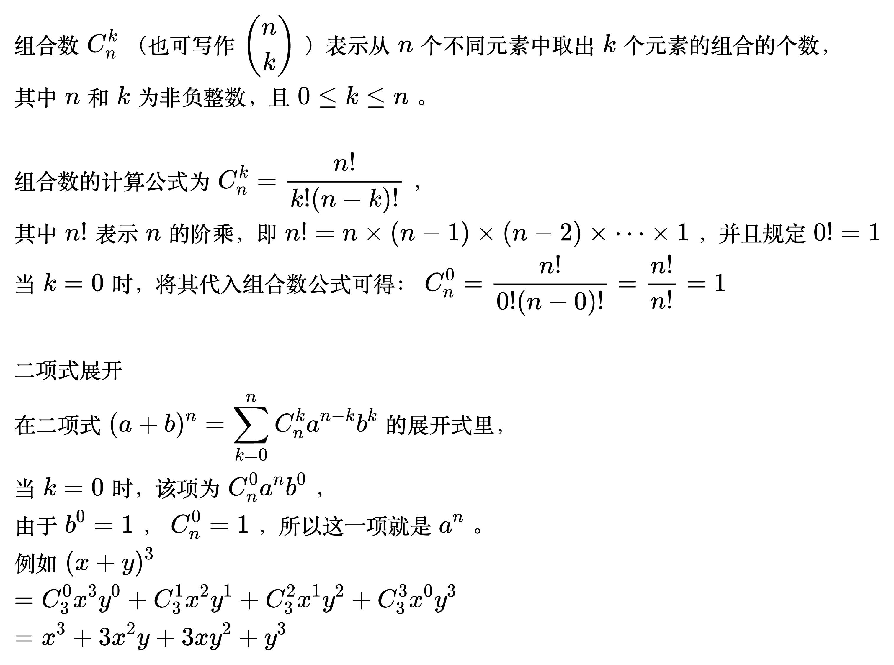

# 组合数

<!--
\begin{align}
& 组合数C_{n}^{k}（也可写作 \binom{n}{k} ）表示从n个不同元素中取出k个元素的组合的个数，\\
& 其中n和k为非负整数，且0 \leq k \leq n。\\
\\
& 组合数的计算公式为C_{n}^{k}=\frac{n!}{k!(n - k)!}，\\
& 其中n!表示n的阶乘，即n!=n\times(n - 1)\times(n - 2)\times\cdots\times1 ，并且规定0!=1 \\
& 当k = 0时，将其代入组合数公式可得：
C_{n}^{0}=\frac{n!}{0!(n - 0)!}=\frac{n!}{n!}= 1 \\
\\
& 二项式展开 \\
& 在二项式(a + b)^n=\sum_{k = 0}^{n}C_{n}^{k}a^{n - k}b^{k}的展开式里，\\
& 当 k = 0 时，该项为 C_{n}^{0}a^{n}b^{0}，\\
& 由于 b^{0}=1，C_{n}^{0}=1，所以这一项就是 a^{n}。\\
& 例如(x + y)^3 \\
& = C_{3}^{0}x^{3}y^{0}+C_{3}^{1}x^{2}y^{1}+C_{3}^{2}x^{1}y^{2}+C_{3}^{3}x^{0}y^{3} \\
& = x^{3}+3x^{2}y + 3xy^{2}+y^{3} \\
\end{align}
-->

