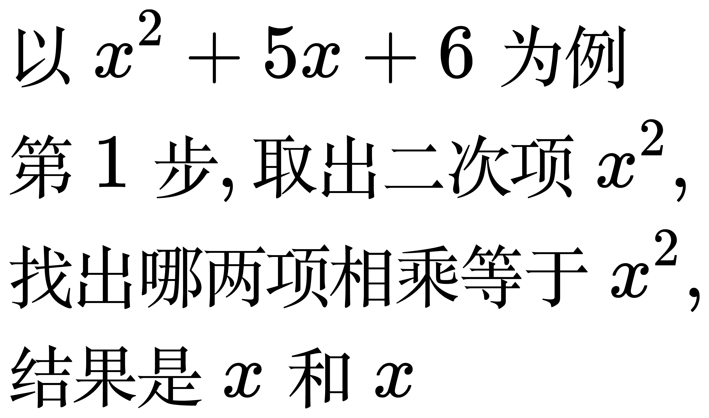
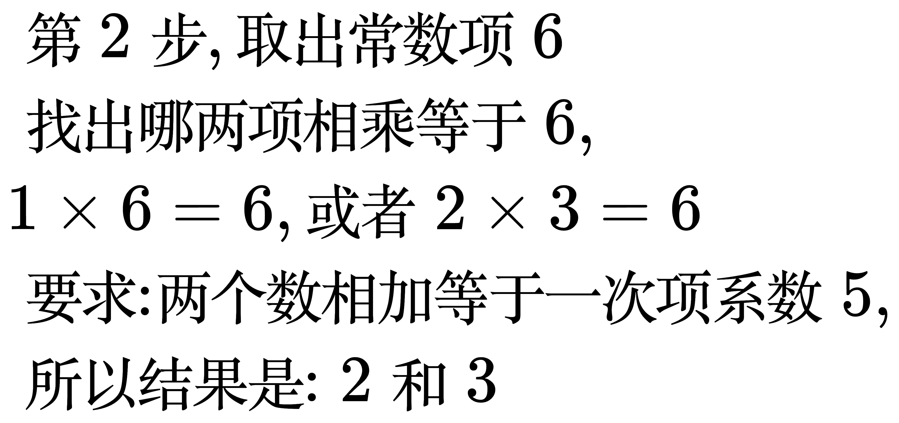
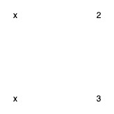
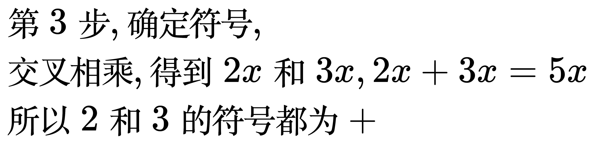
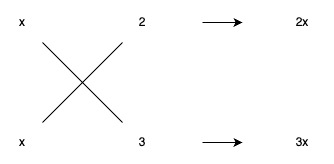
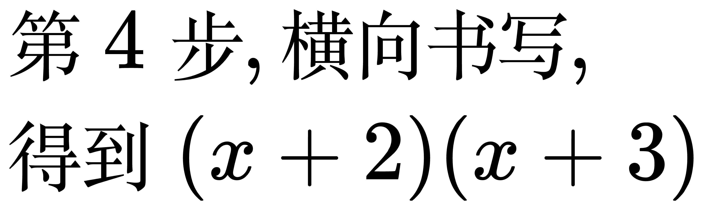
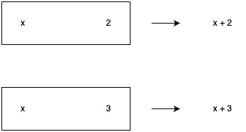
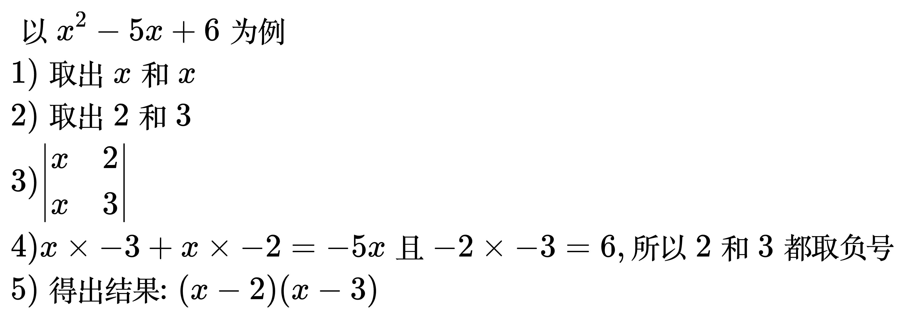
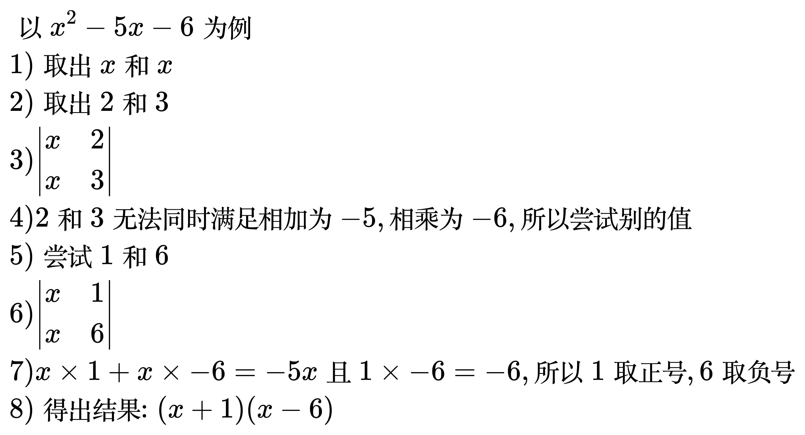
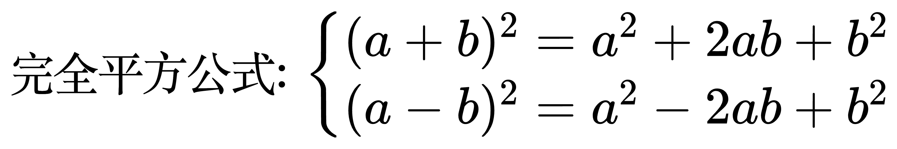

# 十字相乘法

<!--
\begin{align}
& 以 x^{2} + 5x + 6 为例 \\
& 第1步, 取出二次项 x^{2}, \\
& 找出哪两项相乘等于x^{2}, \\
& 结果是 x 和 x \\
\end{align}
-->

<!--
\begin{align}
& 第2步, 取出常数项 6 \\
& 找出哪两项相乘等于6, \\
& 1 \times 6 = 6, 或者 2 \times 3 = 6 \\
& 要求: 两个数相加等于一次项系数5, \\
& 所以结果是: 2 和 3 \\
\end{align}
-->

<!--
\begin{align}
& 第3步, 确定符号, \\
& 交叉相乘, 得到 2x 和 3x, 2x + 3x = 5x \\
& 所以 2 和 3 的符号都为 +
\end{align}
-->

<!--
\begin{align}
& 第4步, 横向书写, \\
& 得到 (x + 2)(x + 3) \\
\end{align}
-->

## 例题

<!--
\begin{align}
& 以 x^{2} - 5x + 6 为例 \\
& 1) 取出 x 和 x \\
& 2) 取出 -2 和 -3 \\
& 3) \begin{vmatrix}
  x & -2 \\
  x & -3
\end{vmatrix} \\
& 4) x \times -3 + x \times -2 = -5x 且 -2 \times -3 = 6, 所以 2 和 3 都取负号 \\
& 5) 得出结果: (x - 2)(x - 3) \\
\end{align}
-->

<!--
\begin{align}
& 以 x^{2} - 5x - 6 为例 \\
& 1) 取出 x 和 x \\
& 2) 取出 -2 和 -3 \\
& 3) \begin{vmatrix}
  x & -2 \\
  x & -3
\end{vmatrix} \\
& 4) -2 和 -3无法同时满足相加为 -5, 相乘为 -6, 所以尝试别的值 \\
& 5) 尝试 1 和 -6 \\
& 6) \begin{vmatrix}
  x & 1 \\
  x & -6
\end{vmatrix} \\
& 7) x \times 1 + x \times -6 = -5x 且 1 \times -6 = -6, 所以 1 取正号, 6 取负号 \\
& 8) 得出结果: (x + 1)(x - 6) \\
\end{align}
-->

<!--
\begin{align}
& 以 x^{2} + 5x - 6 为例 \\
& 1) 取出 x 和 x \\
& 2) 取出 -2 和 3 \\
& 3) \begin{vmatrix}
  x & -2 \\
  x & 3
\end{vmatrix} \\
& 4) -2 和 3无法同时满足相加为 5, 相乘为 -6, 所以尝试别的值 \\
& 5) 尝试 -1 和 6 \\
& 6) \begin{vmatrix}
  x & -1 \\
  x & 6
\end{vmatrix} \\
& 7) x \times -1 + x \times 6 = 5x 且 -1 \times 6 = -6, 所以 1 取负号, 6 取正号 \\
& 8) 得出结果: (x - 1)(x + 6) \\
\end{align}
-->

<!--
\begin{align}
& 以 2x^{2} + 7x + 6 为例 \\
& 1) 取出相乘等于2x^{2} 的 2x 和 x \\
& 2) 取出相乘等于6 的 2 和 3 \\
& 3) \begin{vmatrix}
  2x & 2 \\
  x & 3
\end{vmatrix} \\
& 4) 交叉相乘, 2x \times 3 = 6x, x \times 2 = 2x, 相加为8x, 不对 \\
& 5) 尝试交换2和3的位置 \\
& 6) \begin{vmatrix}
  2x & 3 \\
  x & 2
\end{vmatrix} \\
& 4) 交叉相乘, 2x \times 2 = 4x, x \times 3 = 3x, 相加为7x, 对了 \\
& 5) 2x \times 2 + x \times 3 = 7x 且 2 \times 3 = 6, 所以 2 和 3 都取正号 \\
& 4) 得出结果: (2x + 3)(x + 2) \\
\end{align}
-->

## 常用公式

<!--
完全平方公式: \begin{cases}
(a + b)^2 = a^2 + 2ab + b^2 \\
(a - b)^2 = a^2 - 2ab + b^2
\end{cases}
-->

