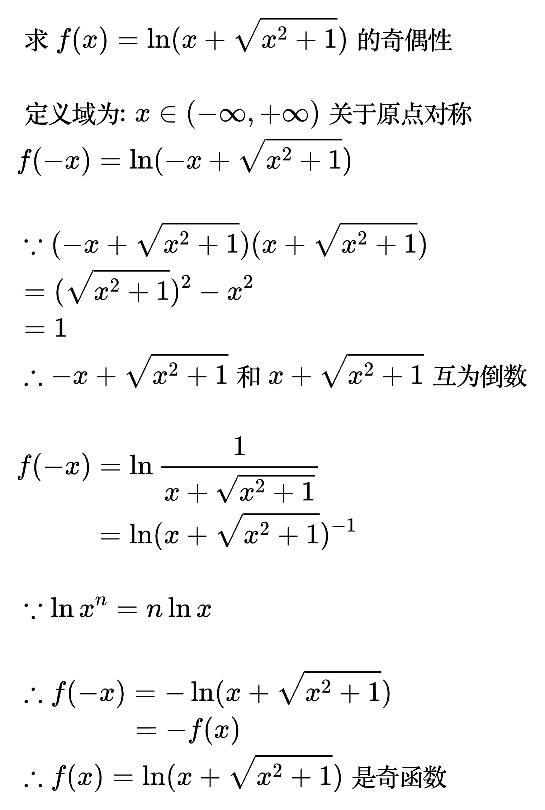

# 初等函数

初等函数是基本初等函数通过有限次的四则运算(加减乘除)、常数倍、复合运算以及对数和指数等基本运算构成的。

## 奇偶性

<!--
\begin{align}
& 求 f(x) = \ln (x + \sqrt{x^{2} + 1}) 的奇偶性 \\
\\
& 定义域为: x \in (-\infty, +\infty) 关于原点对称 \\
& f(-x) = \ln (-x + \sqrt{x^{2} + 1}) \\
\\
& \because (-x + \sqrt{x^{2}+1})(x + \sqrt{x^{2}+1}) \\
& = (\sqrt{x^{2}+1})^{2} - x^{2} \\
& = 1 \\
& \therefore -x + \sqrt{x^{2}+1} 和 x + \sqrt{x^{2}+1} 互为倒数 \\
\\
& f(-x) = \ln \frac{1}{x + \sqrt{x^{2} + 1}} \\
& \;\;\;\;\;\;\;\;\;\, = \ln (x + \sqrt{x^{2} + 1})^{-1} \\
\\
& \because \ln x^{n} = n\ln x \\
\\
& \therefore f(-x) = -\ln (x + \sqrt{x^{2} + 1}) \\
& \;\;\;\;\;\;\;\;\;\;\;\;\;\,\, = -f(x) \\
& \therefore f(x) = \ln (x + \sqrt{x^{2} + 1}) 是奇函数\\
\end{align}
-->

