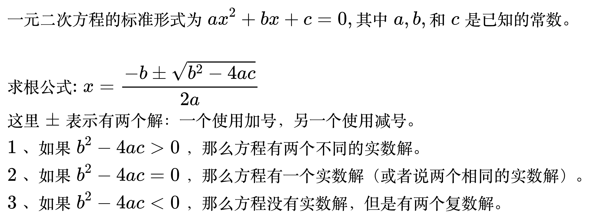
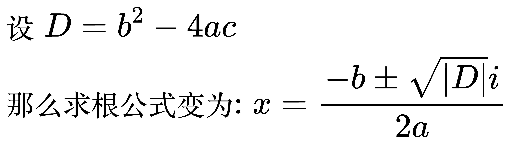

# 方程

<!--
\begin{align}
& 一元二次方程的标准形式为 ax^2 + bx + c = 0, 其中 a, b, 和 c 是已知的常数。 \\
\\
& 求根公式: x = \frac{-b \pm \sqrt{b^2 - 4ac}}{2a} \\
& 这里 \pm 表示有两个解：一个使用加号，另一个使用减号。 \\
& \; 1、如果  b^2 - 4ac > 0 ，那么方程有两个不同的实数解。 \\
& \; 2、如果  b^2 - 4ac = 0 ，那么方程有一个实数解(或者说两个相同的实数解)。 \\
& \; 3、如果  b^2 - 4ac < 0 ，那么方程没有实数解，但是有两个复数解。 \\
\end{align}
-->

## 方程的复数解

<!--
\begin{align}
& 设 D = b^2 - 4ac \\
& 那么求根公式变为: x = \frac{-b \pm \sqrt{|D|}i}{2a} \\
\end{align}
-->

