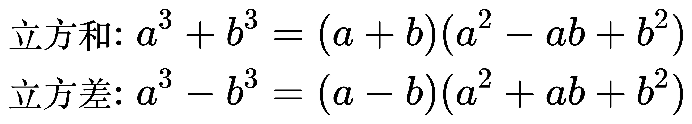

# 常用的公式

1.

<!--
\begin{align}
& 1 + 2 + 3 + ... + n = \frac{1}{2} n(n + 1) \\
\end{align}
-->

2. 立方和/差公式

<!--
\begin{align}
& 立方和: a^{3}+b^{3}=(a+b)(a^{2}-ab+b^{2}) \\
& 立方差: a^{3}-b^{3}=(a-b)(a^{2}+ab+b^{2}) \\
\end{align}
-->

