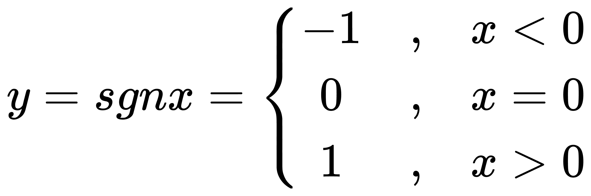
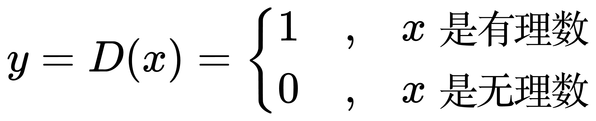

# 特殊的函数

符号函数（Sign function，简称 sgn）用来判断实数的正负号。

<!-- y ={sgn} x=\left\{
{\begin{matrix}
-1 & , & x<0 \\
 0 & , & x=0 \\
 1 & , & x>0
\end{matrix}}
\right. -->

狄利克雷函数（Dirichlet function）是一个判别自变量是有理数还是无理数的函数。

<!-- y = D(x)=\left\{
{\begin{matrix}
1 & , & x是有理数 \\
0 & , & x是无理数
\end{matrix}}
\right. -->

