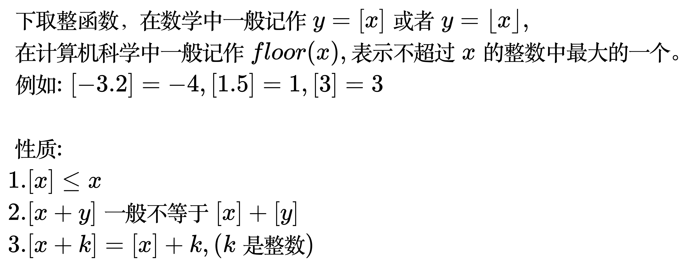
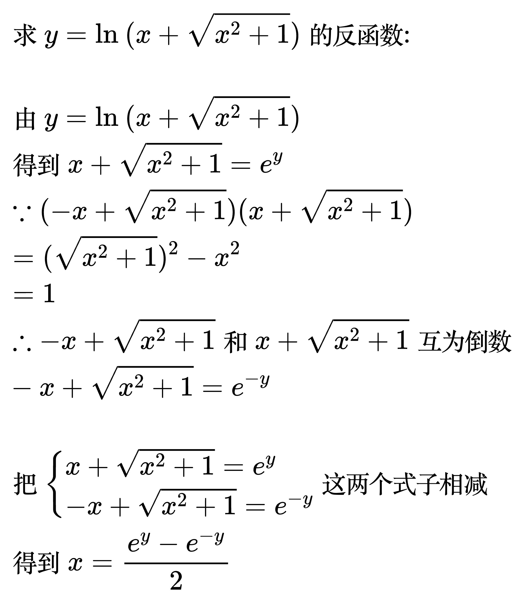

# 函数

## 特殊的函数

符号函数（Sign function, 简称 sgn）用来判断实数的正负号。

<!-- y ={sgn} x=\left\{
{\begin{matrix}
-1 & , & x<0 \\
 0 & , & x=0 \\
 1 & , & x>0
\end{matrix}}
\right. -->

狄利克雷函数（Dirichlet function）是一个判别自变量是有理数还是无理数的函数。

<!-- y = D(x)=\left\{
{\begin{matrix}
1 & , & x是有理数 \\
0 & , & x是无理数
\end{matrix}}
\right. -->

取整函数是一类将实数映射到相近的整数的函数。常用的取整函数有两个, 分别是下取整函数（英语: floor function）和上取整函数（ceiling function）。

<!-- \begin{align}
& 下取整函数, 在数学中一般记作 y =\left [ x \right ] 或者 y = \left \lfloor x \right \rfloor, \\
& 在计算机科学中一般记作floor(x), 表示不超过x的整数中最大的一个。\\
& 例如: \left [ -3.2 \right ] = -4, \left [ 1.5 \right ] = 1, \left [ 3 \right ] = 3 \\
\\ & 性质: \\
& 1. \left [ x \right ] \le x \\
& 2. \left [ x + y \right ] 一般不等于 \left [ x \right ] + \left [ y \right ] \\
& 3. \left [ x + k \right ] = \left [ x \right ] + k, (k是整数) \\
\end{align} -->

<!-- \begin{align}
& 上取整函数, 在数学中一般记作 y = \left \lceil x \right \rceil , \\
& 在计算机科学中一般记作ceil(x), 表示不小于x的整数中最小的一个。\\
\end{align} -->

## 反函数

如果 y= f(x) 在定义域上严格单调, 则它有反函数。

<!--
\begin{align}
& 求 y = \ln_{}{(x + \sqrt{x^{2}+1})}的反函数:  \\
\\
& 由 y = \ln_{}{(x + \sqrt{x^{2}+1})} \\
& 得到 x + \sqrt{x^{2}+1} = e^{y} \\
& \because (-x + \sqrt{x^{2}+1})(x + \sqrt{x^{2}+1}) \\
& = (\sqrt{x^{2}+1})^{2} - x^{2} \\
& = 1 \\
& \therefore -x + \sqrt{x^{2}+1} 和 x + \sqrt{x^{2}+1} 互为倒数 \\
& -x + \sqrt{x^{2}+1} = e^{-y} \\
\\
& 把 \begin{cases}
x + \sqrt{x^{2}+1} = e^{y} \\
-x + \sqrt{x^{2}+1} = e^{-y}
\end{cases} 这两个式子相减 \\
& 得到 x = \frac{e^{y} - e^{-y}}{2} \\
\end{align}
-->

