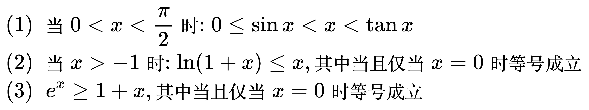

# 常见的不等式

三角不等式

<!--
\begin{align}
& 0 \le \left | \left | a \right | - \left | b \right | \right | \le \left | a \pm b \right | \le \left | a \right | + \left | b \right | \\
\end{align}
-->

均值不等式

<!--
\begin{align}
& \sqrt[n]{a_{1}a_{2} \dots a_{n}} \quad\quad \quad \quad \, 称为几何平均数 \\
& \frac{a_{1} + a_{2} + \dots + a_{n}}{n} \quad 称为代数平均数 \\
\\
& 如果n个数中的每一项都大于0 \\
& 则: \frac{a_{1} + a_{2} + \dots + a_{n}}{n} \ge \sqrt[n]{a_{1}a_{2} \dots a_{n}} \\
\\
& 当 n = 2 时: a_{1} + a_{2} \ge 2\sqrt{a_{1}a_{2}} \quad \Rightarrow \quad a_{1}^{2} + a_{2}^{2} \ge 2a_{1}a_{2} \\
& 当 n = 3 时: a_{1} + a_{2} + a_{3} \ge 3\sqrt[3]{a_{1}a_{2}a_{3}} \\
\end{align}
-->

解带绝对值的不等式

<!--
\begin{align}
& |x - a| \lt b \Rightarrow a - b \lt x \lt a + b \\
\\
& 求解过程: \\
& \;\;\;\;\;\,\begin{cases}
x - a \lt b, & x \gt a \\
a - x \lt b, & x \lt a
\end{cases} \\
& \Rightarrow \begin{cases}
x \lt a + b, & x \gt a \\
-x \lt b - a, & x \lt a
\end{cases} \\
& \Rightarrow \begin{cases}
x \lt a + b, & x \gt a \\
x \gt a - b, & x \lt a
\end{cases} \\
& \Rightarrow a - b \lt x \lt a + b
\end{align}
-->

常用的不等式

<!--
\begin{align}
& (1) \; 当 0 \lt x \lt \frac{\pi}{2} 时: 0 \le \sin x \lt x \lt \tan x \\
& (2) \; 当 x \gt -1 时: \ln (1 + x) \le x, 其中当且仅当 x = 0 时等号成立 \\
& (3) \;\; e^{x} \ge 1 + x, 其中当且仅当 x = 0 时等号成立 \\
\end{align}
-->

