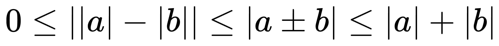
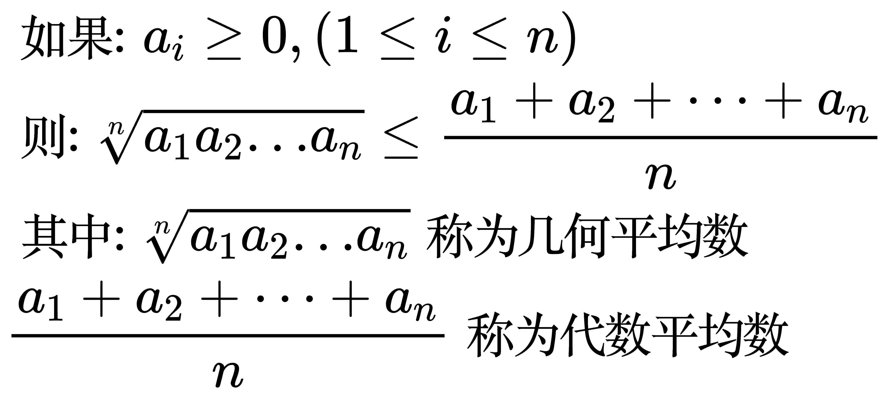
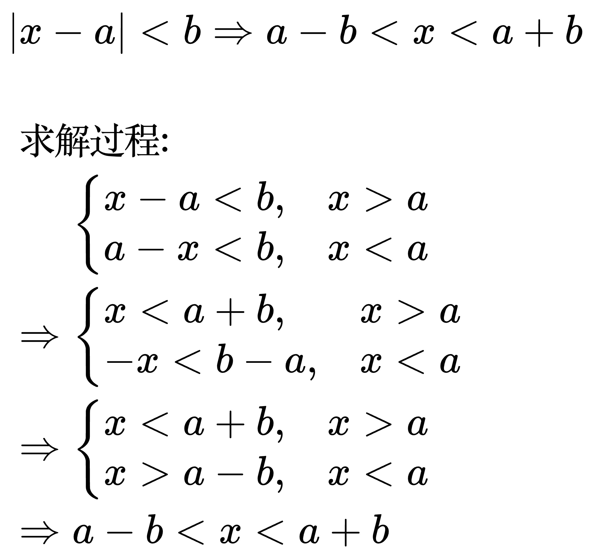

# 常见的不等式

<!-- \begin{align}
& 三角不等式: \\
& 0 \le \left | \left | a \right | - \left | b \right | \right | \le \left | a \pm b \right | \le \left | a \right | + \left | b \right | \\
\end{align} -->

<!-- \begin{align}
& 如果: a_{i} \ge 0, (1 \le i \le n) \\
& 则: \sqrt[n]{a_{1}a_{2} \dots a_{n}} \le \frac{a_{1} + a_{2} + \dots + a_{n}}{n} \\
& 其中: \sqrt[n]{a_{1}a_{2} \dots a_{n}} 称为几何平均数 \\
& \frac{a_{1} + a_{2} + \dots + a_{n}}{n} 称为代数平均数 \\
\end{align} -->

<!--
\begin{align}
& |x - a| \lt b \Rightarrow a - b \lt x \lt a + b \\
\\
& 求解过程: \\
& \;\;\;\;\;\,\begin{cases}
x - a \lt b, & x \gt a \\
a - x \lt b, & x \lt a
\end{cases} \\
& \Rightarrow \begin{cases}
x \lt a + b, & x \gt a \\
-x \lt b - a, & x \lt a
\end{cases} \\
& \Rightarrow \begin{cases}
x \lt a + b, & x \gt a \\
x \gt a - b, & x \lt a
\end{cases} \\
& \Rightarrow a - b \lt x \lt a + b
\end{align}
-->

