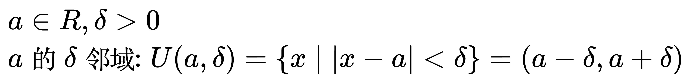
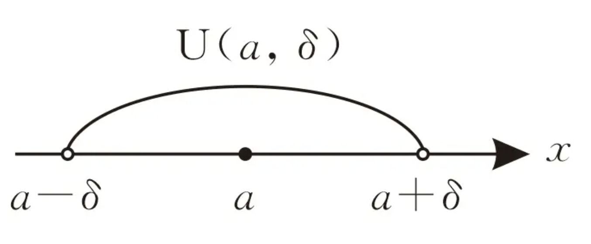
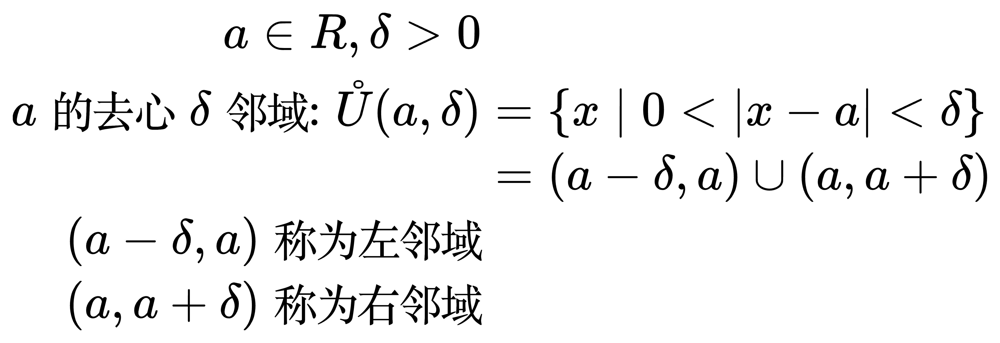
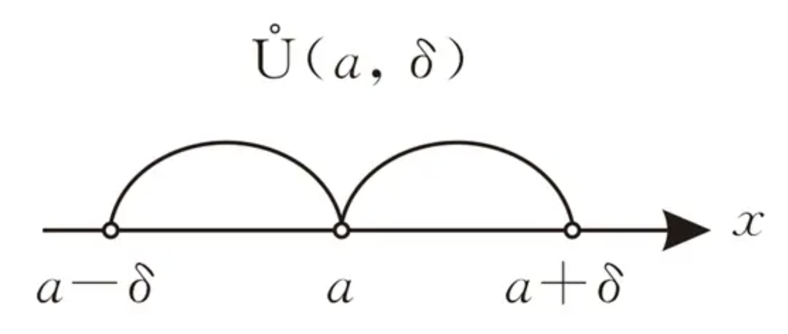

# 邻域和去心邻域

<!-- \begin{align}
& a \in R, \delta \gt 0 \\
& a的\delta邻域: U(a,\delta) = \left \{ x \mid |x-a| \lt \delta \right \} = (a-\delta,a+\delta)
\end{align} -->

<!-- \begin{eqnarray}
a \in R, \delta \gt 0 \\
a的去心\delta邻域: \mathring{U}(a,\delta) & = & \left \{ x \mid 0 \lt |x-a| \lt \delta \right \} \\
& = & (a-\delta,a) \cup (a,a+\delta) \\
(a-\delta,a) 称为左邻域 \\
(a,a+\delta) 称为右邻域 \\
\end{eqnarray} -->

