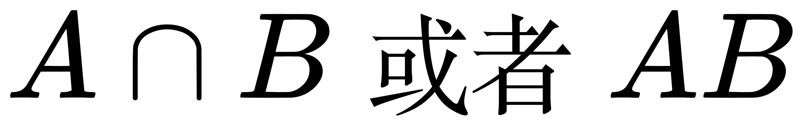
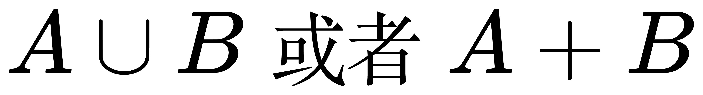
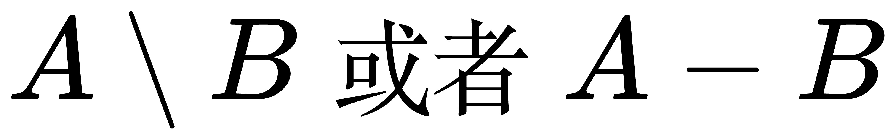
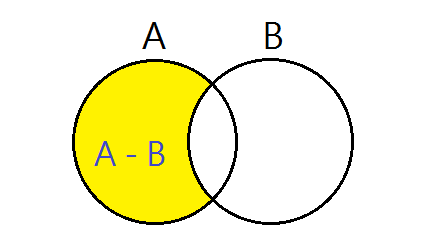
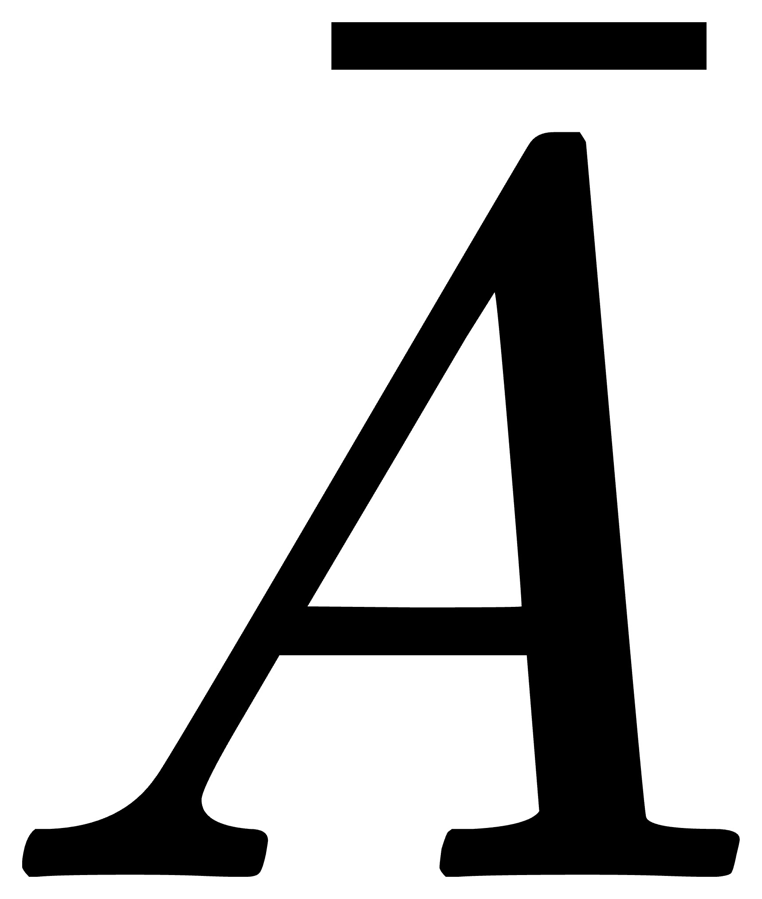
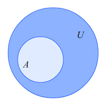
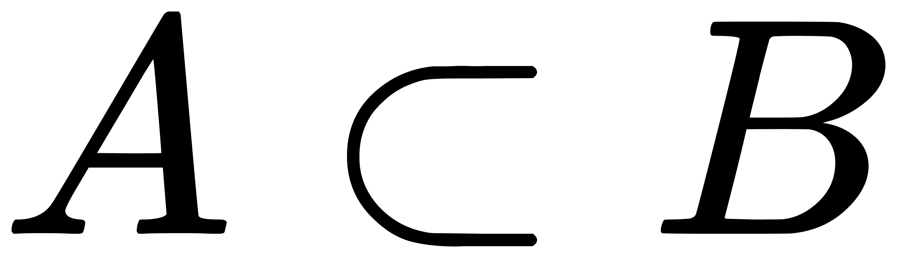
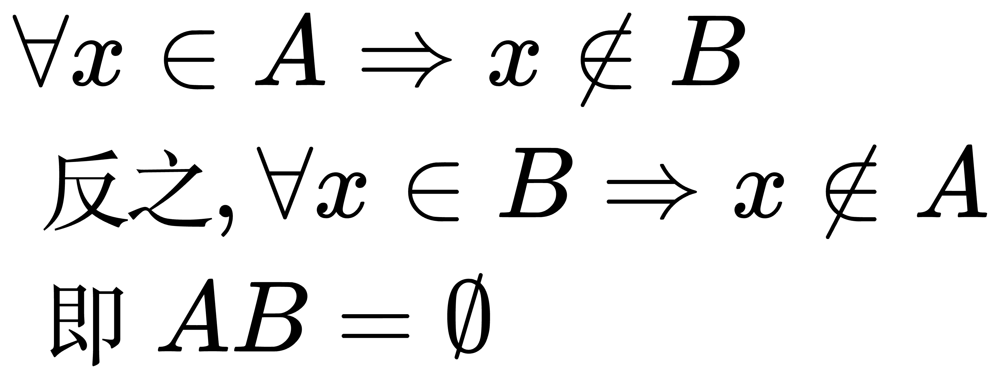
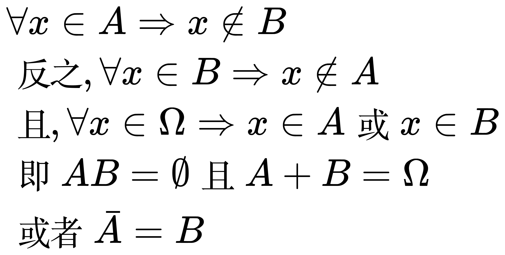
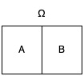

# 集合

集合: 所有特定性质的对象放在一块。每一个对象叫做元素。

全集: 所有元素都包含。

空集: 没有任何元素。

## 运算

### 交集

<!-- A \cap B 或者 AB -->

### 并集

<!-- A \cup B 或者 A + B -->

### 差

属于 A, 但不属于 B

<!-- A \setminus B 或者 A - B -->

### 补

不属于 A 的元素构成的集合, 称为 A 的补

<!-- \bar{A} -->

## 关系

### 包含

A 的所有元素都在 B 中

<!-- A \subset B -->

### 互斥(不相容)

A 和 B 没有共同的元素

<!-- \begin{align}
& \forall x \in A \Rightarrow x \notin B \\
& 反之, \forall x \in B \Rightarrow x \notin A \\
& 即 AB = \emptyset
\end{align} -->

### 对立

<!-- \begin{align}
& \forall x \in A \Rightarrow x \notin B \\
& 反之, \forall x \in B \Rightarrow x \notin A \\
& 且, \forall x \in \Omega \Rightarrow x \in A 或 x \in B \\
& 即 AB = \emptyset 且 A + B = \Omega \\
& 或者 \bar{A} = B
\end{align} -->

