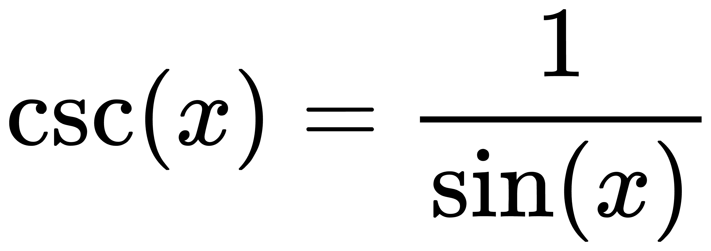
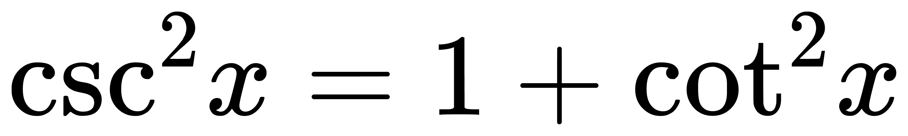

# 三角函数

<!-- \sin ^{2}\!x+\cos ^{2}\!x = 1 -->

<!-- \sec(x) = \frac{1}{\cos(x)}  -->

<!-- \csc(x) = \frac{1}{\sin(x)}  -->

<!-- \sec ^{2}\!x = 1 + \tan ^{2}\!x -->

<!-- \csc ^{2}\!x = 1 + \cot ^{2}\!x -->

