# 三角函数

常用的值

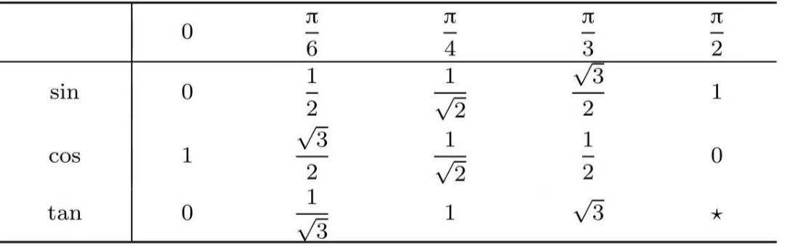

关系

<!--
\begin{align}
& \sec x = \frac{1}{\cos x} \\
\\
& \csc x = \frac{1}{\sin x} \\
\\
& \tan x = \frac{\sin x}{\cos x} \\
\\
& \cot x = \frac{\cos x}{\sin x} \\
\end{align}
-->

## 函数图像

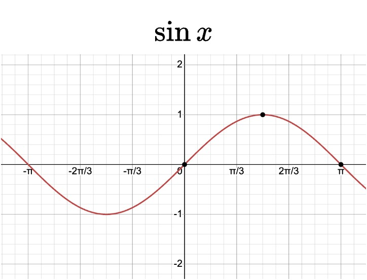
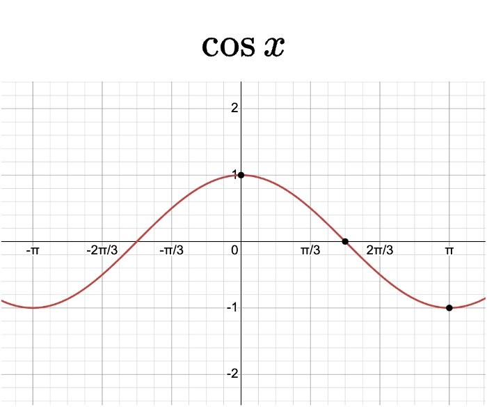
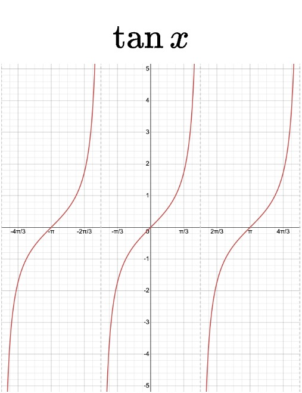
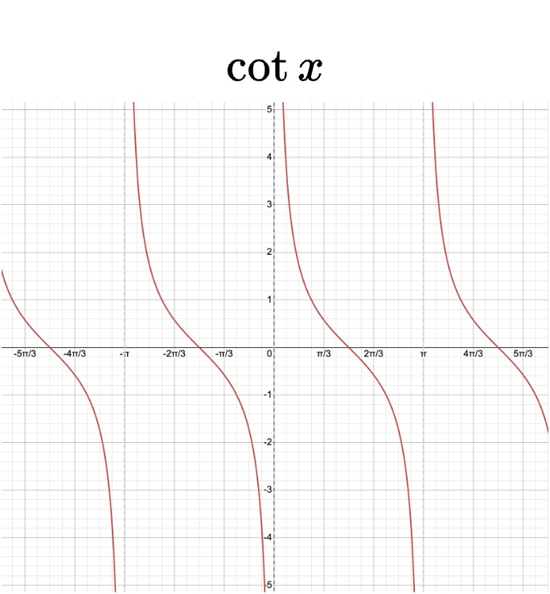

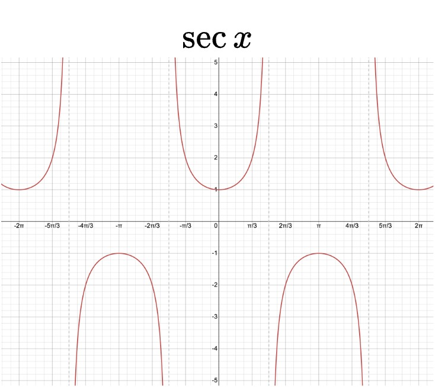
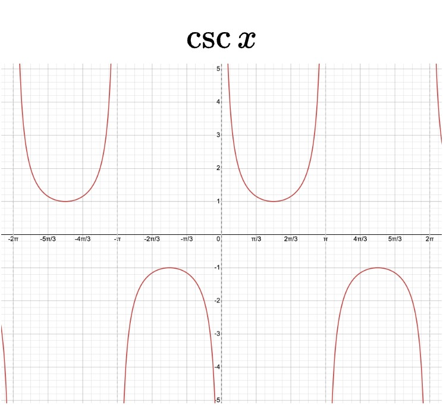

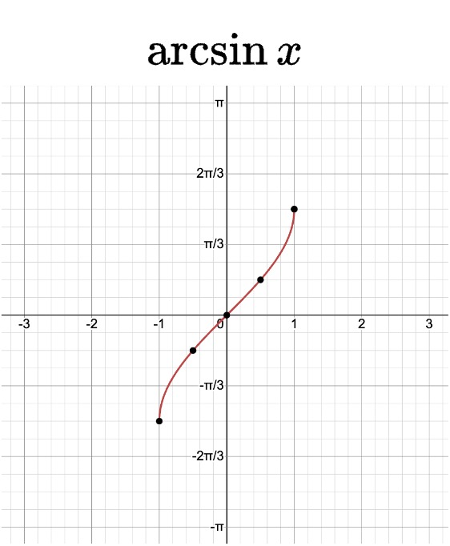
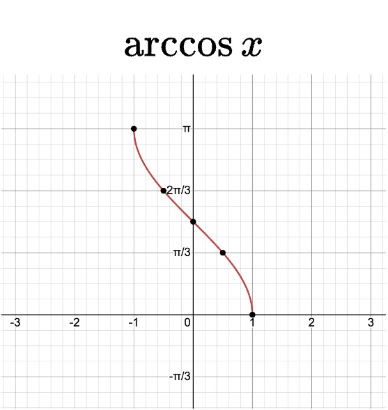
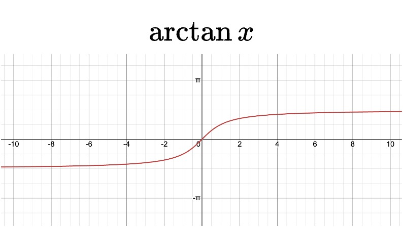
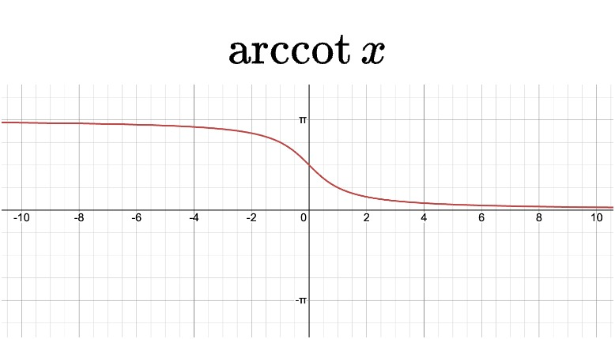

## 三角恒等式

<!--
\begin{align}
& 1、 毕达哥拉斯定理: \sin ^{2} x + \cos ^{2} x = 1 \\
& 2、 \tan ^{2} x + 1 = \sec ^{2} x {\color{Green} \quad // 两边同除 \cos^{2} x} \\
& 3、 1 + \cot ^{2} x = \csc ^{2} x {\color{Green} \quad // 两边同除 \sin^{2} x} \\
\end{align}
-->

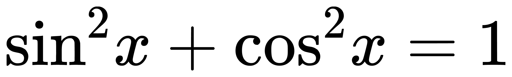

## 倍角公式

<!-- \sin 2x = 2 \sin x \cos x -->

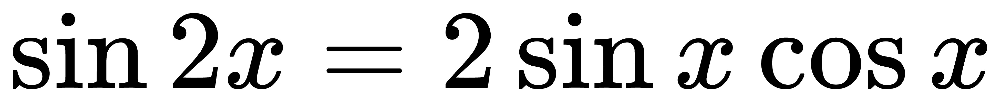

<!-- \begin{eqnarray}
\cos 2x & = & \cos ^{2} x - \sin ^{2} x \\
& = & 2 \cos ^{2} x - 1 \\
& = & 1 - 2 \sin ^{2} x \\
\end{eqnarray} -->

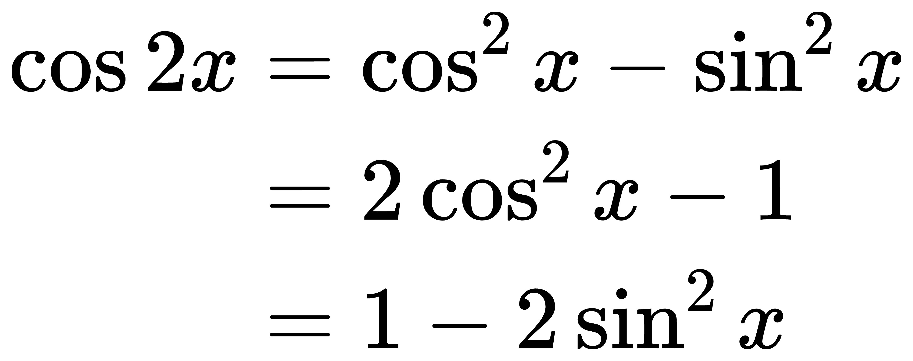

<!-- \tan 2x = \frac{2 \tan x}{1 - \tan ^{2} x}  -->

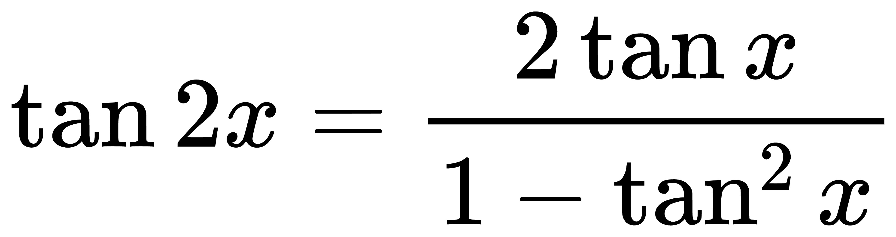

## 半角公式

<!-- \sin \frac{x}{2} = \pm \sqrt{\frac{1 - \cos x}{2}} -->

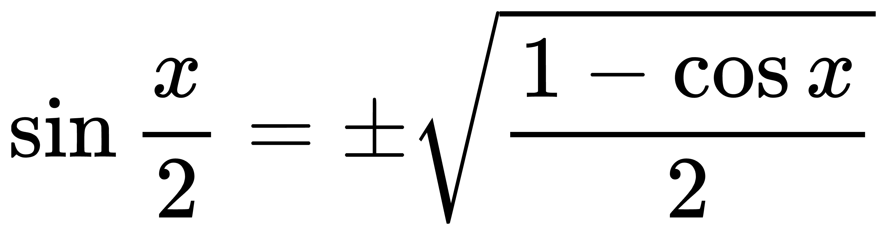

<!-- \cos \frac{x}{2} = \pm \sqrt{\frac{1 + \cos x}{2}} -->

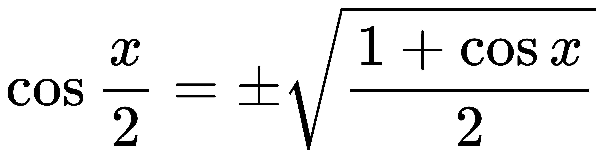

## 辅助角公式

<!--
\begin{align}
& 1、 a \sin x + b \cos x = \sqrt{a^2 + b^2} \sin (x + \arctan \frac{b}{a}), (a > 0) \\
& 2、 a \sin x + b \cos x = \sqrt{a^2 + b^2} \cos (x - \arctan \frac{a}{b}), (b > 0) \\
\end{align}
-->

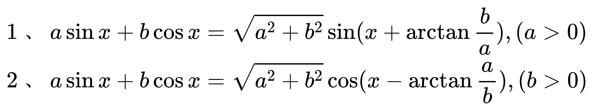

## 和角差角公式

<!--
\begin{align}
& 1、 \sin (a + b) = \sin a \cos b + \cos a \sin b \\
& 2、 \sin (a - b) = \sin a \cos b - \cos a \sin b \\
& 3、 \cos (a + b) = \cos a \cos b - \sin a \sin b \\
& 4、 \cos (a - b) = \cos a \cos b + \sin a \sin b \\
& 5、 \tan (a + b) = \frac{\tan a + \tan b}{1 - \tan a \tan b} \\
& 6、 \tan (a - b) = \frac{\tan a - \tan b}{1 + \tan a \tan b} \\
\end{align}
-->

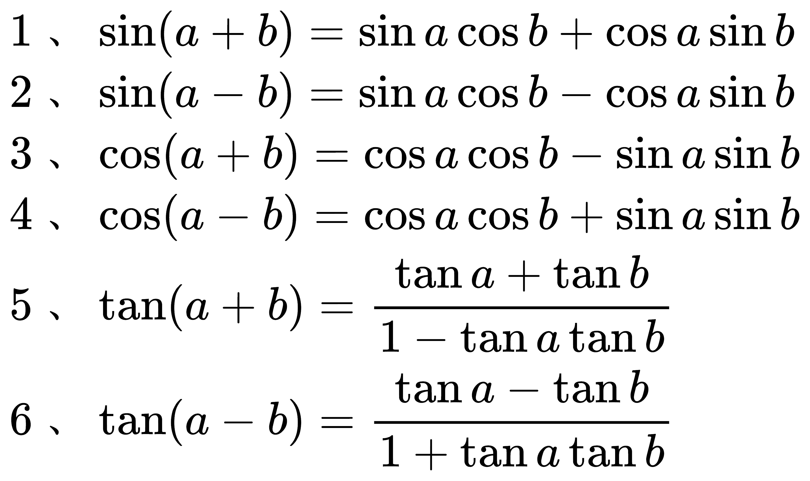

## 反三角函数

<!--
\begin{align}
& 如果 y = \sin x \; (-\frac{\pi}{2} \le x \le \frac{\pi}{2}), 则 x = \arcsin y \\
& 如果 y = \cos x \; (0 \le x \le \pi), 则 x = \arccos y \\
& 如果 y = \tan x \; (-\frac{\pi}{2} < x < \frac{\pi}{2}), 则 x = \arctan y \\
\end{align}
-->

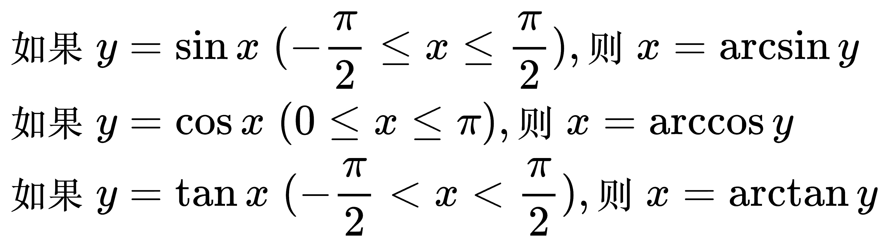

<!-- y = \arcsin x 在 x \in [−1, 1], y \in [-\frac{\pi}{2},\frac{\pi}{2}]上的图像 -->

<!-- y = \arccos x 在 x \in [−1, 1], y \in [0,\pi]上的图像 -->

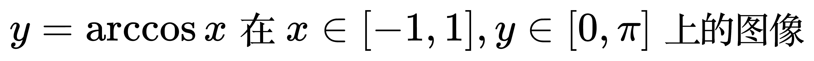

<!-- 奇函数 y = \arctan x 在 x \in [−\infty, +\infty], y \in [-\frac{\pi}{2},\frac{\pi}{2}]上的图像 -->

<!-- y = \operatorname{arccot} x 在 x \in [−\infty, +\infty], y \in [0,\pi]上的图像 -->

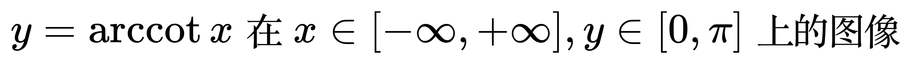

<!-- \arcsin x + \arccos x = \frac{\pi}{2}, (-1 \le x \le 1) -->

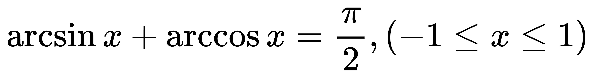

<!-- \arctan x + \operatorname{arccot} x = \frac{\pi}{2}, (-\infty \le x \le +\infty) -->

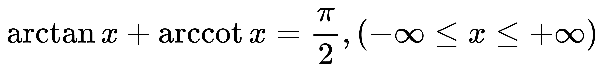

## 三角函数在各个象限的正负

- 角在第一象限，三个函数都是正数
- 角在第二象限，只有正弦是正数
- 角在第三象限，只有正切是正数
- 角在第四象限，只有余弦是正数

三角函数在四象限的正负口诀：一全正；二正弦(余割)；三两切；四余弦(正割)。
