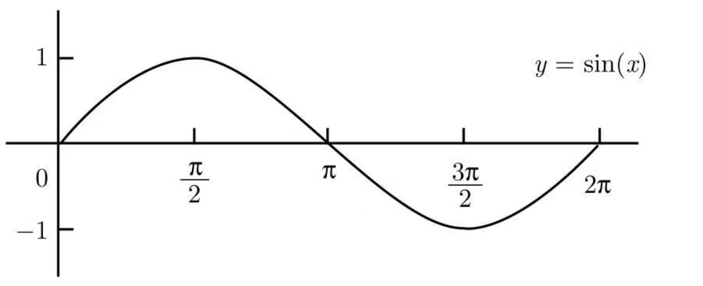
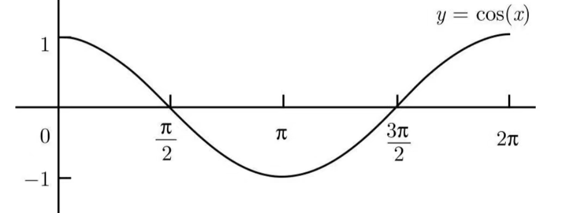
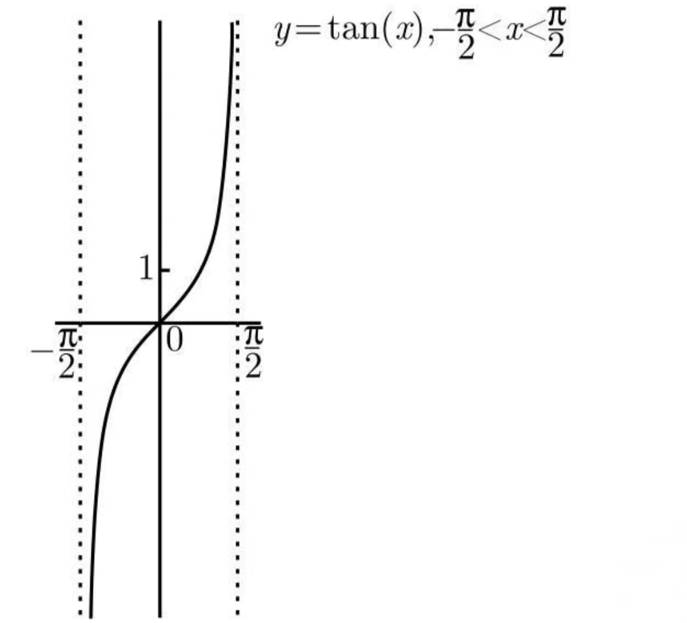
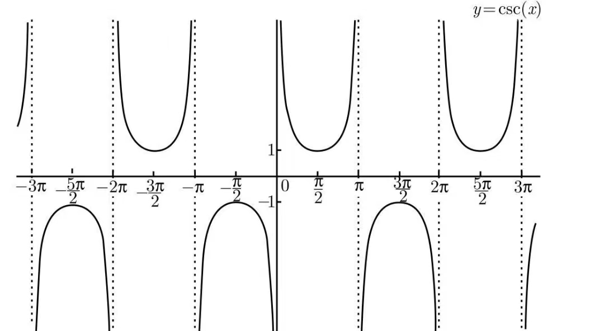
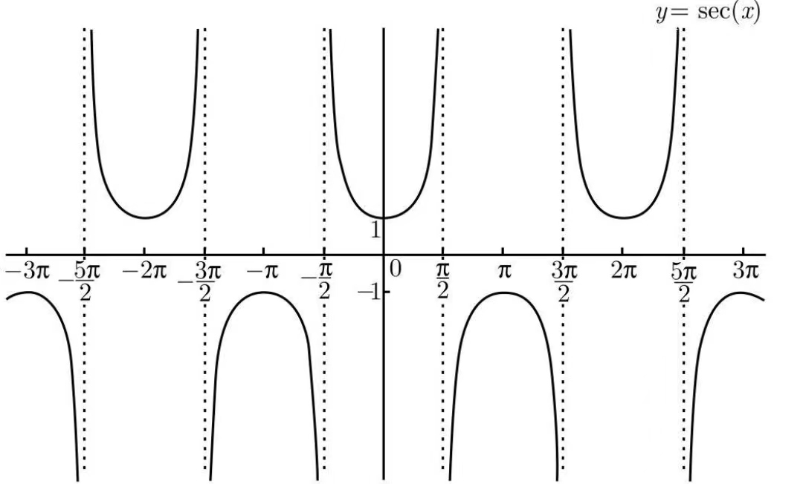
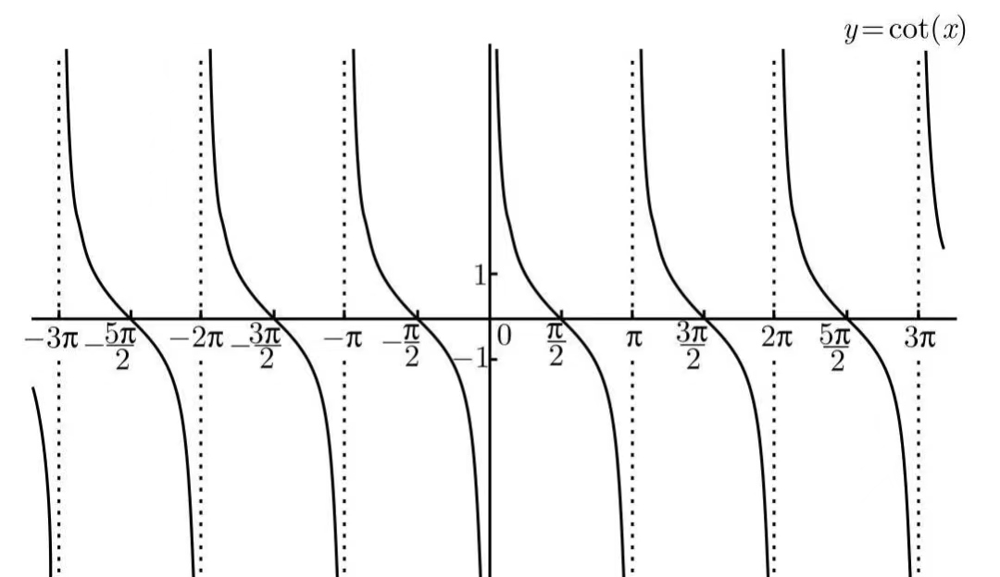
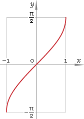
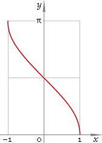
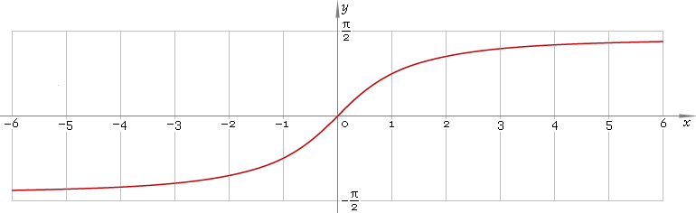

# 三角函数

<!--
\begin{align}
& \sec x = \frac{1}{\cos x} \\
\\
& \csc x = \frac{1}{\sin x} \\
\\
& \tan x = \frac{\sin x}{\cos x} \\
\\
& \cot x = \frac{\cos x}{\sin x} \\
\end{align}
-->

## 函数图像

## 三角恒等式

<!--
\begin{align}
& 毕达哥拉斯定理: \\
& \sin ^{2} x + \cos ^{2} x = 1 \\
\\
& 两边同除 \cos^{2} x: \\
& \tan ^{2} x + 1 = \sec ^{2} x \\
\\
& 两边同除 \sin^{2} x: \\
& 1 + \cot ^{2} x = \csc ^{2} x \\
\end{align}
-->

## 倍角公式

<!-- \sin 2x = 2 \sin x \cos x -->

<!-- \begin{eqnarray}
\cos 2x & = & \cos ^{2} x - \sin ^{2} x \\
& = & 2 \cos ^{2} x - 1 \\
& = & 1 - 2 \sin ^{2} x \\
\end{eqnarray} -->

<!-- \tan 2x = \frac{2 \tan x}{1 - \tan ^{2} x}  -->

## 半角公式

<!-- \sin \frac{x}{2} = \pm \sqrt{\frac{1 - \cos x}{2}} -->

<!-- \cos \frac{x}{2} = \pm \sqrt{\frac{1 + \cos x}{2}} -->

## 反三角函数

<!-- y = \arcsin x 在 x \in [−1, 1], y \in [-\frac{\pi}{2},\frac{\pi}{2}]上的图像 -->

<!-- y = \arccos x 在 x \in [−1, 1], y \in [0,\pi]上的图像 -->

<!-- 奇函数 y = \arctan x 在 x \in [−\infty, +\infty], y \in [-\frac{\pi}{2},\frac{\pi}{2}]上的图像 -->

<!-- y = \operatorname{arccot} x 在 x \in [−\infty, +\infty], y \in [0,\pi]上的图像 -->

<!-- \arcsin x + \arccos x = \frac{\pi}{2}, (-1 \le x \le 1) -->

<!-- \arctan x + \operatorname{arccot} x = \frac{\pi}{2}, (-\infty \le x \le +\infty) -->

