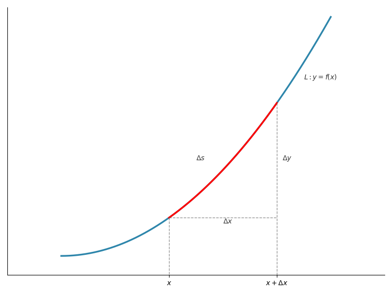
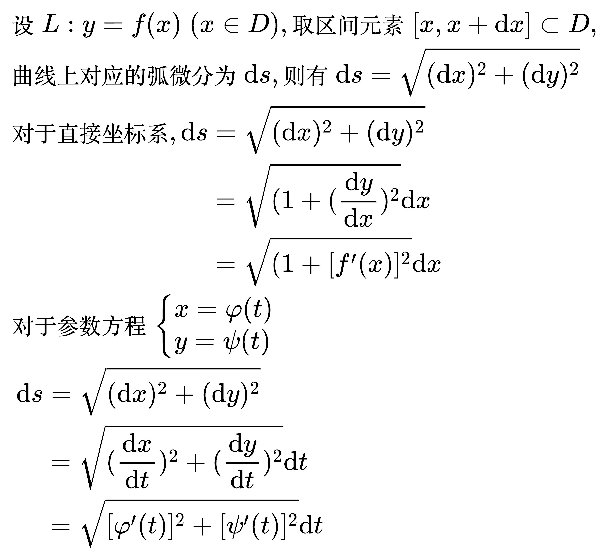

# 弧微分

<!--
import numpy as np
import matplotlib.pyplot as plt

plt.rcParams['font.sans-serif'] = ['Hiragino Sans GB']
plt.rcParams['axes.unicode_minus'] = False

def get_line_function(x1, y1, x2, y2):
    # 计算斜率k和截距b
    k = (y2 - y1) / (x2 - x1)
    b = y1 - k * x1

    # 定义直线函数
    line_func = lambda x: k * x + b
    return line_func

def f(x):
    return x ** 2

# 曲线
x_start = 0
x_end = 5
x = np.linspace(x_start, x_end, 2000)  # x范围覆盖两个极值点，2000个点确保曲线平滑
y = f(x)

x1 = x_start + 2
x2 = x_start + 4

# 创建画布
plt.figure(figsize=(8, 6))

# 绘制函数曲线
plt.plot(x, y, color='#2E86AB', linewidth=2.5)
plt.text(x_end - 0.5, f(x_end - 0.7), '$L: y=f(x)$', fontsize=10, color='#333333')
x_s = np.linspace(x1, x2, 2000)
plt.plot(x_s, f(x_s), color='red', linewidth=2.5)

# 坐标轴范围
plt.xlim(x_start - 1, x_end + 1)
plt.ylim(f(x_start) - 2, f(x_end) + 1)

# 添加注释线
plt.plot([x1, x1], [f(x1), -3], color='#666666', linestyle='--', linewidth=1, alpha=0.7)
plt.plot([x2, x2], [f(x2), -3], color='#666666', linestyle='--', linewidth=1, alpha=0.7)

plt.plot([x1, x2], [f(x1), f(x1)], color='#666666', linestyle='--', linewidth=1, alpha=0.7)

plt.text(x1 + 1, f(x1) - 0.6, r'$\Delta x$', fontsize=10, color='#333333')
plt.text(x2 + 0.1, (f(x2) + f(x1)) / 2, r'$\Delta y$', fontsize=10, color='#333333')
plt.text((x2 + x1) / 2 - 0.5, f(x2) - 6, r'$\Delta s$', fontsize=10, color='#333333')

# 设置刻度
plt.xticks([x1, x2], ['$x$', r'$x+\Delta x$'])
plt.yticks([], [])
# 获取当前坐标轴对象
ax = plt.gca()
ax.spines['top'].set_visible(False)  # 隐藏顶部边框
ax.spines['right'].set_visible(False)  # 隐藏右侧边框

# 调整布局并显示
plt.tight_layout()
plt.show()
-->

<!--
\begin{align}
& {\large 弧微分的几何模型} \\
& 图中 \Delta x、\Delta y和\Delta s构成了一个曲边三角形，它近似直角三角形 \\
& 所以 \Delta s \approx \sqrt{(\Delta x)^2+(\Delta y)^2} \\
& 如果 \Delta x \to 0, \\
& 则此时曲边三角形的斜边会由 “弧长\Delta s” 近似替代为 “弧长微分 \mathrm{d}s” \\
& 直角边由 “增量 \Delta x, \Delta y” 近似替代为 “微分 \mathrm{d}x, \mathrm{d}y” \\
& 由于变成了微分, 微分没有量变，所以曲边三角形可以看成直角三角形 \\
& 所以 \mathrm{d}s = \sqrt{(\mathrm{d}x)^2+(\mathrm{d}y)^2} \\
\\
& {\large 直角坐标形式} \\
& 曲线上对应的弧微分为 \mathrm{d} s \\
& 则有 \mathrm{d} s = \sqrt{(\mathrm{d} x)^2 + (\mathrm{d} y)^2} \\
& {\color{Green} // 把\mathrm{d} x从根号提出来} \\
& = \sqrt{(1 + (\frac{\mathrm{d} y}{\mathrm{d} x})^2} \mathrm{d} x \\
& = \sqrt{(1 + [f'(x)]^2} \mathrm{d} x \\
\\
& {\large 参数方程形式} \\
& 对于参数方程 \begin{cases}
x = \varphi (t) \\
y = \psi (t) \\
\end{cases} \\
& 则 \mathrm{d} s = \sqrt{(\mathrm{d} x)^2 + (\mathrm{d} y)^2} \\
& {\color{Green} // 把\mathrm{d} t从根号提出来} \\
& = \sqrt{(\frac{\mathrm{d} x}{\mathrm{d} t})^2 + (\frac{\mathrm{d} y}{\mathrm{d} t})^2} \mathrm{d} t \\
& = \sqrt{[\varphi '(t)]^2 + [\psi '(t)]^2} \mathrm{d} t \\
\end{align}
-->

