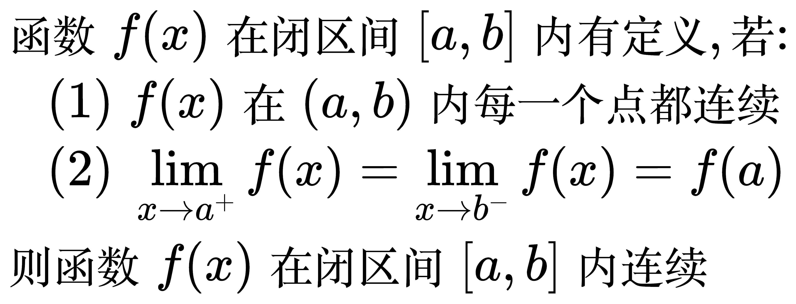
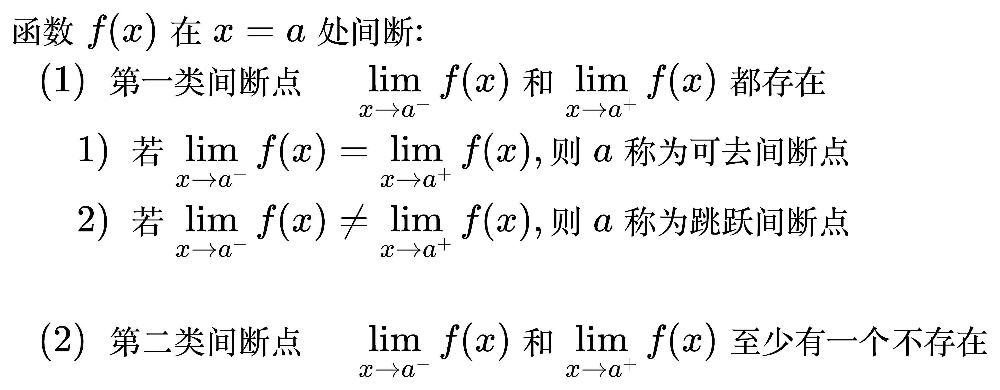

# 连续与间断

## 连续

函数在一点上连续

<!--
\begin{align}
& 函数 f(x) 在 x = a 的邻域内有定义, 若\lim_{x \to a} f(x) = f(a), 则函数 f(x) 在 x = a 处连续 \\
\\
& 1. 函数 f(x) 在 x = a 处连续的充要条件: \lim_{x \to a^{-}} f(x) = \lim_{x \to a^{+}} f(x) = f(a) \\
& 2. 初等函数在定义域内皆连续 \\
\end{align}
-->

函数在闭区间上连续

<!--
\begin{align}
& 函数 f(x) 在闭区间 [a, b] 内有定义, 若: \\
& \quad (1) \; f(x) 在 (a, b) 内每一个点都连续 \\
& \quad (2) \; \lim_{x \to a^{+}} f(x) = \lim_{x \to b^{-}} f(x) = f(a) \\
& 则函数 f(x) 在闭区间 [a, b] 内连续 \\
\end{align}
-->

## 间断

<!--
\begin{align}
& 函数 f(x) 在 x = a 的去心邻域内有定义, 若\lim_{x \to a} f(x) \ne f(a), \\
& 则函数 f(x) 在 x = a 处间断, a 点称为 f(x) 的间断点 \\
\end{align}
-->

间断点的分类

<!--
\begin{align}
& 函数 f(x) 在 x = a 处间断: \\
& \quad (1) \; 第一类间断点 \quad \lim_{x \to a^{-}} f(x) 和 \lim_{x \to a^{+}} f(x) 都存在 \\
& \quad \quad 1) \; 若 \lim_{x \to a^{-}} f(x) = \lim_{x \to a^{+}} f(x), 则 a 称为可去间断点 \\
& \quad \quad 2) \; 若 \lim_{x \to a^{-}} f(x) \ne \lim_{x \to a^{+}} f(x), 则 a 称为跳跃间断点 \\
\\
& \quad (2) \; 第二类间断点 \quad \lim_{x \to a^{-}} f(x) 和 \lim_{x \to a^{+}} f(x) 至少有一个不存在 \\
\end{align}
-->

例题 1

<!--
\begin{align}
& 设函数 f(x) = \begin{cases}
\frac{\sin ax + e^{2x} - 1}{x}, & x \lt 0 \\
4, & x = 0 \\
\frac{b\arctan x + \ln (1 - x)}{x}, & x \gt 0
\end{cases}, 在 x= 0 处连续, 求常数 a, b 的值 \\
\\
& \;\;\;\; \lim_{x \to 0^{-}} f(x) \\
& = \lim_{x \to 0^{-}} \frac{\sin ax}{x} + \lim_{x \to 0^{-}} \frac{e^{2x} - 1}{x} \\
& \;\;\;\; // 等价无穷小替换 \\
& = \lim_{x \to 0^{-}} \frac{ax}{x} + \lim_{x \to 0^{-}} \frac{2x}{x} \\
& = a + 2 \\
\\
& \;\;\;\; f(0) = 0 \\
\\
& \;\;\;\; \lim_{x \to 0^{+}} f(x) \\
& = b \lim_{x \to 0^{+}} \frac{\arctan x}{x} + \lim_{x \to 0^{+}} \frac{\ln (1 - x)}{x} \\
& \;\;\;\; // 等价无穷小替换 \\
& = b \lim_{x \to 0^{+}} \frac{x}{x} + \lim_{x \to 0^{+}} \frac{-x}{x} \\
& = b - 1 \\
\\
& 因为 f(x) 在 x= 0 处连续, 所以 \lim_{x \to 0^{-}} f(x) = \lim_{x \to 0^{+}} f(x) = f(0) \\
& \;\, a + 2 = b - 1 = 4 \\
& \;\, a = 2, b = 5 \\
\end{align}
-->

例题 2

<!--
\begin{align}
& 设 f(x) = \frac{x^{2} + x - 2}{x^{2} - 1} e^{\frac{1}{x}}, 求函数 f(x) 的间断点并分类 \\
\\
& \;\, x = -1, x = 0, x = 1 时 分母为0, 所以 -1, 0, 1 是间断点 \\
\\
& \lim_{x \to -1} f(x) 时, 分母趋于0, 分子趋于 -2, \lim_{x \to -1} e^{\frac{1}{x}} 是个正数 \\
& \lim_{x \to -1} f(x) = \infty, 极限不存在, -1 是第二类间断点 \\
\\
& \lim_{x \to 0} f(x) 时, e^{\frac{1}{0}} 不存在, 要分左右极限 \\
& \lim_{x \to 0^{-}} f(x) = 2\lim_{x \to 0^{-}} e^{\frac{1}{x}} = 0 \\
& \lim_{x \to 0^{+}} f(x) = 2\lim_{x \to 0^{+}} e^{\frac{1}{x}} = + \infty \\
& 所以 0 是第二类间断点 \\
\\
& \lim_{x \to 1} f(x) = \lim_{x \to 1} \frac{(x - 1)(x + 2)}{(x - 1)(x + 1)} e^{\frac{1}{x}} \\
& \qquad \quad \;\;\, = \lim_{x \to 1} \frac{x + 2}{x + 1} e^{\frac{1}{x}} \\
& \qquad \quad \;\;\, = \frac{3}{2} e \\
& 左右极限存在且相等, 1 是可去间断点 \\
\end{align}
-->

例题 3

<!--
\begin{align}
& 设 f(x) = \frac{\ln |x|}{x^{2} - 1}, 求 f(x) 的间断点 \\
\\
& 间断点是 -1, 0, 1 \\
\\
& \lim_{x \to -1} f(x) = \lim_{x \to -1} \frac{1}{x - 1} \times \frac{\ln -x}{x + 1} \\
& \qquad\qquad\; = - \frac{1}{2} \lim_{x \to -1} \frac{\ln -x}{x + 1} \\
& \qquad\qquad\; = - \frac{1}{2} \lim_{x \to -1} \frac{\ln [1 - (x + 1)]}{x + 1} \\
& \qquad\qquad\; = - \frac{1}{2} \lim_{x \to -1} \frac{- (x + 1)}{x + 1} \\
& \qquad\qquad\; = \frac{1}{2} \\
& 左右极限存在且相等, -1 是可去间断点 \\
\\
& \lim_{x \to 0} f(x), 分母趋于 -1, 分子: 由于 |x| 趋于0^{+}, 所以 ln|x| 趋于 - \infty \\
& 所以 \lim_{x \to 0} f(x) = + \infty \\
& 极限不存在, 0 是第二类间断点 \\
\\
& \lim_{x \to 1} f(x) = \lim_{x \to -1} \frac{1}{x + 1} \times \frac{\ln x}{x - 1} \\
& \qquad\qquad\; = \frac{1}{2} \lim_{x \to -1} \frac{\ln x}{x - 1} \\
& \qquad\qquad\; = \frac{1}{2} \lim_{x \to -1} \frac{\ln [1 + (x - 1)]}{x - 1} \\
& \qquad\qquad\; = \frac{1}{2} \lim_{x \to -1} \frac{x - 1}{x - 1} \\
& \qquad\qquad\; = \frac{1}{2} \\
& 左右极限存在且相等, 11 是可去间断点 \\
\end{align}
-->

