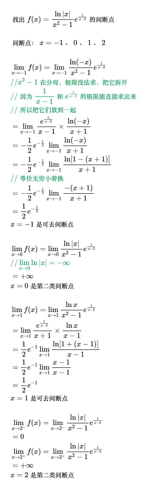

# 连续与间断

## 连续

<!--
\begin{align}
& \; {\large 函数在一点上连续} \\
& 函数 f(x) 在 x = a 的邻域内有定义, \\
& 如果 \lim_{x \to a} f(x) = f(a), \\
& 则称函数 f(x) 在 x = a 点连续 \\
\\
& \; 1、函数 f(x) 在 x = a 处连续的充要条件: \\
& \quad \;\; \lim_{x \to a^{-}} f(x) = \lim_{x \to a^{+}} f(x) = f(a) \\
& \; 2、初等函数在定义域内皆连续 \\
\\
& \; {\large 函数在闭区间上连续} \\
& 函数 f(x) 在闭区间 [a, b] 内有定义, 如果: \\
& \; 1、f(x) 在 (a, b) 内每一个点都连续 \\
& \; 2、 \lim_{x \to a^{+}} f(x) = \lim_{x \to b^{-}} f(x) = f(a) \\
& 则称函数 f(x) 在闭区间 [a, b] 上连续 \\
& 记为 f(x) \in C[a, b] 上连续 \\
\end{align}
-->

## 间断

<!--
\begin{align}
& 函数 f(x) 在 x = a 的去心邻域内有定义，如果 \lim_{x \to a} f(x) \ne f(a), \\
& 则称函数 f(x) 在 x = a 处间断，a 点称为 f(x) 的间断点 \\
\\
& \; {\large 间断点的分类} \\
& 函数 f(x) 在 x = a 处间断: \\
& \; 1、第一类间断点：\lim_{x \to a^{-}} f(x) 和 \lim_{x \to a^{+}} f(x) 都存在 \\
& \quad \quad 1) \; 若 \lim_{x \to a^{-}} f(x) = \lim_{x \to a^{+}} f(x)，则 a 称为可去间断点 \\
& \quad \quad 2) \; 若 \lim_{x \to a^{-}} f(x) \ne \lim_{x \to a^{+}} f(x)，则 a 称为跳跃间断点 \\
\\
& \; 2、第二类间断点：\lim_{x \to a^{-}} f(x) 和 \lim_{x \to a^{+}} f(x) 至少有一个不存在 \\
\end{align}
-->

例题

<!--
\begin{align}
& 设函数 f(x) = \begin{cases}
\frac{\sin ax + e^{2x} - 1}{x}, & x \lt 0 \\
4, & x = 0 \\
\frac{b\arctan x + \ln (1 - x)}{x}, & x \gt 0
\end{cases}, 在 x= 0 处连续, 求常数 a, b 的值 \\
\\
& \;\;\;\; \lim_{x \to 0^{-}} f(x) \\
& = \lim_{x \to 0^{-}} \frac{\sin ax}{x} + \lim_{x \to 0^{-}} \frac{e^{2x} - 1}{x} \\
& \;\;\;\; {\color{Green} // 等价无穷小替换} \\
& = \lim_{x \to 0^{-}} \frac{ax}{x} + \lim_{x \to 0^{-}} \frac{2x}{x} \\
& = a + 2 \\
\\
& \;\;\;\; f(0) = 0 \\
\\
& \;\;\;\; \lim_{x \to 0^{+}} f(x) \\
& = b \lim_{x \to 0^{+}} \frac{\arctan x}{x} + \lim_{x \to 0^{+}} \frac{\ln (1 - x)}{x} \\
& \;\;\;\; {\color{Green} // 等价无穷小替换} \\
& = b \lim_{x \to 0^{+}} \frac{x}{x} + \lim_{x \to 0^{+}} \frac{-x}{x} \\
& = b - 1 \\
\\
& 因为 f(x) 在 x= 0 处连续, 所以 \lim_{x \to 0^{-}} f(x) = \lim_{x \to 0^{+}} f(x) = f(0) \\
& \;\, a + 2 = b - 1 = 4 \\
& \;\, a = 2, b = 5 \\
\end{align}
-->

<!--
\begin{align}
& 设 f(x) = \frac{x^{2} + x - 2}{x^{2} - 1} e^{\frac{1}{x}}, 求函数 f(x) 的间断点并分类 \\
\\
& \;\, x = -1, x = 0, x = 1 时 分母为0, 所以 -1, 0, 1 是间断点 \\
\\
& \lim_{x \to -1} f(x) 时, 分母趋于0, 分子趋于 -2, \lim_{x \to -1} e^{\frac{1}{x}} 是个正数 \\
& \lim_{x \to -1} f(x) = \infty, 极限不存在, -1 是第二类间断点 \\
\\
& \lim_{x \to 0} f(x) 时, e^{\frac{1}{0}} 不存在, 要分左右极限 \\
& \lim_{x \to 0^{-}} f(x) = 2\lim_{x \to 0^{-}} e^{\frac{1}{x}} = 0 \\
& \lim_{x \to 0^{+}} f(x) = 2\lim_{x \to 0^{+}} e^{\frac{1}{x}} = + \infty \\
& 所以 0 是第二类间断点 \\
\\
& \lim_{x \to 1} f(x) = \lim_{x \to 1} \frac{(x - 1)(x + 2)}{(x - 1)(x + 1)} e^{\frac{1}{x}} \\
& \qquad \quad \;\;\, = \lim_{x \to 1} \frac{x + 2}{x + 1} e^{\frac{1}{x}} \\
& \qquad \quad \;\;\, = \frac{3}{2} e \\
& 左右极限存在且相等, 1 是可去间断点 \\
\end{align}
-->

<!--
\begin{align}
& 设 f(x) = \frac{\ln |x|}{x^{2} - 1}, 求 f(x) 的间断点 \\
\\
& 间断点是 -1, 0, 1 \\
\\
& \lim_{x \to -1} f(x) = \lim_{x \to -1} \frac{1}{x - 1} \times \frac{\ln -x}{x + 1} \\
& \qquad\qquad\; = - \frac{1}{2} \lim_{x \to -1} \frac{\ln -x}{x + 1} \\
& \qquad\qquad\; = - \frac{1}{2} \lim_{x \to -1} \frac{\ln [1 - (x + 1)]}{x + 1} \\
& \qquad\qquad\; = - \frac{1}{2} \lim_{x \to -1} \frac{- (x + 1)}{x + 1} \\
& \qquad\qquad\; = \frac{1}{2} \\
& 左右极限存在且相等, -1 是可去间断点 \\
\\
& \lim_{x \to 0} f(x), 分母趋于 -1, 分子: 由于 |x| 趋于0^{+}, 所以 ln|x| 趋于 - \infty \\
& 所以 \lim_{x \to 0} f(x) = + \infty \\
& 极限不存在, 0 是第二类间断点 \\
\\
& \lim_{x \to 1} f(x) = \lim_{x \to -1} \frac{1}{x + 1} \times \frac{\ln x}{x - 1} \\
& \qquad\qquad\; = \frac{1}{2} \lim_{x \to -1} \frac{\ln x}{x - 1} \\
& \qquad\qquad\; = \frac{1}{2} \lim_{x \to -1} \frac{\ln [1 + (x - 1)]}{x - 1} \\
& \qquad\qquad\; = \frac{1}{2} \lim_{x \to -1} \frac{x - 1}{x - 1} \\
& \qquad\qquad\; = \frac{1}{2} \\
& 左右极限存在且相等, 11 是可去间断点 \\
\end{align}
-->

<!--
\begin{align}
& 求出所有间断点及类型
f(x) = \frac{2^{\frac{1}{x}}}{1 + 2^{\frac{1}{x}}} \cdot \frac{x^2 + x - 2}{x^2 - 1} \\
\\
& f(x) 的间断点: x = 0，x = -1，x = 1 \\
\\
& 对于 x = 0 \\
& \; x \to 0 时函数的定义中包含 a^{\frac{?}{x - b}}，要分左右极限 \Rightarrow \\
& \begin{cases}
x \to 0^- 时，2^{\frac{1}{x}} \to 2^{-\infty} \to 0 \Rightarrow
\frac{2^{\frac{1}{x}}}{1 + 2^{\frac{1}{x}}} \to \frac{0}{1} \to 0 \\
x \to 0^+ 时，2^{\frac{1}{x}} \to 2^{+\infty} \to \infty \Rightarrow
\frac{2^{\frac{1}{x}}}{1 + 2^{\frac{1}{x}}} \to \frac{\infty}{\infty} \to 1
\end{cases} \\
& \; x \to 0 \Rightarrow \frac{x^2 + x - 2}{x^2 - 1} \to 2 \\
& \; \lim_{x \to 0^-} f(x) = 0 \\
& \; \lim_{x \to 0^+} f(x) = 2 \\
& 所以 x = 0 是跳跃间断点 \\
\\
& 对于 x = -1 \\
& \; x \to -1 \Rightarrow 2^{\frac{1}{x}} \to \frac{1}{2} \Rightarrow
\frac{2^{\frac{1}{x}}}{1 + 2^{\frac{1}{x}}} \to \frac{1}{3} \\
& \; x \to -1 \Rightarrow \frac{x^2 + x - 2}{x^2 - 1} \to \frac{-2}{0} \to \infty \\
& \; \lim_{x \to -1} f(x) = \infty \\
& 所以 x = -1 是第二类间断点 \\
\\
& 对于 x = 1 \\
& \; x \to 1 \Rightarrow 2^{\frac{1}{x}} \to 2 \Rightarrow
\frac{2^{\frac{1}{x}}}{1 + 2^{\frac{1}{x}}} \to \frac{2}{3} \\
& \; x \to 1 \Rightarrow \frac{x^2 + x - 2}{x^2 - 1}
= \frac{(x + 2)(x - 1)}{(x + 1)(x - 1)}
= \frac{x + 2}{x + 1} \to \frac{3}{2} \\
& \; \lim_{x \to -1} f(x) = 1 \\
& 所以 x = 1 是可去间断点 \\
\end{align}
-->

<!--
\begin{align}
& 找出 f(x)=\frac{\ln|x|}{x^2-1}e^{\frac{1}{x-2}} 的间断点 \\
\\
& 间断点：x=-1、0、1、2 \\
\\
& \lim_{x \to -1}f(x)=\lim_{x \to -1}\frac{\ln(-x)}{x^2-1}e^{\frac{1}{x-2}} \\
& {\color{Green} // x^2-1在分母，极限没法求，把它拆开} \\
& {\color{Green} // 因为\frac{1}{x-1}和e^{\frac{1}{x-2}}的极限能直接求出来} \\
& {\color{Green} // 所以把它们放到一起} \\
& =\lim_{x \to -1}\frac{e^{\frac{1}{x-2}}}{x-1} \times \frac{\ln(-x)}{x+1} \\
& =-\frac{1}{2}e^{-\frac{1}{3}} \lim_{x \to -1} \frac{\ln(-x)}{x+1} \\
& =-\frac{1}{2}e^{-\frac{1}{3}} \lim_{x \to -1} \frac{\ln[1-(x+1)]}{x+1} \\
& {\color{Green} // 等价无穷小替换} \\
& =-\frac{1}{2}e^{-\frac{1}{3}} \lim_{x \to -1} \frac{-(x+1)}{x+1} \\
& =\frac{1}{2}e^{-\frac{1}{3}} \\
& x=-1是可去间断点 \\
\\
& \lim_{x \to 0}f(x)=\lim_{x \to 0}\frac{\ln|x|}{x^2-1}e^{\frac{1}{x-2}} \\
& {\color{Green} // \lim_{x \to 0}\ln|x|=-\infty} \\
& = +\infty \\
& x=0是第二类间断点 \\
\\
& \lim_{x \to 1}f(x)=\lim_{x \to 1}\frac{\ln x}{x^2-1}e^{\frac{1}{x-2}} \\
& =\lim_{x \to 1}\frac{e^{\frac{1}{x-2}}}{x+1} \times \frac{\ln x}{x-1} \\
& =\frac{1}{2}e^{-1} \lim_{x \to 1} \frac{\ln[1+(x-1)]}{x-1} \\
& =\frac{1}{2}e^{-1} \lim_{x \to 1} \frac{x-1}{x-1} \\
& =\frac{1}{2}e^{-1} \\
& x=1是可去间断点 \\
\\
& \lim_{x \to 2^-}f(x)=\lim_{x \to 2^-}\frac{\ln|x|}{x^2-1}e^{\frac{1}{x-2}} \\
& =0 \\
& \lim_{x \to 2^+}f(x)=\lim_{x \to 2^+}\frac{\ln|x|}{x^2-1}e^{\frac{1}{x-2}} \\
& =+\infty \\
& x=2是第二类间断点 \\
\end{align}
-->

