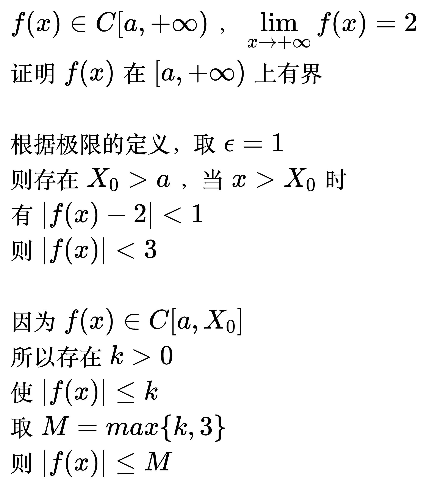

# 闭区间上连续函数的性质

<!--
\begin{align}
& {\large 最小值与最大值定理} \\
& 设 f(x) 在 [a, b] 上连续， \\
& 则 f(x) 在 [a, b] 上可以取到最小值和最大值 \\
\\
& {\large 有界定理} \\
& 设 f(x) 在 [a, b] 上连续， \\
& 则 f(x) 在 [a, b] 上有界 \\
\\
& {\large 零点定理} \\
& 设 f(x) 在 [a, b] 上连续，且 f(a) \cdot f(b) \lt 0， \\
& 则至少存在一点 c \in (a, b)， 使 f(c) = 0 \\
\end{align}
-->

例题

<!--
\begin{align}
& 证明方程 x^{5} + 4x + 1 = 0 有且仅有一个正根 \\
\\
& 令 f(x) = x^{5} + 4x + 1, f(x) 处处连续 \\
& 取一个好算的范围 [0, 1], 则 f(0) = -1, f(1) = 4, f(0) \cdot f(1) = -4 \lt 0 \\
& 根据零点定理, 存在 c \in (a, b), 使 f(c) = 0 \\
& 所以 c 是方程的1个解, 且 c 为正数 \\
\\
& 求导 f'(x) = 5x^{4} + 4 > 0, 所以 f(x) 在 [0, + \infty]单调递增 \\
& 所以方程的解唯一 \\
\end{align}
-->

<!--
\begin{align}
& \; f(x)\in C[a,+\infty)，\lim_{x \to +\infty}f(x)=2 \\
& 证明 f(x)在[a,+\infty)上有界 \\
\\
& 根据极限的定义，取 \epsilon =1 \\
& 则存在X_0>a，当x>X_0时 \\
& 有 |f(x)-2|<1 \\
& 则 |f(x)|<3 \\
\\
& 因为 f(x)\in C[a,X_0] \\
& 所以存在k>0 \\
& 使 |f(x)|\le k \\
& 取M=max\left \{ k,3 \right \} \\
& 则|f(x)|\le M \\
\end{align}
-->

