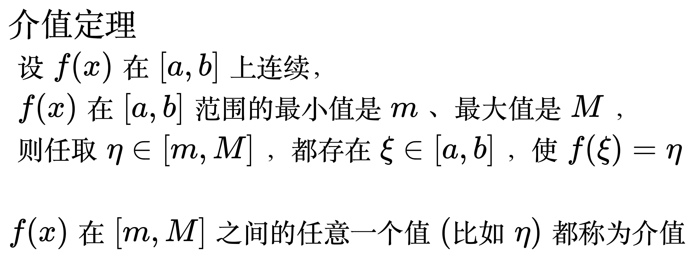
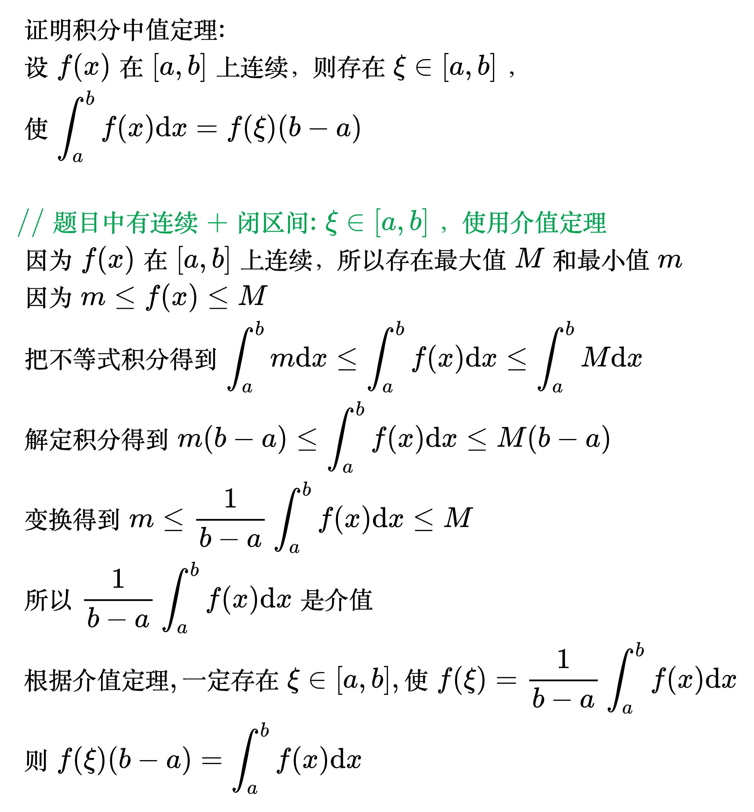

# 介值定理

<!--
\begin{align}
& {\large 介值定理} \\
& 设 f(x) 在 [a, b] 上连续， \\
& \; f(x) 在 [a, b] 范围的最小值是 m、最大值是 M， \\
& 则任取 \eta \in [m, M]，都存在 \xi \in [a, b]，使 f(\xi) = \eta \\
\\
& f(x) 在 [m, M] 之间的任意一个值(比如 \eta)都称为介值 \\
\end{align}
-->

例题

<!--
\begin{align}
& 设 f(x) 在 [0, 2] 上连续, f(0) + 2 \cdot f(1) + 3 \cdot f(2) = 6, \\
& 证明: 存在 \xi \in [0, 2], 使 f(\xi) = 1 \\
\\
& {\color{Green} // 闭区间连续, 函数值相加 \Rightarrow 使用介值定理} \\
& 因为  f(x) 在 [0, 2] 上连续, 所以存在最大值 M 和最小值 m \\
& {\color{Green} // f(0) + 2 \cdot f(1) + 3 \cdot f(2) 一共是6个f相加} \\
& {\color{Green} // 所以m和M也乘6} \\
& 因为 6 \cdot m \le f(0) + 2 \cdot f(1) + 3 \cdot f(2) \le 6 \cdot M \\
& 所以 6 \cdot m \le 6 \le 6 \cdot M \\
& 得到 m \le 1 \le M \\
& 所以1是介值 \\
& 根据介值定理, 一定存在 \xi \in [0, 2], 使 f(\xi) = 1 \\
\end{align}
-->

<!--
\begin{align}
& 证明积分中值定理: \\
& 设 f(x) 在 [a, b] 上连续，则存在 \xi \in [a, b]，\\
& 使 \int_{a}^{b} f(x) \mathrm{d}x = f(\xi)(b - a) \\
\\
& {\color{Green} // 题目中有连续+闭区间: \xi \in [a, b]， 使用介值定理} \\
& 因为 f(x) 在 [a, b] 上连续，所以存在最大值 M 和最小值 m \\
& 因为 m \le f(x) \le M \\
& 把不等式积分得到 \int_{a}^{b} m \mathrm{d}x \le \int_{a}^{b} f(x) \mathrm{d}x
\le \int_{a}^{b} M \mathrm{d}x \\
& 解定积分得到 m(b - a) \le \int_{a}^{b} f(x) \mathrm{d}x \le M(b - a) \\
& 变换得到 m \le \frac{1}{b - a} \int_{a}^{b} f(x) \mathrm{d}x \le M \\
& 所以 \frac{1}{b - a} \int_{a}^{b} f(x) \mathrm{d}x 是介值 \\
& 根据介值定理, 一定存在 \xi \in [a, b], 使 f(\xi) = \frac{1}{b - a} \int_{a}^{b} f(x) \mathrm{d}x \\
& 则 f(\xi)(b - a) = \int_{a}^{b} f(x) \mathrm{d}x \\
\end{align}
-->

<!--
\begin{align}
& \; f(x) \in C[a,b]，p>0，q>0 \\
& 证明 存在 \xi \in [a,b]，使得pf(a)+qf(b)=(p+q)f(\xi) \\
\\
& 因为f(x) \in C[a,b] \\
& 所以存在上下界 m，M \\
& 则 (p+q)m\le pf(a)+qf(b)\le (p+q)M \\
& 推出 m\le \frac{pf(a)+qf(b)}{p+q} \le M \\
& 则 \frac{pf(a)+qf(b)}{p+q} 是介值 \\
& 存在 \xi \in [a,b] \\
& 使得 f(\xi)=\frac{pf(a)+qf(b)}{p+q} \\
& 则 pf(a)+qf(b)=(p+q)f(\xi) \\
\end{align}
-->

