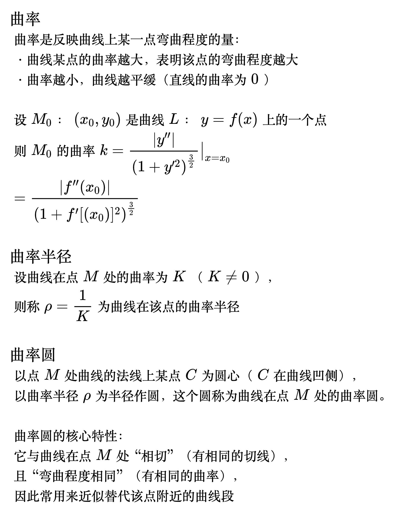

# 曲率

<!--
\begin{align}
& {\large 曲率} \\
& 曲率是反映曲线上某一点弯曲程度的量： \\
& \;\;\cdot 曲线某点的曲率越大，表明该点的弯曲程度越大 \\
& \;\;\cdot 曲率越小，曲线越平缓（直线的曲率为 0） \\
\\
& 设 M_0：(x_0, y_0)是曲线L：y=f(x)上的一个点 \\
& 则M_0的曲率k=\frac{|y''|}{\left ( 1+y'^2 \right )^{\frac{3}{2}}}\big|_{x=x_0} \\
& =\frac{|f''(x_0)|}{\left ( 1+f'[(x_0)]^2 \right )^{\frac{3}{2}}} \\
\\
& {\large 曲率半径} \\
& 设曲线在点 M 处的曲率为 K（K \neq 0），\\
& 则称 \rho = \frac{1}{K} 为曲线在该点的曲率半径 \\
\\
& {\large 曲率圆} \\
& 以点 M 处曲线的法线上某点 C 为圆心（C 在曲线凹侧），\\
& 以曲率半径 \rho 为半径作圆，这个圆称为曲线在点 M 处的曲率圆。\\
\\
& 曲率圆的核心特性：\\
& 它与曲线在点 M 处 “相切”（有相同的切线）， \\
& 且 “弯曲程度相同”（有相同的曲率）， \\
& 因此常用来近似替代该点附近的曲线段 \\
\end{align}
-->

