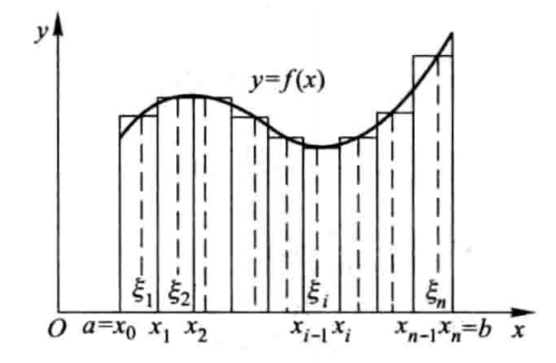
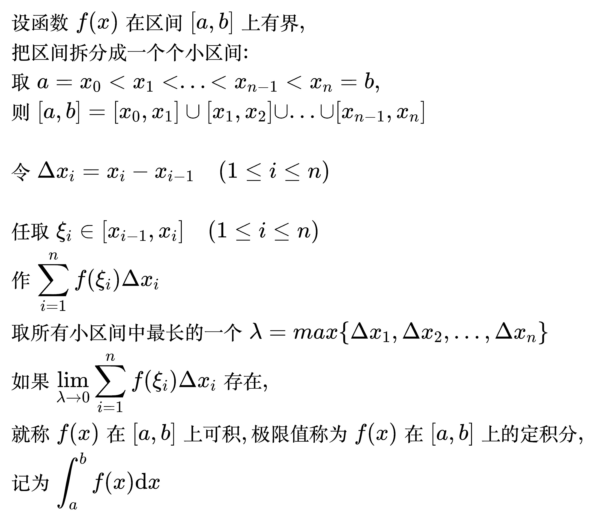
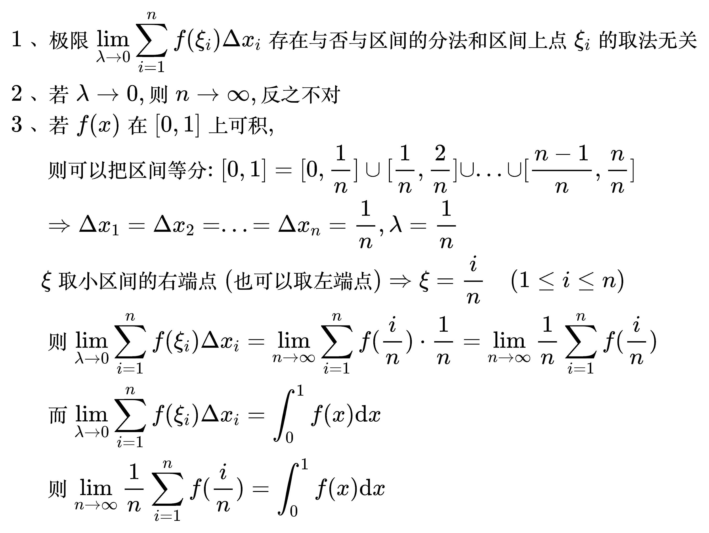
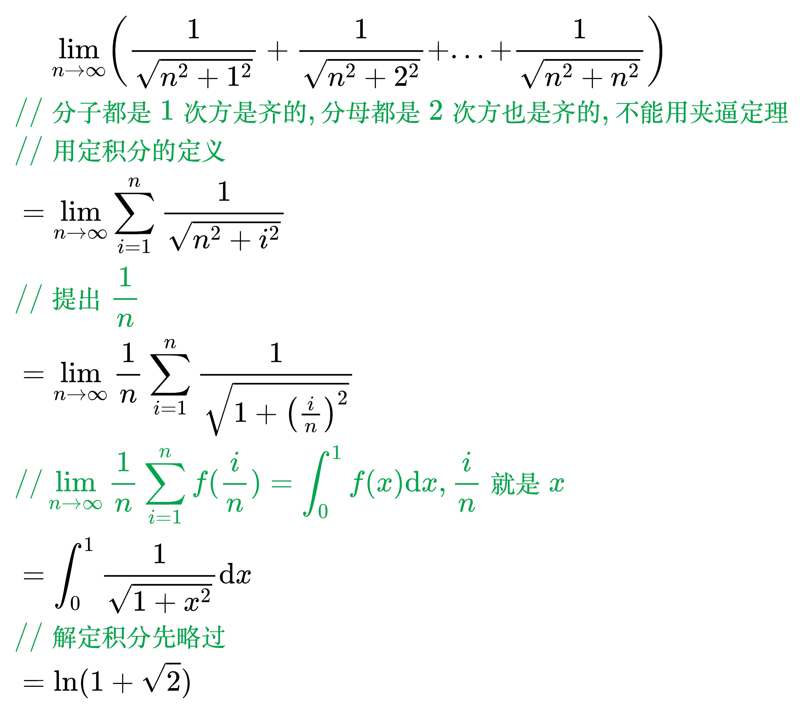
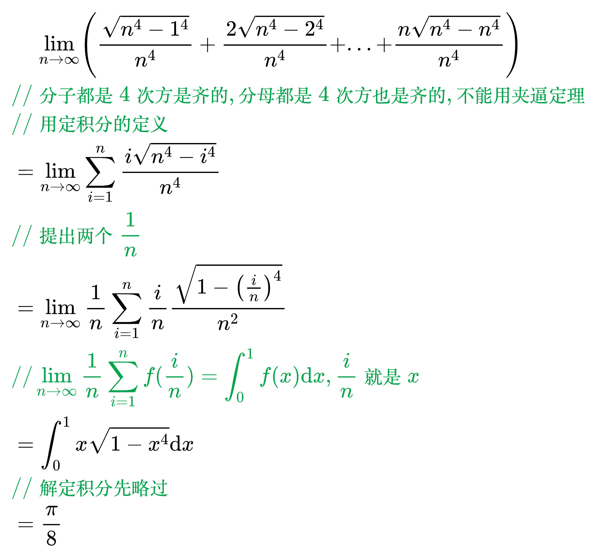
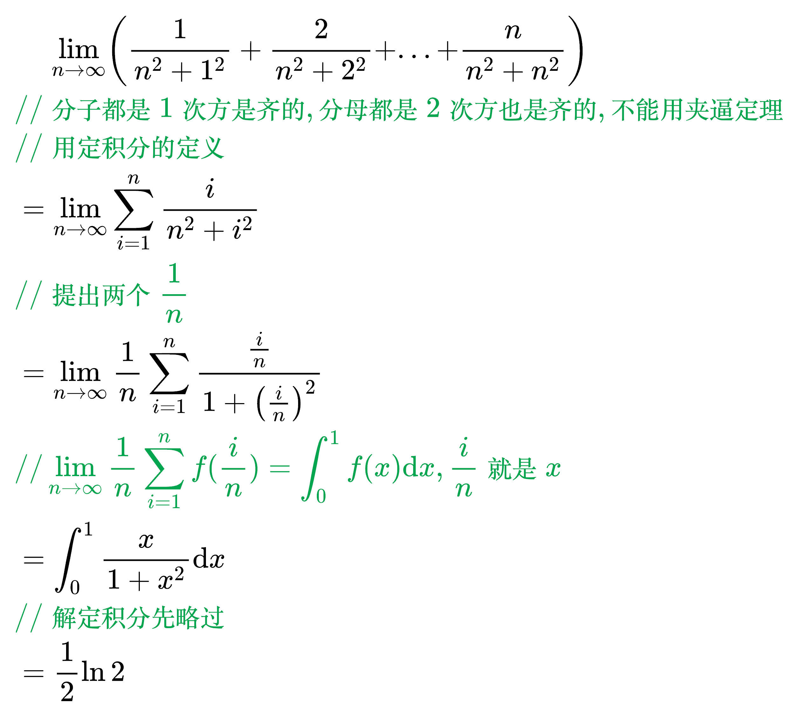

# 定积分

求曲边梯形的面积的方法: 细分成无数的小矩形, 再把所有矩形的面积加起来

<!--
\begin{align}
& 设函数 f(x) 在区间 [a, b] 上有界, \\
& 把区间拆分成一个个小区间: \\
& 取 a = x_0 < x_1 < ... < x_{n-1} < x_n = b, \\
& 则 [a, b] = [x_0, x_1] \cup [x_1, x_2] \cup ... \cup [x_{n-1}, x_n] \\
\\
& 令 \Delta x_i = x_i - x_{i-1} \quad (1 \le i \le n) \\
\\
& 任取 \xi _i \in [x_{i-1}, x_i] \quad (1 \le i \le n) \\
& 作 \sum_{i = 1}^{n} f(\xi _i) \Delta x_i \\
& 取所有小区间中最长的一个 \lambda = max \left \{ \Delta x_1, \Delta x_2, ... , \Delta x_n \right \} \\
& 如果 \lim_{\lambda \to 0} \sum_{i = 1}^{n} f(\xi _i) \Delta x_i 存在, \\
& 就称 f(x) 在 [a, b] 上可积, 极限值称为 f(x) 在 [a, b] 上的定积分, \\
& 记为 \int_{a}^{b} f(x) \mathrm{d}x \\
\end{align}
-->

<!--
\begin{align}
& 1、 极限 \lim_{\lambda \to 0} \sum_{i = 1}^{n} f(\xi _i) \Delta x_i 存在与否与区间的分法和区间上点 \xi _i 的取法无关 \\
& 2、 若 \lambda \to 0, 则 n \to \infty , 反之不对 \\
& 3、 若 f(x) 在 [0, 1] 上可积, \\
& \;\;\;\;\, 则可以把区间等分: [0, 1] = [0, \frac{1}{n}] \cup [\frac{1}{n}, \frac{2}{n}] \cup ... \cup [\frac{n - 1}{n}, \frac{n}{n}] \\
& \;\;\;\;\, \Rightarrow \Delta x_1 = \Delta x_2 = ... = \Delta x_n = \frac{1}{n}, \lambda = \frac{1}{n} \\
& \;\;\;\;\, \xi 取小区间的右端点(也可以取左端点) \Rightarrow \xi = \frac{i}{n} \quad (1 \le i \le n) \\
& \;\;\;\;\, 则 \lim_{\lambda \to 0} \sum_{i = 1}^{n} f(\xi _i) \Delta x_i
= \lim_{n \to \infty} \sum_{i = 1}^{n} f(\frac{i}{n}) \cdot \frac{1}{n}
= \lim_{n \to \infty} \frac{1}{n} \sum_{i = 1}^{n} f(\frac{i}{n})  \\
& \;\;\;\;\, 而 \lim_{\lambda \to 0} \sum_{i = 1}^{n} f(\xi _i) \Delta x_i = \int_{0}^{1} f(x) \mathrm{d}x \\
& \;\;\;\;\, 则 \lim_{n \to \infty} \frac{1}{n} \sum_{i = 1}^{n} f(\frac{i}{n}) = \int_{0}^{1} f(x) \mathrm{d}x \\
\end{align}
-->

例题 1

<!--
\begin{align}
& \;\;\;\; \lim_{n \to \infty} \left ( \frac{1}{\sqrt{n^2 + 1^2}} + \frac{1}{\sqrt{n^2 + 2^2}} + ... + \frac{1}{\sqrt{n^2 + n^2}} \right ) \\
& {\color{Green} // 分子都是1次方是齐的, 分母都是2次方也是齐的, 不能用夹逼定理} \\
& {\color{Green} // 用定积分的定义} \\
& = \lim_{n \to \infty} \sum_{i=1}^{n} \frac{1}{\sqrt{n^2 + i^2}} \\
& {\color{Green} // 提出 \frac{1}{n}} \\
& = \lim_{n \to \infty} \frac{1}{n} \sum_{i=1}^{n} \frac{1}{\sqrt{1 + \left ( \frac{i}{n} \right ) ^2}} \\
& {\color{Green} // \lim_{n \to \infty} \frac{1}{n} \sum_{i = 1}^{n} f(\frac{i}{n}) = \int_{0}^{1} f(x) \mathrm{d}x, \frac{i}{n} 就是 x} \\
& = \int_{0}^{1} \frac{1}{\sqrt{1 + x^2}} \mathrm{d}x \\
& {\color{Green} // 解定积分先略过} \\
& = \ln (1 + \sqrt{2})
\end{align} \\
-->

例题 2

<!--
\begin{align}
& \;\;\;\; \lim_{n \to \infty} \left ( \frac{\sqrt{n^4 - 1^4}}{n^4} + \frac{2\sqrt{n^4 - 2^4}}{n^4} + ... + \frac{n\sqrt{n^4 - n^4}}{n^4} \right ) \\
& {\color{Green} // 分子都是4次方是齐的, 分母都是4次方也是齐的, 不能用夹逼定理} \\
& {\color{Green} // 用定积分的定义} \\
& = \lim_{n \to \infty} \sum_{i=1}^{n} \frac{i\sqrt{n^4 - i^4}}{n^4} \\
& {\color{Green} // 提出两个 \frac{1}{n}} \\
& = \lim_{n \to \infty} \frac{1}{n} \sum_{i=1}^{n} \frac{i}{n} \frac{\sqrt{1 - \left ( \frac{i}{n} \right ) ^4}}{n^2} \\
& {\color{Green} // \lim_{n \to \infty} \frac{1}{n} \sum_{i = 1}^{n} f(\frac{i}{n}) = \int_{0}^{1} f(x) \mathrm{d}x, \frac{i}{n} 就是 x} \\
& = \int_{0}^{1} x \sqrt{1 - x^4} \mathrm{d}x \\
& {\color{Green} // 解定积分先略过} \\
& = \frac{\pi}{8} \\
\end{align}
-->

例题 3

<!--
\begin{align}
& \;\;\;\; \lim_{n \to \infty} \left ( \frac{1}{n^2 + 1^2} + \frac{2}{n^2 + 2^2} + ... + \frac{n}{n^2 + n^2} \right ) \\
& {\color{Green} // 分子都是1次方是齐的, 分母都是2次方也是齐的, 不能用夹逼定理} \\
& {\color{Green} // 用定积分的定义} \\
& = \lim_{n \to \infty} \sum_{i=1}^{n} \frac{i}{n^2 + i^2} \\
& {\color{Green} // 提出两个 \frac{1}{n}} \\
& = \lim_{n \to \infty} \frac{1}{n} \sum_{i=1}^{n} \frac{\frac{i}{n}}{1 + \left ( \frac{i}{n} \right ) ^2} \\
& {\color{Green} // \lim_{n \to \infty} \frac{1}{n} \sum_{i = 1}^{n} f(\frac{i}{n}) = \int_{0}^{1} f(x) \mathrm{d}x, \frac{i}{n} 就是 x} \\
& = \int_{0}^{1} \frac{x}{1 + x^2} \mathrm{d}x \\
& {\color{Green} // 解定积分先略过} \\
& = \frac{1}{2} \ln 2 \\
\end{align}
-->

## 定积分的一般性质
