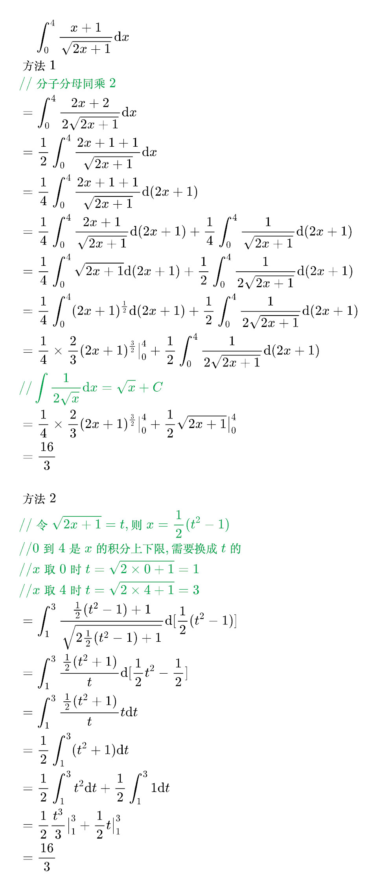
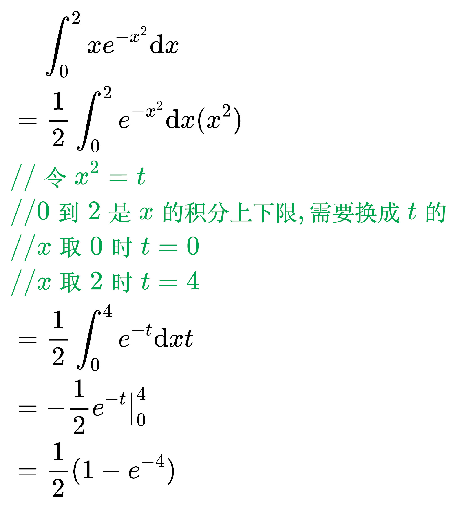

# 换元积分法

例题 1

<!--
\begin{align}
& \;\;\;\; \int_{0}^{4} \frac{x + 1}{\sqrt{2x + 1}} \mathrm{d}x \\
& 方法1 \\
& {\color{Green} // 分子分母同乘2} \\
& = \int_{0}^{4} \frac{2x + 2}{2\sqrt{2x + 1}} \mathrm{d}x \\
& = \frac{1}{2} \int_{0}^{4} \frac{2x + 1 + 1}{\sqrt{2x + 1}} \mathrm{d}x \\
& = \frac{1}{4} \int_{0}^{4} \frac{2x + 1 + 1}{\sqrt{2x + 1}} \mathrm{d}(2x + 1) \\
& = \frac{1}{4} \int_{0}^{4} \frac{2x + 1}{\sqrt{2x + 1}} \mathrm{d}(2x + 1) +
\frac{1}{4} \int_{0}^{4} \frac{1}{\sqrt{2x + 1}} \mathrm{d}(2x + 1) \\
& = \frac{1}{4} \int_{0}^{4} \sqrt{2x + 1} \mathrm{d}(2x + 1) +
\frac{1}{2} \int_{0}^{4} \frac{1}{2\sqrt{2x + 1}} \mathrm{d}(2x + 1) \\
& = \frac{1}{4} \int_{0}^{4} (2x + 1)^{\frac{1}{2}} \mathrm{d}(2x + 1) +
\frac{1}{2} \int_{0}^{4} \frac{1}{2\sqrt{2x + 1}} \mathrm{d}(2x + 1) \\
& = \frac{1}{4} \times \frac{2}{3} (2x + 1)^{\frac{3}{2}} \big|_{0}^{4} +
\frac{1}{2} \int_{0}^{4} \frac{1}{2\sqrt{2x + 1}} \mathrm{d}(2x + 1) \\
& {\color{Green} // \int \frac{1}{2\sqrt{x}} \mathrm{d}x = \sqrt{x} + C} \\
& = \frac{1}{4} \times \frac{2}{3} (2x + 1)^{\frac{3}{2}} \big|_{0}^{4} +
\frac{1}{2} \sqrt{2x + 1}  \big|_{0}^{4} \\
& = \frac{16}{3} \\
\\
& 方法2 \\
& {\color{Green} // 令 \sqrt{2x + 1} = t, 则 x = \frac{1}{2}(t^2 - 1)} \\
& {\color{Green} // 0到4是x的积分上下限, 需要换成t的} \\
& {\color{Green} // x取0时 t = \sqrt{2 \times 0 + 1} = 1} \\
& {\color{Green} // x取4时 t = \sqrt{2 \times 4 + 1} = 3} \\
& = \int_{1}^{3} \frac{\frac{1}{2}(t^2 - 1) + 1}{\sqrt{2 \frac{1}{2}(t^2 - 1) + 1}}
\mathrm{d}[\frac{1}{2}(t^2 - 1)] \\
& = \int_{1}^{3} \frac{\frac{1}{2}(t^2 + 1)}{t} \mathrm{d}[\frac{1}{2}t^2 - \frac{1}{2}] \\
& = \int_{1}^{3} \frac{\frac{1}{2}(t^2 + 1)}{t} t \mathrm{d}t \\
& = \frac{1}{2} \int_{1}^{3} (t^2 + 1) \mathrm{d}t \\
& = \frac{1}{2} \int_{1}^{3} t^2 \mathrm{d}t + \frac{1}{2} \int_{1}^{3} 1 \mathrm{d}t \\
& = \frac{1}{2} \frac{t^3}{3} \big|_{1}^{3} + \frac{1}{2} t \big|_{1}^{3} \\
& = \frac{16}{3} \\
\end{align}
-->

例题 2

<!--
\begin{align}
& \;\;\;\; \int_{0}^{2} x e^{-x^2} \mathrm{d}x \\
& = \frac{1}{2} \int_{0}^{2}e^{-x^2} \mathrm{d}x(x^2) \\
& {\color{Green} // 令 x^2 = t} \\
& {\color{Green} // 0到2是x的积分上下限, 需要换成t的} \\
& {\color{Green} // x取0时 t = 0} \\
& {\color{Green} // x取2时 t = 4} \\
& = \frac{1}{2} \int_{0}^{4}e^{-t} \mathrm{d}xt \\
& = - \frac{1}{2} e^{-t} \big|_{0}^{4} \\
& = \frac{1}{2} (1 - e^{-4}) \\
\end{align}
-->

例题 3

<!--

-->
