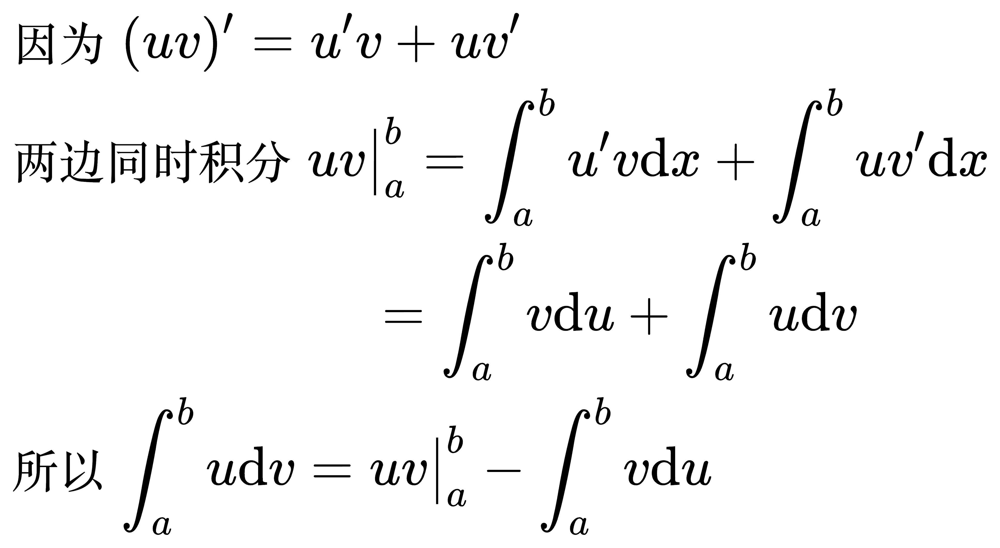
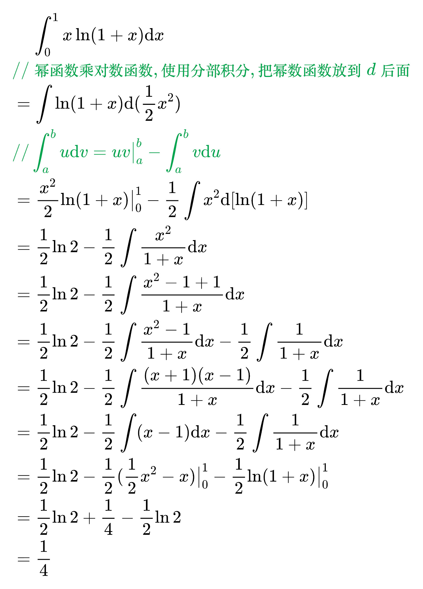

# 分部积分法

分部积分公式

<!--
\begin{align}
& 因为 (uv)' = u'v + uv' \\
& 两边同时积分 uv \big|_{a}^{b} = \int_{a}^{b} u'v \mathrm{d}x + \int_{a}^{b} uv' \mathrm{d}x \\
& \qquad\qquad\qquad\,\,\,\, = \int_{a}^{b} v \mathrm{d}u + \int_{a}^{b} u \mathrm{d}v \\
& 所以 \int_{a}^{b} u \mathrm{d}v = uv \big|_{a}^{b} - \int_{a}^{b} v \mathrm{d}u \\
\end{align}
-->

例题 1

<!--
\begin{align}
& \;\;\;\; \int_{0}^{1} x \ln(1 + x) \mathrm{d}x \\
& {\color{Green} // 幂函数乘对数函数, 使用分部积分, 把幂数函数放到 d 后面} \\
& = \int \ln(1 + x) \mathrm{d}(\frac{1}{2} x^2) \\
& {\color{Green} // \int_{a}^{b} u \mathrm{d}v = uv \big|_{a}^{b} - \int_{a}^{b} v \mathrm{d}u} \\
& = \frac{x^2}{2} \ln(1 + x) \big|_{0}^{1} - \frac{1}{2} \int x^2 \mathrm{d}[\ln(1 + x)] \\
& = \frac{1}{2} \ln 2 - \frac{1}{2} \int \frac{x^2}{1 + x} \mathrm{d}x \\
& = \frac{1}{2} \ln 2 - \frac{1}{2} \int \frac{x^2 -1 + 1}{1 + x} \mathrm{d}x \\
& = \frac{1}{2} \ln 2 -
\frac{1}{2} \int \frac{x^2 -1}{1 + x} \mathrm{d}x -
\frac{1}{2} \int \frac{1}{1 + x} \mathrm{d}x \\
& = \frac{1}{2} \ln 2 -
\frac{1}{2} \int \frac{(x + 1)(x - 1)}{1 + x} \mathrm{d}x -
\frac{1}{2} \int \frac{1}{1 + x} \mathrm{d}x \\
& = \frac{1}{2} \ln 2 -
\frac{1}{2} \int (x - 1) \mathrm{d}x -
\frac{1}{2} \int \frac{1}{1 + x} \mathrm{d}x \\
& = \frac{1}{2} \ln 2 -
\frac{1}{2} (\frac{1}{2} x^2 - x) \big|_{0}^{1} -
\frac{1}{2} \ln (1 + x) \big|_{0}^{1} \\
& = \frac{1}{2} \ln 2 + \frac{1}{4} - \frac{1}{2} \ln 2 \\
& = \frac{1}{4} \\
\end{align}
-->

