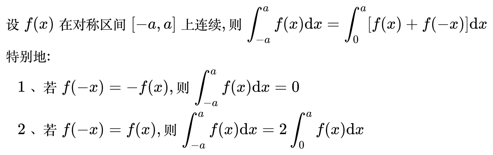

# 定积分特殊性质

## 对称区间的定积分性质

<!--
\begin{align}
& 设 f(x) 在对称区间 [-a, a] 上连续, 则 \int_{-a}^{a} f(x) \mathrm{d}x
= \int_{0}^{a} [f(x) + f(-x)] \mathrm{d}x \\
& 特别地: \\
& \quad 1、若 f(-x) = - f(x), 则 \int_{-a}^{a} f(x) \mathrm{d}x = 0 \\
& \quad 2、若 f(-x) = f(x), 则 \int_{-a}^{a} f(x) \mathrm{d}x = 2 \int_{0}^{a} f(x) \mathrm{d}x \\
\end{align}
-->

例题 1

<!--
\begin{align}
& \;\;\;\; \int_{- \frac{\pi}{4}}^{\frac{\pi}{4}} \frac{1}{e^x + 1} \mathrm{d}x \\
& = \int_{0}^{\frac{\pi}{4}} (\frac{1}{e^x + 1} + \frac{1}{e^{-x} + 1}) \mathrm{d}x \\
& {\color{Green} // 把第二项的分子分母同时乘 e^x} \\
& = \int_{0}^{\frac{\pi}{4}} (\frac{1}{e^x + 1} + \frac{e^x}{1 + e^x}) \mathrm{d}x \\
& = \int_{0}^{\frac{\pi}{4}} \frac{1 + e^x}{1 + e^x} \mathrm{d}x \\
& = \int_{0}^{\frac{\pi}{4}} 1 \mathrm{d}x \\
& = \frac{\pi}{4} \\
\end{align}
-->

