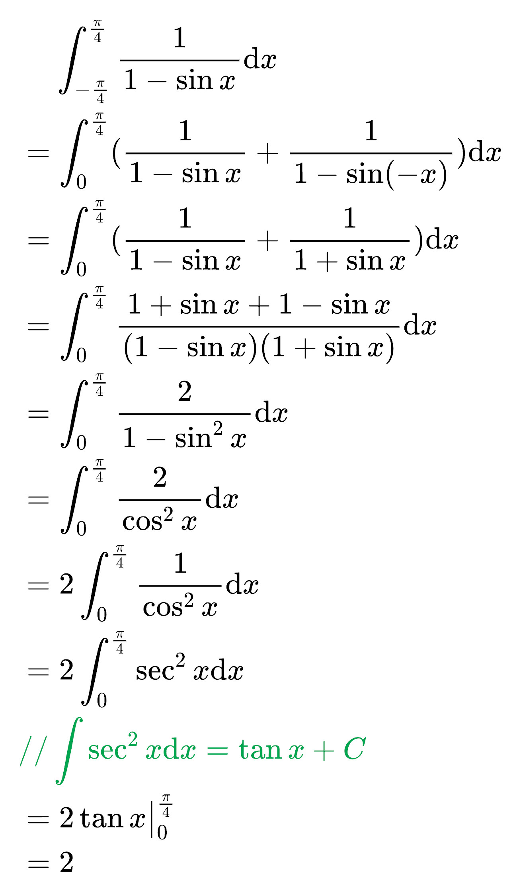
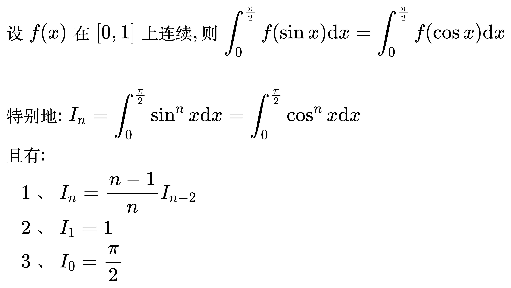
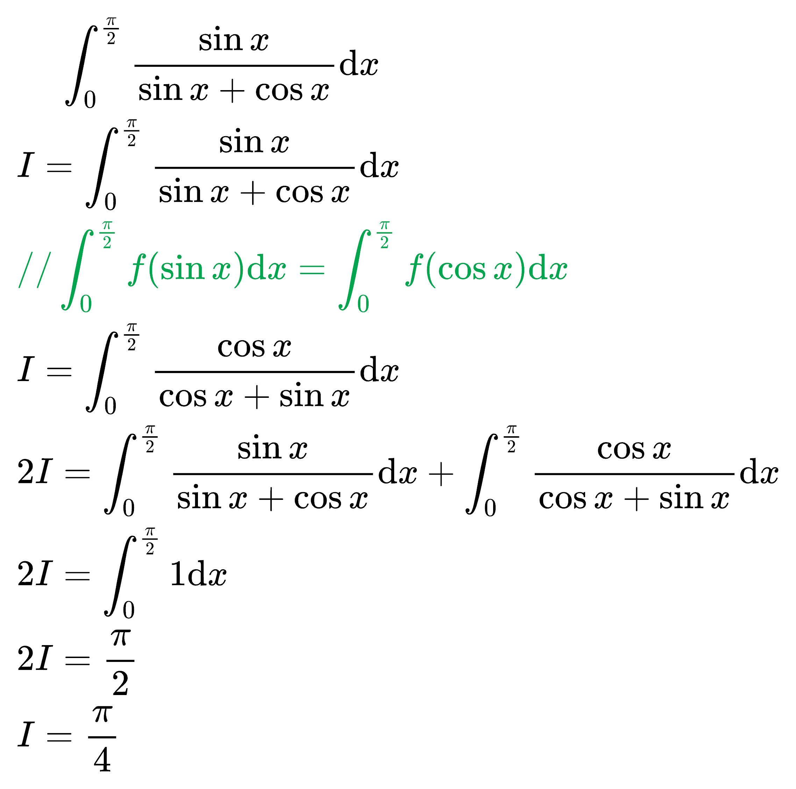
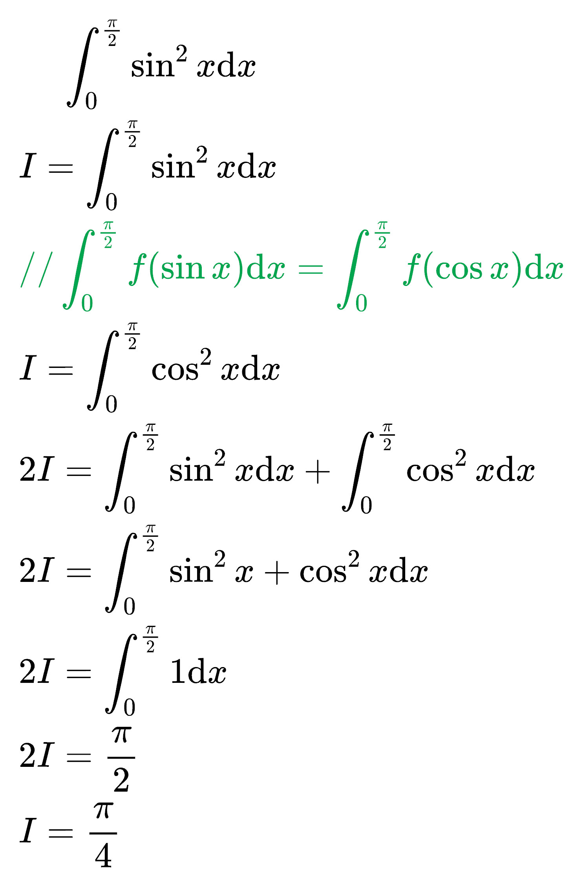
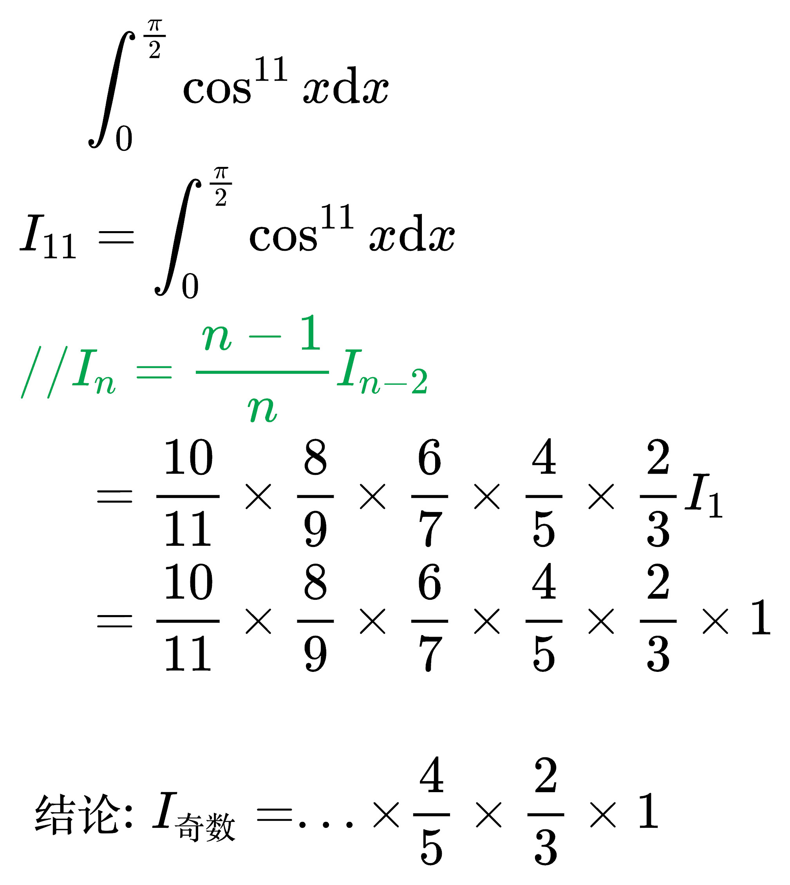
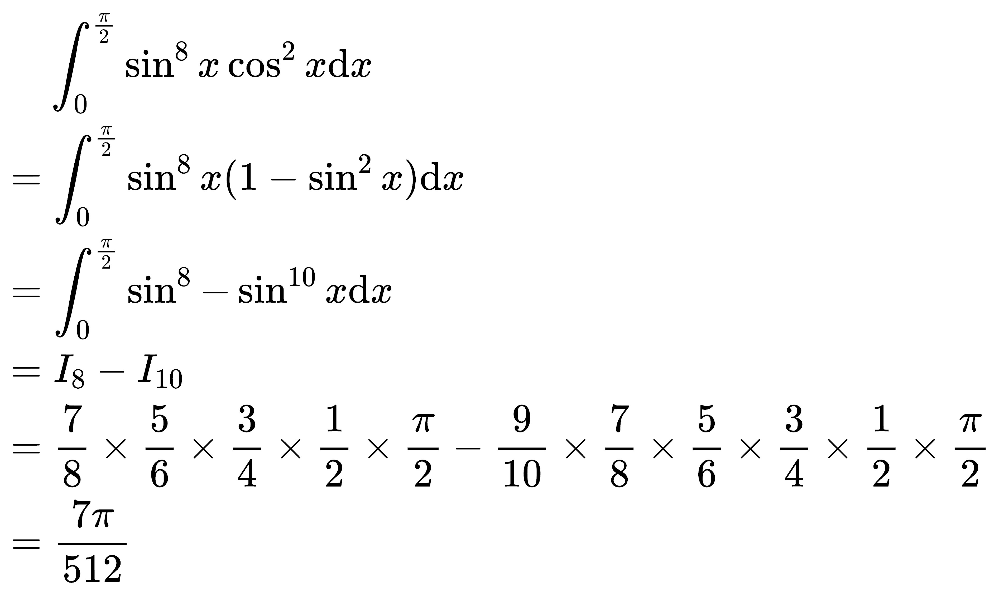
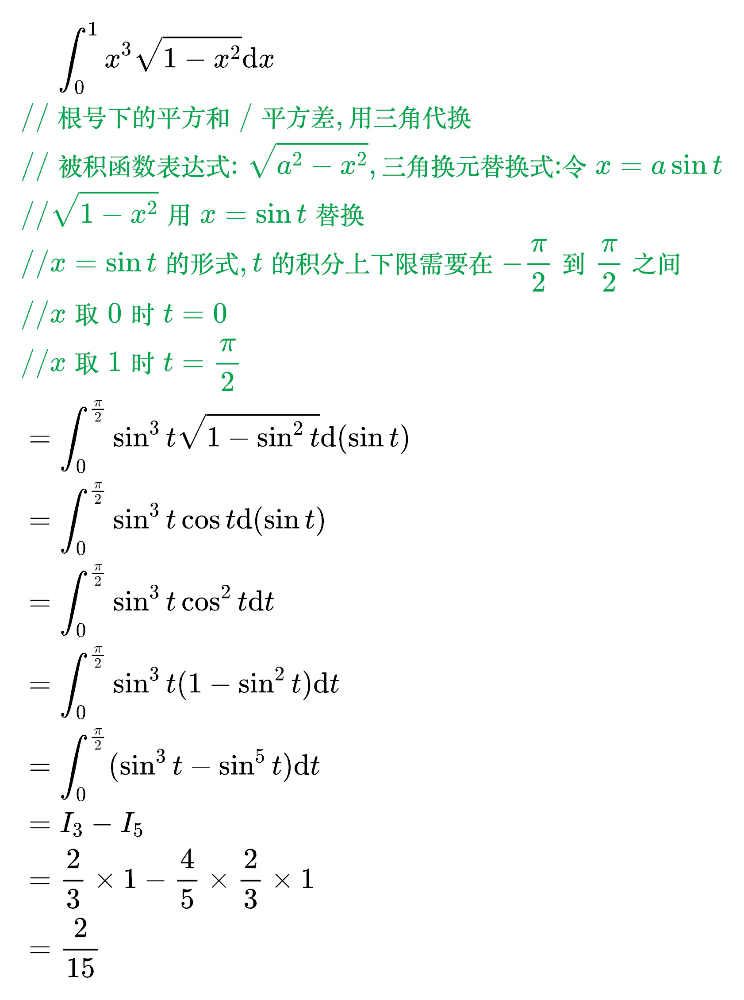
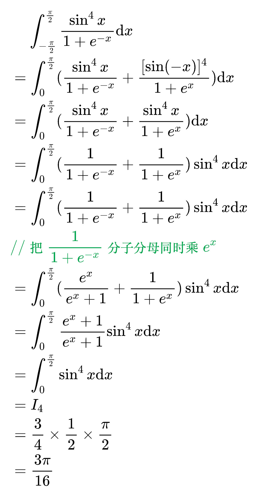

# 定积分特殊性质

## 对称区间的定积分性质

<!--
\begin{align}
& 设 f(x) 在对称区间 [-a, a] 上连续, 则 \int_{-a}^{a} f(x) \mathrm{d}x
= \int_{0}^{a} [f(x) + f(-x)] \mathrm{d}x \\
& 特别地: \\
& \quad 1、若 f(-x) = - f(x), 则 \int_{-a}^{a} f(x) \mathrm{d}x = 0 \\
& \quad 2、若 f(-x) = f(x), 则 \int_{-a}^{a} f(x) \mathrm{d}x = 2 \int_{0}^{a} f(x) \mathrm{d}x \\
\end{align}
-->

例题 1

<!--
\begin{align}
& \;\;\;\; \int_{- \frac{\pi}{4}}^{\frac{\pi}{4}} \frac{1}{e^x + 1} \mathrm{d}x \\
& = \int_{0}^{\frac{\pi}{4}} (\frac{1}{e^x + 1} + \frac{1}{e^{-x} + 1}) \mathrm{d}x \\
& {\color{Green} // 把第二项的分子分母同时乘 e^x} \\
& = \int_{0}^{\frac{\pi}{4}} (\frac{1}{e^x + 1} + \frac{e^x}{1 + e^x}) \mathrm{d}x \\
& = \int_{0}^{\frac{\pi}{4}} \frac{1 + e^x}{1 + e^x} \mathrm{d}x \\
& = \int_{0}^{\frac{\pi}{4}} 1 \mathrm{d}x \\
& = \frac{\pi}{4} \\
\end{align}
-->

例题 2

<!--
\begin{align}
& \;\;\;\; \int_{- \frac{\pi}{4}}^{\frac{\pi}{4}} \frac{1}{1 - \sin x} \mathrm{d}x \\
& = \int_{0}^{\frac{\pi}{4}} (\frac{1}{1 - \sin x} + \frac{1}{1 - \sin (-x)}) \mathrm{d}x \\
& = \int_{0}^{\frac{\pi}{4}} (\frac{1}{1 - \sin x} + \frac{1}{1 + \sin x}) \mathrm{d}x \\
& = \int_{0}^{\frac{\pi}{4}} \frac{1 + \sin x + 1 - \sin x}{(1 - \sin x)(1 + \sin x)} \mathrm{d}x \\
& = \int_{0}^{\frac{\pi}{4}} \frac{2}{1 - \sin ^2 x} \mathrm{d}x \\
& = \int_{0}^{\frac{\pi}{4}} \frac{2}{\cos ^2 x} \mathrm{d}x \\
& = 2 \int_{0}^{\frac{\pi}{4}} \frac{1}{\cos ^2 x} \mathrm{d}x \\
& = 2 \int_{0}^{\frac{\pi}{4}} \sec ^2 x \mathrm{d}x \\
& {\color{Green} // \int \sec ^2 x \mathrm{d}x = \tan x + C} \\
& = 2 \tan x \big|_{0}^{\frac{\pi}{4}} \\
& = 2 \\
\end{align}
-->

## 三角函数的定积分性质

<!--
\begin{align}
& 设 f(x) 在 [0, 1] 上连续, 则 \int_{0}^{\frac{\pi}{2}} f(\sin x) \mathrm{d}x
= \int_{0}^{\frac{\pi}{2}} f(\cos x) \mathrm{d}x \\
\\
& 特别地: I_n = \int_{0}^{\frac{\pi}{2}} \sin ^n x \mathrm{d}x
= \int_{0}^{\frac{\pi}{2}} \cos ^n x \mathrm{d}x \\
& 且有: \\
& \quad 1、I_n = \frac{n - 1}{n} I_{n-2} \\
& \quad 2、I_1 = 1 \\
& \quad 3、I_0 = \frac{\pi}{2} \\
\end{align}
-->

例题 1

<!--
\begin{align}
& \;\;\;\; \int_{0}^{\frac{\pi}{2}} \frac{\sin x}{\sin x + \cos x} \mathrm{d}x \\
& I = \int_{0}^{\frac{\pi}{2}} \frac{\sin x}{\sin x + \cos x} \mathrm{d}x \\
& {\color{Green} // \int_{0}^{\frac{\pi}{2}} f(\sin x) \mathrm{d}x
= \int_{0}^{\frac{\pi}{2}} f(\cos x) \mathrm{d}x} \\
& I = \int_{0}^{\frac{\pi}{2}} \frac{\cos x}{\cos x + \sin x} \mathrm{d}x \\
& 2I = \int_{0}^{\frac{\pi}{2}} \frac{\sin x}{\sin x + \cos x} \mathrm{d}x +
\int_{0}^{\frac{\pi}{2}} \frac{\cos x}{\cos x + \sin x} \mathrm{d}x \\
& 2I = \int_{0}^{\frac{\pi}{2}} 1 \mathrm{d}x \\
& 2I = \frac{\pi}{2} \\
& I = \frac{\pi}{4} \\
\end{align}
-->

例题 2

<!--
\begin{align}
& \;\;\;\; \int_{0}^{\frac{\pi}{2}} \sin ^2 x \mathrm{d}x \\
& I = \int_{0}^{\frac{\pi}{2}} \sin ^2 x \mathrm{d}x \\
& {\color{Green} // \int_{0}^{\frac{\pi}{2}} f(\sin x) \mathrm{d}x
= \int_{0}^{\frac{\pi}{2}} f(\cos x) \mathrm{d}x} \\
& I = \int_{0}^{\frac{\pi}{2}} \cos ^2 x \mathrm{d}x \\
& 2I = \int_{0}^{\frac{\pi}{2}} \sin ^2 x \mathrm{d}x +
\int_{0}^{\frac{\pi}{2}} \cos ^2 x \mathrm{d}x \\
& 2I = \int_{0}^{\frac{\pi}{2}} \sin ^2 x + \cos ^2 x \mathrm{d}x \\
& 2I = \int_{0}^{\frac{\pi}{2}} 1 \mathrm{d}x \\
& 2I = \frac{\pi}{2} \\
& I = \frac{\pi}{4} \\
\end{align}
-->

例题 3

<!--
\begin{align}
& \;\;\;\; \int_{0}^{\frac{\pi}{2}} \sin ^{10} x \mathrm{d}x \\
& I_{10} = \int_{0}^{\frac{\pi}{2}} \sin ^{10} x \mathrm{d}x \\
& {\color{Green} // I_n = \frac{n - 1}{n} I_{n-2}} \\
& I_{10} = \frac{9}{10} I_{8} \\
& \;\;\;\,\,= \frac{9}{10} \times \frac{7}{8} I_{6} \\
& \;\;\;\,\,= ... \\
& \;\;\;\,\,= \frac{9}{10} \times \frac{7}{8} \times \frac{5}{6} \times \frac{3}{4} \times
\frac{1}{2} I_{0} \\
& \;\;\;\,\,= \frac{9}{10} \times \frac{7}{8} \times \frac{5}{6} \times \frac{3}{4} \times
\frac{1}{2} \times \frac{\pi}{2} \\
\\
& 结论: I_{偶数} = ... \times \frac{3}{4} \times \frac{1}{2} \times \frac{\pi}{2} \\
\end{align}
-->

例题 4

<!--
\begin{align}
& \;\;\;\; \int_{0}^{\frac{\pi}{2}} \cos ^{11} x \mathrm{d}x \\
& I_{11} = \int_{0}^{\frac{\pi}{2}} \cos ^{11} x \mathrm{d}x \\
& {\color{Green} // I_n = \frac{n - 1}{n} I_{n-2}} \\
& \;\;\;\,\,= \frac{10}{11} \times \frac{8}{9} \times \frac{6}{7} \times \frac{4}{5} \times
\frac{2}{3} I_{1} \\
& \;\;\;\,\,= \frac{10}{11} \times \frac{8}{9} \times \frac{6}{7} \times \frac{4}{5} \times
\frac{2}{3} \times 1 \\
\\
& 结论: I_{奇数} = ... \times \frac{4}{5} \times \frac{2}{3} \times 1 \\
\end{align}
-->

例题 5

<!--
\begin{align}
& \;\;\;\; \int_{0}^{\frac{\pi}{2}} \sin ^{8} x \cos ^{2} x \mathrm{d}x \\
& = \int_{0}^{\frac{\pi}{2}} \sin ^{8} x (1 - \sin ^{2} x) \mathrm{d}x \\
& = \int_{0}^{\frac{\pi}{2}} \sin ^{8} - \sin ^{10} x \mathrm{d}x \\
& = I_8 - I_{10} \\
& = \frac{7}{8} \times \frac{5}{6} \times \frac{3}{4} \times
\frac{1}{2} \times \frac{\pi}{2} -
\frac{9}{10} \times \frac{7}{8} \times \frac{5}{6} \times \frac{3}{4} \times
\frac{1}{2} \times \frac{\pi}{2} \\
& = \frac{7 \pi}{512} \\
\end{align}
-->

例题 6

<!--
\begin{align}
& \;\;\;\; \int_{0}^{1} x^3 \sqrt{1 - x^2} \mathrm{d}x \\
& {\color{Green} // 根号下的 平方和/平方差, 用三角代换} \\
& {\color{Green} // 被积函数表达式: \sqrt{a^2 - x^2}, 三角换元替换式: 令 x = a \sin t} \\
& {\color{Green} // \sqrt{1 - x^2} 用 x = \sin t 替换} \\
& {\color{Green} // x = \sin t 的形式, t的积分上下限需要在 - \frac{\pi}{2} 到 \frac{\pi}{2} 之间} \\
& {\color{Green} // x取0时 t = 0} \\
& {\color{Green} // x取1时 t = \frac{\pi}{2}} \\
& = \int_{0}^{\frac{\pi}{2}} \sin ^3 t \sqrt{1 - \sin ^2 t} \mathrm{d}(\sin t) \\
& = \int_{0}^{\frac{\pi}{2}} \sin ^3 t \cos t \mathrm{d}(\sin t) \\
& = \int_{0}^{\frac{\pi}{2}} \sin ^3 t \cos ^2 t \mathrm{d}t \\
& = \int_{0}^{\frac{\pi}{2}} \sin ^3 t (1 - \sin ^2 t) \mathrm{d}t \\
& = \int_{0}^{\frac{\pi}{2}} (\sin ^3 t - \sin ^5 t) \mathrm{d}t \\
& = I_3 - I_{5} \\
& = \frac{2}{3} \times 1 - \frac{4}{5} \times \frac{2}{3} \times 1 \\
& = \frac{2}{15} \\
\end{align}
-->

例题 7

<!--
\begin{align}
& \;\;\;\; \int_{- \frac{\pi}{2}}^{\frac{\pi}{2}} \frac{\sin ^4 x}{1 + e^{-x}} \mathrm{d}x \\
& = \int_{0}^{\frac{\pi}{2}} (\frac{\sin ^4 x}{1 + e^{-x}} + \frac{[\sin (- x)]^4}{1 + e^{x}}) \mathrm{d}x \\
& = \int_{0}^{\frac{\pi}{2}} (\frac{\sin ^4 x}{1 + e^{-x}} + \frac{\sin ^4 x}{1 + e^{x}}) \mathrm{d}x \\
& = \int_{0}^{\frac{\pi}{2}} (\frac{1}{1 + e^{-x}} + \frac{1}{1 + e^{x}}) \sin ^4 x \mathrm{d}x \\
& = \int_{0}^{\frac{\pi}{2}} (\frac{1}{1 + e^{-x}} + \frac{1}{1 + e^{x}}) \sin ^4 x \mathrm{d}x \\
& {\color{Green} // 把 \frac{1}{1 + e^{-x}} 分子分母同时乘 e^{x}} \\
& = \int_{0}^{\frac{\pi}{2}} (\frac{e^{x}}{e^{x} + 1} + \frac{1}{1 + e^{x}}) \sin ^4 x \mathrm{d}x \\
& = \int_{0}^{\frac{\pi}{2}} \frac{e^{x} + 1}{e^{x} + 1} \sin ^4 x \mathrm{d}x \\
& = \int_{0}^{\frac{\pi}{2}} \sin ^4 x \mathrm{d}x \\
& = I_4 \\
& = \frac{3}{4} \times \frac{1}{2} \times \frac{\pi}{2} \\
& = \frac{3 \pi}{16} \\
\end{align}
-->

