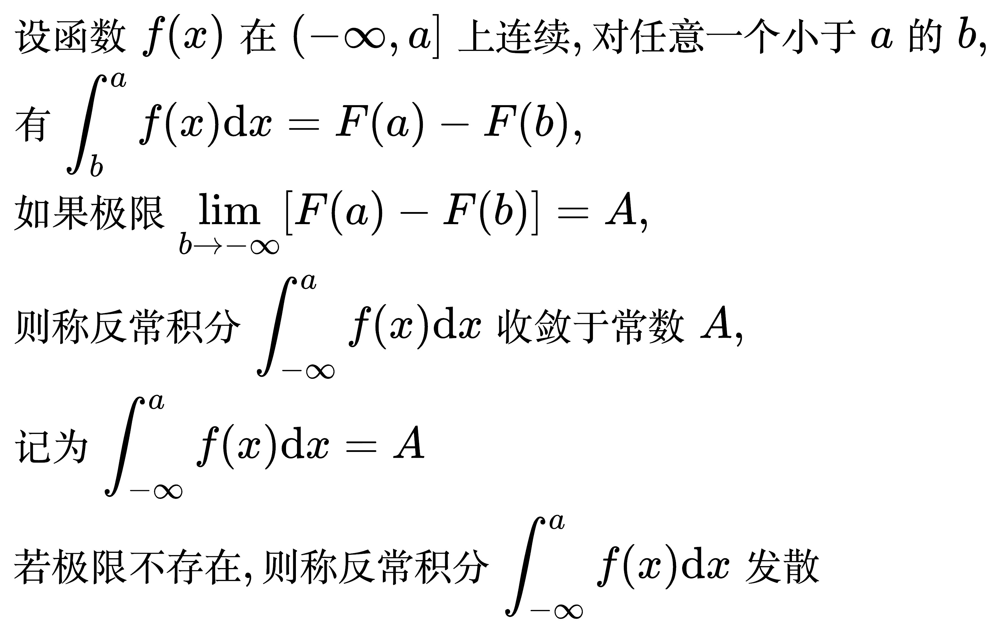
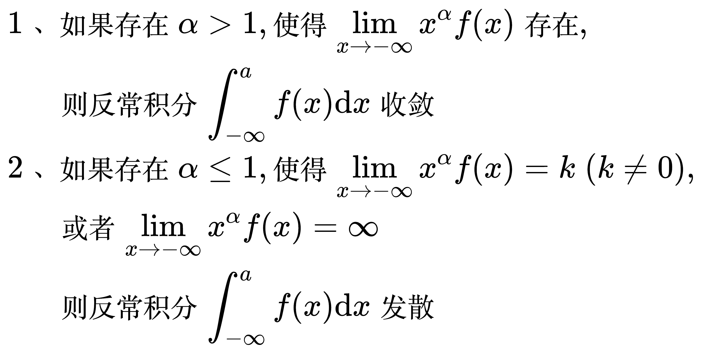
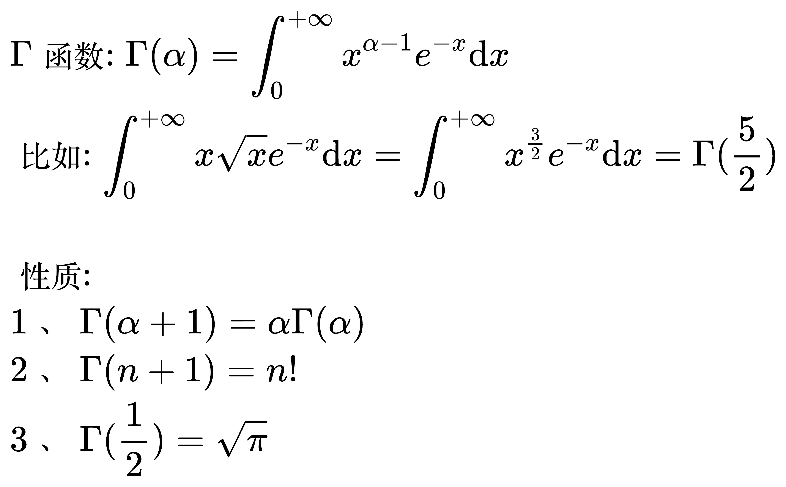
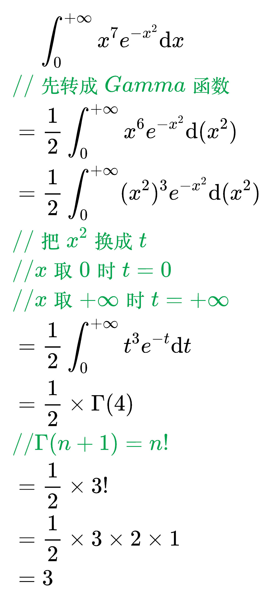
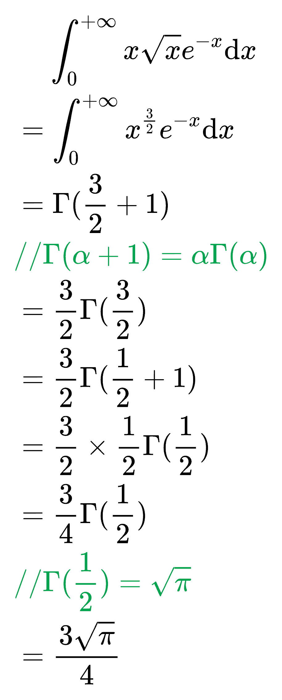
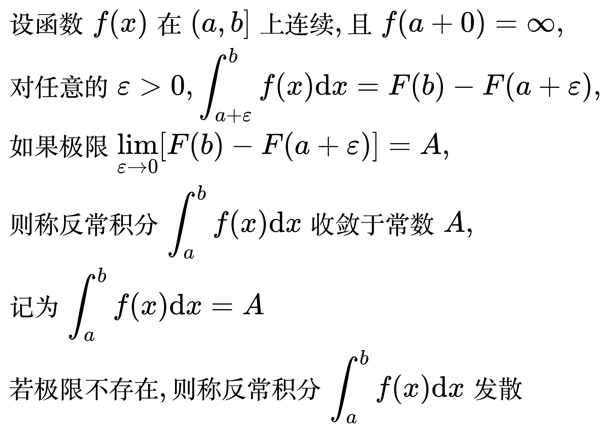

# 反常积分

<!--
\begin{align}
& 正常积分: \\
& \quad 1、积分区间有限 \\
& \quad 2、f(x) 在积分区间上连续或者存在有限个第一类间断点 \\
\end{align}
-->

## 区间无限的反常积分

### 积分区间右侧无限的反常积分

<!--
\begin{align}
& 设函数 f(x) 在 [a, + \infty ) 上连续, 对任意一个大于 a 的 b, \\
& 有 \int_{a}^{b} f(x) \mathrm{d}x = F(b) - F(a), \\
& 如果极限 \lim_{b \to + \infty} [F(b) - F(a)] = A, \\
& 则称反常积分 \int_{a}^{+ \infty} f(x) \mathrm{d}x 收敛于常数 A, \\
& 记为 \int_{a}^{+ \infty} f(x) \mathrm{d}x = A \\
& 若极限不存在, 则称反常积分 \int_{a}^{+ \infty} f(x) \mathrm{d}x 发散 \\
\end{align}
-->

例题 1

<!--
\begin{align}
& 判断反常积分 \int_{1}^{+ \infty} \frac{1}{\sqrt{x} (1 + x)} \mathrm{d}x 的敛散性 \\
& 任取 b > 1, \\
& \;\;\;\; \int_{1}^{b} \frac{1}{\sqrt{x} (1 + x)} \mathrm{d}x \\
& {\color{Green} // 把 \frac{1}{\sqrt{x}} 放到 d 后面} \\
& = 2 \int_{1}^{b} \frac{1}{1 + x} \mathrm{d}(\sqrt{x}) \\
& = 2 \int_{1}^{b} \frac{1}{1 + (\sqrt{x})^2} \mathrm{d}(\sqrt{x}) \\
& = 2 \arctan \sqrt{x} \big|_{1}^{b} \\
& = 2 (\arctan \sqrt{b} - \frac{\pi}{4}) \\
& \lim_{b \to + \infty} 2 (\arctan \sqrt{b} - \frac{\pi}{4}) = \frac{\pi}{2} \\
& 所以反常积分收敛于 \frac{\pi}{2} \\
\end{align}
-->

敛散性判别法

<!--
\begin{align}
& 1、如果存在 \alpha > 1, 使得 \lim_{x \to + \infty} x^{\alpha} f(x) 存在, \\
& \;\;\;\;\; 则反常积分 \int_{a}^{+ \infty} f(x) \mathrm{d}x 收敛 \\
& 2、如果存在 \alpha \le 1, 使得 \lim_{x \to + \infty} x^{\alpha} f(x) = k \; (k \ne 0), \\
& \;\;\;\;\; 或者 \lim_{x \to + \infty} x^{\alpha} f(x) = \infty \\
& \;\;\;\;\; 则反常积分 \int_{a}^{+ \infty} f(x) \mathrm{d}x 发散 \\
\end{align}
-->

例题 1

<!--
\begin{align}
& 判断反常积分 \int_{0}^{+ \infty} \frac{\sqrt{x}}{4 + x^2} \mathrm{d}x 的敛散性 \\
& {\color{Green} // 要判断 \lim_{x \to + \infty} x^{\alpha} f(x) 是否存在} \\
& \;\;\;\; \lim_{x \to + \infty} x^{\alpha} \frac{\sqrt{x}}{4 + x^2} \\
& {\color{Green} // 分子最大是 \frac{1}{2} 次方, 分母是 2次方, 相差 \frac{3}{2} 次方} \\
& {\color{Green} // 所以 \alpha 取 \frac{3}{2}} \\
& = \lim_{x \to + \infty} x^{\frac{3}{2}} \frac{\sqrt{x}}{4 + x^2} \\
& = \lim_{x \to + \infty} x^{\frac{3}{2}} \frac{x^{\frac{1}{2}}}{4 + x^2} \\
& = \lim_{x \to + \infty} \frac{x^2}{4 + x^2} \\
& = 1 \\
& 因为 \alpha = \frac{3}{2} > 1, 且极限存在, 所以反常积分收敛 \\
\end{align}
-->

### 积分区间左侧无限的反常积分

<!--
\begin{align}
& 设函数 f(x) 在 (- \infty, a] 上连续, 对任意一个小于 a 的 b, \\
& 有 \int_{b}^{a} f(x) \mathrm{d}x = F(a) - F(b), \\
& 如果极限 \lim_{b \to - \infty} [F(a) - F(b)] = A, \\
& 则称反常积分 \int_{- \infty}^{a} f(x) \mathrm{d}x 收敛于常数 A, \\
& 记为 \int_{- \infty}^{a} f(x) \mathrm{d}x = A \\
& 若极限不存在, 则称反常积分 \int_{- \infty}^{a} f(x) \mathrm{d}x 发散 \\
\end{align}
-->

敛散性判别法

<!--
\begin{align}
& 1、如果存在 \alpha > 1, 使得 \lim_{x \to - \infty} x^{\alpha} f(x) 存在, \\
& \;\;\;\;\; 则反常积分 \int_{- \infty}^{a} f(x) \mathrm{d}x 收敛 \\
& 2、如果存在 \alpha \le 1, 使得 \lim_{x \to - \infty} x^{\alpha} f(x) = k \; (k \ne 0), \\
& \;\;\;\;\; 或者 \lim_{x \to - \infty} x^{\alpha} f(x) = \infty \\
& \;\;\;\;\; 则反常积分 \int_{- \infty}^{a} f(x) \mathrm{d}x 发散 \\
\end{align}
-->

### Gamma 函数

<!--
\begin{align}
& \Gamma 函数: \Gamma (\alpha) = \int_{0}^{+ \infty} x^{\alpha - 1} e^{-x} \mathrm{d}x \\
& 比如: \int_{0}^{+ \infty} x \sqrt{x} e^{-x} \mathrm{d}x
= \int_{0}^{+ \infty} x^{\frac{3}{2}} e^{-x} \mathrm{d}x = \Gamma (\frac{5}{2}) \\
\\
& 性质: \\
& 1、\Gamma (\alpha + 1) = \alpha \Gamma (\alpha) \\
& 2、\Gamma (n + 1) = n! \\
& 3、\Gamma (\frac{1}{2}) = \sqrt{\pi} \\
\end{align}
-->

例题 1

<!--
\begin{align}
& \;\;\;\; \int_{0}^{+ \infty} x^{7} e^{-x^2} \mathrm{d}x \\
& {\color{Green} // 先转成 Gamma 函数} \\
& = \frac{1}{2} \int_{0}^{+ \infty} x^{6} e^{-x^2} \mathrm{d}(x^2) \\
& = \frac{1}{2} \int_{0}^{+ \infty} (x^2)^3 e^{-x^2} \mathrm{d}(x^2) \\
& {\color{Green} // 把 x^2 换成 t} \\
& {\color{Green} // x 取 0 时 t = 0} \\
& {\color{Green} // x 取 + \infty 时 t = + \infty} \\
& = \frac{1}{2} \int_{0}^{+ \infty} t^3 e^{-t} \mathrm{d}t \\
& = \frac{1}{2} \times \Gamma (4) \\
& {\color{Green} // \Gamma (n + 1) = n!} \\
& = \frac{1}{2} \times 3! \\
& = \frac{1}{2} \times 3 \times 2 \times 1 \\
& = 3 \\
\end{align}
-->

例题 2

<!--
\begin{align}
& \;\;\;\; \int_{0}^{+ \infty} x \sqrt{x} e^{-x} \mathrm{d}x \\
& = \int_{0}^{+ \infty} x^{\frac{3}{2}} e^{-x} \mathrm{d}x \\
& = \Gamma (\frac{3}{2} + 1) \\
& {\color{Green} // \Gamma (\alpha + 1) = \alpha \Gamma (\alpha)} \\
& = \frac{3}{2} \Gamma (\frac{3}{2}) \\
& = \frac{3}{2} \Gamma (\frac{1}{2} + 1) \\
& = \frac{3}{2} \times \frac{1}{2} \Gamma (\frac{1}{2}) \\
& = \frac{3}{4} \Gamma (\frac{1}{2}) \\
& {\color{Green} // \Gamma (\frac{1}{2}) = \sqrt{\pi}} \\
& = \frac{3\sqrt{\pi}}{4} \\
\end{align}
-->

## 区间有限的反常积分

### 区间左端点无界的反常积分

<!--
\begin{align}
& 设函数 f(x) 在 (a, b] 上连续, 且 f(a + 0) = \infty, \\
& 对任意的 \varepsilon > 0, \int_{a + \varepsilon}^{b} f(x) \mathrm{d}x = F(b) - F(a + \varepsilon), \\
& 如果极限 \lim_{\varepsilon \to 0} [F(b) - F(a + \varepsilon)] = A, \\
& 则称反常积分 \int_{a}^{b} f(x) \mathrm{d}x 收敛于常数 A, \\
& 记为 \int_{a}^{b} f(x) \mathrm{d}x = A \\
& 若极限不存在, 则称反常积分 \int_{a}^{b} f(x) \mathrm{d}x 发散 \\
\end{align}
-->

