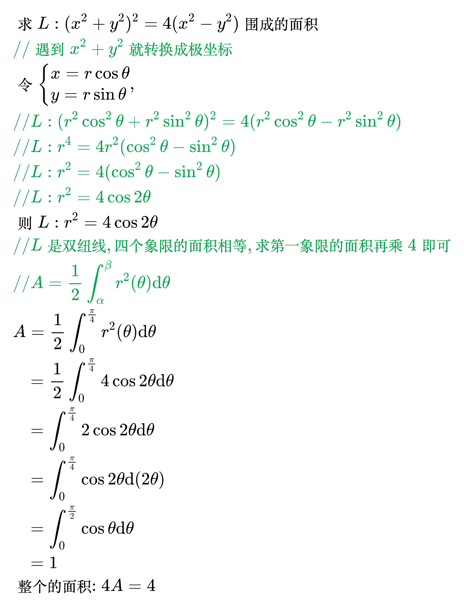
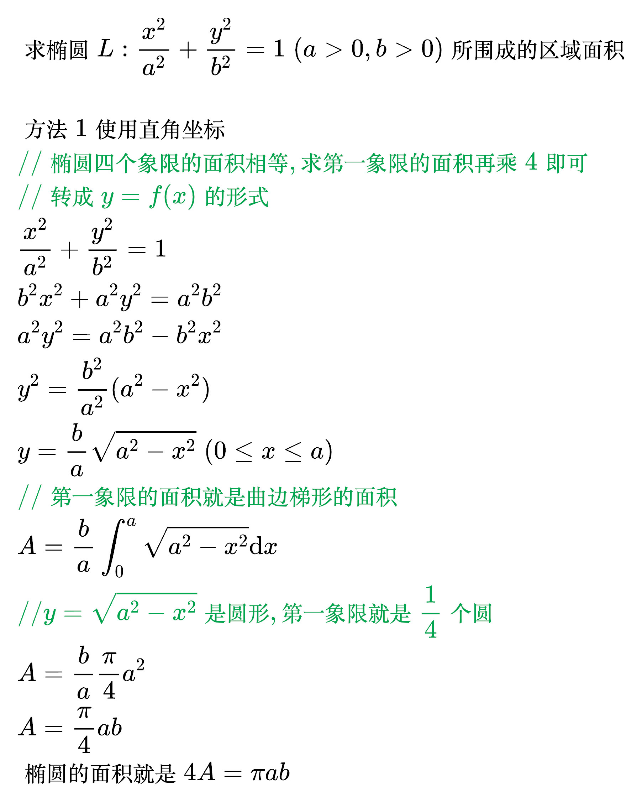
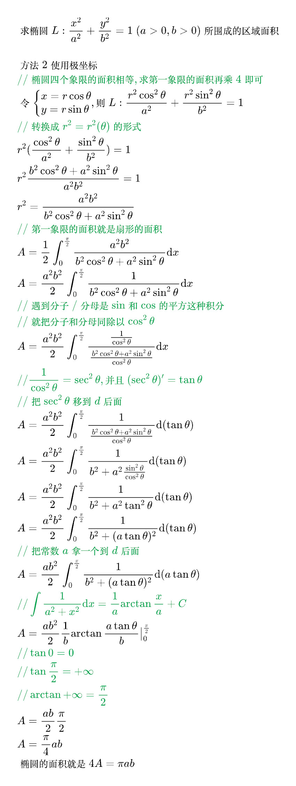

# 定积分的几何应用

<!--
\begin{align}
& 设平面区域 D 由 L: r = r(\theta) 及射线 \theta = \alpha, \theta = \beta 围成, \\
& 则区域 D 的面积为: A = \frac{1}{2} \int_{\alpha}^{\beta} r^2(\theta) \mathrm{d} \theta \\
\end{align}
-->

例题 1

<!--
\begin{align}
& 求 L: (x^2 + y^2)^2 = 4(x^2 - y^2) 围成的面积 \\
& {\color{Green} // 遇到 x^2 + y^2 就转换成极坐标} \\
& 令 \begin{cases}
x = r \cos \theta \\
y = r \sin \theta \\
\end{cases}, \\
& {\color{Green} // L: (r^2 \cos ^2 \theta + r^2 \sin ^2 \theta)^2 = 4(r^2 \cos ^2 \theta - r^2 \sin ^2 \theta)} \\
& {\color{Green} // L: r^4 = 4 r^2(\cos ^2 \theta - \sin ^2 \theta)} \\
& {\color{Green} // L: r^2 = 4(\cos ^2 \theta - \sin ^2 \theta)} \\
& {\color{Green} // L: r^2 = 4 \cos 2 \theta} \\
& 则 L: r^2 = 4 \cos 2 \theta \\
& {\color{Green} // L 是双纽线, 四个象限的面积相等, 求第一象限的面积再乘4即可} \\
& {\color{Green} // A = \frac{1}{2} \int_{\alpha}^{\beta} r^2(\theta) \mathrm{d} \theta} \\
& A = \frac{1}{2} \int_{0}^{\frac{\pi}{4}} r^2(\theta) \mathrm{d} \theta \\
& \;\;\, = \frac{1}{2} \int_{0}^{\frac{\pi}{4}} 4 \cos 2 \theta \mathrm{d} \theta \\
& \;\;\, = \int_{0}^{\frac{\pi}{4}} 2 \cos 2 \theta \mathrm{d} \theta \\
& \;\;\, = \int_{0}^{\frac{\pi}{4}} \cos 2 \theta \mathrm{d}(2 \theta) \\
& \;\;\, = \int_{0}^{\frac{\pi}{2}} \cos \theta \mathrm{d} \theta \\
& \;\;\, = 1 \\
& 整个的面积: 4A = 4 \\
\end{align}
-->

例题 2

<!--
\begin{align}
& 求椭圆 L: \frac{x^2}{a^2} + \frac{y^2}{b^2} = 1 \; (a > 0, b > 0) 所围成的区域面积 \\
\\
& 方法1使用直角坐标 \\
& {\color{Green} // 椭圆四个象限的面积相等, 求第一象限的面积再乘4即可} \\
& {\color{Green} // 转成 y = f(x) 的形式} \\
& \frac{x^2}{a^2} + \frac{y^2}{b^2} = 1 \\
& b^2 x^2 + a^2 y^2 = a^2 b^2 \\
& a^2 y^2 = a^2 b^2 - b^2 x^2 \\
& y^2 = \frac{b^2}{a^2} (a^2 - x^2) \\
& y = \frac{b}{a} \sqrt{a^2 - x^2} \; (0 \le x \le a) \\
& {\color{Green} // 第一象限的面积就是曲边梯形的面积} \\
& A = \frac{b}{a} \int_{0}^{a} \sqrt{a^2 - x^2} \mathrm{d}x \\
& {\color{Green} // y = \sqrt{a^2 - x^2} 是圆形, 第一象限就是 \frac{1}{4} 个圆} \\
& A = \frac{b}{a} \frac{\pi}{4} a^2 \\
& A = \frac{\pi}{4} ab \\
& 椭圆的面积就是 4A = \pi ab \\
\end{align}
-->

例题 3

<!--
\begin{align}
& 求椭圆 L: \frac{x^2}{a^2} + \frac{y^2}{b^2} = 1 \; (a > 0, b > 0) 所围成的区域面积 \\
\\
& 方法2使用极坐标 \\
& {\color{Green} // 椭圆四个象限的面积相等, 求第一象限的面积再乘4即可} \\
& 令 \begin{cases}
x = r \cos \theta \\
y = r \sin \theta \\
\end{cases}, 则 L: \frac{r^2 \cos ^2 \theta}{a^2} + \frac{r^2 \sin ^2 \theta}{b^2} = 1 \\
& {\color{Green} // 转换成 r^2 = r^2(\theta) 的形式} \\
& r^2 (\frac{\cos ^2 \theta}{a^2} + \frac{\sin ^2 \theta}{b^2}) = 1 \\
& r^2 \frac{b^2 \cos ^2 \theta + a^2 \sin ^2 \theta}{a^2 b^2} = 1 \\
& r^2 = \frac{a^2 b^2}{b^2 \cos ^2 \theta + a^2 \sin ^2 \theta} \\
& {\color{Green} // 第一象限的面积就是扇形的面积} \\
& A = \frac{1}{2} \int_{0}^{\frac{\pi}{2}} \frac{a^2 b^2}{b^2 \cos ^2 \theta + a^2 \sin ^2 \theta} \mathrm{d}x \\
& A = \frac{a^2 b^2}{2} \int_{0}^{\frac{\pi}{2}} \frac{1}{b^2 \cos ^2 \theta + a^2 \sin ^2 \theta} \mathrm{d}x \\
& {\color{Green} // 遇到分子/分母是 \sin 和 \cos 的平方这种积分} \\
& {\color{Green} // 就把分子和分母同除以 \cos ^2 \theta} \\
& A = \frac{a^2 b^2}{2} \int_{0}^{\frac{\pi}{2}} \frac{\frac{1}{\cos ^2 \theta}}{\frac{b^2 \cos ^2 \theta + a^2 \sin ^2 \theta}{\cos ^2 \theta}} \mathrm{d}x \\
& {\color{Green} // \frac{1}{\cos ^2 \theta} = \sec ^2 \theta, 并且 (\sec ^2 \theta)' = \tan \theta} \\
& {\color{Green} // 把 \sec ^2 \theta 移到 d 后面} \\
& A = \frac{a^2 b^2}{2} \int_{0}^{\frac{\pi}{2}} \frac{1}{\frac{b^2 \cos ^2 \theta + a^2 \sin ^2 \theta}{\cos ^2 \theta}} \mathrm{d}(\tan \theta) \\
& A = \frac{a^2 b^2}{2} \int_{0}^{\frac{\pi}{2}} \frac{1}{b^2 + a^2 \frac{\sin ^2 \theta}{\cos ^2 \theta}} \mathrm{d}(\tan \theta) \\
& A = \frac{a^2 b^2}{2} \int_{0}^{\frac{\pi}{2}} \frac{1}{b^2 + a^2 \tan ^2 \theta} \mathrm{d}(\tan \theta) \\
& A = \frac{a^2 b^2}{2} \int_{0}^{\frac{\pi}{2}} \frac{1}{b^2 + (a \tan \theta)^2} \mathrm{d}(\tan \theta) \\
& {\color{Green} // 把常数 a 拿一个到 d 后面} \\
& A = \frac{a b^2}{2} \int_{0}^{\frac{\pi}{2}} \frac{1}{b^2 + (a \tan \theta)^2} \mathrm{d}(a \tan \theta) \\
& {\color{Green} // \int \frac{1}{a^2 + x^2} \mathrm{d}x = \frac{1}{a} \arctan \frac{x}{a} + C} \\
& A = \frac{a b^2}{2} \frac{1}{b} \arctan \frac{a \tan \theta}{b} \big|_{0}^{\frac{\pi}{2}} \\
& {\color{Green} // \tan 0 = 0} \\
& {\color{Green} // \tan \frac{\pi}{2} = + \infty} \\
& {\color{Green} // \arctan + \infty = \frac{\pi}{2}} \\
& A = \frac{a b}{2} \frac{\pi}{2} \\
& A = \frac{\pi}{4} ab \\
& 椭圆的面积就是 4A = \pi ab \\
\end{align}
-->

