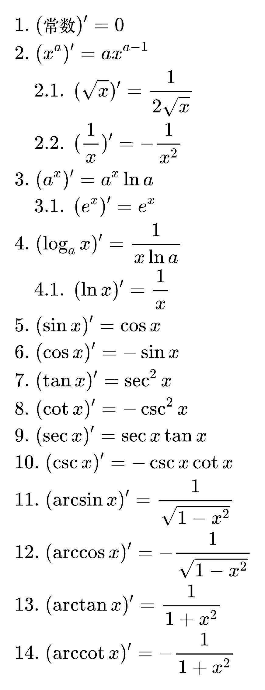
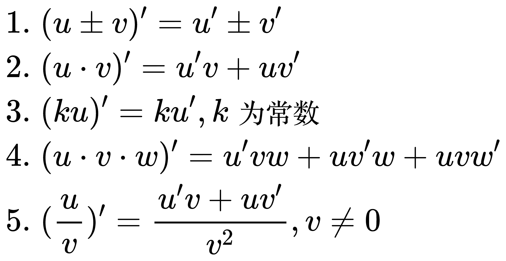
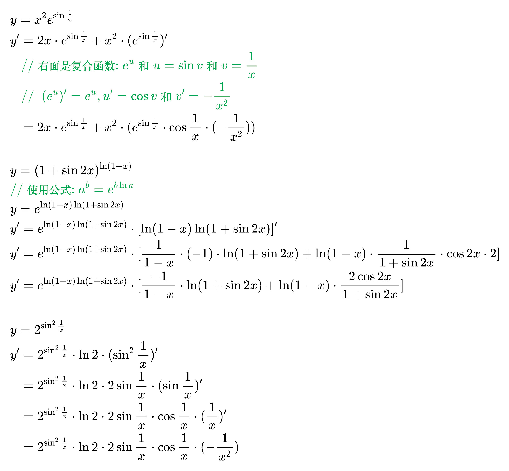
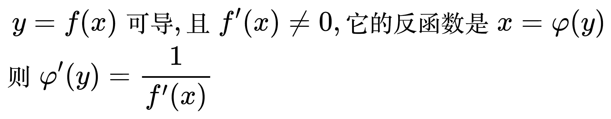
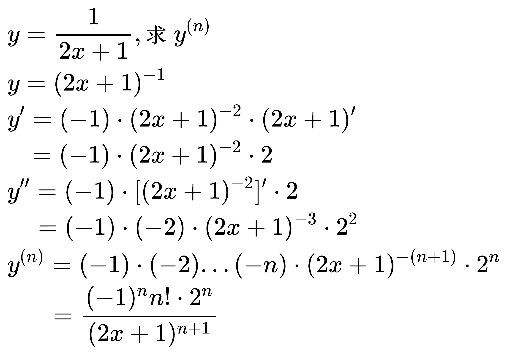

# 求导工具

## 求导基本公式

<!--
\begin{align}
& 1. \; (常数)' = 0 \\
& 2. \; (x^{a})' = ax^{a - 1} \\
& \quad 2.1. \; (\sqrt{x})' = \frac{1}{2\sqrt{x}} \\
& \quad 2.2. \; (\frac{1}{x})' = - \frac{1}{x^{2}} \\
& 3. \; (a^{x})' = a^{x} \ln a \\
& \quad 3.1. \; (e^{x})' = e^{x} \\
& 4. \; (\log_{a}{x})' = \frac{1}{x \ln a} \\
& \quad 4.1. \; (\ln x)' = \frac{1}{x} \\
& 5. \; (\sin x)' = \cos x \\
& 6. \; (\cos x)' = - \sin x \\
& 7. \; (\tan x)' = \sec^{2} x \\
& 8. \; (\cot x)' = - \csc^{2} x \\
& 9. \; (\sec x)' = \sec x \tan x \\
& 10. \; (\csc x)' = - \csc x \cot x \\
& 11. \; (\arcsin x)' = \frac{1}{\sqrt{1 - x^{2}}} \\
& 12. \; (\arccos x)' = - \frac{1}{\sqrt{1 - x^{2}}} \\
& 13. \; (\arctan x)' = \frac{1}{1 + x^{2}} \\
& 14. \; (\operatorname{arccot} x)' = - \frac{1}{1 + x^{2}} \\
\end{align}
-->

## 导数的四则运算法则

<!--
\begin{align}
& 1. \; (u \pm v)' = u' \pm v' \\
& 2. \; (u \cdot v)' = u'v + uv' \\
& 3. \; (ku)' = ku', k 为常数 \\
& 4. \; (u \cdot v \cdot w)' = u'vw + uv'w + uvw' \\
& 5. \; (\frac{u}{v})' = \frac{u'v + uv'}{v^{2}}, v \ne 0 \\
\end{align}
-->

## 复合函数求导

<!--
\begin{align}
& \; y = f(u) 可导, u = \varphi (x) 可导, 且 \varphi '(x) \ne 0, \\
& 则 \frac{\mathrm{d} y}{\mathrm{d} x}
= \frac{\mathrm{d} y}{\mathrm{d} u} \cdot \frac{\mathrm{d} u}{\mathrm{d} x}
= f'(u) \cdot \varphi '(x) = f'[\varphi (x)] \varphi '(x) \\
\end{align}
-->

例题

<!--
\begin{align}
& 求下列函数的导数
\\
& y = x^{2} e^{\sin \frac{1}{x}} \\
& y' = 2x \cdot e^{\sin \frac{1}{x}} + x^{2} \cdot (e^{\sin \frac{1}{x}})' \\
& \;\;\; // 右面是复合函数: e^{u} 和 u = \sin v 和 v = \frac{1}{x} \\
& \;\;\; // \;\; (e^{u})' = e^{u}, u' = \cos v 和 v' = -\frac{1}{x^{2}} \\
& \;\;\, = 2x \cdot e^{\sin \frac{1}{x}} + x^{2} \cdot (e^{\sin \frac{1}{x}} \cdot \cos \frac{1}{x} \cdot (-\frac{1}{x^{2}})) \\
\\
& y = (1 + \sin 2x)^{\ln (1 - x)} \\
& // 使用公式: a^{b} = e^{b \ln a} \\
& y = e^{\ln (1 - x) \ln (1 + \sin 2x)} \\
& y' = e^{\ln (1 - x) \ln (1 + \sin 2x)} \cdot [\ln (1 - x) \ln (1 + \sin 2x)]' \\
& y' = e^{\ln (1 - x) \ln (1 + \sin 2x)} \cdot
[\frac{1}{1 - x} \cdot (-1) \cdot \ln (1 + \sin 2x) +
\ln (1 - x) \cdot \frac{1}{1 + \sin 2x} \cdot \cos 2x \cdot 2] \\
& y' = e^{\ln (1 - x) \ln (1 + \sin 2x)} \cdot
[\frac{-1}{1 - x} \cdot \ln (1 + \sin 2x) + \ln (1 - x) \cdot \frac{2\cos 2x}{1 + \sin 2x}] \\
\\
& y = 2^{\sin ^{2} \frac{1}{x}} \\
& y' = 2^{\sin ^{2} \frac{1}{x}} \cdot \ln 2 \cdot (\sin ^{2} \frac{1}{x})' \\
& \;\;\, = 2^{\sin ^{2} \frac{1}{x}} \cdot \ln 2 \cdot 2 \sin \frac{1}{x} \cdot (\sin \frac{1}{x})' \\
& \;\;\, = 2^{\sin ^{2} \frac{1}{x}} \cdot \ln 2 \cdot 2 \sin \frac{1}{x} \cdot \cos \frac{1}{x} \cdot (\frac{1}{x})' \\
& \;\;\, = 2^{\sin ^{2} \frac{1}{x}} \cdot \ln 2 \cdot 2 \sin \frac{1}{x} \cdot \cos \frac{1}{x} \cdot (-\frac{1}{x^{2}}) \\
\end{align}
-->

## 反函数的导数

<!--
\begin{align}
& \;\, y = f(x) 可导, 且 f'(x) \ne 0, 它的反函数是 x = \varphi (y) \\
& 则 \varphi ' (y) = \frac{1}{f'(x)} \\
\end{align}
-->

## 求高阶导数

<!--
\begin{align}
& y = \frac{1}{2x + 1}, 求 y^{(n)} \\
& y = (2x + 1)^{-1} \\
& y' = (-1) \cdot (2x + 1)^{-2} \cdot (2x + 1)' \\
& \;\;\, = (-1) \cdot (2x + 1)^{-2} \cdot 2 \\
& y'' = (-1) \cdot [(2x + 1)^{-2}]' \cdot 2 \\
& \;\,\,\,\, = (-1) \cdot (-2) \cdot (2x + 1)^{-3} \cdot 2^{2} \\
& y^{(n)} = (-1) \cdot (-2) ... (-n) \cdot (2x + 1)^{-(n + 1)} \cdot 2^{n} \\
& \;\;\;\;\;\, = \frac{(-1)^{n}n! \cdot 2^{n}}{(2x + 1)^{n + 1}}
\end{align}
-->

