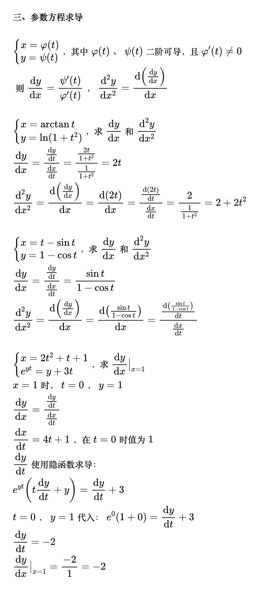
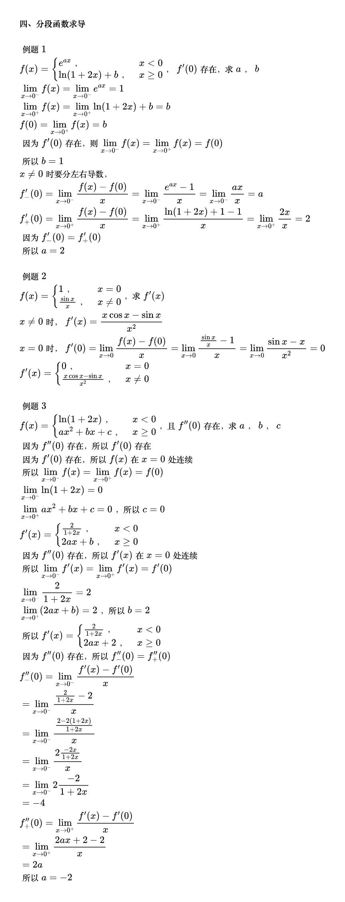

# 求导类型

<!--
\begin{align}
& \mathbf{一、y=f(x)}  \\
\\
& y = x\ln(x+\sqrt{x^2+1})，求y' \\
& y'=\ln(x+\sqrt{x^2+1}) + x\frac{1}{x+\sqrt{x^2+1}}\left ( 1+\frac{1}{2\sqrt{x^2+1}} \right )2x \\
& =\ln(x+\sqrt{x^2+1})+\frac{x}{\sqrt{x^2+1}} \\
\\
& y=(1+x)^{\sin x}，求y' \\
& {\color{Green} // 见到 u^v，就把它写成 e^{v \ln u}} \\
& y=e^{\sin x \ln(1+x)} \\
& y'=e^{\sin x \ln(1+x)}\left [ \cos x \ln(1+x) + \frac{\sin x}{1+x} \right ]  \\
& =(1+x)^{\sin x}\left [ \cos x \ln(1+x) + \frac{\sin x}{1+x} \right ]  \\
\end{align}
-->

<!--
\begin{align}
& \mathbf{二、隐函数求导F(x,y)=0}  \\
\\
& 把y看成x的函数正常求导 \\
& \ln\sqrt{x^2+y^2}=\arctan\frac{y}{x}确定y是x的函数，求\frac{\mathrm{d}y}{\mathrm{d}x} \\
& {\color{Green} // 等号两边同时求导} \\
& \frac{1}{\sqrt{x^2+y^2}}\times\frac{1}{2\sqrt{x^2+y^2}}\left ( 2x+2y\frac{\mathrm{d}y}{\mathrm{d}x} \right )
= \frac{1}{1+\left ( \frac{y}{x} \right ) ^2}\times\frac{x\frac{\mathrm{d}y}{\mathrm{d}x}+y}{x^2} \\
& \frac{x+y\frac{\mathrm{d}y}{\mathrm{d}x}}{x^2+y^2}=\frac{x\frac{\mathrm{d}y}{\mathrm{d}x}-y}{x^2+y^2} \\
& x+y\frac{\mathrm{d}y}{\mathrm{d}x}=x\frac{\mathrm{d}y}{\mathrm{d}x}-y \\
& \frac{\mathrm{d}y}{\mathrm{d}x}=\frac{x+y}{x-y} \\
\\
& e^{xy}=x^2+y，求y'(0)和y''(0) \\
& x=0代入，得到y=1 \\
& {\color{Green} // 等号两边同时求导} \\
& x^{xy}(y+xy')=2x+y' \\
& 把x=0，y=1代入：得到y'(0)=1 \\
& {\color{Green} // 继续求导} \\
& x^{xy}(y+xy')^2+x^{xy}(2y'+xy'')=2+y'' \\
& 把x=0，y=1，y'=1代入：得到y''(0)=1 \\
\end{align}
-->

<!--
\begin{align}
& \mathbf{三、参数方程求导}  \\
\\
& \begin{cases}
x=\varphi (t) \\
y=\psi (t)
\end{cases}，其中\varphi (t)、\psi (t)二阶可导，且\varphi '(t)\ne0 \\
& 则\frac{\mathrm{d}y}{\mathrm{d}x}=\frac{\psi '(t)}{\varphi '(t)}，
\frac{\mathrm{d}^2y}{\mathrm{d}x^2}
=\frac{\mathrm{d}\left ( \frac{\mathrm{d}y}{\mathrm{d}x} \right )}{\mathrm{d}x} \\
\\
& \begin{cases}
x=\arctan t \\
y=\ln(1+t^2)
\end{cases}，求\frac{\mathrm{d}y}{\mathrm{d}x}和\frac{\mathrm{d}^2y}{\mathrm{d}x^2} \\
& \frac{\mathrm{d}y}{\mathrm{d}x}
=\frac{\frac{\mathrm{d}y}{\mathrm{d}t}}{\frac{\mathrm{d}x}{\mathrm{d}t}}
=\frac{\frac{2t}{1+t^2}}{\frac{1}{1+t^2}}=2t \\
& \frac{\mathrm{d}^2y}{\mathrm{d}x^2}
=\frac{\mathrm{d}\left ( \frac{\mathrm{d}y}{\mathrm{d}x} \right )}{\mathrm{d}x}
=\frac{\mathrm{d}(2t)}{\mathrm{d}x}
=\frac{\frac{\mathrm{d}(2t)}{\mathrm{d}t}}{\frac{\mathrm{d}x}{\mathrm{d}t}}
=\frac{2}{\frac{1}{1+t^2}}=2+2t^2 \\
\\
& \begin{cases}
x=t-\sin t \\
y=1-\cos t
\end{cases}，求\frac{\mathrm{d}y}{\mathrm{d}x}和\frac{\mathrm{d}^2y}{\mathrm{d}x^2} \\
& \frac{\mathrm{d}y}{\mathrm{d}x}
=\frac{\frac{\mathrm{d}y}{\mathrm{d}t}}{\frac{\mathrm{d}x}{\mathrm{d}t}}
=\frac{\sin t}{1-\cos t} \\
& \frac{\mathrm{d}^2y}{\mathrm{d}x^2}
=\frac{\mathrm{d}\left ( \frac{\mathrm{d}y}{\mathrm{d}x} \right )}{\mathrm{d}x}
=\frac{\mathrm{d}\left ( \frac{\sin t}{1-\cos t} \right )}{\mathrm{d}x}
=\frac{\frac{\mathrm{d}\left ( \frac{\sin t}{1-\cos t} \right )}{\mathrm{d}t}}{\frac{\mathrm{d}x}{\mathrm{d}t}} \\
\\
& \begin{cases}
x=2t^2+t+1 \\
e^{yt}=y+3t
\end{cases}，求\frac{\mathrm{d}y}{\mathrm{d}x}\big|_{x=1} \\
& x=1时，t=0，y=1 \\
& \frac{\mathrm{d}y}{\mathrm{d}x}
=\frac{\frac{\mathrm{d}y}{\mathrm{d}t}}{\frac{\mathrm{d}x}{\mathrm{d}t}} \\
& \frac{\mathrm{d}x}{\mathrm{d}t}=4t+1，在t=0时值为1 \\
& \frac{\mathrm{d}y}{\mathrm{d}t} 使用隐函数求导： \\
& e^{yt}\left ( t\frac{\mathrm{d}y}{\mathrm{d}t}+y \right )=\frac{\mathrm{d}y}{\mathrm{d}t}+3 \\
& t=0，y=1代入：e^0(1+0)=\frac{\mathrm{d}y}{\mathrm{d}t}+3 \\
& \frac{\mathrm{d}y}{\mathrm{d}t}=-2 \\
& \frac{\mathrm{d}y}{\mathrm{d}x}\big|_{x=1}=\frac{-2}{1}=-2 \\
\end{align}
-->

<!--
\begin{align}
& \mathbf{四、分段函数求导}  \\
\\
& 例题1 \\
& f(x)=\begin{cases}
e^{ax}，& x<0 \\
\ln(1+2x)+b，& x\ge0
\end{cases}，f'(0)存在，求a，b \\
& \lim_{x \to 0^-}f(x)=\lim_{x \to 0^-}e^{ax}=1 \\
& \lim_{x \to 0^+}f(x)=\lim_{x \to 0^+}\ln(1+2x)+b=b \\
& f(0)=\lim_{x \to 0^+}f(x)=b \\
& 因为 f'(0)存在，则\lim_{x \to 0^-}f(x)=\lim_{x \to 0^+}f(x)=f(0) \\
& 所以b=1 \\
& x\ne0时要分左右导数，\\
& f'_-(0)=\lim_{x \to 0^-}\frac{f(x)-f(0)}{x}=\lim_{x \to 0^-}\frac{e^{ax}-1}{x}
=\lim_{x \to 0^-}\frac{ax}{x}=a \\
& f'_+(0)=\lim_{x \to 0^+}\frac{f(x)-f(0)}{x}=\lim_{x \to 0^+}\frac{\ln(1+2x)+1-1}{x}
=\lim_{x \to 0^+}\frac{2x}{x}=2 \\
& 因为f'_-(0)=f'_+(0) \\
& 所以a=2 \\
\\
& 例题2 \\
& f(x)=\begin{cases}
1，& x=0 \\
\frac{\sin x}{x}，& x\ne0
\end{cases}，求f'(x) \\
& x\ne0时，f'(x)=\frac{x\cos x-\sin x}{x^2} \\
& x=0时，f'(0)=\lim_{x \to 0}\frac{f(x)-f(0)}{x}=\lim_{x \to 0}\frac{\frac{\sin x}{x}-1}{x}
=\lim_{x \to 0}\frac{\sin x-x}{x^2}=0 \\
& f'(x)=\begin{cases}
0，& x=0 \\
\frac{x\cos x-\sin x}{x^2}，& x\ne0
\end{cases} \\
\\
& 例题3 \\
& f(x)=\begin{cases}
\ln(1+2x)，& x<0 \\
ax^2+bx+c，& x\ge0
\end{cases}，且f''(0)存在，求a，b，c \\
& 因为f''(0)存在，所以f'(0)存在 \\
& 因为f'(0)存在，所以f(x)在x=0处连续 \\
& 所以\lim_{x \to 0^-}f(x)=\lim_{x \to 0^+}f(x)=f(0) \\
& \lim_{x \to 0^-}\ln(1+2x)=0 \\
& \lim_{x \to 0^+}ax^2+bx+c=0，所以c=0 \\
& f'(x)=\begin{cases}
\frac{2}{1+2x} ，& x<0 \\
2ax+b，& x\ge0
\end{cases} \\
& 因为f''(0)存在，所以f'(x)在x=0处连续 \\
& 所以\lim_{x \to 0^-}f'(x)=\lim_{x \to 0^+}f'(x)=f'(0) \\
& \lim_{x \to 0^-}\frac{2}{1+2x}=2 \\
& \lim_{x \to 0^+}(2ax+b)=2，所以b=2 \\
& 所以f'(x)=\begin{cases}
\frac{2}{1+2x} ，& x<0 \\
2ax+2，& x\ge0
\end{cases} \\
& 因为f''(0)存在，所以f''_-(0)=f''_+(0) \\
& f''_-(0)=\lim_{x \to 0^-}\frac{f'(x)-f'(0)}{x} \\
& =\lim_{x \to 0^-}\frac{\frac{2}{1+2x}-2}{x} \\
& =\lim_{x \to 0^-}\frac{\frac{2-2(1+2x)}{1+2x}}{x} \\
& =\lim_{x \to 0^-}\frac{2\frac{-2x}{1+2x}}{x} \\
& =\lim_{x \to 0^-}2\frac{-2}{1+2x} \\
& =-4 \\
& f''_+(0)=\lim_{x \to 0^+}\frac{f'(x)-f'(0)}{x} \\
& =\lim_{x \to 0^+}\frac{2ax+2-2}{x} \\
& =2a \\
& 所以a=-2 \\
\end{align}
-->

<!--
\begin{align}
& \mathbf{五、高阶导数}  \\
\\
& 例题1 \\
& y=f(x)=e^x\sin x，求f^{(n)}(x) \\
& 
\end{align}
-->
