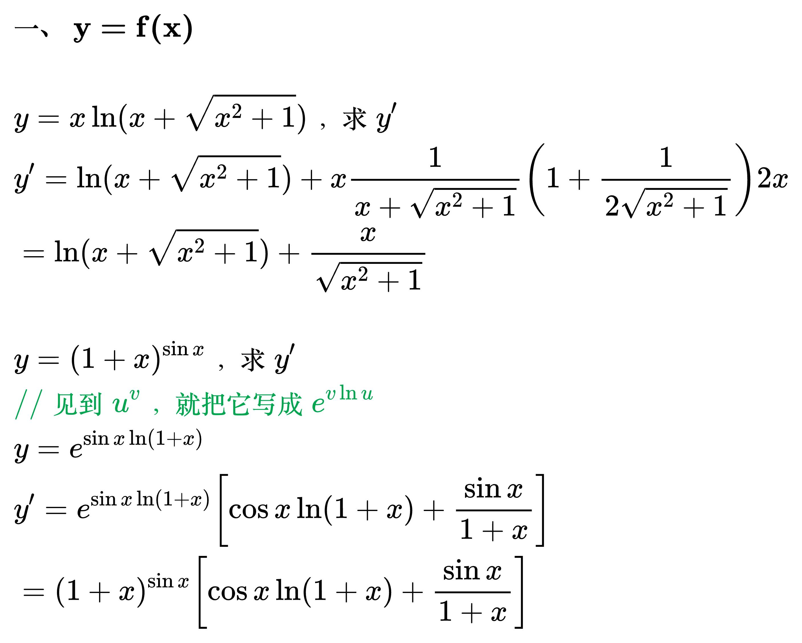
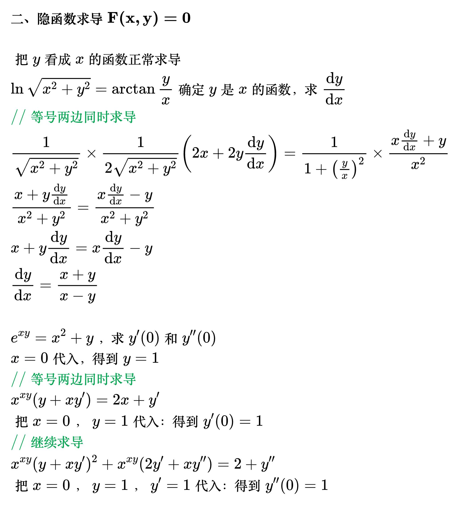

# 求导类型

<!--
\begin{align}
& \mathbf{一、y=f(x)}  \\
\\
& y = x\ln(x+\sqrt{x^2+1})，求y' \\
& y'=\ln(x+\sqrt{x^2+1}) + x\frac{1}{x+\sqrt{x^2+1}}\left ( 1+\frac{1}{2\sqrt{x^2+1}} \right )2x \\
& =\ln(x+\sqrt{x^2+1})+\frac{x}{\sqrt{x^2+1}} \\
\\
& y=(1+x)^{\sin x}，求y' \\
& {\color{Green} // 见到 u^v，就把它写成 e^{v \ln u}} \\
& y=e^{\sin x \ln(1+x)} \\
& y'=e^{\sin x \ln(1+x)}\left [ \cos x \ln(1+x) + \frac{\sin x}{1+x} \right ]  \\
& =(1+x)^{\sin x}\left [ \cos x \ln(1+x) + \frac{\sin x}{1+x} \right ]  \\
\end{align}
-->

<!--
\begin{align}
& \mathbf{二、隐函数求导F(x,y)=0}  \\
\\
& 把y看成x的函数正常求导 \\
& \ln\sqrt{x^2+y^2}=\arctan\frac{y}{x}确定y是x的函数，求\frac{\mathrm{d}y}{\mathrm{d}x} \\
& {\color{Green} // 等号两边同时求导} \\
& \frac{1}{\sqrt{x^2+y^2}}\times\frac{1}{2\sqrt{x^2+y^2}}\left ( 2x+2y\frac{\mathrm{d}y}{\mathrm{d}x} \right )
= \frac{1}{1+\left ( \frac{y}{x} \right ) ^2}\times\frac{x\frac{\mathrm{d}y}{\mathrm{d}x}+y}{x^2} \\
& \frac{x+y\frac{\mathrm{d}y}{\mathrm{d}x}}{x^2+y^2}=\frac{x\frac{\mathrm{d}y}{\mathrm{d}x}-y}{x^2+y^2} \\
& x+y\frac{\mathrm{d}y}{\mathrm{d}x}=x\frac{\mathrm{d}y}{\mathrm{d}x}-y \\
& \frac{\mathrm{d}y}{\mathrm{d}x}=\frac{x+y}{x-y} \\
\\
& e^{xy}=x^2+y，求y'(0)和y''(0) \\
& x=0代入，得到y=1 \\
& {\color{Green} // 等号两边同时求导} \\
& x^{xy}(y+xy')=2x+y' \\
& 把x=0，y=1代入：得到y'(0)=1 \\
& {\color{Green} // 继续求导} \\
& x^{xy}(y+xy')^2+x^{xy}(2y'+xy'')=2+y'' \\
& 把x=0，y=1，y'=1代入：得到y''(0)=1 \\
\end{align}
-->

<!--

-->
