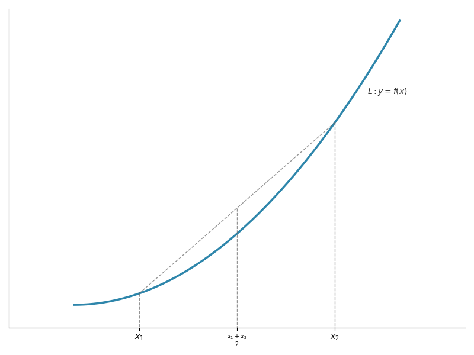
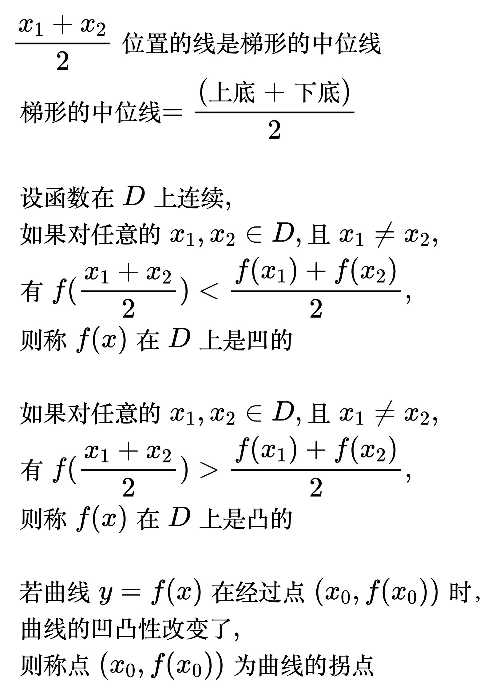
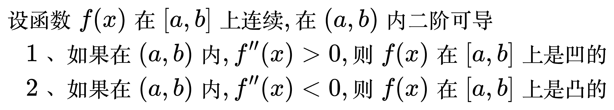
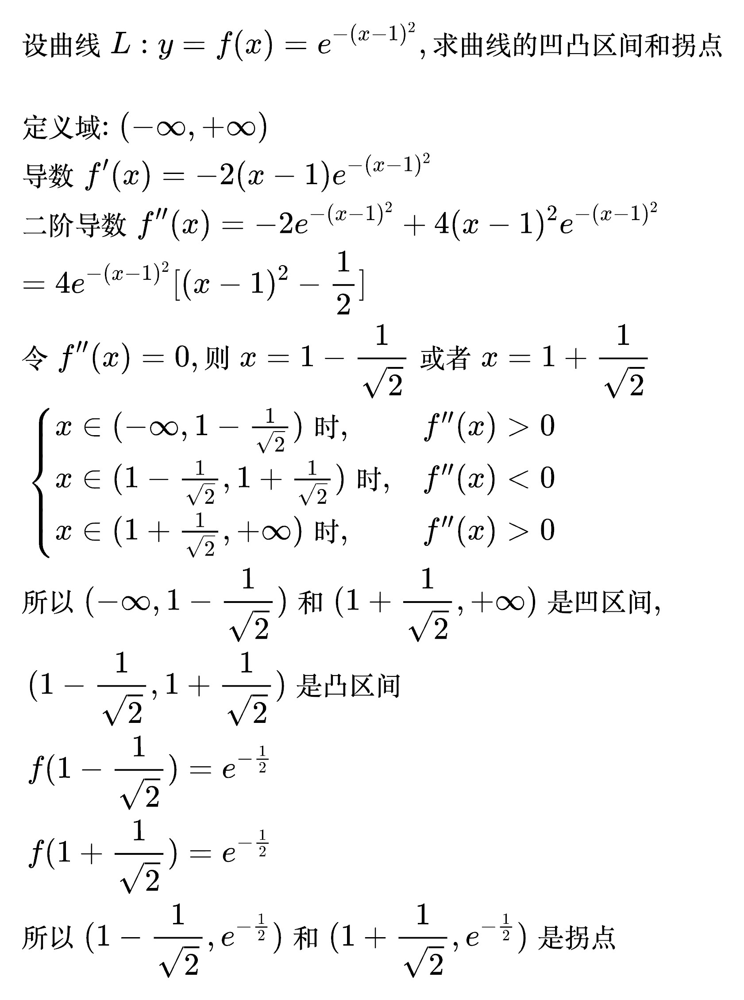
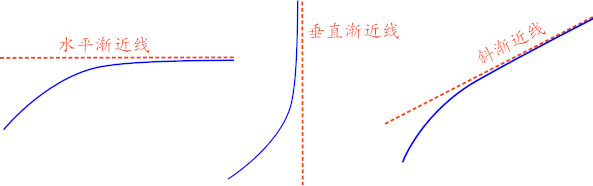
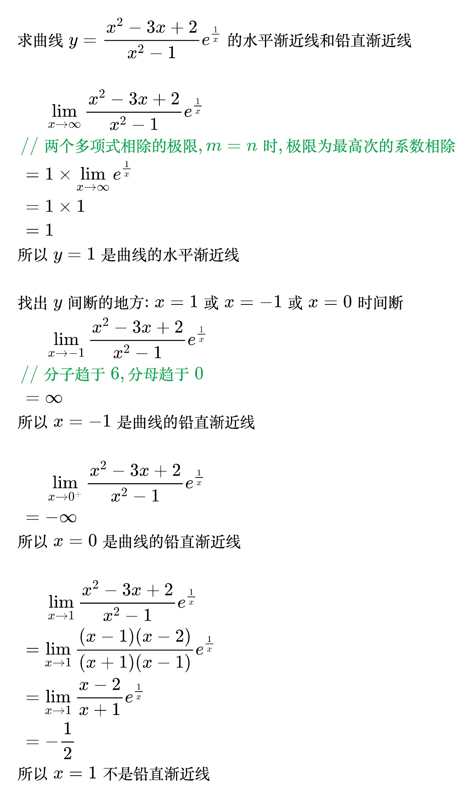
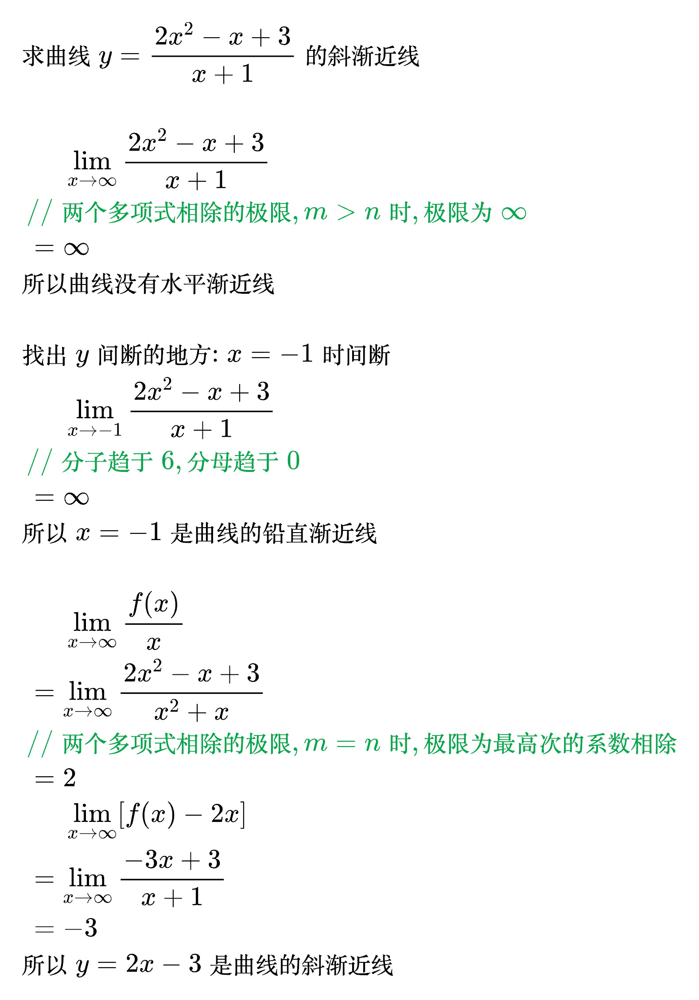
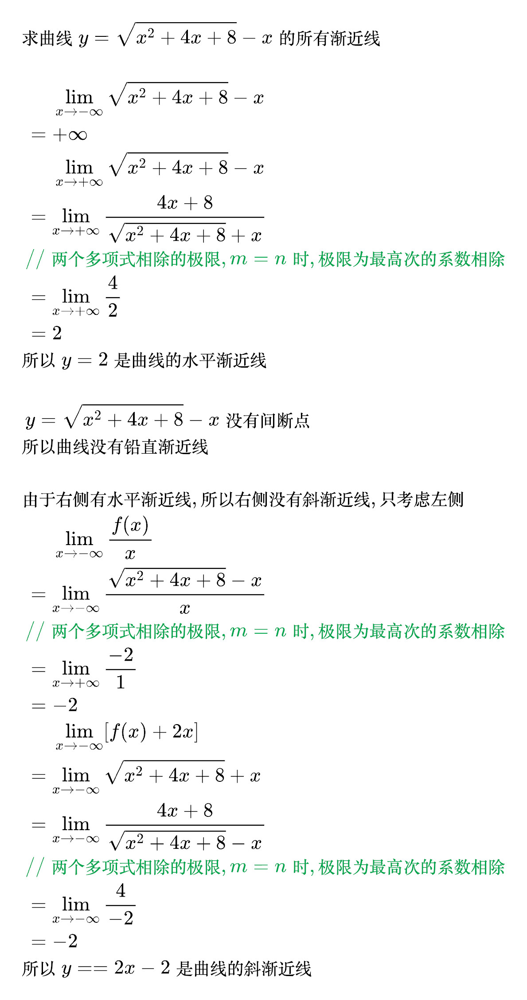

# 导数的应用

## 函数的凹凸性

<!--
import numpy as np
import matplotlib.pyplot as plt

plt.rcParams['font.sans-serif'] = ['Hiragino Sans GB']
plt.rcParams['axes.unicode_minus'] = False

def get_line_function(x1, y1, x2, y2):
    # 计算斜率k和截距b
    k = (y2 - y1) / (x2 - x1)
    b = y1 - k * x1

    # 定义直线函数
    line_func = lambda x: k * x + b
    return line_func

def f(x):
    return x ** 2

# 曲线
x_start = 0
x_end = 5
x = np.linspace(x_start, x_end, 2000)  # x范围覆盖两个极值点，2000个点确保曲线平滑
y = f(x)

# 创建画布
plt.figure(figsize=(8, 6))

# 绘制函数曲线
plt.plot(x, y, color='#2E86AB', linewidth=2.5)
plt.text(x_end - 0.5, f(x_end - 0.7), '$L: y=f(x)$', fontsize=10, color='#333333')

# 坐标轴范围
plt.xlim(x_start - 1, x_end + 1)
plt.ylim(f(x_start) - 2, f(x_end) + 1)

# 添加注释线
x1 = x_start + 1
x2 = x_start + 4
plt.plot([x1, x1], [f(x1), -3], color='#666666', linestyle='--', linewidth=1, alpha=0.7)
plt.plot([x2, x2], [f(x2), -3], color='#666666', linestyle='--', linewidth=1, alpha=0.7)

# 连线
line_f = get_line_function(x1, f(x1), x2, f(x2))
x = np.linspace(x1, x2, 2000)
plt.plot(x, line_f(x), color='#666666', linestyle='--', linewidth=1, alpha=0.7)

xm = (x1 + x2) / 2
plt.plot([xm, xm], [line_f(xm), -3], color='#666666', linestyle='--', linewidth=1, alpha=0.7)

# 设置刻度
plt.xticks([x1, xm, x2], ['$x_1$', r'$\frac{x_1+x_2}{2}$', '$x_2$'])
plt.yticks([], [])
# 获取当前坐标轴对象
ax = plt.gca()
ax.spines['top'].set_visible(False)  # 隐藏顶部边框
ax.spines['right'].set_visible(False)  # 隐藏右侧边框

# 调整布局并显示
plt.tight_layout()
plt.show()
-->

<!--
TODO 画图 \frac{f(x_1) + f(x_2)}{2}是梯形的中位线
-->
<!--
\begin{align}
& 设函数在 D 上连续, \\
& 如果对任意的 x_1, x_2 \in D, 且 x_1 \ne x_2,  \\
& 有 f(\frac{x_1 + x_2}{2}) < \frac{f(x_1) + f(x_2)}{2}, \\
& 则称 f(x) 在 D 上是凹的 \\
\\
& 如果对任意的 x_1, x_2 \in D, 且 x_1 \ne x_2,  \\
& 有 f(\frac{x_1 + x_2}{2}) > \frac{f(x_1) + f(x_2)}{2}, \\
& 则称 f(x) 在 D 上是凸的 \\
\\
& 若曲线 y = f(x) 在经过点 (x_0, f(x_0)) 时, 曲线的凹凸性改变了, \\
& 则称点 (x_0, f(x_0)) 为曲线的拐点 \\
\end{align}
-->

### 凹凸性判别法

<!--
\begin{align}
& 设函数 f(x) 在 [a, b] 上连续, 在 (a, b) 内二阶可导 \\
& \quad 1、 如果在 (a, b) 内, f''(x) > 0, 则 f(x) 在 [a, b] 上是凹的 \\
& \quad 2、 如果在 (a, b) 内, f''(x) < 0, 则 f(x) 在 [a, b] 上是凸的 \\
\end{align}
-->

例题

<!--
\begin{align}
& 设曲线 L: y = f(x) = e^{-(x - 1)^2}, 求曲线的凹凸区间和拐点 \\
\\
& 定义域: (- \infty, + \infty) \\
& 导数 f'(x) = -2(x - 1)e^{-(x - 1)^2} \\
& 二阶导数 f''(x) = -2e^{-(x - 1)^2} + 4(x - 1)^2 e^{-(x - 1)^2} \\
& = 4e^{-(x - 1)^2}[(x - 1)^2 - \frac{1}{2}] \\
& 令 f''(x) = 0, 则 x = 1 - \frac{1}{\sqrt[]{2}} 或者 x = 1 + \frac{1}{\sqrt[]{2}} \\
& \;\, \begin{cases}
x \in (- \infty, 1 - \frac{1}{\sqrt[]{2}}) 时, & f''(x) > 0 \\
x \in (1 - \frac{1}{\sqrt[]{2}}, 1 + \frac{1}{\sqrt[]{2}}) 时, & f''(x) < 0 \\
x \in (1 + \frac{1}{\sqrt[]{2}}, + \infty) 时, & f''(x) > 0 \\
\end{cases} \\
& 所以 (- \infty, 1 - \frac{1}{\sqrt[]{2}}) 和 (1 + \frac{1}{\sqrt[]{2}}, + \infty) 是凹区间, \\
& \;\, (1 - \frac{1}{\sqrt[]{2}}, 1 + \frac{1}{\sqrt[]{2}}) 是凸区间 \\
& \;\, f(1 - \frac{1}{\sqrt[]{2}}) = e^{-\frac{1}{2}} \\
& \;\, f(1 + \frac{1}{\sqrt[]{2}}) = e^{-\frac{1}{2}} \\
& 所以 (1 - \frac{1}{\sqrt[]{2}}, e^{-\frac{1}{2}}) 和
(1 + \frac{1}{\sqrt[]{2}}, e^{-\frac{1}{2}})
是拐点 \\
\end{align}
-->

## 渐近线

<!--
\begin{align}
& 水平渐近线: 设曲线 L: y = f(x), 若 \lim_{x \to \infty} f(x) = A, \\
& 则称直线 y = A 为曲线 L 的水平渐近线 \\
\\
& 铅直渐近线: 设曲线 L: y = f(x), \\
& 若下列任意情况成立 \begin{cases}
\lim_{x \to a} f(x) = \infty \\
\lim_{x \to a^-} f(x) = \infty \\
\lim_{x \to a^+} f(x) = \infty \\
\end{cases} \\
& 则称直线 x = a 为曲线 L 的铅直渐近线 \\
\\
& 斜渐近线: 设曲线 L: y = f(x), 若 \lim_{x \to \infty} \frac{f(x)}{x} = a (a \ne 0, a \ne \infty), \\
& \lim_{x \to \infty} [f(x) - ax] = b, \\
& 则称直线 y = ax + b 为曲线 L 的斜渐近线 \\
\end{align}
-->

例题 1

<!--
\begin{align}
& 求曲线 y = \frac{x^2 - 3x + 2}{x^2 - 1} e^{\frac{1}{x}} 的水平渐近线和铅直渐近线 \\
\\
& \;\,\;\, \;\, \;\, \lim_{x \to \infty} \frac{x^2 - 3x + 2}{x^2 - 1} e^{\frac{1}{x}} \\
& \;\, {\color{Green} // 两个多项式相除的极限, m = n 时, 极限为最高次的系数相除} \\
& \;\, = 1 \times \lim_{x \to \infty} e^{\frac{1}{x}} \\
& \;\, = 1 \times 1 \\
& \;\, = 1 \\
& 所以 y = 1 是曲线的水平渐近线 \\
\\
& 找出 y 间断的地方: x = 1 或 x = -1 或 x = 0 时间断 \\
& \;\,\;\, \;\, \;\, \lim_{x \to -1} \frac{x^2 - 3x + 2}{x^2 - 1} e^{\frac{1}{x}} \\
& \;\, {\color{Green} // 分子趋于6, 分母趋于0} \\
& \;\, = \infty \\
& 所以 x = -1 是曲线的铅直渐近线 \\
\\
& \;\,\;\, \;\, \;\, \lim_{x \to 0^+} \frac{x^2 - 3x + 2}{x^2 - 1} e^{\frac{1}{x}} \\
& \;\, = - \infty \\
& 所以 x = 0 是曲线的铅直渐近线 \\
\\
& \;\,\;\, \;\, \;\, \lim_{x \to 1} \frac{x^2 - 3x + 2}{x^2 - 1} e^{\frac{1}{x}} \\
& \;\, = \lim_{x \to 1} \frac{(x - 1)(x - 2)}{(x + 1)(x - 1)} e^{\frac{1}{x}} \\
& \;\, = \lim_{x \to 1} \frac{x - 2}{x + 1} e^{\frac{1}{x}} \\
& \;\, = - \frac{1}{2} \\
& 所以 x = 1 不是铅直渐近线 \\
\end{align}
-->

例题 2

<!--
\begin{align}
& 求曲线 y = \frac{2x^2 - x + 3}{x + 1} 的斜渐近线 \\
\\
& \;\,\;\, \;\, \;\, \lim_{x \to \infty} \frac{2x^2 - x + 3}{x + 1} \\
& \;\, {\color{Green} // 两个多项式相除的极限, m > n 时, 极限为 \infty} \\
& \;\, = \infty \\
& 所以曲线没有水平渐近线 \\
\\
& 找出 y 间断的地方: x = -1 时间断 \\
& \;\,\;\, \;\, \;\, \lim_{x \to -1} \frac{2x^2 - x + 3}{x + 1} \\
& \;\, {\color{Green} // 分子趋于6, 分母趋于0} \\
& \;\, = \infty \\
& 所以 x = -1 是曲线的铅直渐近线 \\
\\
& \;\,\;\, \;\, \;\, \lim_{x \to \infty} \frac{f(x)}{x} \\
& \;\, = \lim_{x \to \infty} \frac{2x^2 - x + 3}{x^2 + x} \\
& \;\, {\color{Green} // 两个多项式相除的极限, m = n 时, 极限为最高次的系数相除} \\
& \;\, = 2 \\
& \;\,\;\, \;\, \;\, \lim_{x \to \infty} [f(x) - 2x] \\
& \;\, = \lim_{x \to \infty} \frac{- 3x + 3}{x + 1} \\
& \;\, = -3 \\
& 所以 y = 2x - 3 是曲线的斜渐近线 \\
\end{align}
-->

例题 3

<!--
\begin{align}
& 求曲线 y = \sqrt{x^2 + 4x + 8} - x 的所有渐近线 \\
\\
& \;\,\;\, \;\, \;\, \lim_{x \to - \infty} \sqrt{x^2 + 4x + 8} - x \\
& \;\, = + \infty \\
& \;\,\;\, \;\, \;\, \lim_{x \to + \infty} \sqrt{x^2 + 4x + 8} - x \\
& \;\, = \lim_{x \to + \infty} \frac{4x + 8}{\sqrt{x^2 + 4x + 8} + x} \\
& \;\, {\color{Green} // 两个多项式相除的极限, m = n 时, 极限为最高次的系数相除} \\
& \;\, = \lim_{x \to + \infty} \frac{4}{2} \\
& \;\, = 2 \\
& 所以 y = 2 是曲线的水平渐近线 \\
\\
& \;\, y = \sqrt{x^2 + 4x + 8} - x 没有间断点 \\
& 所以曲线没有铅直渐近线 \\
\\
& 由于右侧有水平渐近线, 所以右侧没有斜渐近线, 只考虑左侧 \\
& \;\,\;\, \;\, \;\, \lim_{x \to - \infty} \frac{f(x)}{x} \\
& \;\, = \lim_{x \to - \infty} \frac{\sqrt{x^2 + 4x + 8} - x}{x} \\
& \;\, {\color{Green} // 两个多项式相除的极限, m = n 时, 极限为最高次的系数相除} \\
& \;\, = \lim_{x \to + \infty} \frac{-2}{1} \\
& \;\, = -2 \\
& \;\,\;\, \;\, \;\, \lim_{x \to - \infty} [f(x) + 2x] \\
& \;\, = \lim_{x \to - \infty} \sqrt{x^2 + 4x + 8} + x \\
& \;\, = \lim_{x \to - \infty} \frac{4x + 8}{\sqrt{x^2 + 4x + 8} - x} \\
& \;\, {\color{Green} // 两个多项式相除的极限, m = n 时, 极限为最高次的系数相除} \\
& \;\, = \lim_{x \to - \infty} \frac{4}{-2} \\
& \;\, = -2 \\
& 所以 y = =2x - 2 是曲线的斜渐近线 \\
\end{align}
-->

