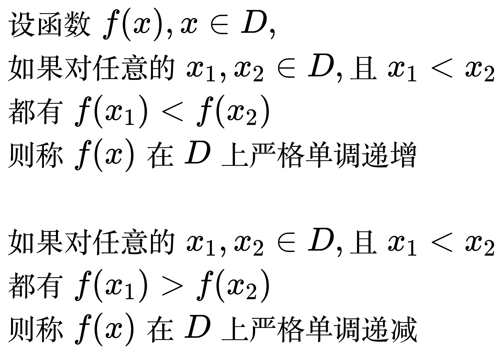
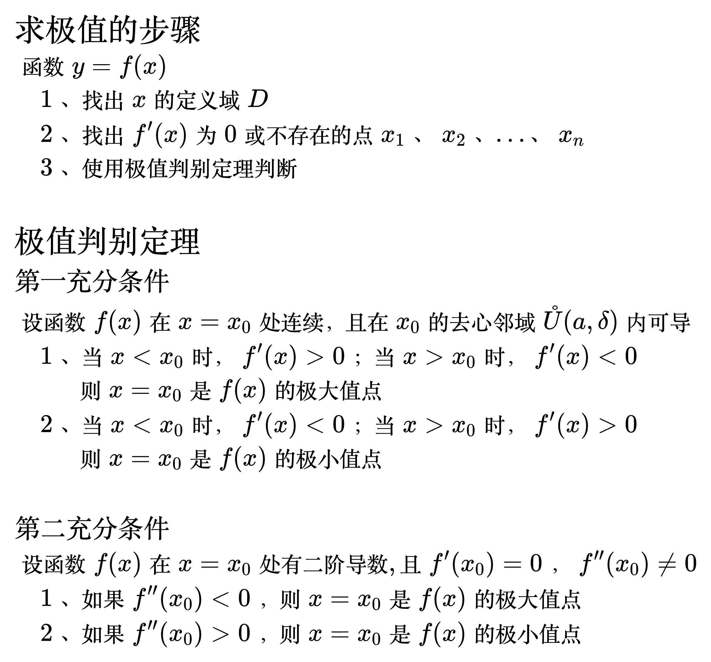
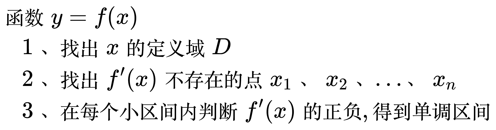
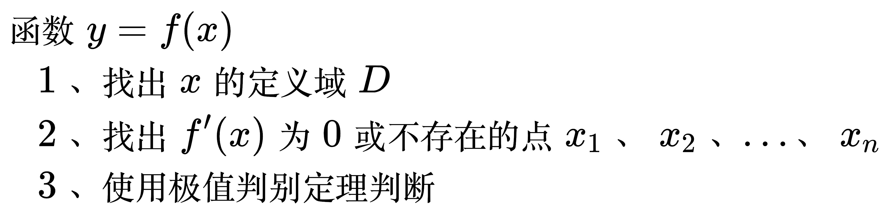
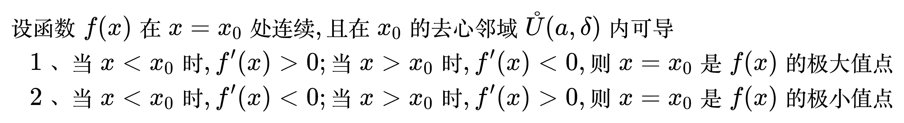
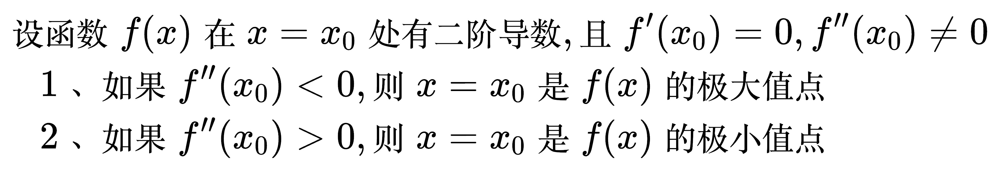
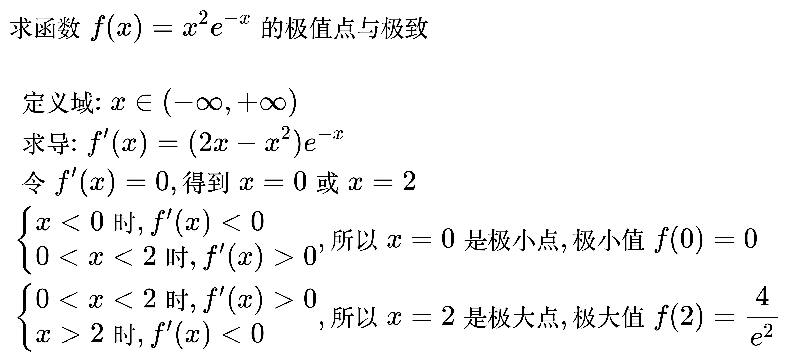
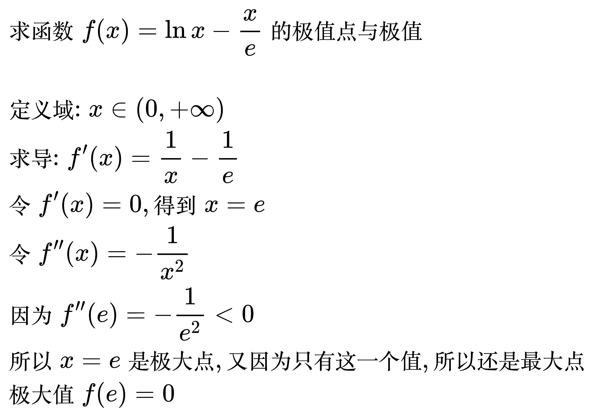
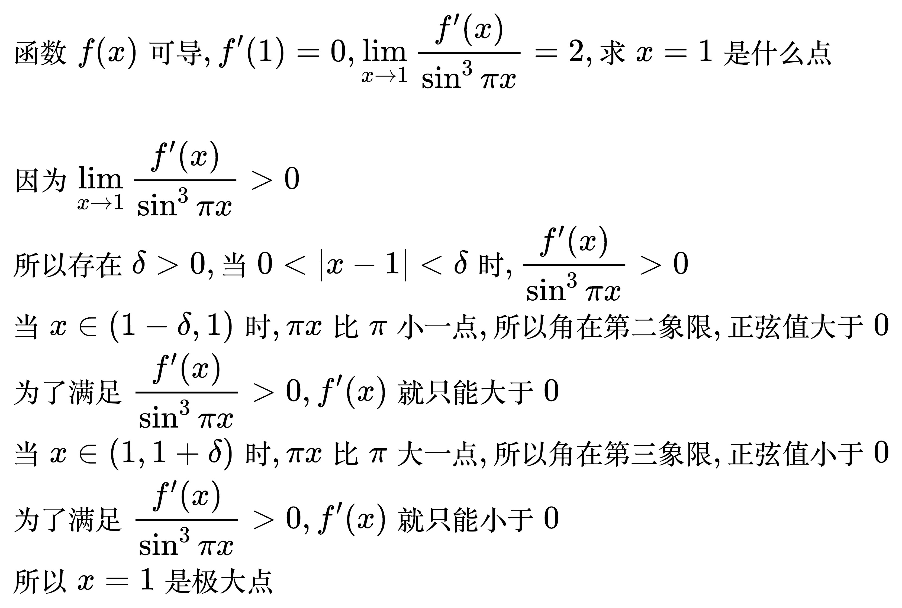
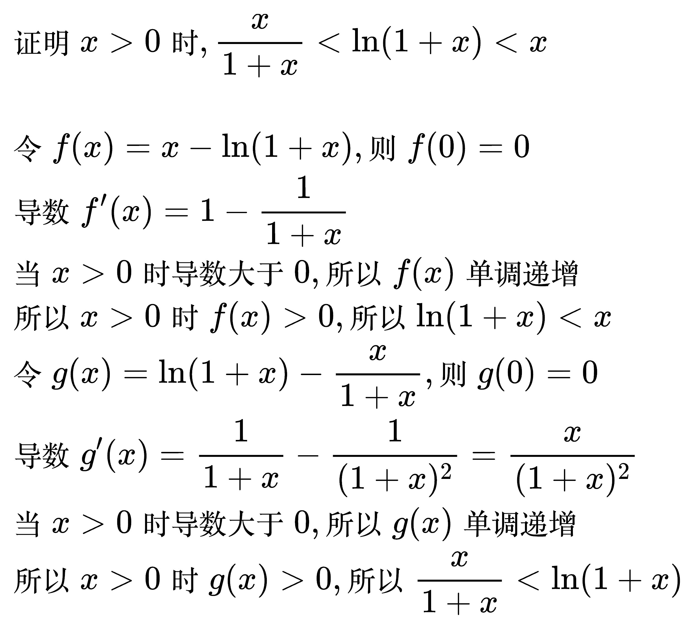

# 导数的应用

## 函数的单调性

<!--
\begin{align}
& 设函数 f(x), x\in D, \\
& 如果对任意的 x_1, x_2 \in D, 且 x_1 < x_2 \\
& 都有 f(x_1) < f(x_2) \\
& 则称 f(x) 在 D 上严格单调递增 \\
\\
& 如果对任意的 x_1, x_2 \in D, 且 x_1 < x_2 \\
& 都有 f(x_1) > f(x_2) \\
& 则称 f(x) 在 D 上严格单调递减 \\
\end{align}
-->

### 判断定理

<!--
\begin{align}
& 设函数 f(x) 在 [a, b] 上连续, 在 (a, b) 内可导 \\
& \quad 1、 如果 x \in (a, b) 时, f'(x) > 0, 则 f(x) 在 [a, b] 上单调递增 \\
& \quad 2、 如果 x \in (a, b) 时, f'(x) < 0, 则 f(x) 在 [a, b] 上单调递减 \\
\end{align}
-->

求单调区间的步骤

<!--
\begin{align}
& 函数 y = f(x) \\
& \quad 1、 找出 x 的定义域 D \\
& \quad 2、 找出 f'(x) 不存在的点 x_1、x_2、...、x_n \\
& \quad 3、 在每个小区间内判断 f'(x) 的正负, 得到单调区间 \\
\end{align}
-->

## 函数的极值

求极值的步骤

<!--
\begin{align}
& 函数 y = f(x) \\
& \quad 1、 找出 x 的定义域 D \\
& \quad 2、 找出 f'(x) 为 0 或不存在的点 x_1、x_2、...、x_n \\
& \quad 3、 使用极值判别定理判断 \\
\end{align}
-->

### 极值判别定理

第一充分条件

<!--
\begin{align}
& 设函数 f(x) 在 x = x_0 处连续, 且在 x_0 的去心邻域 \mathring{U}(a,\delta) 内可导 \\
& \quad 1、 当 x < x_0 时, f'(x) > 0; 当 x > x_0 时, f'(x) < 0, 则 x = x_0 是 f(x) 的极大值点 \\
& \quad 2、 当 x < x_0 时, f'(x) < 0; 当 x > x_0 时, f'(x) > 0, 则 x = x_0 是 f(x) 的极小值点 \\
\end{align}
-->

第二充分条件

<!--
\begin{align}
& 设函数 f(x) 在 x = x_0 处有二阶导数, 且 f'(x_0) = 0, f''(x_0) \ne 0 \\
& \quad 1、 如果 f''(x_0) < 0, 则 x = x_0 是 f(x) 的极大值点 \\
& \quad 2、 如果 f''(x_0) > 0, 则 x = x_0 是 f(x) 的极小值点 \\
\end{align}
-->

例题 1

<!--
\begin{align}
& 求函数 f(x) = x^2e^{-x} 的极值点与极值 \\
\\
& \;\, 定义域: x \in (- \infty, + \infty) \\
& \;\, 求导: f'(x) = (2x - x^2)e^{-x} \\
& \;\, 令 f'(x) = 0, 得到 x = 0 或 x = 2 \\
& \;\, \begin{cases}
x < 0 时, f'(x) < 0 \\
0 < x < 2 时, f'(x) > 0 \\
\end{cases}, 所以 x = 0 是极小点, 极小值 f(0) = 0 \\
& \;\, \begin{cases}
0 < x < 2 时, f'(x) > 0 \\
x > 2 时, f'(x) < 0 \\
\end{cases}, 所以 x = 2 是极大点, 极大值 f(2) = \frac{4}{e^2} \\
\end{align}
-->

例题 2

<!--
\begin{align}
& 求函数 f(x) = \ln x - \frac{x}{e} 的极值点与极值 \\
\\
& 定义域: x \in (0, + \infty) \\
& 求导: f'(x) = \frac{1}{x} - \frac{1}{e} \\
& 令 f'(x) = 0, 得到 x = e \\
& 令 f''(x) = - \frac{1}{x^2} \\
& 因为 f''(e) = - \frac{1}{e^2} < 0 \\
& 所以 x = e 是极大点, 又因为只有这一个值, 所以还是最大点 \\
& 极大值 f(e) = 0 \\
\end{align}
-->

例题 3

<!--
\begin{align}
& 函数 f(x) 可导, f'(1) = 0, \lim_{x \to 1} \frac{f'(x)}{\sin ^3 \pi x} = 2, 求 x = 1 是什么点 \\
\\
& 因为 \lim_{x \to 1} \frac{f'(x)}{\sin ^3 \pi x} > 0 \\
& 所以存在 \delta > 0, 当 0 < |x - 1| < \delta 时, \frac{f'(x)}{\sin ^3 \pi x} > 0 \\
& 当 x \in (1 - \delta, 1) 时, \pi x 比 \pi 小一点, 所以角在第二象限, 正弦值大于 0 \\
& 为了满足 \frac{f'(x)}{\sin ^3 \pi x} > 0, f'(x) 就只能大于 0 \\
& 当 x \in (1, 1 + \delta) 时, \pi x 比 \pi 大一点, 所以角在第三象限, 正弦值小于 0 \\
& 为了满足 \frac{f'(x)}{\sin ^3 \pi x} > 0, f'(x) 就只能小于 0 \\
& 所以 x = 1 是极大点 \\
\end{align}
-->

例题 4

<!--
\begin{align}
& 证明 x > 0 时, \frac{x}{1 + x} < \ln (1 + x) < x \\
\\
& 令 f(x) = x - \ln (1 + x), 则 f(0) = 0 \\
& 导数 f'(x) = 1 - \frac{1}{1 + x} \\
& 当 x > 0 时导数大于 0, 所以 f(x) 单调递增 \\
& 所以 x > 0 时 f(x) > 0, 所以 \ln (1 + x) < x \\
& 令 g(x) = \ln (1 + x) - \frac{x}{1 + x}, 则 g(0) = 0 \\
& 导数 g'(x) = \frac{1}{1 + x} - \frac{1}{(1 + x)^2} = \frac{x}{(1 + x)^2} \\
& 当 x > 0 时导数大于 0, 所以 g(x) 单调递增 \\
& 所以 x > 0 时 g(x) > 0, 所以 \frac{x}{1 + x} < \ln (1 + x) \\
\end{align}
-->

## 函数的凹凸性

<!--
\begin{align}
& 设函数在 D 上连续, \\
& 如果对任意的 x_1, x_2 \in D, 且 x_1 \ne x_2,  \\
& 有 f(\frac{x_1 + x_2}{2}) < \frac{f(x_1) + f(x_2)}{2}, \\
& 则称 f(x) 在 D 上是凹的 \\
\\
& 如果对任意的 x_1, x_2 \in D, 且 x_1 \ne x_2,  \\
& 有 f(\frac{x_1 + x_2}{2}) > \frac{f(x_1) + f(x_2)}{2}, \\
& 则称 f(x) 在 D 上是凸的 \\
\\
& 若曲线 y = f(x) 在经过点 (x_0, f(x_0)) 时, 曲线的凹凸性改变了, \\
& 则称点 (x_0, f(x_0)) 为曲线的拐点 \\
\end{align}
-->

### 凹凸性判别法

<!--
\begin{align}
& 设函数 f(x) 在 [a, b] 上连续, 在 (a, b) 内二阶可导 \\
& \quad 1、 如果在 (a, b) 内, f''(x) > 0, 则 f(x) 在 [a, b] 上是凹的 \\
& \quad 2、 如果在 (a, b) 内, f''(x) < 0, 则 f(x) 在 [a, b] 上是凸的 \\
\end{align}
-->

