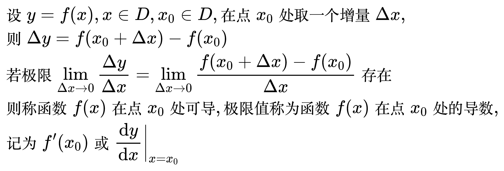
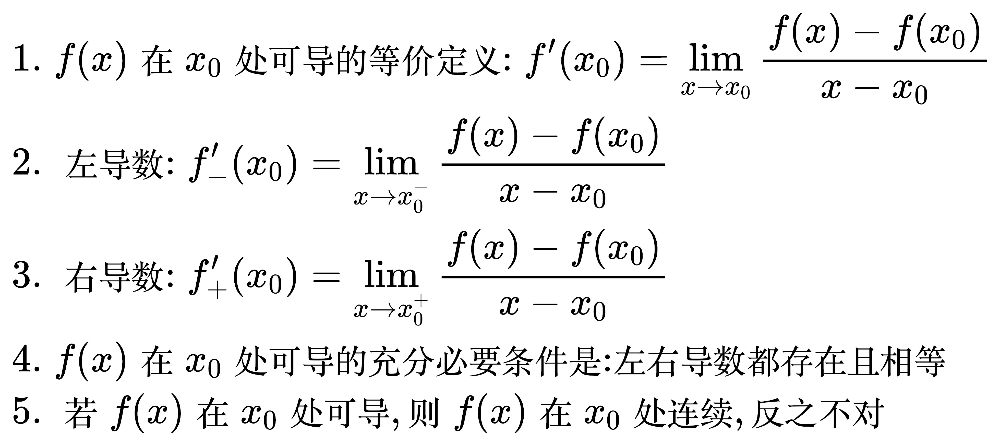
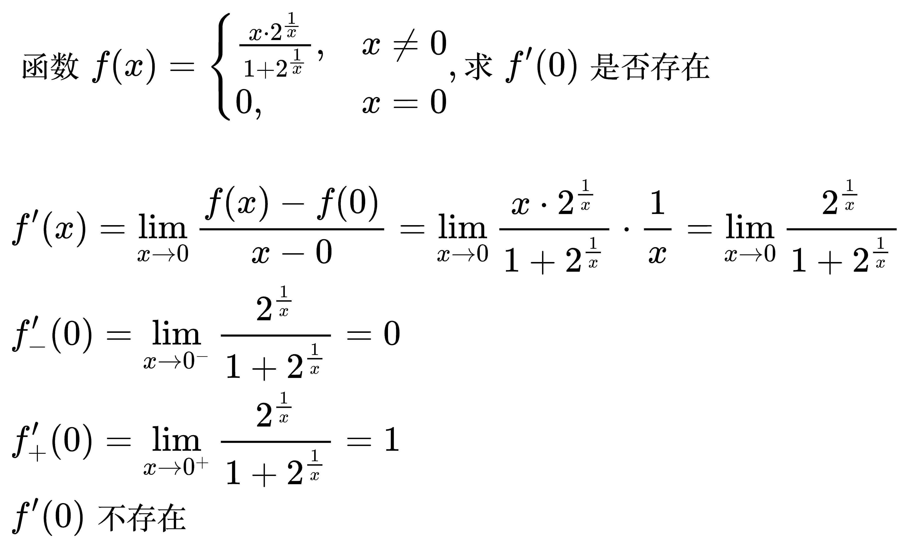
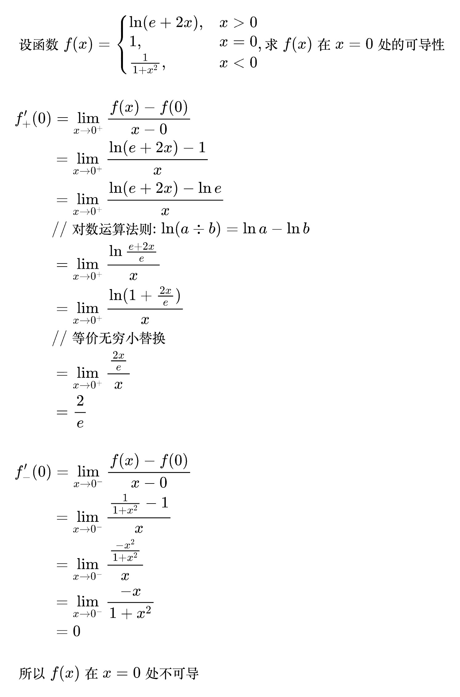
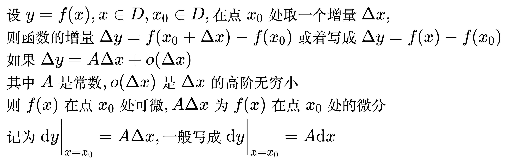
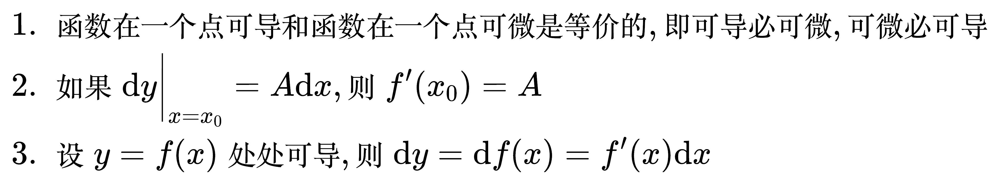

# 导数与微分

## 导数

<!--
\begin{align}
& 设 y = f(x), x \in D, x_{0} \in D, 在点 x_{0} 处取一个增量 \Delta x, \\
& 则 \Delta y = f(x_{0} + \Delta x) - f(x_{0}) \\
& 若极限 \lim_{\Delta x \to 0} \frac{\Delta y}{\Delta x} = \lim_{\Delta x \to 0} \frac{f(x_{0} + \Delta x) - f(x_{0})}{\Delta x} 存在 \\
& 则称函数 f(x) 在点 x_{0} 处可导, 极限值称为函数 f(x) 在点 x_{0} 处的导数, \\
& 记为 f'(x_{0}) 或 \frac{\mathrm{d} y}{\mathrm{d} x} \bigg| _{x = x_{0}} \\
\end{align}
-->

<!--
\begin{align}
& 1. \; f(x) 在 x_{0} 处可导的等价定义: f'(x_{0}) = \lim_{x \to x_{0}} \frac{f(x) - f(x_{0})}{x - x_{0}} \\
& 2. \; 左导数: f'_{-}(x_{0}) = \lim_{x \to x_{0}^{-}} \frac{f(x) - f(x_{0})}{x - x_{0}} \\
& 3. \; 右导数: f'_{+}(x_{0}) = \lim_{x \to x_{0}^{+}} \frac{f(x) - f(x_{0})}{x - x_{0}} \\
& 4. \; f(x) 在 x_{0} 处可导的充分必要条件是: 左右导数都存在且相等 \\
& 5. \; 若 f(x) 在 x_{0} 处可导, 则 f(x) 在 x_{0} 处连续, 反之不对 \\
& 6. \; 若 f(x) 为奇函数, 则 f'(x) 为偶函数 \\
& 7. \; 若 f(x) 为偶函数, 则 f'(x) 为奇函数, 且 f'(0) = 0 \\
& 8. \; 若 f(x) 连续, 且 \lim_{x \to a} \frac{f(x) - b}{x - a} = A, 则 f(a) = b, f'(a) = A \\
\end{align}
-->

例题 1

<!--
\begin{align}
& 函数 f(x) = \begin{cases}
\frac{x \cdot 2^{\frac{1}{x}}}{1 + 2^{\frac{1}{x}}}, & x \ne 0 \\
0, & x = 0 \\
\end{cases}, 求 f'(0) 是否存在 \\
\\
& f'(x) = \lim_{x \to 0} \frac{f(x) - f(0)}{x - 0}
= \lim_{x \to 0} \frac{x \cdot 2^{\frac{1}{x}}}{1 + 2^{\frac{1}{x}}} \cdot \frac{1}{x}
= \lim_{x \to 0} \frac{2^{\frac{1}{x}}}{1 + 2^{\frac{1}{x}}} \\
& f'_{-}(0) = \lim_{x \to 0^{-}} \frac{2^{\frac{1}{x}}}{1 + 2^{\frac{1}{x}}} = 0 \\
& f'_{+}(0) = \lim_{x \to 0^{+}} \frac{2^{\frac{1}{x}}}{1 + 2^{\frac{1}{x}}} = 1 \\
& f'(0) 不存在 \\
\end{align}
-->

例题 2

<!--
\begin{align}
& 设函数 f(x) = \begin{cases}
\ln (e + 2x), & x \gt 0 \\
1, & x = 0 \\
\frac{1}{1 + x^{2}}, & x \lt 0 \\
\end{cases}, 求 f(x) 在 x = 0 处的可导性 \\
\\
& f'_{+}(0) = \lim_{x \to 0^{+}} \frac{f(x) - f(0)}{x - 0} \\
& \quad\quad \,\, = \lim_{x \to 0^{+}} \frac{\ln (e + 2x) - 1}{x} \\
& \quad\quad \,\, = \lim_{x \to 0^{+}} \frac{\ln (e + 2x) - \ln e}{x} \\
& \quad\quad \,\, // 对数运算法则: \ln (a \div b) = \ln a - \ln b \\
& \quad\quad \,\, = \lim_{x \to 0^{+}} \frac{\ln \frac{e + 2x}{e}}{x} \\
& \quad\quad \,\, = \lim_{x \to 0^{+}} \frac{\ln (1 + \frac{2x}{e})}{x} \\
& \quad\quad \,\, // 等价无穷小替换 \\
& \quad\quad \,\, = \lim_{x \to 0^{+}} \frac{\frac{2x}{e}}{x} \\
& \quad\quad \,\, = \frac{2}{e} \\
\\
& f'_{-}(0) = \lim_{x \to 0^{-}} \frac{f(x) - f(0)}{x - 0} \\
& \quad\quad \,\, = \lim_{x \to 0^{-}} \frac{\frac{1}{1 + x^{2}} - 1}{x} \\
& \quad\quad \,\, = \lim_{x \to 0^{-}} \frac{\frac{-x^{2}}{1 + x^{2}}}{x} \\
& \quad\quad \,\, = \lim_{x \to 0^{-}} \frac{-x}{1 + x^{2}} \\
& \quad\quad \,\, = 0 \\
\\
& 所以 f(x) 在 x = 0 处不可导 \\
\end{align}
-->

## 微分

<!--
\begin{align}
& 设 y = f(x), x \in D, x_{0} \in D, 在点 x_{0} 处取一个增量 \Delta x, \\
& 则函数的增量 \Delta y = f(x_{0} + \Delta x) - f(x_{0}) 或着写成 \Delta y = f(x) - f(x_{0}) \\
& 如果 \Delta y = A\Delta x + o(\Delta x) \\
& 其中 A 是常数, o(\Delta x) 是\Delta x的高阶无穷小 \\
& 则 f(x) 在点 x_{0} 处可微, A\Delta x 为 f(x) 在点 x_{0} 处的微分 \\
& 记为 \mathrm{d}y \bigg| _{x = x_{0}} = A\Delta x, 一般写成 \mathrm{d}y \bigg| _{x = x_{0}} = A\mathrm{d}x \\
\end{align}
-->

<!--
\begin{align}
& 1. \; 函数在一个点可导和函数在一个点可微是等价的, 即可导必可微, 可微必可导 \\
& 2. \; 如果 \mathrm{d}y \bigg| _{x = x_{0}} = A\mathrm{d}x, 则 f'(x_{0}) = A \\
& 3. \; 设 y = f(x) 处处可导, 则 \mathrm{d}y = \mathrm{d}f(x) = f'(x)\mathrm{d}x \\
\end{align}
-->

