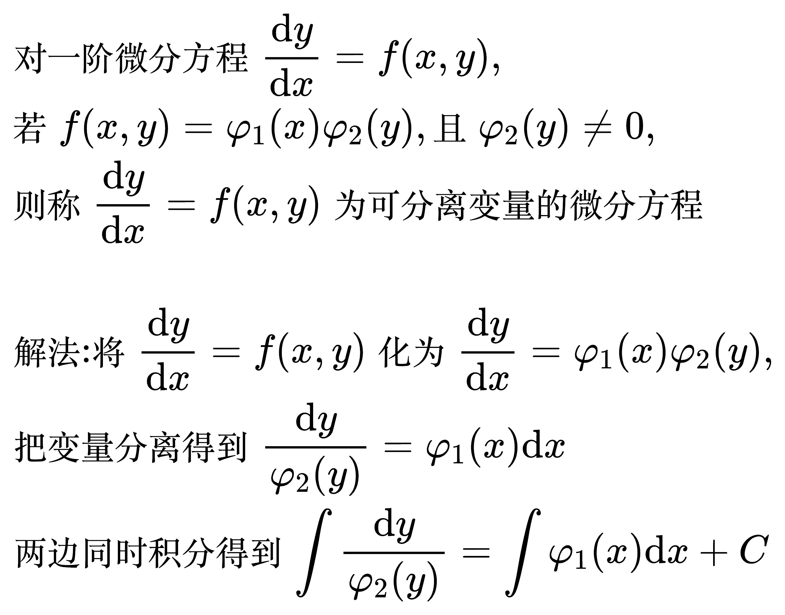
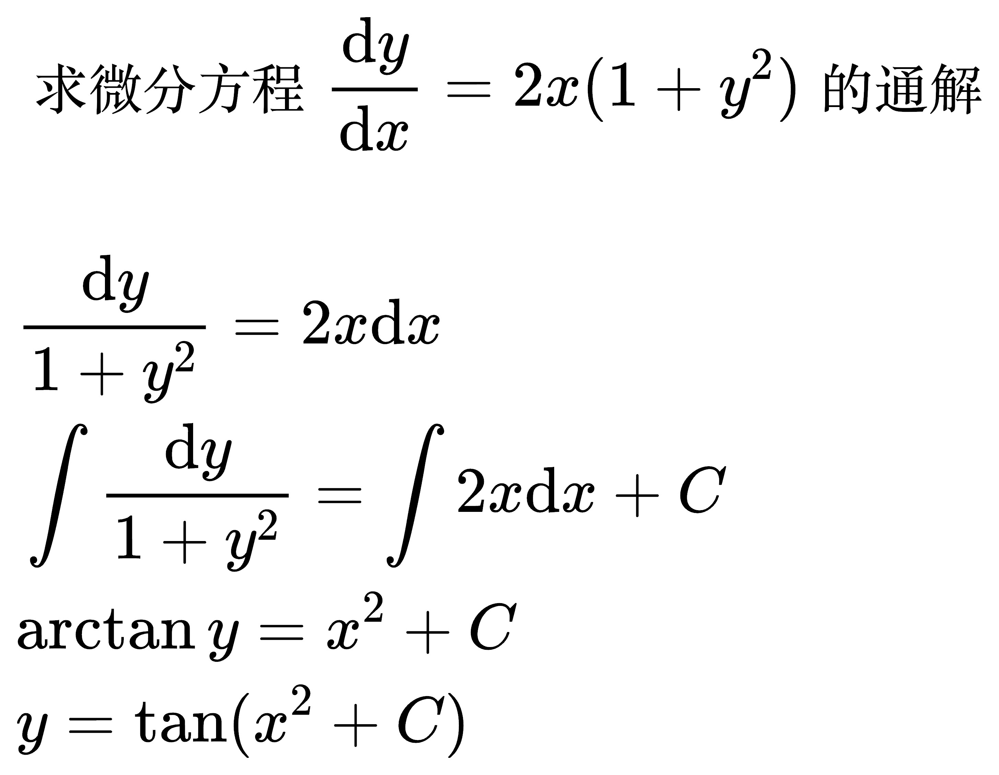

# 一阶微分方程

## 可分离变量的微分方程

<!--
\begin{align}
& 对一阶微分方程 \frac{\mathrm{d}y}{\mathrm{d}x} = f(x, y), \\
& 若 f(x, y) = \varphi _1(x) \varphi _2(y), 且 \varphi _2(y) \ne 0, \\
& 则称 \frac{\mathrm{d}y}{\mathrm{d}x} = f(x, y) 为可分离变量的微分方程 \\
\\
& 解法: 将 \frac{\mathrm{d}y}{\mathrm{d}x} = f(x, y) 化为 \frac{\mathrm{d}y}{\mathrm{d}x} = \varphi _1(x) \varphi _2(y), \\
& 把变量分离得到 \frac{\mathrm{d}y}{\varphi _2(y)} = \varphi _1(x) \mathrm{d}x \\
& 两边同时积分得到 \int \frac{\mathrm{d}y}{\varphi _2(y)} = \int \varphi _1(x) \mathrm{d}x + C \\
\end{align}
-->

例题 1

<!--
\begin{align}
& 求微分方程 \frac{\mathrm{d}y}{\mathrm{d}x} = 2x(1 + y^2) 的通解 \\
\\
& \frac{\mathrm{d}y}{1 + y^2} = 2x \mathrm{d}x\\
& \int \frac{\mathrm{d}y}{1 + y^2} = \int 2x \mathrm{d}x + C \\
& \arctan y = x^2 + C \\
& y = \tan (x^2 + C) \\
\end{align}
-->

