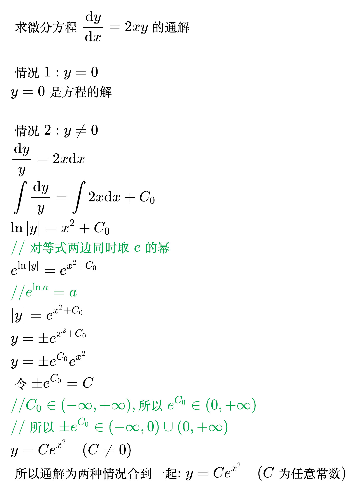
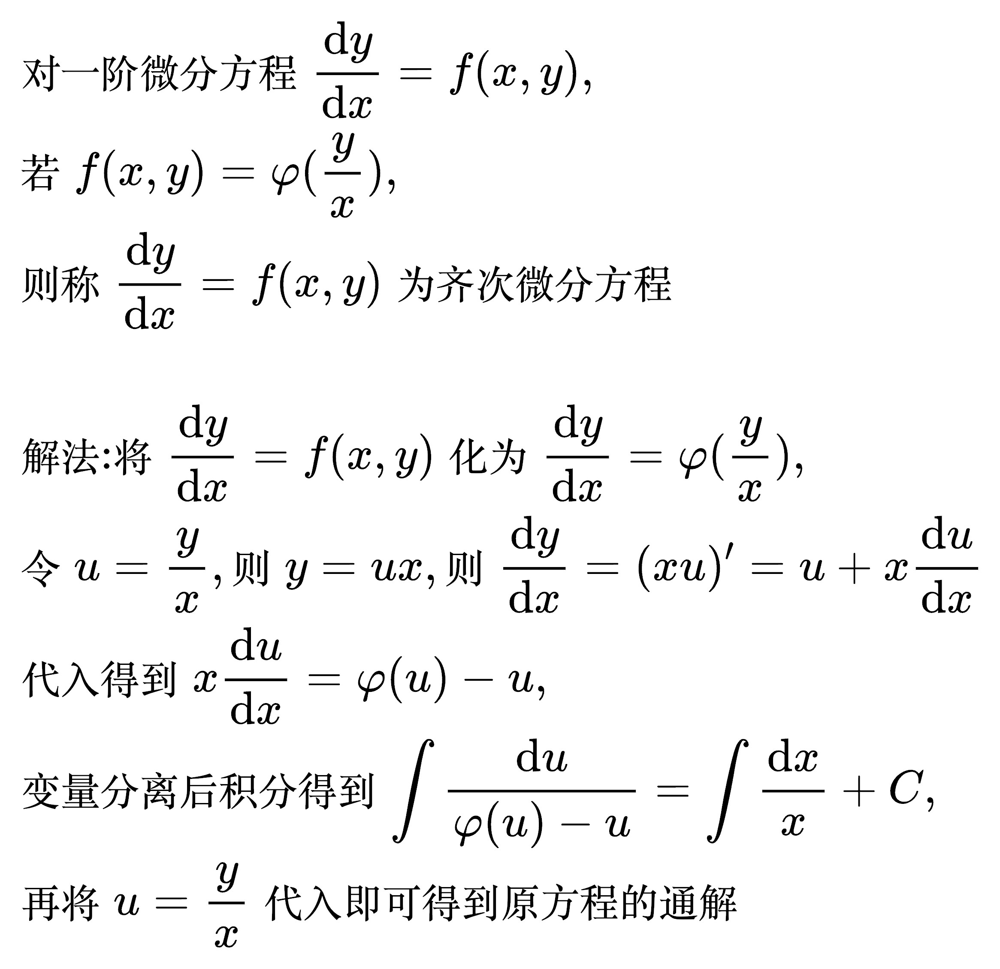
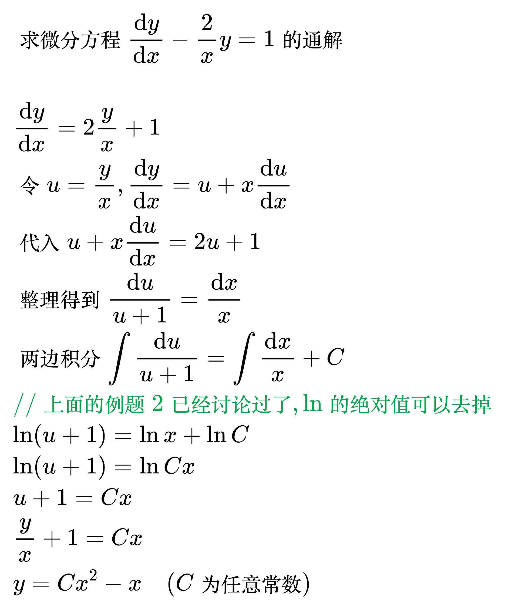
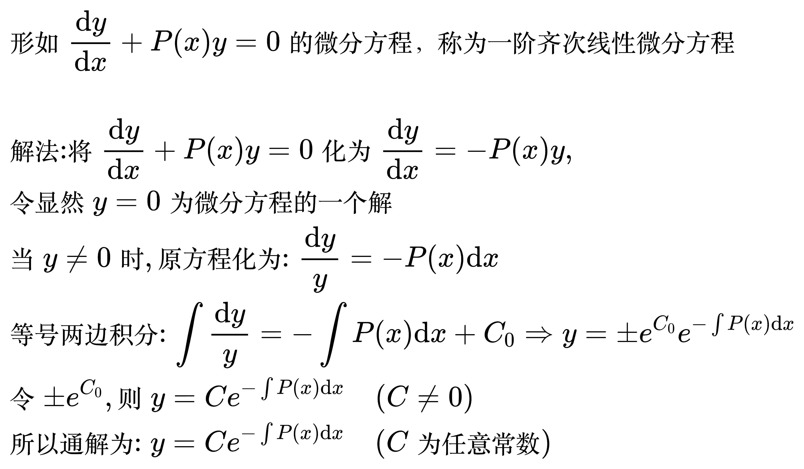

# 一阶微分方程

## 可分离变量的微分方程

<!--
\begin{align}
& 对一阶微分方程 \frac{\mathrm{d}y}{\mathrm{d}x} = f(x, y), \\
& 若 f(x, y) = \varphi _1(x) \varphi _2(y), 且 \varphi _2(y) \ne 0, \\
& 则称 \frac{\mathrm{d}y}{\mathrm{d}x} = f(x, y) 为可分离变量的微分方程 \\
\\
& 解法: 将 \frac{\mathrm{d}y}{\mathrm{d}x} = f(x, y) 化为 \frac{\mathrm{d}y}{\mathrm{d}x} = \varphi _1(x) \varphi _2(y), \\
& 把变量分离得到 \frac{\mathrm{d}y}{\varphi _2(y)} = \varphi _1(x) \mathrm{d}x \\
& 两边同时积分得到 \int \frac{\mathrm{d}y}{\varphi _2(y)} = \int \varphi _1(x) \mathrm{d}x + C \\
\end{align}
-->

例题 1

<!--
\begin{align}
& 求微分方程 \frac{\mathrm{d}y}{\mathrm{d}x} = 2x(1 + y^2) 的通解 \\
\\
& \frac{\mathrm{d}y}{1 + y^2} = 2x \mathrm{d}x\\
& \int \frac{\mathrm{d}y}{1 + y^2} = \int 2x \mathrm{d}x + C \\
& \arctan y = x^2 + C \\
& y = \tan (x^2 + C) \\
\end{align}
-->

例题 2

<!--
\begin{align}
& 求微分方程 \frac{\mathrm{d}y}{\mathrm{d}x} = 2xy 的通解 \\
\\
& 情况1: y = 0 \\
& y = 0 是方程的解 \\
\\
& 情况2: y \ne 0 \\
& \frac{\mathrm{d}y}{y} = 2x \mathrm{d}x\\
& \int \frac{\mathrm{d}y}{y} = \int 2x \mathrm{d}x + C_0 \\
& \ln |y| = x^2 + C_0 \\
& {\color{Green} // 对等式两边同时取 e 的幂} \\
& e^{\ln |y|} = e^{x^2 + C_0} \\
& {\color{Green} // e^{\ln a} = a} \\
& |y| = e^{x^2 + C_0} \\
& y = \pm e^{x^2 + C_0} \\
& y = \pm e^{C_0}e^{x^2} \\
& 令 \pm e^{C_0} = C \\
& {\color{Green} // C_0 \in (- \infty, + \infty), 所以 e^{C_0} \in (0, + \infty)} \\
& {\color{Green} // 所以 \pm e^{C_0} \in (- \infty, 0) \cup (0, + \infty)} \\
& y = Ce^{x^2} \quad (C \ne 0) \\
& 所以通解为 两种情况合到一起:  y = Ce^{x^2} \quad (C为任意常数)\\
\end{align}
-->

## 齐次微分方程

<!--
\begin{align}
& 对一阶微分方程 \frac{\mathrm{d}y}{\mathrm{d}x} = f(x, y), \\
& 若 f(x, y) = \varphi (\frac{y}{x}), \\
& 则称 \frac{\mathrm{d}y}{\mathrm{d}x} = f(x, y) 为齐次微分方程 \\
\\
& 解法: 将 \frac{\mathrm{d}y}{\mathrm{d}x} = f(x, y) 化为 \frac{\mathrm{d}y}{\mathrm{d}x} = \varphi (\frac{y}{x}), \\
& 令 u = \frac{y}{x}, 则 y = ux, 则 \frac{\mathrm{d}y}{\mathrm{d}x} = (xu)' = u + x \frac{\mathrm{d}u}{\mathrm{d}x} \\
& 代入得到 x \frac{\mathrm{d}u}{\mathrm{d}x} = \varphi (u) - u, \\
& 变量分离后积分得到 \int \frac{\mathrm{d}u}{\varphi (u) - u} = \int \frac{\mathrm{d}x}{x} + C, \\
& 再将 u = \frac{y}{x} 代入即可得到原方程的通解 \\
\end{align}
-->

例题 1

<!--
\begin{align}
& 求微分方程 \frac{\mathrm{d}y}{\mathrm{d}x} - \frac{2}{x}y = 1 的通解 \\
\\
& \frac{\mathrm{d}y}{\mathrm{d}x} = 2 \frac{y}{x} + 1 \\
& 令 u = \frac{y}{x}, \frac{\mathrm{d}y}{\mathrm{d}x} = u + x \frac{\mathrm{d}u}{\mathrm{d}x} \\
& 代入 u + x \frac{\mathrm{d}u}{\mathrm{d}x} = 2 u + 1 \\
& 整理得到 \frac{\mathrm{d}u}{u + 1} = \frac{\mathrm{d}x}{x} \\
& 两边积分 \int \frac{\mathrm{d}u}{u + 1} = \int \frac{\mathrm{d}x}{x} + C \\
& {\color{Green} // 上面的例题2已经讨论过了, \ln 的绝对值可以去掉} \\
& \ln (u + 1) = \ln x + \ln C \\
& \ln (u + 1) = \ln Cx \\
& u + 1 = Cx \\
& \frac{y}{x} + 1 = Cx \\
& y = Cx^2 - x \quad (C为任意常数)\\
\end{align}
-->

## 一阶齐次线性微分方程

<!--
\begin{align}
& 形如 \frac{\mathrm{d}y}{\mathrm{d}x} + P(x)y = 0 的微分方程，称为一阶齐次线性微分方程 \\
\\
& 解法: 将 \frac{\mathrm{d}y}{\mathrm{d}x} + P(x)y = 0 化为 \frac{\mathrm{d}y}{\mathrm{d}x} = - P(x)y, \\
& 令显然 y = 0 为微分方程的一个解 \\
& 当 y \ne 0 时, 原方程化为: \frac{\mathrm{d}y}{y} = - P(x) \mathrm{d}x \\
& 等号两边积分: \int \frac{\mathrm{d}y}{y} = - \int P(x) \mathrm{d}x + C_0
\Rightarrow y = \pm e^{C_0} e^{- \int P(x) \mathrm{d}x} \\
& 令 \pm e^{C_0}, 则 y = C e^{- \int P(x) \mathrm{d}x} \quad (C \ne 0) \\
& 所以通解为: y = C e^{- \int P(x) \mathrm{d}x} \quad (C 为任意常数) \\
\end{align}
-->

