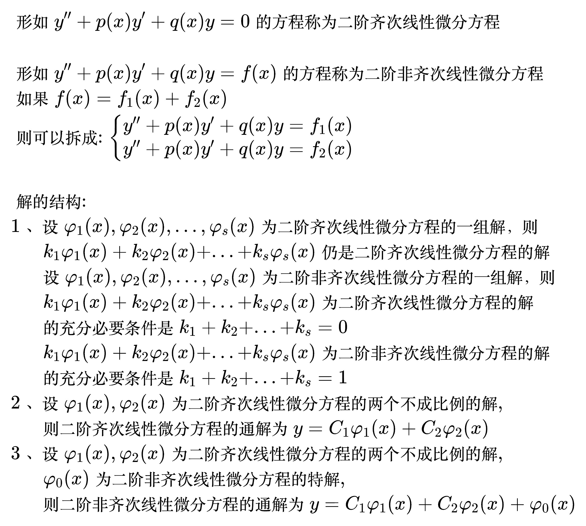
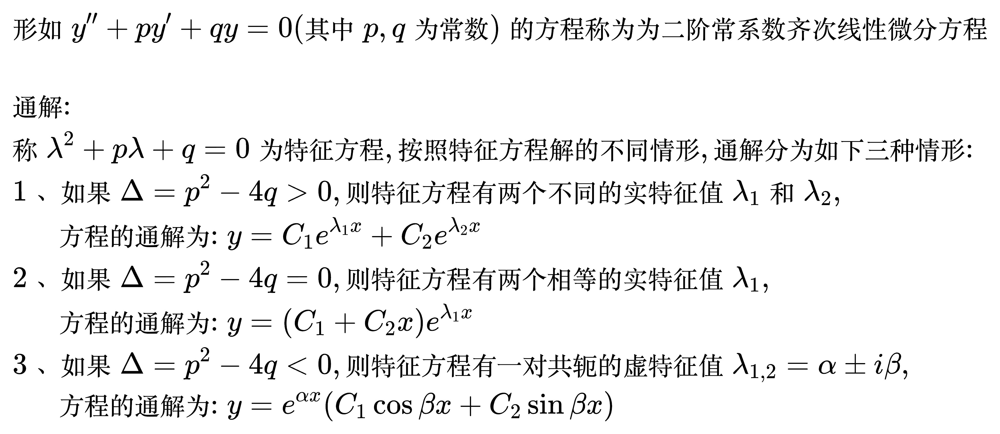
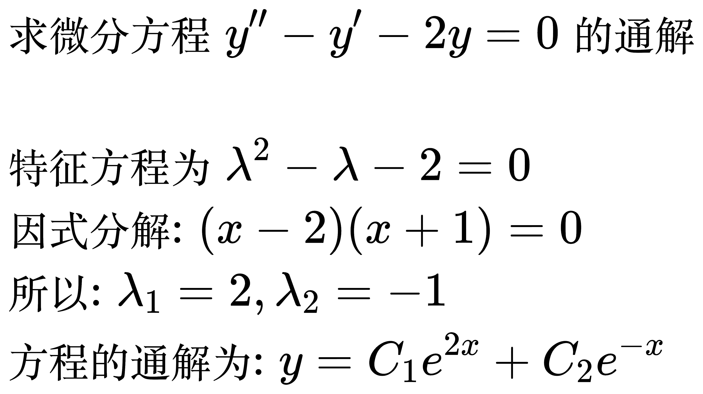
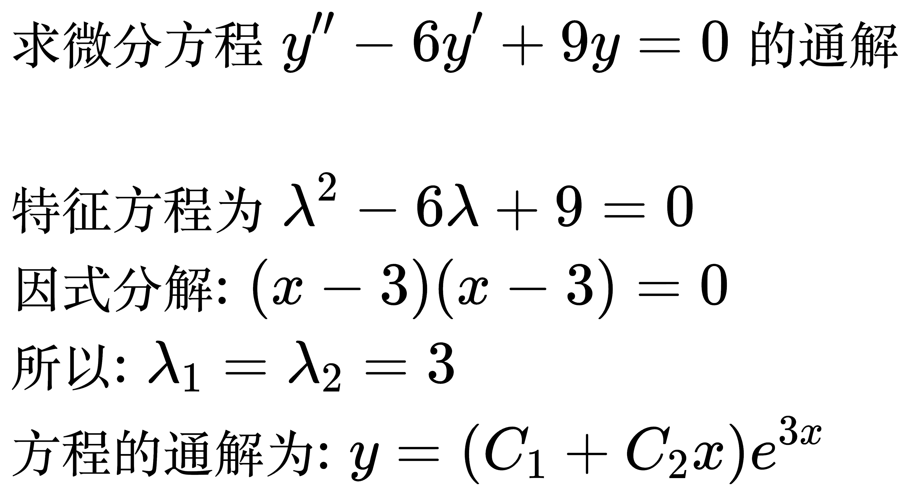
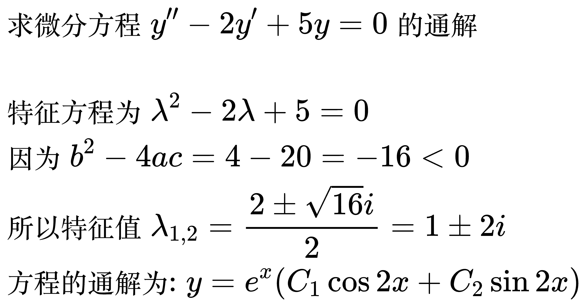
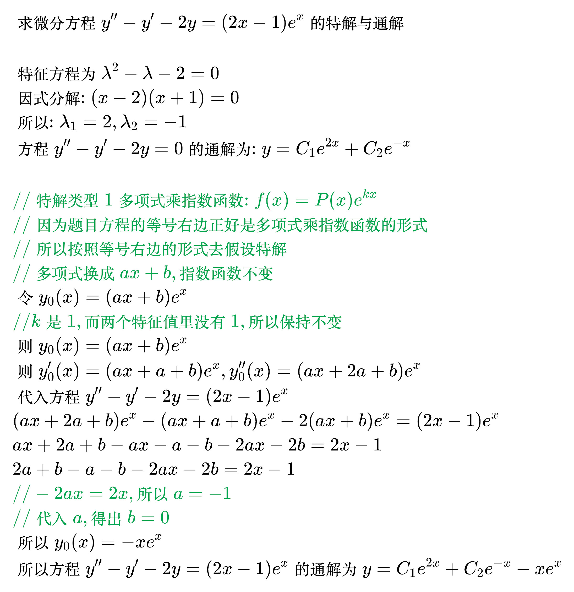

# 高阶线性微分方程

<!--
\begin{align}
& 形如 y'' + p(x)y' + q(x)y = 0 的方程称为二阶齐次线性微分方程 \\
\\
& 形如 y'' + p(x)y' + q(x)y = f(x) 的方程称为二阶非齐次线性微分方程 \\
& 如果 f(x) = f_1(x) + f_2(x) \\
& 则可以拆成: \begin{cases}
y'' + p(x)y' + q(x)y = f_1(x) \\
y'' + p(x)y' + q(x)y = f_2(x) \\
\end{cases}
\\
\\
& 解的结构: \\
& 1、设 \varphi _1(x), \varphi _2(x), ... , \varphi _s(x) 为二阶齐次线性微分方程的一组解，则 \\
& \;\;\;\;\;\; k_1 \varphi _1(x) + k_2 \varphi _2(x) + ... + k_s \varphi _s(x) 仍是二阶齐次线性微分方程的解 \\
& \;\;\;\;\; 设 \varphi _1(x), \varphi _2(x), ... , \varphi _s(x) 为二阶非齐次线性微分方程的一组解，则 \\
& \;\;\;\;\;\; k_1 \varphi _1(x) + k_2 \varphi _2(x) + ... + k_s \varphi _s(x) 为二阶齐次线性微分方程的解 \\
& \;\;\;\;\; 的充分必要条件是 k_1 + k_2 + ... + k_s = 0 \\
& \;\;\;\;\;\; k_1 \varphi _1(x) + k_2 \varphi _2(x) + ... + k_s \varphi _s(x) 为二阶非齐次线性微分方程的解 \\
& \;\;\;\;\; 的充分必要条件是 k_1 + k_2 + ... + k_s = 1 \\
& 2、设 \varphi _1(x), \varphi _2(x) 为二阶齐次线性微分方程的两个不成比例的解, \\
& \;\;\;\;\; 则二阶齐次线性微分方程的通解为 y = C_1 \varphi _1(x) + C_2 \varphi _2(x) \\
& 3、设 \varphi _1(x), \varphi _2(x) 为二阶齐次线性微分方程的两个不成比例的解, \\
& \;\;\;\;\;\; \varphi _0(x) 为二阶非齐次线性微分方程的特解, \\
& \;\;\;\;\; 则二阶非齐次线性微分方程的通解为 y = C_1 \varphi _1(x) + C_2 \varphi _2(x) + \varphi _0(x) \\
\end{align}
-->

## 二阶常系数齐次线性微分方程

<!--
\begin{align}
& 形如 y'' + py' + qy = 0 (其中p, q为常数)的方程称为为二阶常系数齐次线性微分方程 \\
\\
& 通解: \\
& 称 \lambda ^2 + p \lambda + q = 0 为特征方程, 按照特征方程解的不同情形, 通解分为如下三种情形: \\
& \; 1、如果 \Delta = p^2 - 4q > 0, 则特征方程有两个不同的实特征值 \lambda _1 和 \lambda _2,  \\
& \;\;\;\;\;\, 方程的通解为: y = C_1 e^{\lambda _1 x} + C_2 e^{\lambda _2 x} \\
& \; 2、如果 \Delta = p^2 - 4q = 0, 则特征方程有两个相等的实特征值 \lambda _1,  \\
& \;\;\;\;\;\, 方程的通解为: y = (C_1 + C_2 x) e^{\lambda _1 x} \\
& \; 3、如果 \Delta = p^2 - 4q < 0, 则特征方程有一对共轭的虚特征值 \lambda _{1,2} = \alpha \pm i \beta,  \\
& \;\;\;\;\;\, 方程的通解为: y = e^{\alpha x}(C_1 \cos \beta x + C_2 \sin \beta x) \\
\end{align}
-->

例题 1

<!--
\begin{align}
& 求微分方程 y'' - y' - 2y = 0 的通解 \\
\\
& 特征方程为 \lambda ^2 - \lambda -2 = 0 \\
& 因式分解: (x - 2)(x + 1) = 0 \\
& 所以: \lambda _1 = 2, \lambda _2 = -1 \\
& 方程的通解为: y = C_1 e^{2 x} + C_2 e^{- x}
\end{align}
-->

例题 2

<!--
\begin{align}
& 求微分方程 y'' - 6y' + 9y = 0 的通解 \\
\\
& 特征方程为 \lambda ^2 - 6\lambda + 9 = 0 \\
& 因式分解: (x - 3)(x - 3) = 0 \\
& 所以: \lambda _1 = \lambda _2 = 3 \\
& 方程的通解为: y = (C_1 + C_2 x) e^{3 x} \\
\end{align}
-->

例题 3

<!--
\begin{align}
& 求微分方程 y'' - 2y' + 5y = 0 的通解 \\
\\
& 特征方程为 \lambda ^2 - 2\lambda + 5 = 0 \\
& 因为 b^2 - 4ac = 4 - 20 = -16 < 0 \\
& 所以特征值 \lambda _{1,2} = \frac{2 \pm \sqrt{16}i}{2} = 1 \pm 2i \\
& 方程的通解为: y = e^{x}(C_1 \cos 2x + C_2 \sin 2x) \\
\end{align}
-->

## 二阶常系数非齐次线性微分方程

<!--
\begin{align}
& 形如 y'' + py' + qy = f(x) (其中p, q为常数, f(x) 为非零的函数)的方程称为为二阶常系数非齐次线性微分方程 \\
\\
& 特解: \\
\end{align}
-->

例题 1

<!--
\begin{align}
& 求微分方程 y'' - y' - 2y = (2x - 1)e^x 的特解与通解 \\
\\
& 特征方程为 \lambda ^2 - \lambda -2 = 0 \\
& 因式分解: (x - 2)(x + 1) = 0 \\
& 所以: \lambda _1 = 2, \lambda _2 = -1 \\
& 方程 y'' - y' - 2y = 0 的通解为: y = C_1 e^{2 x} + C_2 e^{- x} \\
\\
& {\color{Green} // 特解类型1 多项式乘指数函数: f(x) = P(x)e^{kx}} \\
& {\color{Green} // 因为题目方程的等号右边正好是多项式乘指数函数的形式} \\
& {\color{Green} // 所以按照等号右边的形式去假设特解} \\
& {\color{Green} // 多项式换成ax + b, 指数函数不变} \\
& 令 y_0(x) = (ax + b)e^x \\
& 令 y_0 '(x) = (ax + a + b)e^x, y_0 ''(x) = (ax + 2a + b)e^x \\
& 代入方程 y'' - y' - 2y = (2x - 1)e^x \\
& (ax + 2a + b)e^x - (ax + a + b)e^x - 2(ax + b)e^x = (2x - 1)e^x \\
& ax + 2a + b - ax - a - b - 2ax - 2b = 2x - 1 \\
& 2a + b - a - b - 2ax - 2b = 2x - 1 \\
& {\color{Green} // - 2ax = 2x, 所以 a = -1} \\
& {\color{Green} // 代入a, 得出 b = 0} \\
& 所以 y_0(x) = - xe^x \\
& 所以方程 y'' - y' - 2y = (2x - 1)e^x 的通解为 y = C_1 e^{2 x} + C_2 e^{- x} - xe^x \\
\end{align}
-->

