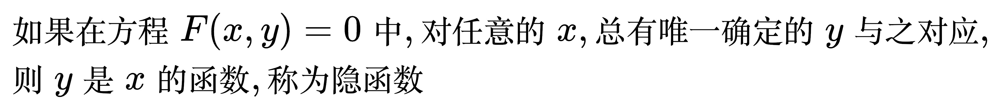
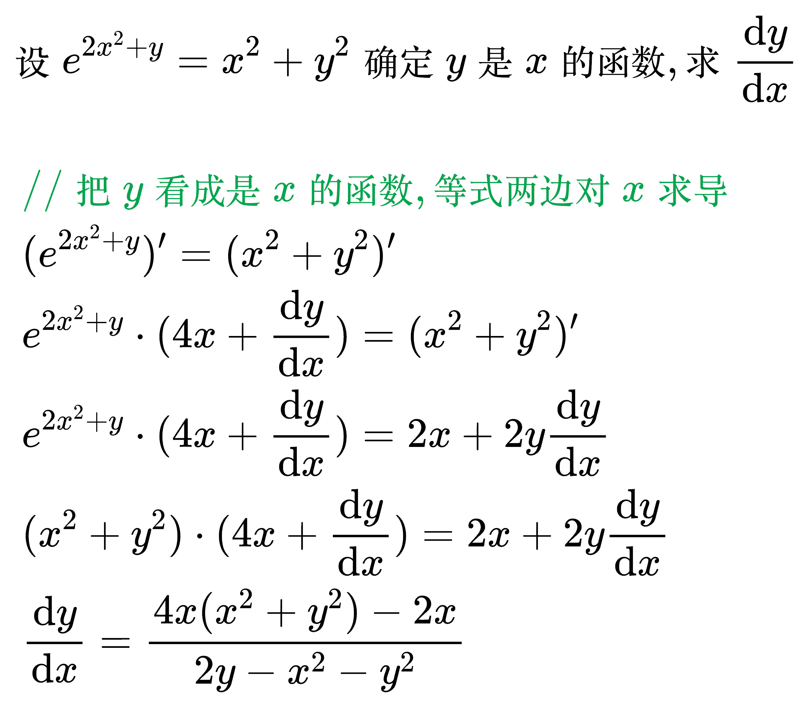
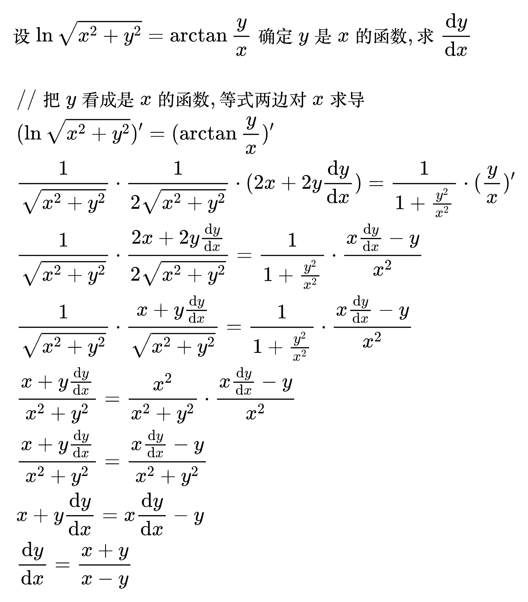
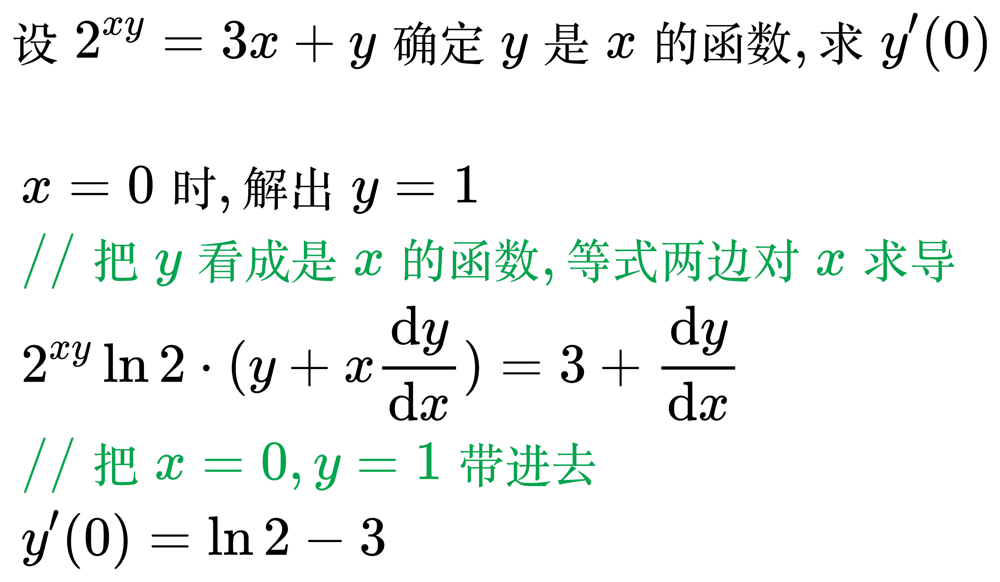

# 隐函数

<!--
\begin{align}
& 如果在方程 F(x, y) = 0 中, 对任意的x, 总有唯一确定的y与之对应, \\
& 则 y 是 x 的函数, 称为隐函数 \\
\end{align}
-->

例题 1

<!--
\begin{align}
& 设 e^{2x^{2} + y} = x^{2} + y^{2} 确定 y 是 x 的函数, 求 \frac{\mathrm{d} y}{\mathrm{d} x} \\
\\
& \;\, // 把 y 看成是 x 的函数, 等式两边对 x 求导 \\
& \;\, (e^{2x^{2} + y})' = (x^{2} + y^{2})' \\
& \;\, e^{2x^{2} + y} \cdot (4x + \frac{\mathrm{d} y}{\mathrm{d} x}) = (x^{2} + y^{2})' \\
& \;\, e^{2x^{2} + y} \cdot (4x + \frac{\mathrm{d} y}{\mathrm{d} x}) = 2x + 2y \frac{\mathrm{d} y}{\mathrm{d} x} \\
& \;\, (x^{2} + y^{2}) \cdot (4x + \frac{\mathrm{d} y}{\mathrm{d} x}) = 2x + 2y \frac{\mathrm{d} y}{\mathrm{d} x} \\
& \;\, \frac{\mathrm{d} y}{\mathrm{d} x} = \frac{4x(x^{2} + y^{2}) - 2x}{2y - x^{2} - y^{2}} \\
\end{align}
-->

例题 2

<!--
\begin{align}
& 设 \ln \sqrt{x^{2} + y^{2}} = \arctan \frac{y}{x} 确定 y 是 x 的函数, 求 \frac{\mathrm{d} y}{\mathrm{d} x} \\
\\
& \;\, // 把 y 看成是 x 的函数, 等式两边对 x 求导 \\
& \;\, (\ln \sqrt{x^{2} + y^{2}})' = (\arctan \frac{y}{x})' \\
& \;\, \frac{1}{\sqrt{x^{2} + y^{2}}} \cdot \frac{1}{2 \sqrt{x^{2} + y^{2}}} \cdot (2x + 2y \frac{\mathrm{d} y}{\mathrm{d} x})
= \frac{1}{1 + \frac{y^{2}}{x^{2}}} \cdot (\frac{y}{x})' \\
& \;\, \frac{1}{\sqrt{x^{2} + y^{2}}} \cdot \frac{2x + 2y \frac{\mathrm{d} y}{\mathrm{d} x}}{2 \sqrt{x^{2} + y^{2}}}
= \frac{1}{1 + \frac{y^{2}}{x^{2}}} \cdot \frac{x\frac{\mathrm{d} y}{\mathrm{d} x} - y}{x^{2}} \\
& \;\, \frac{1}{\sqrt{x^{2} + y^{2}}} \cdot \frac{x + y \frac{\mathrm{d} y}{\mathrm{d} x}}{\sqrt{x^{2} + y^{2}}}
= \frac{1}{1 + \frac{y^{2}}{x^{2}}} \cdot \frac{x\frac{\mathrm{d} y}{\mathrm{d} x} - y}{x^{2}} \\
& \;\, \frac{x + y \frac{\mathrm{d} y}{\mathrm{d} x}}{x^{2} + y^{2}}
= \frac{x^{2}}{x^{2} + y^{2}} \cdot \frac{x\frac{\mathrm{d} y}{\mathrm{d} x} - y}{x^{2}} \\
& \;\, \frac{x + y \frac{\mathrm{d} y}{\mathrm{d} x}}{x^{2} + y^{2}}
= \frac{x\frac{\mathrm{d} y}{\mathrm{d} x} - y}{x^{2} + y^{2}} \\
& \;\, x + y \frac{\mathrm{d} y}{\mathrm{d} x}
= x \frac{\mathrm{d} y}{\mathrm{d} x} - y \\
& \;\, \frac{\mathrm{d} y}{\mathrm{d} x}
= \frac{x + y}{x - y} \\
\end{align}
-->

例题 3

<!--
\begin{align}
& 设 2^{xy} = 3x + y 确定 y 是 x 的函数, 求 y'(0) \\
\\
& \;\, x = 0 时, 解出 y = 1 \\
& \;\, // 把 y 看成是 x 的函数, 等式两边对 x 求导 \\
& \;\, 2^{xy} \ln 2 \cdot (y + x \frac{\mathrm{d} y}{\mathrm{d} x}) = 3 + \frac{\mathrm{d} y}{\mathrm{d} x} \\
& \;\, // 把 x = 0, y = 1 带进去 \\
& \;\, y'(0) = \ln 2 - 3 \\
\end{align}
-->

