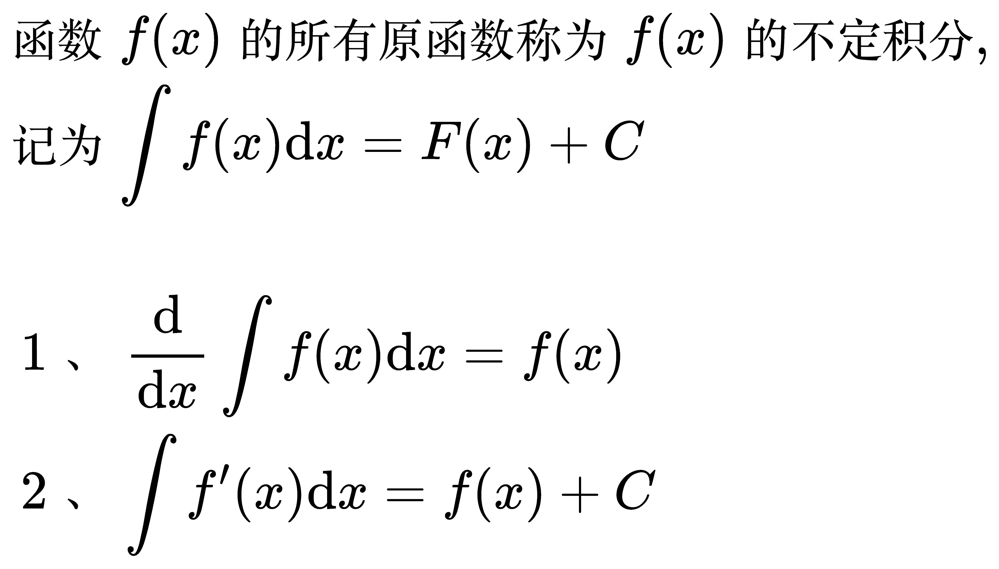
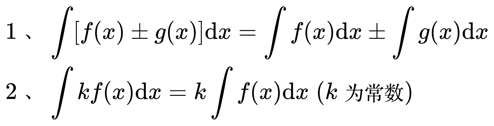

# 不定积分

## 原函数

<!--
\begin{align}
& 函数 f(x) 的定义域为 D, 如果存在函数 F(x), 使得任意的 x \in D, \\
& 都有 F'(x) = f(x), 则称 F(x) 为 f(x) 在 D 上的一个原函数 \\
\\
& \;\, 1、若 f(x) 为连续函数, 则一定有原函数, 反之不对 \\
& \;\, 2、若 f(x) 有一个原函数, 则一定有无数个原函数, 且任意两个雨啊函数相差为常数 \\
& \;\, 3、若 F(x) 为 f(x) 的一个原函数, 则其所有的原函数为 F(x) + C \; (C 为任意常数) \\
\end{align}
-->

## 不定积分

<!--
\begin{align}
& 函数 f(x) 的所有原函数称为 f(x) 的不定积分, \\
& 记为 \int f(x) \mathrm{d}x = F(x) + C \\
\\
& \;\, 1、\frac{\mathrm{d}}{\mathrm{d} x} \int f(x) \mathrm{d}x = f(x) \\
& \;\, 2、\int f'(x) \mathrm{d}x = f(x) + C \\
\end{align}
-->

不定积分的基本性质

<!--
\begin{align}
& \;\, 1、\int [f(x) \pm g(x)] \mathrm{d}x = \int f(x) \mathrm{d}x \pm \int g(x) \mathrm{d}x \\
& \;\, 2、\int kf(x) \mathrm{d}x = k \int f(x) \mathrm{d}x \; (k 为常数) \\
\end{align}
-->

不定积分的基本公式

<!--
\begin{align}
& \;\, 1、\int k \mathrm{d}x = kx + C \\
& \;\, 2、\int x^a \mathrm{d}x = \frac{1}{a + 1} x^{a + 1} + C \quad (a \ne -1) \\
& \;\, 3、\int \frac{1}{x} \mathrm{d}x = \ln |x| + C \\
& \;\, 4、\int a^x \mathrm{d}x = \frac{1}{\ln a} a^x + C \quad (a \ne e) \\
& \;\, 5、\int e^x \mathrm{d}x = e^x + C \\
& \;\, 6、\int \sin x \mathrm{d}x = -\cos x + C \\
& \;\, 7、\int \cos x \mathrm{d}x = \sin x + C \\
& \;\, 8、\int \tan x \mathrm{d}x = -\ln |\cos x| + C \\
& \;\, 9、\int \cot x \mathrm{d}x = \ln |\sin x| + C \\
& 10、\int \sec x \mathrm{d}x = \ln |\sec x + \tan x| + C \\
& 11、\int \csc x \mathrm{d}x = \ln |\csc x - \cot x| + C \\
& 12、\int \sec ^2 x \mathrm{d}x = \tan x + C \\
& 13、\int \csc ^2 x \mathrm{d}x = -\cot x + C \\
& 14、\int \sec x \tan x \mathrm{d}x = \sec x + C \\
& 15、\int \csc x \cot x \mathrm{d}x = -\csc x + C \\
\end{align}
-->
