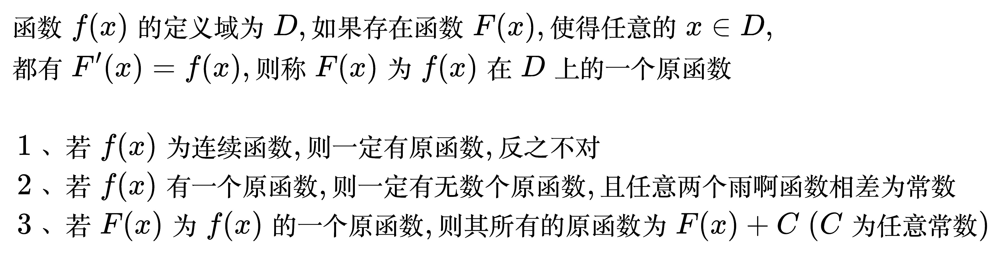

# 不定积分

## 原函数

<!--
\begin{align}
& 函数 f(x) 的定义域为 D, 如果存在函数 F(x), 使得任意的 x \in D, \\
& 都有 F'(x) = f(x), 则称 F(x) 为 f(x) 在 D 上的一个原函数 \\
\\
& \;\, 1、若 f(x) 为连续函数, 则一定有原函数, 反之不对 \\
& \;\, 2、若 f(x) 有一个原函数, 则一定有无数个原函数, 且任意两个雨啊函数相差为常数 \\
& \;\, 3、若 F(x) 为 f(x) 的一个原函数, 则其所有的原函数为 F(x) + C \; (C 为任意常数) \\
\end{align}
-->

