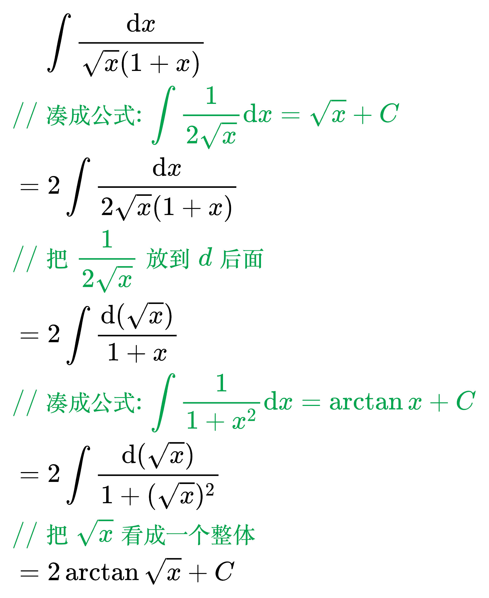
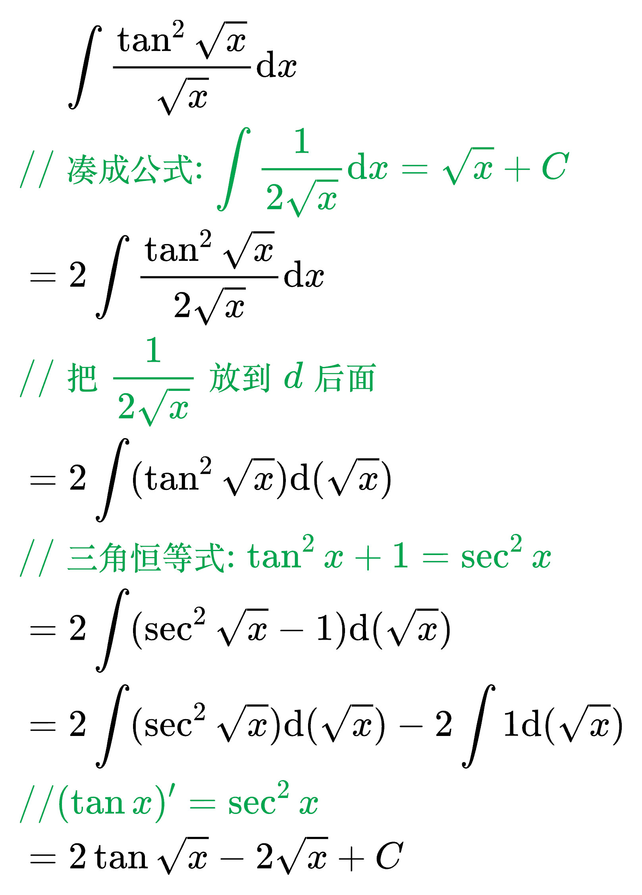
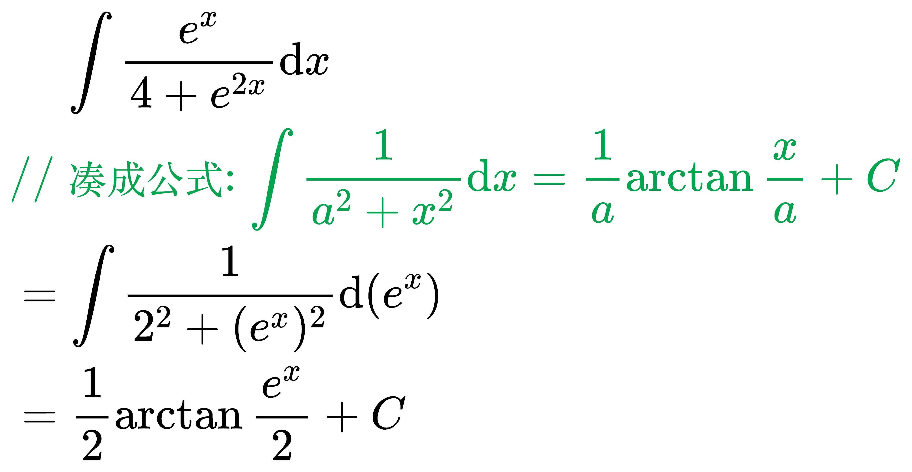
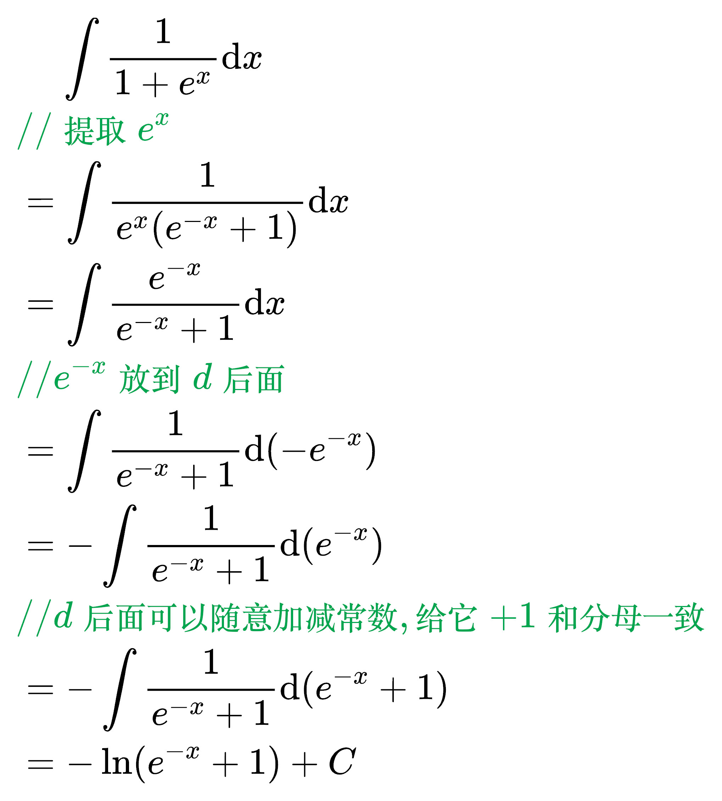
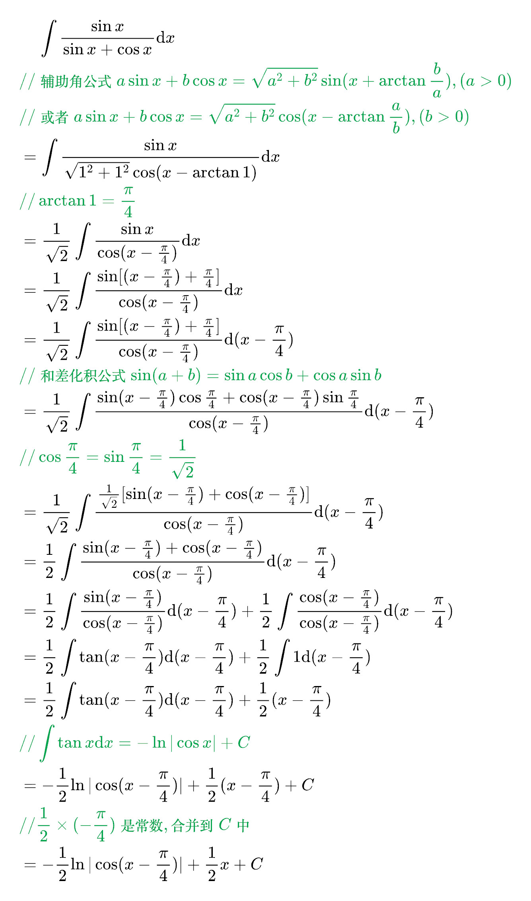
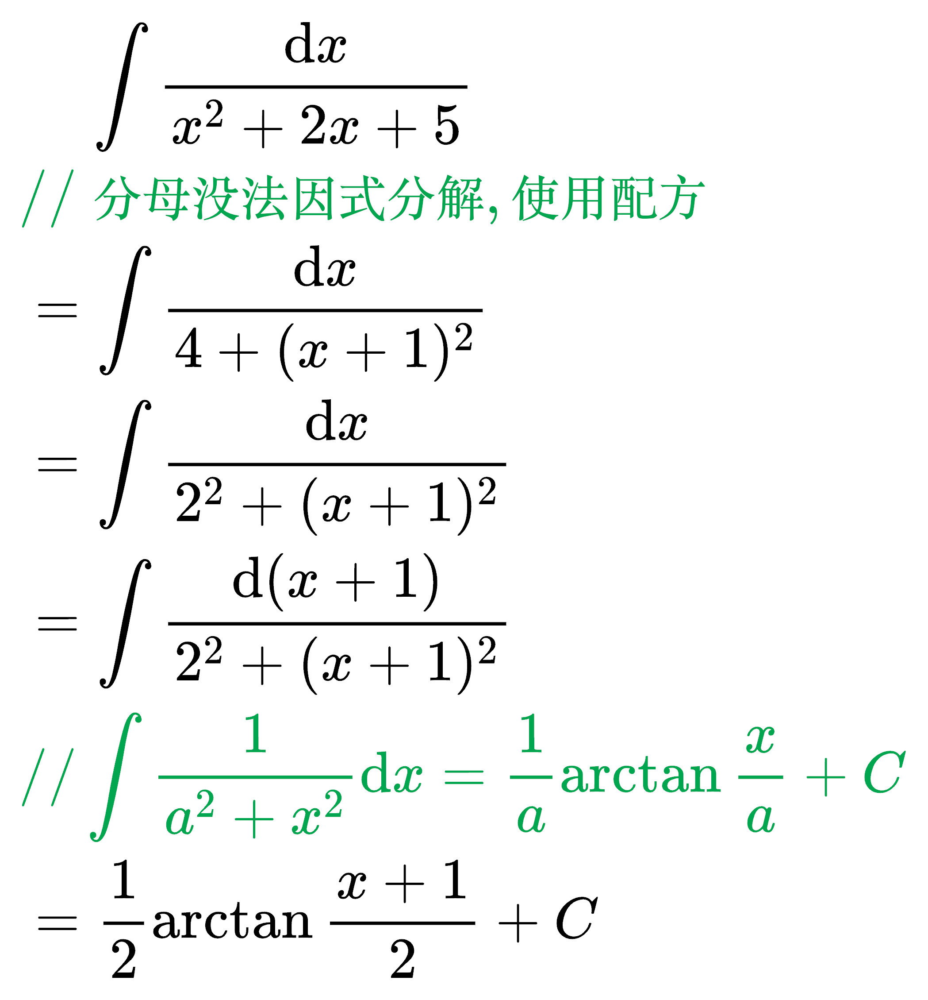
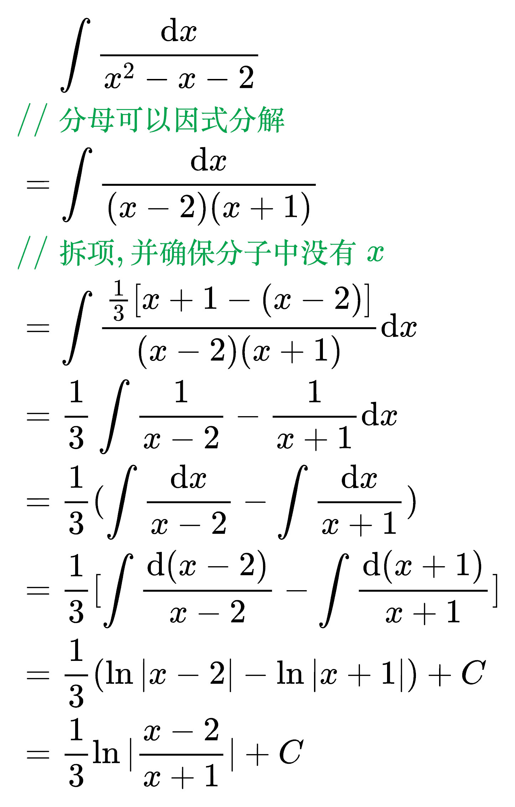
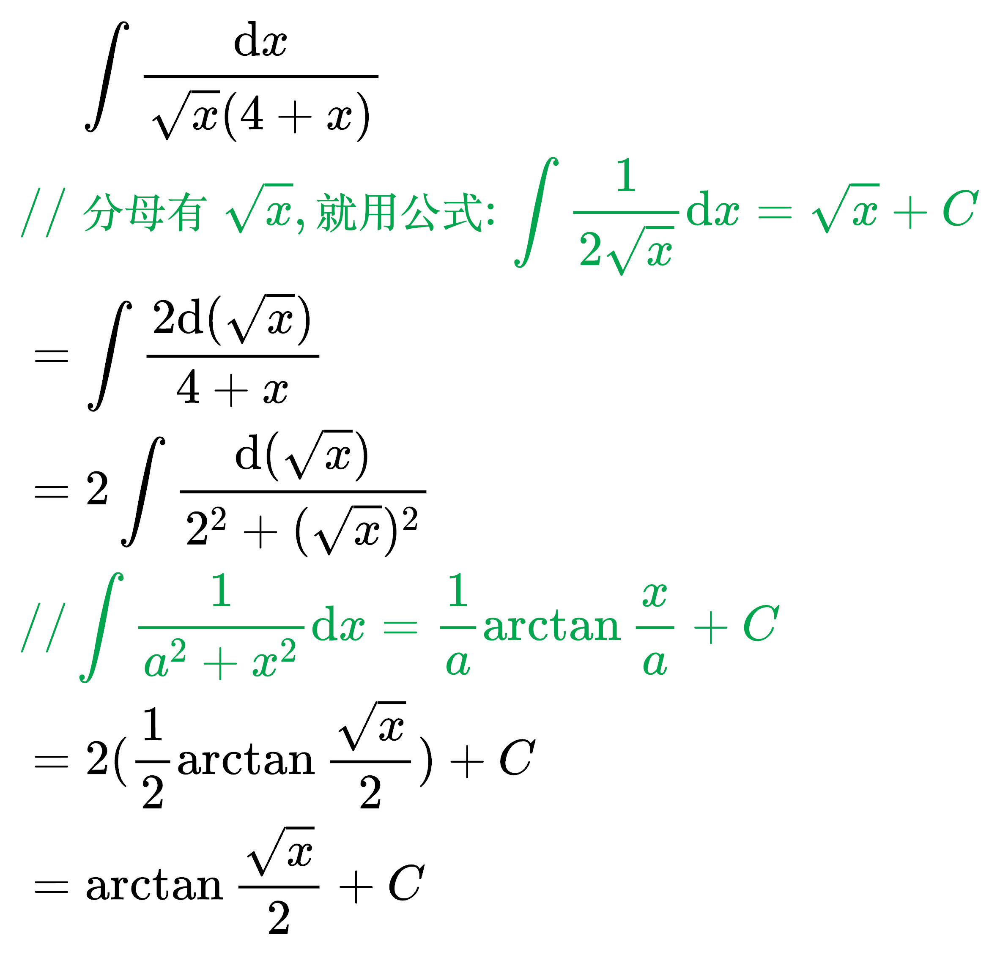
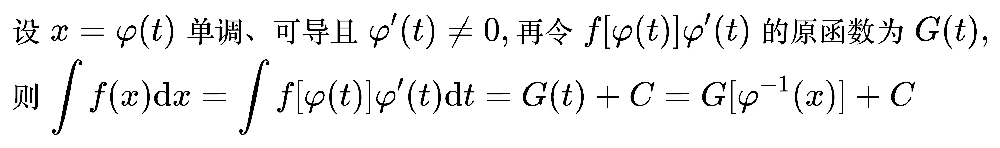
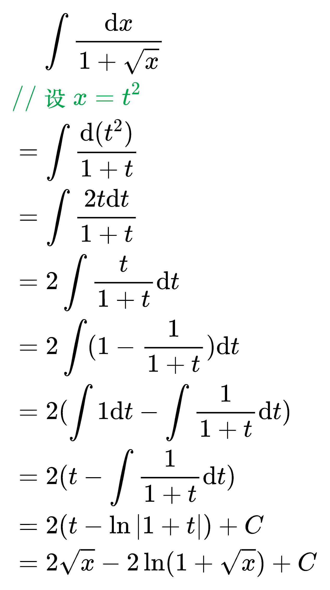

# 换元积分法

<!--
\mathrm{d}f(x) = f'(x)\mathrm{d}x
-->

## 第一类换元积分法

例题 1

<!--
\begin{align}
& \;\;\;\; \int \frac{1}{\sqrt{a^2 - x^2}} \mathrm{d}x \\
& {\color{Green} // 提出一个 a^2 } \\
& = \int \frac{1}{a \sqrt{1 - (\frac{x}{a})^2}} \mathrm{d}x \\
& {\color{Green} // 把 \frac{1}{a} 放到 d 后面, 常数可以直接移动} \\
& = \int \frac{1}{\sqrt{1 - (\frac{x}{a})^2}} \mathrm{d}(\frac{x}{a}) \\
& {\color{Green} // 把 \frac{x}{a} 看成一个整体} \\
& = \arcsin \frac{x}{a} + C \\
\end{align}
-->

例题 2

<!--
\begin{align}
& \;\;\;\; \int \frac{x + 1}{x^2 + 2x + 3} \mathrm{d}x \\
& {\color{Green} // 分子提出来一个 \frac{1}{2}} \\
& = \frac{1}{2} \int \frac{2x + 2}{x^2 + 2x + 3} \mathrm{d}x \\
& {\color{Green} // 把 2x + 2 放到 d 后面} \\
& = \frac{1}{2} \int \frac{1}{x^2 + 2x + 3} \mathrm{d}(x^2 + 2x) \\
& {\color{Green} // d 后面可以随意加减常数, 给它 +3 和分母一致} \\
& = \frac{1}{2} \int \frac{1}{x^2 + 2x + 3} \mathrm{d}(x^2 + 2x + 3) \\
& {\color{Green} // 把 x^2 + 2x + 3 看成一个整体} \\
& = \frac{1}{2} \ln | x^2 + 2x + 3 | + C \\
& {\color{Green} //  x^2 + 2x + 3 > 0} \\
& = \frac{1}{2} \ln (x^2 + 2x + 3) + C \\
\end{align}
-->

例题 3

<!--
\begin{align}
& \;\;\;\; \int \frac{x^2}{\sqrt{x^3 + 1}} \mathrm{d}x \\
& {\color{Green} // 把 x^2 放到 d 后面} \\
& = \int \frac{1}{\sqrt{x^3 + 1}} \mathrm{d}(\frac{1}{3} x^3) \\
& {\color{Green} // 把 \frac{1}{3} 拿到外面} \\
& = \frac{1}{3} \int \frac{1}{\sqrt{x^3 + 1}} \mathrm{d}(x^3) \\
& {\color{Green} // d 后面可以随意加减常数, 给它 +1 和分母一致} \\
& = \frac{1}{3} \int \frac{1}{\sqrt{x^3 + 1}} \mathrm{d}(x^3 + 1) \\
& {\color{Green} // 把 x^3 + 1 看成一个整体,}  \\
& {\color{Green} // 凑成公式: \int \frac{1}{2 \sqrt{x}} \mathrm{d}x = \sqrt{x} + C}  \\
& = \frac{2}{3} \int \frac{1}{2 \sqrt{x^3 + 1}} \mathrm{d}(x^3 + 1) \\
& = \frac{2}{3} \sqrt{x^3 + 1} + C \\
\end{align}
-->

例题 4

<!--
\begin{align}
& \;\;\;\; \int \frac{x}{4 + x^4} \mathrm{d}x \\
& {\color{Green} // 把 x 放到 d 后面} \\
& = \frac{1}{2} \int \frac{1}{4 + x^4} \mathrm{d}(x^2) \\
& {\color{Green} // 把分母的 x 写成和 d 后面的 x 一样} \\
& = \frac{1}{2} \int \frac{1}{2^2 + (x^2)^2} \mathrm{d}(x^2) \\
& {\color{Green} // 把 x^2 看成一个整体,}  \\
& {\color{Green} // 使用公式: \int \frac{1}{a^2 + x^2} \mathrm{d}x = \frac{1}{a} \arctan \frac{x}{a} + C}  \\
& = \frac{1}{4} \arctan \frac{x^2}{2} + C \\
\end{align}
-->

例题 5

<!--
\begin{align}
& \;\;\;\; \int \frac{\mathrm{d}x}{\sqrt{x} (1 + x)} \\
& {\color{Green} // 凑成公式: \int \frac{1}{2 \sqrt{x}} \mathrm{d}x = \sqrt{x} + C} \\
& = 2 \int \frac{\mathrm{d}x}{2 \sqrt{x} (1 + x)} \\
& {\color{Green} // 把\frac{1}{2 \sqrt{x}} 放到 d 后面} \\
& = 2 \int \frac{\mathrm{d}(\sqrt{x})}{1 + x} \\
& {\color{Green} // 凑成公式: \int \frac{1}{1 + x^2} \mathrm{d}x = \arctan x + C}  \\
& = 2 \int \frac{\mathrm{d}(\sqrt{x})}{1 + (\sqrt{x})^2} \\
& {\color{Green} // 把 \sqrt{x} 看成一个整体}  \\
& = 2 \arctan \sqrt{x} + C \\
\end{align}
-->

例题 6

<!--
\begin{align}
& \;\;\;\; \int \frac{\tan ^2 \sqrt{x}}{\sqrt{x}} \mathrm{d}x \\
& {\color{Green} // 凑成公式: \int \frac{1}{2 \sqrt{x}} \mathrm{d}x = \sqrt{x} + C} \\
& = 2 \int \frac{\tan ^2 \sqrt{x}}{2\sqrt{x}} \mathrm{d}x \\
& {\color{Green} // 把\frac{1}{2 \sqrt{x}} 放到 d 后面} \\
& = 2 \int (\tan ^2 \sqrt{x}) \mathrm{d}(\sqrt{x}) \\
& {\color{Green} // 三角恒等式: \tan ^{2} x + 1 = \sec ^{2} x}  \\
& = 2 \int (\sec ^{2} \sqrt{x} - 1) \mathrm{d}(\sqrt{x}) \\
& = 2 \int (\sec ^{2} \sqrt{x}) \mathrm{d}(\sqrt{x}) - 2 \int 1 \mathrm{d}(\sqrt{x}) \\
& {\color{Green} // (\tan x)' = \sec^{2} x}  \\
& = 2 \tan \sqrt{x} - 2\sqrt{x} + C \\
\end{align}
-->

例题 7

<!--
\begin{align}
& \;\;\;\; \int \frac{e^x}{4 + e^{2x}} \mathrm{d}x \\
& {\color{Green} // 凑成公式: \int \frac{1}{a^2 + x^2} \mathrm{d}x = \frac{1}{a} \arctan \frac{x}{a} + C} \\
& = \int \frac{1}{2^2 + (e^{x})^2} \mathrm{d}(e^x) \\
& = \frac{1}{2} \arctan \frac{e^x}{2} + C \\
\end{align}
-->

例题 8

<!--
\begin{align}
& \;\;\;\; \int \frac{1}{1 + e^x} \mathrm{d}x \\
& {\color{Green} // 提取 e^x} \\
& = \int \frac{1}{e^x(e^{-x} + 1)} \mathrm{d}x \\
& = \int \frac{e^{-x}}{e^{-x} + 1} \mathrm{d}x \\
& {\color{Green} // e^{-x}放到 d 后面} \\
& = \int \frac{1}{e^{-x} + 1} \mathrm{d}(-e^{-x}) \\
& = - \int \frac{1}{e^{-x} + 1} \mathrm{d}(e^{-x}) \\
& {\color{Green} // d 后面可以随意加减常数, 给它 +1 和分母一致} \\
& = - \int \frac{1}{e^{-x} + 1} \mathrm{d}(e^{-x} + 1) \\
& = - \ln (e^{-x} + 1) + C \\
\end{align}
-->

例题 9

<!--
\begin{align}
& \;\;\;\; \int \frac{\sin x}{\sin x + \cos x} \mathrm{d}x \\
& {\color{Green} // 辅助角公式 a \sin x + b \cos x = \sqrt{a^2 + b^2} \sin (x + \arctan \frac{b}{a}), (a > 0)} \\
& {\color{Green} // 或者 a \sin x + b \cos x = \sqrt{a^2 + b^2} \cos (x - \arctan \frac{a}{b}), (b > 0)} \\
& = \int \frac{\sin x}{\sqrt{1^2 + 1^2} \cos (x - \arctan 1)} \mathrm{d}x \\
& {\color{Green} // \arctan 1 = \frac{\pi}{4}} \\
& = \frac{1}{\sqrt{2}} \int \frac{\sin x}{\cos (x - \frac{\pi}{4})} \mathrm{d}x \\
& = \frac{1}{\sqrt{2}} \int \frac{\sin [(x - \frac{\pi}{4}) + \frac{\pi}{4}]}{\cos (x - \frac{\pi}{4})} \mathrm{d}x \\
& = \frac{1}{\sqrt{2}} \int \frac{\sin [(x - \frac{\pi}{4}) + \frac{\pi}{4}]}{\cos (x - \frac{\pi}{4})} \mathrm{d}(x - \frac{\pi}{4}) \\
& {\color{Green} // 和差化积公式 \sin (a + b) = \sin a \cos b + \cos a \sin b} \\
& = \frac{1}{\sqrt{2}} \int \frac{\sin (x - \frac{\pi}{4}) \cos \frac{\pi}{4} + \cos (x - \frac{\pi}{4}) \sin \frac{\pi}{4}}{\cos (x - \frac{\pi}{4})} \mathrm{d}(x - \frac{\pi}{4}) \\
& {\color{Green} // \cos \frac{\pi}{4} = \sin \frac{\pi}{4} = \frac{1}{\sqrt{2}}} \\
& = \frac{1}{\sqrt{2}} \int \frac{\frac{1}{\sqrt{2}} [\sin (x - \frac{\pi}{4}) + \cos (x - \frac{\pi}{4})]}{\cos (x - \frac{\pi}{4})} \mathrm{d}(x - \frac{\pi}{4}) \\
& = \frac{1}{2} \int \frac{\sin (x - \frac{\pi}{4}) + \cos (x - \frac{\pi}{4})}{\cos (x - \frac{\pi}{4})} \mathrm{d}(x - \frac{\pi}{4}) \\
& = \frac{1}{2} \int \frac{\sin (x - \frac{\pi}{4})}{\cos (x - \frac{\pi}{4})} \mathrm{d}(x - \frac{\pi}{4}) + \frac{1}{2} \int \frac{\cos (x - \frac{\pi}{4})}{\cos (x - \frac{\pi}{4})} \mathrm{d}(x - \frac{\pi}{4}) \\
& = \frac{1}{2} \int \tan (x - \frac{\pi}{4}) \mathrm{d}(x - \frac{\pi}{4}) + \frac{1}{2} \int 1 \mathrm{d}(x - \frac{\pi}{4}) \\
& = \frac{1}{2} \int \tan (x - \frac{\pi}{4}) \mathrm{d}(x - \frac{\pi}{4}) + \frac{1}{2} (x - \frac{\pi}{4}) \\
& {\color{Green} // \int \tan x \mathrm{d}x = -\ln |\cos x| + C} \\
& = -\frac{1}{2} \ln |\cos (x - \frac{\pi}{4})| + \frac{1}{2} (x - \frac{\pi}{4}) + C \\
& {\color{Green} // \frac{1}{2} \times (- \frac{\pi}{4}) 是常数, 合并到 C 中} \\
& = -\frac{1}{2} \ln |\cos (x - \frac{\pi}{4})| + \frac{1}{2} x + C \\
\end{align}
-->

例题 10

<!--
\begin{align}
& \;\;\;\; \int \frac{\mathrm{d}x}{x^2 + 2x + 5} \\
& {\color{Green} // 分母没法因式分解, 使用配方} \\
& = \int \frac{\mathrm{d}x}{4 + (x + 1)^2} \\
& = \int \frac{\mathrm{d}x}{2^2 + (x + 1)^2} \\
& = \int \frac{\mathrm{d}(x + 1)}{2^2 + (x + 1)^2} \\
& {\color{Green} // \int \frac{1}{a^2 + x^2} \mathrm{d}x = \frac{1}{a} \arctan \frac{x}{a} + C} \\
& = \frac{1}{2} \arctan \frac{x + 1}{2} + C \\
\end{align}
-->

例题 11

<!--
\begin{align}
& \;\;\;\; \int \frac{\mathrm{d}x}{x^2 - x - 2} \\
& {\color{Green} // 分母可以因式分解} \\
& = \int \frac{\mathrm{d}x}{(x - 2)(x + 1)} \\
& {\color{Green} // 拆项, 并确保分子中没有x} \\
& = \int \frac{\frac{1}{3} [x + 1 - (x - 2)]}{(x - 2)(x + 1)} \mathrm{d}x \\
& = \frac{1}{3} \int \frac{1}{x - 2} - \frac{1}{x + 1} \mathrm{d}x \\
& = \frac{1}{3} (\int \frac{\mathrm{d}x}{x - 2} - \int \frac{\mathrm{d}x}{x + 1} ) \\
& = \frac{1}{3} [\int \frac{\mathrm{d}(x - 2)}{x - 2} - \int \frac{\mathrm{d}(x + 1)}{x + 1} ] \\
& = \frac{1}{3} (\ln |x - 2| - \ln |x + 1|) + C \\
& = \frac{1}{3} \ln |\frac{x - 2}{x + 1}| + C \\
\end{align}
-->

例题 12

<!--
\begin{align}
& \;\;\;\; \int \frac{\mathrm{d}x}{\sqrt{x} (4 + x)} \\
& {\color{Green} // 分母有 \sqrt{x}, 就用公式: \int \frac{1}{2 \sqrt{x}} \mathrm{d}x = \sqrt{x} + C} \\
& = \int \frac{2 \mathrm{d}(\sqrt{x})}{4 + x} \\
& = 2 \int \frac{\mathrm{d}(\sqrt{x})}{2^2 + (\sqrt{x})^2} \\
& {\color{Green} // \int \frac{1}{a^2 + x^2} \mathrm{d}x = \frac{1}{a} \arctan \frac{x}{a} + C} \\
& = 2(\frac{1}{2} \arctan \frac{\sqrt{x}}{2}) + C \\
& = \arctan \frac{\sqrt{x}}{2} + C \\
\end{align}
-->

例题 13

<!--
\begin{align}
& \;\;\;\; \int \frac{\mathrm{d}x}{x \ln ^2 x} \\
& {\color{Green} // \frac{1}{x} 放到 d 后面} \\
& = \int \frac{\mathrm{d}（\ln x）}{\ln ^2 x} \\
& = - \frac{1}{\ln x} + C \\
\end{align}
-->

## 第二类换元积分法

对于被积函数含平方和或平方差，或者被积函数为无理函数时，一般使用第二类换元积分法，即将 x 表示为一个含 t 的表达式。

<!--
\begin{align}
& 设 x = \varphi (t) 单调、可导且 \varphi '(t) \ne 0, 再令 f[\varphi (t)]\varphi '(t) 的原函数为 G(t), \\
& 则 \int f(x) \mathrm{d}x = \int f[\varphi (t)]\varphi '(t) \mathrm{d}t =
G(t) + C = G[\varphi ^{-1}(x)] + C \\
\end{align}
-->

被积函数是无理且无法积出来的情况, 需要通过第二类换元积分法把无理转换成有理

<!--
\begin{align}
& \;\;\;\; \int \frac{\mathrm{d}x}{1 + \sqrt{x}} \\
& {\color{Green} // 设 x = t^2} \\
& = \int \frac{\mathrm{d}(t^2)}{1 + t} \\
& = \int \frac{2t\mathrm{d}t}{1 + t} \\
& = 2 \int \frac{t}{1 + t} \mathrm{d}t \\
& = 2 \int (1 - \frac{1}{1 + t}) \mathrm{d}t \\
& = 2 (\int 1 \mathrm{d}t - \int \frac{1}{1 + t} \mathrm{d}t) \\
& = 2 (t - \int \frac{1}{1 + t} \mathrm{d}t) \\
& = 2 (t - \ln |1 + t|) + C \\
& = 2 \sqrt{x} - 2 \ln (1 + \sqrt{x}) + C \\
\end{align}
-->

