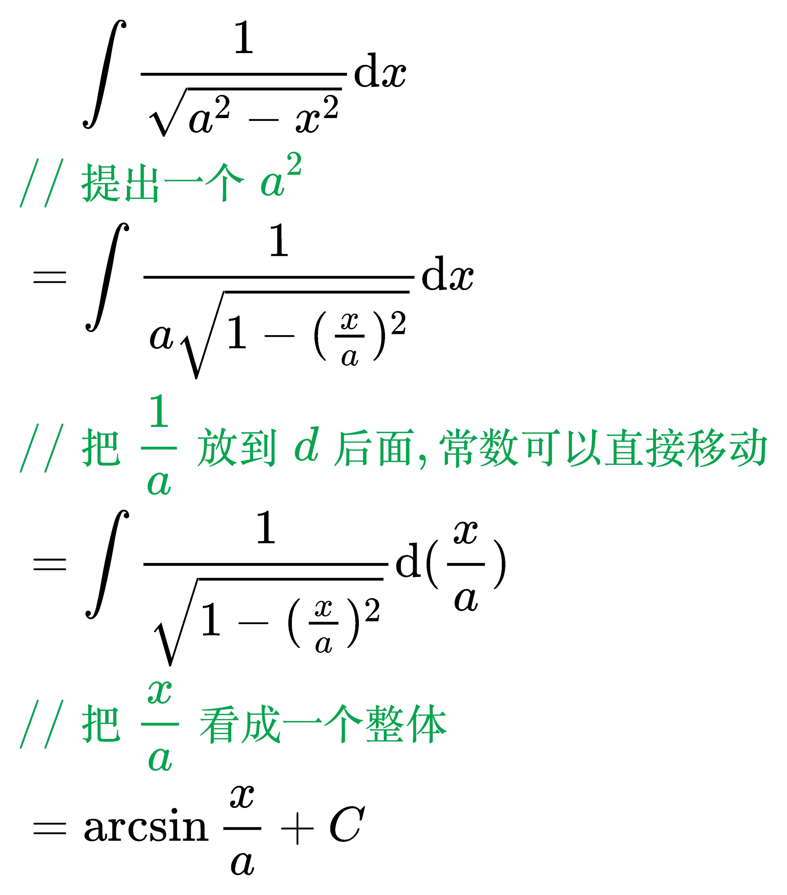
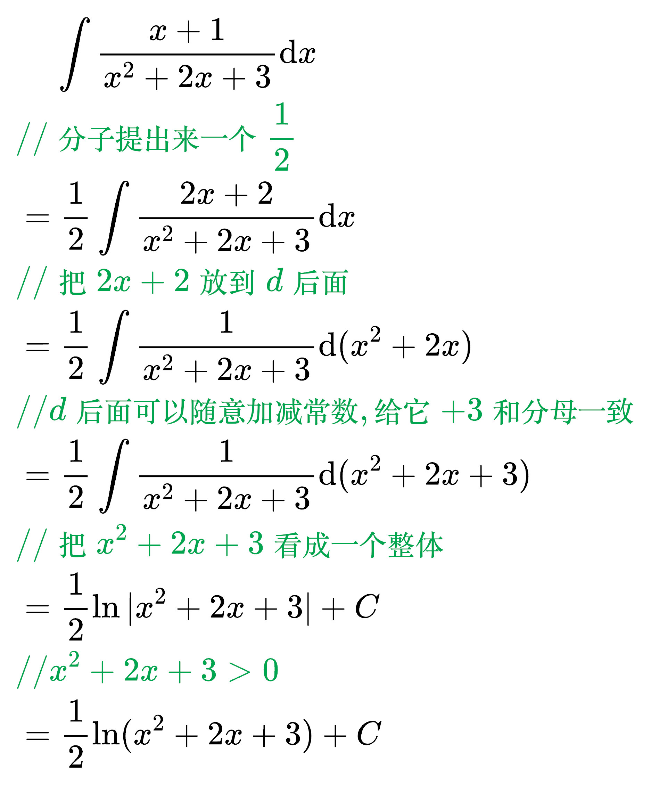
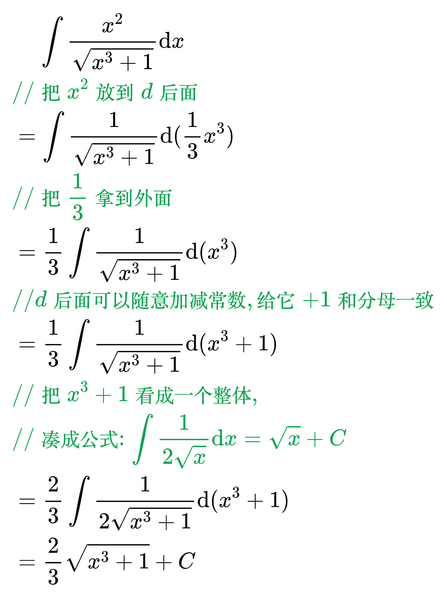

# 不定积分的积分法

<!--
\mathrm{d}f(x) = f'(x)\mathrm{d}x
-->

## 换元积分法

### 第一类换元积分法

例题 1

<!--
\begin{align}
& \;\;\;\; \int \frac{1}{\sqrt{a^2 - x^2}} \mathrm{d}x \\
& {\color{Green} // 提出一个 a^2 } \\
& = \int \frac{1}{a \sqrt{1 - (\frac{x}{a})^2}} \mathrm{d}x \\
& {\color{Green} // 把 \frac{1}{a} 放到 d 后面, 常数可以直接移动} \\
& = \int \frac{1}{\sqrt{1 - (\frac{x}{a})^2}} \mathrm{d}(\frac{x}{a}) \\
& {\color{Green} // 把 \frac{x}{a} 看成一个整体} \\
& = \arcsin \frac{x}{a} + C \\
\end{align}
-->

例题 2

<!--
\begin{align}
& \;\;\;\; \int \frac{x + 1}{x^2 + 2x + 3} \mathrm{d}x \\
& {\color{Green} // 分子提出来一个 \frac{1}{2}} \\
& = \frac{1}{2} \int \frac{2x + 2}{x^2 + 2x + 3} \mathrm{d}x \\
& {\color{Green} // 把 2x + 2 放到 d 后面} \\
& = \frac{1}{2} \int \frac{1}{x^2 + 2x + 3} \mathrm{d}(x^2 + 2x) \\
& {\color{Green} // d 后面可以随意加减常数, 给它 +3 和分母一致} \\
& = \frac{1}{2} \int \frac{1}{x^2 + 2x + 3} \mathrm{d}(x^2 + 2x + 3) \\
& {\color{Green} // 把 x^2 + 2x + 3 看成一个整体} \\
& = \frac{1}{2} \ln | x^2 + 2x + 3 | + C \\
& {\color{Green} //  x^2 + 2x + 3 > 0} \\
& = \frac{1}{2} \ln (x^2 + 2x + 3) + C \\
\end{align}
-->

例题 3

<!--
\begin{align}
& \;\;\;\; \int \frac{x^2}{\sqrt{x^3 + 1}} \mathrm{d}x \\
& {\color{Green} // 把 x^2 放到 d 后面} \\
& = \int \frac{1}{\sqrt{x^3 + 1}} \mathrm{d}(\frac{1}{3} x^3) \\
& {\color{Green} // 把 \frac{1}{3} 拿到外面} \\
& = \frac{1}{3} \int \frac{1}{\sqrt{x^3 + 1}} \mathrm{d}(x^3) \\
& {\color{Green} // d 后面可以随意加减常数, 给它 +1 和分母一致} \\
& = \frac{1}{3} \int \frac{1}{\sqrt{x^3 + 1}} \mathrm{d}(x^3 + 1) \\
& {\color{Green} // 把 x^3 + 1 看成一个整体,}  \\
& {\color{Green} // 凑成公式: \int \frac{1}{2 \sqrt{x}} \mathrm{d}x = \sqrt{x} + C}  \\
& = \frac{2}{3} \int \frac{1}{2 \sqrt{x^3 + 1}} \mathrm{d}(x^3 + 1) \\
& = \frac{2}{3} \sqrt{x^3 + 1} + C \\
\end{align}
-->

