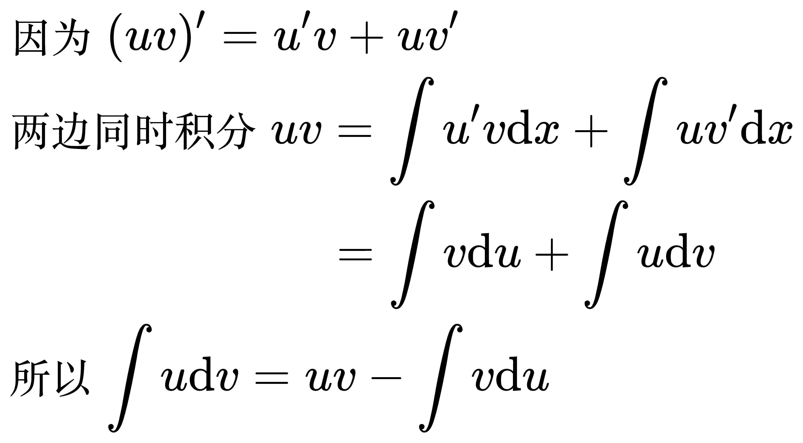
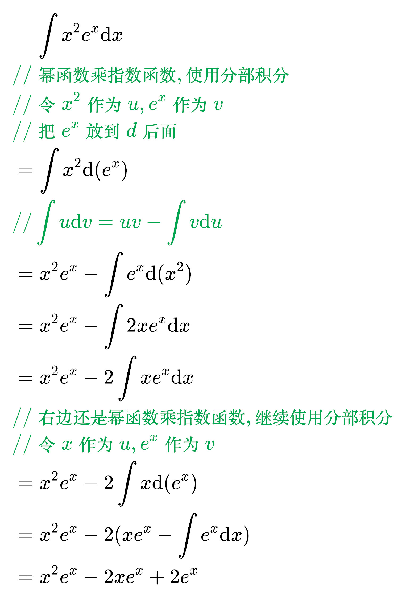
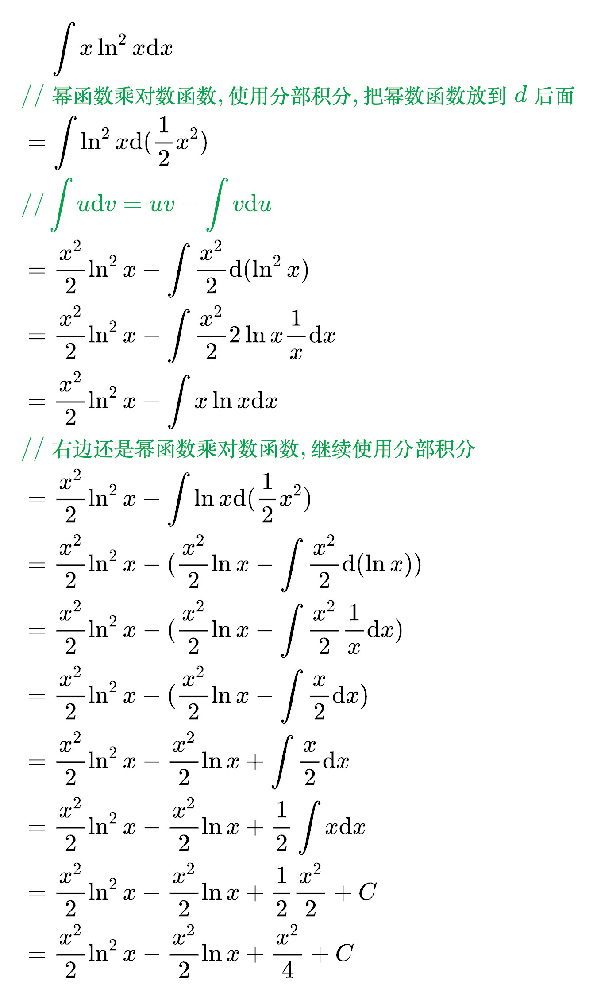
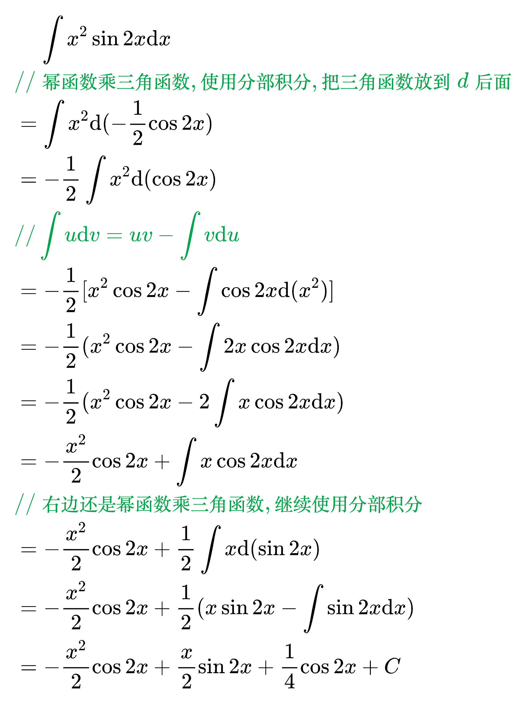
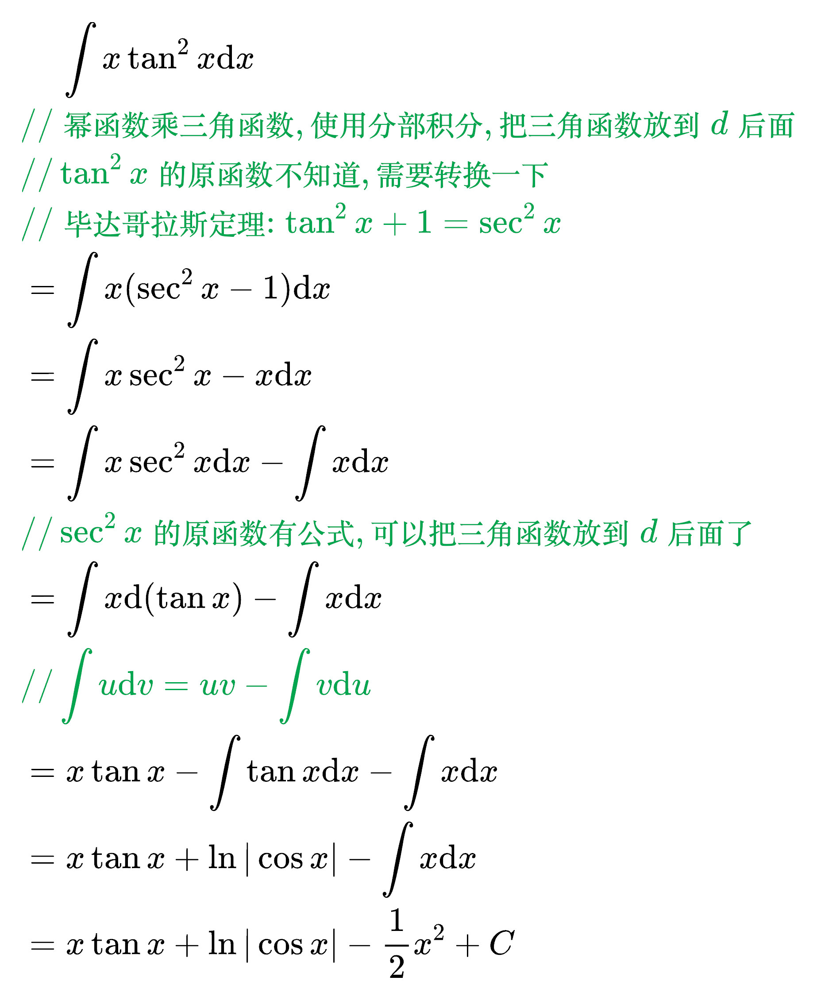
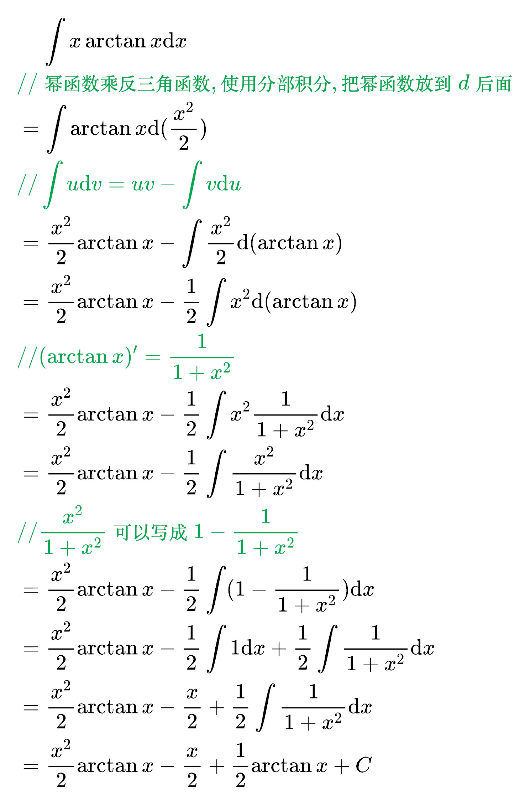
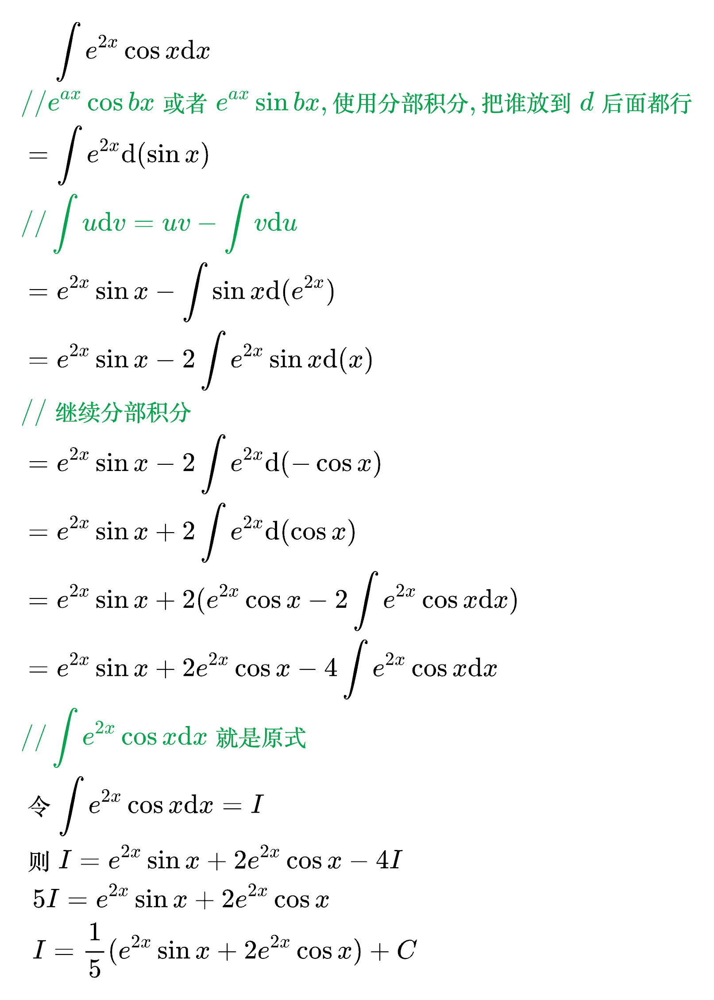

# 分部积分法

分部积分公式

<!--
\begin{align}
& 因为 (uv)' = u'v + uv' \\
& 两边同时积分 uv = \int u'v \mathrm{d}x + \int uv' \mathrm{d}x \\
& \qquad\qquad\qquad\,\,\,\, = \int v \mathrm{d}u + \int u \mathrm{d}v \\
& 所以 \int u \mathrm{d}v = uv - \int v \mathrm{d}u \\
\end{align}
-->

使用场景 1: 幂函数乘指数函数

<!--
\begin{align}
& \;\;\;\; \int x^2 e^x \mathrm{d}x \\
& {\color{Green} // 幂函数乘指数函数, 使用分部积分, 把指数函数放到 d 后面} \\
& {\color{Green} // 把 e^x 放到 d 后面} \\
& = \int x^2 \mathrm{d}(e^x) \\
& {\color{Green} // \int u \mathrm{d}v = uv - \int v \mathrm{d}u} \\
& = x^2 e^x - \int e^x \mathrm{d}(x^2) \\
& = x^2 e^x - \int 2xe^x \mathrm{d}x \\
& = x^2 e^x - 2 \int xe^x \mathrm{d}x \\
& {\color{Green} // 右边还是幂函数乘指数函数, 继续使用分部积分} \\
& = x^2 e^x - 2 \int x \mathrm{d}(e^x) \\
& = x^2 e^x - 2 (x e^x - \int e^x \mathrm{d}x) \\
& = x^2 e^x - 2 x e^x + 2 e^x + C \\
\end{align}
-->

使用场景 2: 幂函数乘对数函数

<!--
\begin{align}
& \;\;\;\; \int x \ln ^2 x \mathrm{d}x \\
& {\color{Green} // 幂函数乘对数函数, 使用分部积分, 把幂数函数放到 d 后面} \\
& = \int \ln ^2 x \mathrm{d}(\frac{1}{2} x^2) \\
& {\color{Green} // \int u \mathrm{d}v = uv - \int v \mathrm{d}u} \\
& = \frac{x^2}{2} \ln ^2 x - \int \frac{x^2}{2} \mathrm{d}(\ln ^2 x) \\
& = \frac{x^2}{2} \ln ^2 x - \int \frac{x^2}{2} 2 \ln x \frac{1}{x} \mathrm{d}x \\
& = \frac{x^2}{2} \ln ^2 x - \int x \ln x \mathrm{d}x \\
& {\color{Green} // 右边还是幂函数乘对数函数, 继续使用分部积分} \\
& = \frac{x^2}{2} \ln ^2 x - \int \ln x \mathrm{d}(\frac{1}{2} x^2) \\
& = \frac{x^2}{2} \ln ^2 x - (\frac{x^2}{2} \ln x - \int \frac{x^2}{2} \mathrm{d}(\ln x)) \\
& = \frac{x^2}{2} \ln ^2 x - (\frac{x^2}{2} \ln x - \int \frac{x^2}{2} \frac{1}{x} \mathrm{d}x) \\
& = \frac{x^2}{2} \ln ^2 x - (\frac{x^2}{2} \ln x - \int \frac{x}{2} \mathrm{d}x) \\
& = \frac{x^2}{2} \ln ^2 x - \frac{x^2}{2} \ln x + \int \frac{x}{2} \mathrm{d}x \\
& = \frac{x^2}{2} \ln ^2 x - \frac{x^2}{2} \ln x + \frac{1}{2} \int x \mathrm{d}x \\
& = \frac{x^2}{2} \ln ^2 x - \frac{x^2}{2} \ln x + \frac{1}{2} \frac{x^2}{2} + C \\
& = \frac{x^2}{2} \ln ^2 x - \frac{x^2}{2} \ln x + \frac{x^2}{4} + C \\
\end{align}
-->

使用场景 3: 幂函数乘三角函数

<!--
\begin{align}
& \;\;\;\; \int x^2 \sin 2x \mathrm{d}x \\
& {\color{Green} // 幂函数乘三角函数, 使用分部积分, 把三角函数放到 d 后面} \\
& = \int x^2 \mathrm{d}(- \frac{1}{2} \cos 2x) \\
& = - \frac{1}{2} \int x^2 \mathrm{d}(\cos 2x) \\
& {\color{Green} // \int u \mathrm{d}v = uv - \int v \mathrm{d}u} \\
& = - \frac{1}{2} [x^2 \cos2x - \int \cos 2x \mathrm{d}(x^2)] \\
& = - \frac{1}{2} (x^2 \cos2x - \int 2x \cos 2x \mathrm{d}x) \\
& = - \frac{1}{2} (x^2 \cos2x - 2\int x \cos 2x \mathrm{d}x) \\
& = - \frac{x^2}{2} \cos2x + \int x \cos 2x \mathrm{d}x \\
& {\color{Green} // 右边还是幂函数乘三角函数, 继续使用分部积分} \\
& = - \frac{x^2}{2} \cos2x + \frac{1}{2} \int x \mathrm{d}(\sin 2x) \\
& = - \frac{x^2}{2} \cos2x + \frac{1}{2} (x \sin 2x - \int \sin 2x \mathrm{d}x) \\
& = - \frac{x^2}{2} \cos2x + \frac{x}{2} \sin 2x + \frac{1}{4} \cos 2x + C \\
\end{align}
-->

<!--
\begin{align}
& \;\;\;\; \int x \tan ^2 x \mathrm{d}x \\
& {\color{Green} // 幂函数乘三角函数, 使用分部积分, 把三角函数放到 d 后面} \\
& {\color{Green} // \tan ^2 x 的原函数不知道, 需要转换一下} \\
& {\color{Green} // 毕达哥拉斯定理: \tan ^{2} x + 1 = \sec ^{2} x} \\
& = \int x (\sec ^2 x - 1) \mathrm{d}x \\
& = \int x \sec ^2 x - x \mathrm{d}x \\
& = \int x \sec ^2 x \mathrm{d}x - \int x \mathrm{d}x \\
& {\color{Green} // \sec ^2 x 的原函数有公式, 可以把三角函数放到 d 后面了} \\
& = \int x \mathrm{d}(\tan x) - \int x \mathrm{d}x \\
& {\color{Green} // \int u \mathrm{d}v = uv - \int v \mathrm{d}u} \\
& = x \tan x - \int \tan x \mathrm{d}x - \int x \mathrm{d}x \\
& = x \tan x + \ln |\cos x| - \int x \mathrm{d}x \\
& = x \tan x + \ln |\cos x| - \frac{1}{2} x^2 + C \\
\end{align}
-->

使用场景 4: 幂函数乘反三角函数

<!--
\begin{align}
& \;\;\;\; \int x \arctan x \mathrm{d}x \\
& {\color{Green} // 幂函数乘反三角函数, 使用分部积分, 把幂函数放到 d 后面} \\
& = \int \arctan x \mathrm{d}(\frac{x^2}{2}) \\
& {\color{Green} // \int u \mathrm{d}v = uv - \int v \mathrm{d}u} \\
& = \frac{x^2}{2} \arctan x - \int \frac{x^2}{2} \mathrm{d}(\arctan x) \\
& = \frac{x^2}{2} \arctan x - \frac{1}{2} \int x^2 \mathrm{d}(\arctan x) \\
& {\color{Green} // (\arctan x)' = \frac{1}{1 + x^{2}}} \\
& = \frac{x^2}{2} \arctan x - \frac{1}{2} \int x^2 \frac{1}{1 + x^2} \mathrm{d}x \\
& = \frac{x^2}{2} \arctan x - \frac{1}{2} \int \frac{x^2}{1 + x^2} \mathrm{d}x \\
& {\color{Green} // \frac{x^2}{1 + x^2} 可以写成 1 - \frac{1}{1 + x^2}} \\
& = \frac{x^2}{2} \arctan x - \frac{1}{2} \int (1 - \frac{1}{1 + x^2}) \mathrm{d}x \\
& = \frac{x^2}{2} \arctan x - \frac{1}{2} \int 1 \mathrm{d}x + \frac{1}{2} \int \frac{1}{1 + x^2} \mathrm{d}x \\
& = \frac{x^2}{2} \arctan x - \frac{x}{2} + \frac{1}{2} \int \frac{1}{1 + x^2} \mathrm{d}x \\
& = \frac{x^2}{2} \arctan x - \frac{x}{2} + \frac{1}{2} \arctan x + C \\
\end{align}
-->

使用场景 5: eaxcosbx 或者 eaxsinbx

<!--
\begin{align}
& \;\;\;\; \int e^{2x} \cos x \mathrm{d}x \\
& {\color{Green} // e^{ax} \cos bx 或者 e^{ax} \sin bx, 使用分部积分, 把谁放到 d 后面都行} \\
& = \int e^{2x} \mathrm{d}(\sin x) \\
& {\color{Green} // \int u \mathrm{d}v = uv - \int v \mathrm{d}u} \\
& = e^{2x} \sin x - \int \sin x \mathrm{d}(e^{2x}) \\
& = e^{2x} \sin x - 2 \int e^{2x} \sin x \mathrm{d}(x) \\
& {\color{Green} // 继续分部积分} \\
& = e^{2x} \sin x - 2 \int e^{2x} \mathrm{d}(- \cos x) \\
& = e^{2x} \sin x + 2 \int e^{2x} \mathrm{d}(\cos x) \\
& = e^{2x} \sin x + 2 (e^{2x} \cos x - 2 \int e^{2x} \cos x \mathrm{d}x) \\
& = e^{2x} \sin x + 2 e^{2x} \cos x - 4 \int e^{2x} \cos x \mathrm{d}x \\
& {\color{Green} // \int e^{2x} \cos x \mathrm{d}x 就是原式} \\
& 令 \int e^{2x} \cos x \mathrm{d}x = I \\
& 则 I = e^{2x} \sin x + 2 e^{2x} \cos x - 4 I \\
& \;\, 5 I = e^{2x} \sin x + 2 e^{2x} \cos x \\
& \;\, I = \frac{1}{5} (e^{2x} \sin x + 2 e^{2x} \cos x) + C \\
\end{align}
-->

