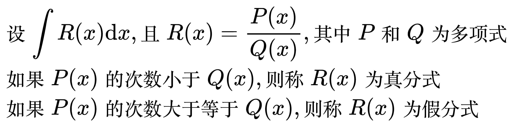
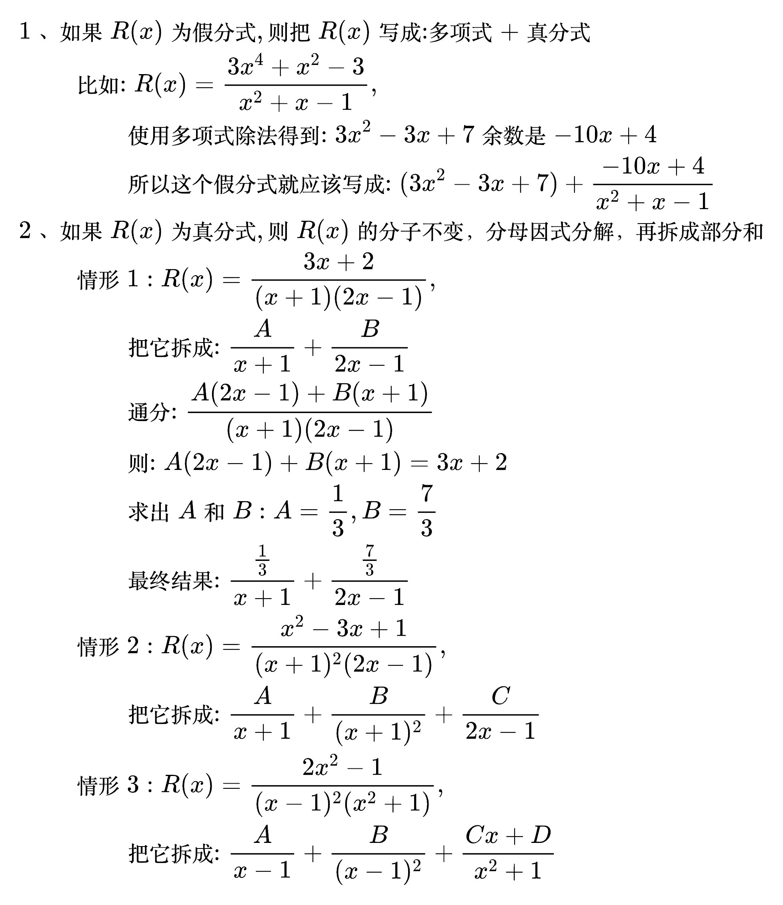

# 两类特殊函数的不定积分

## 有理函数的不定积分

<!--
\begin{align}
& 设 \int R(x) \mathrm{d}x, 且 R(x) = \frac{P(x)}{Q(x)}, 其中 P 和 Q 为多项式 \\
& 如果 P(x) 的次数小于 Q(x), 则称 R(x) 为真分式 \\
& 如果 P(x) 的次数大于等于 Q(x), 则称 R(x) 为假分式 \\
\end{align}
-->

多项式除法(每一次都要消掉最大次项):

计算有理函数的不定积分的步骤

<!--
\begin{align}
& \;\, 1、如果 R(x) 为假分式, 则把 R(x) 写成: 多项式 + 真分式 \\
& \;\, \qquad 比如: R(x) = \frac{3x^4 + x^2 - 3}{x^2 + x - 1}, \\
& \;\, \qquad\qquad 使用多项式除法得到: 3x^2 - 3x + 7 余数是 -10x + 4 \\
& \;\, \qquad\qquad 所以这个假分式就应该写成: (3x^2 - 3x + 7) + \frac{-10x + 4}{x^2 + x - 1} \\
& \;\, 2、如果 R(x) 为真分式, 则 R(x) 的分子不变，分母因式分解，再拆成部分和 \\
& \;\, \qquad 情形1: R(x) = \frac{3x + 2}{(x + 1)(2x - 1)}, \\
& \;\, \qquad\qquad 把它拆成: \frac{A}{x + 1} + \frac{B}{2x - 1} \\
& \;\, \qquad\qquad 通分: \frac{A(2x - 1) + B(x + 1)}{(x + 1)(2x - 1)} \\
& \;\, \qquad\qquad 则: A(2x - 1) + B(x + 1) = 3x + 2 \\
& \;\, \qquad\qquad 求出 A 和 B: A = \frac{1}{3}, B = \frac{7}{3}  \\
& \;\, \qquad\qquad 最终结果: \frac{\frac{1}{3}}{x + 1} + \frac{\frac{7}{3}}{2x - 1} \\
& \;\, \qquad 情形2: R(x) = \frac{x^2 - 3x + 1}{(x + 1)^2 (2x - 1)}, \\
& \;\, \qquad\qquad 把它拆成: \frac{A}{x + 1} + \frac{B}{(x + 1)^2} + \frac{C}{2x - 1} \\
& \;\, \qquad 情形3: R(x) = \frac{2x^2 - 1}{(x - 1)^2 (x^2 + 1)}, \\
& \;\, \qquad\qquad 把它拆成: \frac{A}{x - 1} + \frac{B}{(x - 1)^2} + \frac{Cx + D}{x^2 + 1} \\
\end{align}
-->

