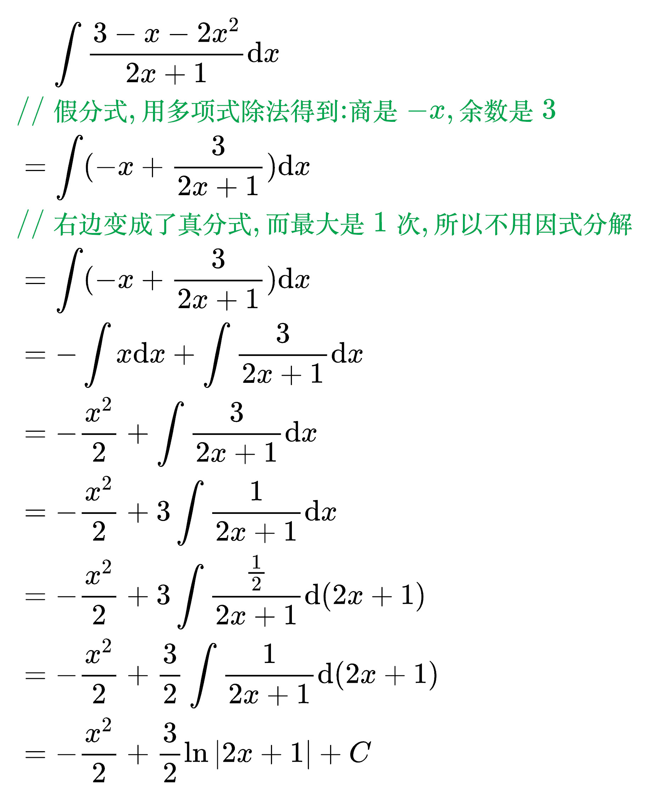
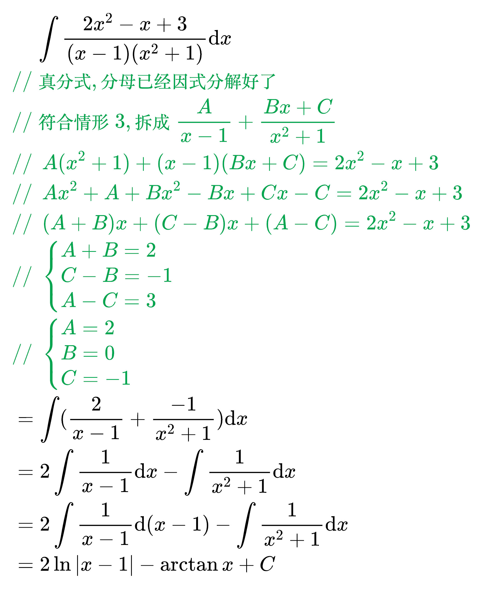

# 两类特殊函数的不定积分

## 有理函数的不定积分

<!--
\begin{align}
& 设 \int R(x) \mathrm{d}x, 且 R(x) = \frac{P(x)}{Q(x)}, 其中 P 和 Q 为多项式 \\
& 如果 P(x) 的次数小于 Q(x), 则称 R(x) 为真分式 \\
& 如果 P(x) 的次数大于等于 Q(x), 则称 R(x) 为假分式 \\
\end{align}
-->

多项式除法(每一次都要消掉最大次项, 一直除到余数的最大次数比除数低为止):

计算有理函数的不定积分的步骤

<!--
\begin{align}
& \;\, 1、如果 R(x) 为假分式, 则把 R(x) 写成: 多项式 + 真分式 \\
& \;\, \qquad 比如: R(x) = \frac{3x^4 + x^2 - 3}{x^2 + x - 1}, \\
& \;\, \qquad\qquad 使用多项式除法得到: 3x^2 - 3x + 7 余数是 -10x + 4 \\
& \;\, \qquad\qquad 所以这个假分式就应该写成: (3x^2 - 3x + 7) + \frac{-10x + 4}{x^2 + x - 1} \\
& \;\, 2、如果 R(x) 为真分式, 则 R(x) 的分子不变，分母因式分解，再拆成部分和 \\
& \;\, \qquad 情形1: R(x) = \frac{3x + 2}{(x + 1)(2x - 1)}, \\
& \;\, \qquad\qquad 把它拆成: \frac{A}{x + 1} + \frac{B}{2x - 1} \\
& \;\, \qquad\qquad 通分: \frac{A(2x - 1) + B(x + 1)}{(x + 1)(2x - 1)} \\
& \;\, \qquad\qquad 则: A(2x - 1) + B(x + 1) = 3x + 2 \\
& \;\, \qquad\qquad 求出 A 和 B: A = \frac{1}{3}, B = \frac{7}{3}  \\
& \;\, \qquad\qquad 最终结果: \frac{\frac{1}{3}}{x + 1} + \frac{\frac{7}{3}}{2x - 1} \\
& \;\, \qquad 情形2: R(x) = \frac{x^2 - 3x + 1}{(x + 1)^2 (2x - 1)}, \\
& \;\, \qquad\qquad 把它拆成: \frac{A}{x + 1} + \frac{B}{(x + 1)^2} + \frac{C}{2x - 1} \\
& \;\, \qquad 情形3: R(x) = \frac{2x^2 - 1}{(x - 1)^2 (x^2 + 1)}, \\
& \;\, \qquad\qquad 把它拆成: \frac{A}{x - 1} + \frac{B}{(x - 1)^2} + \frac{Cx + D}{x^2 + 1} \\
\end{align}
-->

例题 1

<!--
\begin{align}
& \;\;\;\; \int \frac{3 - x - 2x^2}{2x + 1} \mathrm{d}x \\
& {\color{Green} // 假分式, 用多项式除法得到: 商是 -x, 余数是 3} \\
& = \int (-x + \frac{3}{2x + 1}) \mathrm{d}x \\
& {\color{Green} // 右边变成了真分式, 而最大是1次, 所以不用因式分解} \\
& = \int (-x + \frac{3}{2x + 1}) \mathrm{d}x \\
& = - \int x \mathrm{d}x + \int \frac{3}{2x + 1} \mathrm{d}x \\
& = - \frac{x^2}{2} + \int \frac{3}{2x + 1} \mathrm{d}x \\
& = - \frac{x^2}{2} + 3 \int \frac{1}{2x + 1} \mathrm{d}x \\
& = - \frac{x^2}{2} + 3 \int \frac{\frac{1}{2}}{2x + 1} \mathrm{d}(2x + 1) \\
& = - \frac{x^2}{2} + \frac{3}{2} \int \frac{1}{2x + 1} \mathrm{d}(2x + 1) \\
& = - \frac{x^2}{2} + \frac{3}{2} \ln |2x + 1| + C \\
\end{align}
-->

例题 2

<!--
\begin{align}
& \;\;\;\; \int \frac{5x - 8}{2x^2 - x - 1} \mathrm{d}x \\
& {\color{Green} // 真分式, 把分母因式分解} \\
& = \int \frac{5x - 8}{（x - 1）(2x + 1)} \mathrm{d}x \\
& {\color{Green} // 符合情形1, 拆成 \frac{A}{x - 1} + \frac{B}{2x + 1}} \\
& {\color{Green} // \;\, A(2x + 1) + B(x - 1) = 5x - 8} \\
& {\color{Green} // \;\, 2Ax + A + Bx - B = 5x - 8} \\
& {\color{Green} // \;\, (2A + B)x + (A - B) = 5x - 8} \\
& {\color{Green} // \;\, \begin{cases}
2A + B = 5 \\
A - B = -8
\end{cases}} \\
& {\color{Green} // \;\, \begin{cases}
A = -1 \\
B = 7
\end{cases}} \\
& = \int (\frac{-1}{x - 1} + \frac{7}{2x + 1}) \mathrm{d}x \\
& = - \int \frac{1}{x - 1} \mathrm{d}x + \int \frac{7}{2x + 1} \mathrm{d}x \\
& = - \int \frac{1}{x - 1} \mathrm{d}(x - 1) + \int \frac{7}{2x + 1} \mathrm{d}x \\
& = - \int \frac{1}{x - 1} \mathrm{d}(x - 1) + 7 \int \frac{1}{2x + 1} \mathrm{d}x \\
& = - \int \frac{1}{x - 1} \mathrm{d}(x - 1) + \frac{7}{2} \int \frac{1}{2x + 1} \mathrm{d}(2x + 1) \\
& = - \ln |x - 1| + \frac{7}{2} \ln |2x + 1| + C \\
\end{align}
-->

例题 3

<!--
\begin{align}
& \;\;\;\; \int \frac{2x^2 - x + 3}{(x - 1)(x^2 + 1)} \mathrm{d}x \\
& {\color{Green} // 真分式, 分母已经因式分解好了} \\
& {\color{Green} // 符合情形3, 拆成 \frac{A}{x - 1} + \frac{Bx + C}{x^2 + 1}} \\
& {\color{Green} // \;\, A(x^2 + 1) + (x - 1)(Bx + C) = 2x^2 - x + 3} \\
& {\color{Green} // \;\, Ax^2 + A + Bx^2 - Bx + Cx - C = 2x^2 - x + 3} \\
& {\color{Green} // \;\, (A + B)x + (C - B)x + (A - C) = 2x^2 - x + 3} \\
& {\color{Green} // \;\, \begin{cases}
A + B = 2 \\
C - B = -1 \\
A - C = 3
\end{cases}} \\
& {\color{Green} // \;\, \begin{cases}
A = 2 \\
B = 0 \\
C = -1
\end{cases}} \\
& = \int (\frac{2}{x - 1} + \frac{-1}{x^2 + 1}) \mathrm{d}x \\
& = 2 \int \frac{1}{x - 1} \mathrm{d}x - \int \frac{1}{x^2 + 1} \mathrm{d}x \\
& = 2 \int \frac{1}{x - 1} \mathrm{d}(x - 1) - \int \frac{1}{x^2 + 1} \mathrm{d}x \\
& = 2 \ln |x - 1| - \arctan x + C \\
\end{align}
-->

例题 4

<!--
\begin{align}
& \;\;\;\; \int \frac{1}{x^2 + x + 1} \mathrm{d}x \\
\end{align}
-->
