# 无穷小与无穷大

## 无穷小

<!--
\begin{align}
& f(x) 在 x = a 的去心邻域内有定义, \\
& 如果 \lim_{x \to a} f(x) = 0, 则称: \\
& f(x) 在 x \to a 时为无穷小。 \\
\end{align}
-->

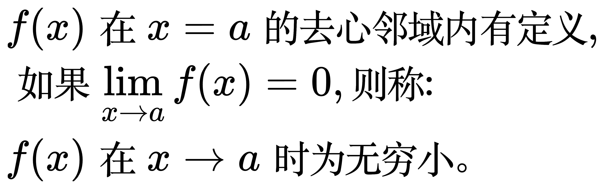

<!--
\begin{align}
& (1) & 0是无穷小, 是唯一的一个与自变量趋向无关的无穷小 \\
& (2) & 一个非0的函数是不是无穷小, 与自变量的趋向有关, \\
& & 比如 f(x) = \left ( x - 1 \right ) ^{2}, 只有当 x \to 1 时才是无穷小 \\
\end{align}
-->

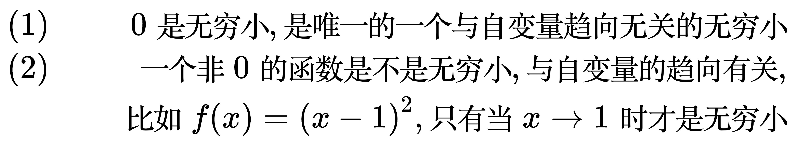

## 无穷小的比较

<!--
\begin{align}
& 当 x \to x_{0} 时, \alpha (x) \to 0, \beta (x) \to 0 \\
& \; (1) \;\;\;\; 若 \lim_{x \to x_{0}} \frac{\beta (x)}{\alpha (x)} = 0,
即 \beta (x) 靠近 0 的速度比 \alpha (x) 更快, 则称 \beta (x) 为 \alpha (x) 的高阶无穷小,
记为 \beta (x) = o \left ( \alpha (x) \right )  \\
& \; (2) \;\;\;\; 若 \lim_{x \to x_{0}} \frac{\beta (x)}{\alpha (x)} = k \ne 0 \ne \infty,
即 \beta (x) 和 \alpha (x) 是倍数关系, 则称 \beta (x) 为 \alpha (x) 的同阶无穷小,
记为 \beta (x) = O \left ( \alpha (x) \right )  \\
& \; (3) \;\;\;\; 若 \lim_{x \to x_{0}} \frac{\beta (x)}{\alpha (x)} = 1,
则称 \beta (x) 和 \alpha (x) 为等价无穷小(一种特殊的同阶无穷小) \\
\end{align}
-->

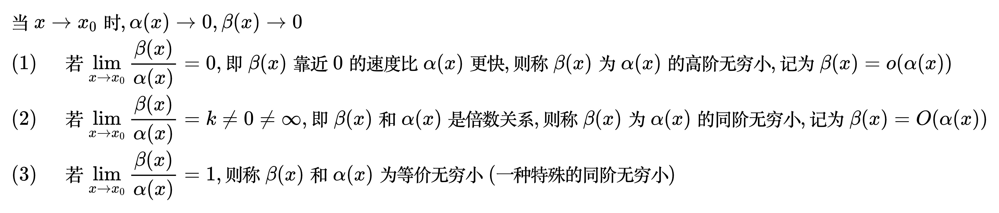

## 无穷大

<!--
\begin{align}
& f(x) 在 x = a 的去心邻域内有定义, \\
& 如果对任意(要多大有多大)的 M \gt 0, \\
& 当 0 \lt | x - a| \lt \delta 时, |f(x)| \ge M \\
& 则称: f(x) 在 x \to a 时为无穷大。 \\
\\
& 另一种表示方法: 如果 \lim_{x \to a} \frac{1}{f(x)} = 0 \\
& 则称: f(x) 在 x \to a 时为无穷大, 即无穷小的倒数。 \\
\end{align}
-->

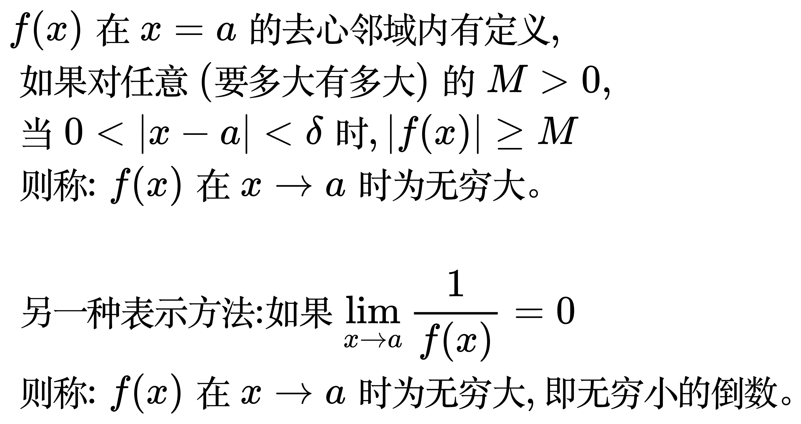

1. 两个无穷大之积仍为无穷大
2. 两个无界函数/数列之积不一定是无界函数/数列, 比如: 两个无界数列 `1, 0, 3, 0, 5, ...` 和 `0, 2, 0, 4, 0, ...` 的积是有界的

## 无穷小的一般性质

<!--
\begin{align}
& 1. 有限个无穷小进行加减、相乘, 结果还是无穷小 \\
& 2. 一个常数和无穷小相乘, 结果还是无穷小 \\
& 3. 有界函数乘以无穷小, 结果还是无穷小，比如: \lim_{x \to 0} x^{2} \sin \frac{1}{x} = 0 \\
& 4. 极限与无穷小的关系: \lim_{x \to a} f(x) = A 的充要条件是 f(x) = A + \alpha(x), 其中 \alpha(x) 是无穷小 \\
\end{align}
-->

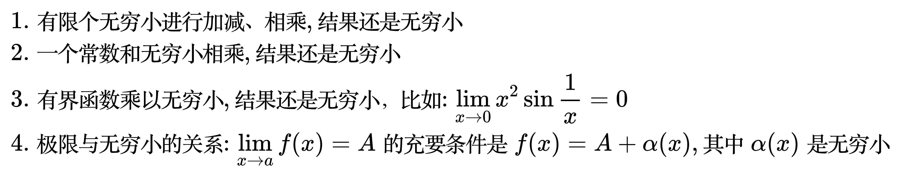

证明第 4 条:

<!--
\begin{align}
& 1. 证明: \lim_{x \to a} f(x) = A \Rightarrow f(x) = A + \alpha(x), 其中 \alpha(x) 是无穷小 \\
\\
& 根据极限的定义, 对任意的 \varepsilon \gt 0, 总存在 \delta \gt 0, 当 x \in \mathring{U}(a,\delta) 时, \\
& |f(x) - A| \lt \varepsilon \\
& f(x) = A + f(x) - A, 令 \alpha (x) = f(x) - A, \\
& 由于 |f(x) - A| \lt \varepsilon, 所以 |\alpha (x)| \lt \varepsilon \Rightarrow |\alpha (x) - 0| \lt \varepsilon \\
& 即 \lim_{x \to a} \alpha(x) = 0 \Rightarrow \alpha(x)是无穷小 \\
\\
& 2. 证明: f(x) = A + \alpha(x), 其中 \alpha(x) 是无穷小 \Rightarrow \lim_{x \to a} f(x) = A \\
\\
& f(x) = A + \alpha(x) 两边同时取极限: \lim_{x \to a} f(x) = \lim_{x \to a} \left [ A + \alpha (x) \right ] \\
& \lim_{x \to a} f(x) = \lim_{x \to a} A + \lim_{x \to a} \alpha (x) \\
& \;\;\;\;\;\;\;\;\;\;\;\;\;\, = A + 0  \\
& \;\;\;\;\;\;\;\;\;\;\;\;\;\, = A \\
\end{align}
-->

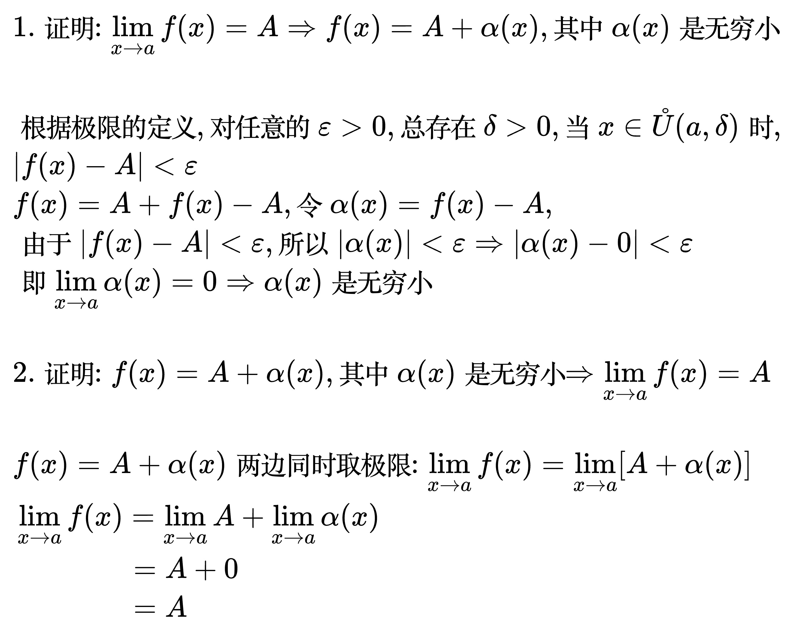

例题:

<!--
\begin{align}
& 设 \lim_{x \to a} f(x) = A, \lim_{x \to a} g(x) = B, 证明: \\
& \qquad (1) \lim_{x \to a} \left [ f(x) \pm g(x) \right ] = A \pm B \\
& \qquad (1) \lim_{x \to a} \left [ f(x) \cdot g(x) \right ] = AB \\
\\
& 证明(1) \\
& \lim_{x \to a} f(x) = A  \Rightarrow f(x) = A + \alpha, (\alpha 是无穷小) \\
& \lim_{x \to a} g(x) = B  \Rightarrow g(x) = B + \beta, (\beta 是无穷小) \\
& f(x) \pm g(x) = (A \pm B) + (\alpha \pm \beta) \\
& 两边同时取极限: \lim_{x \to a} \left [ f(x) \pm g(x) \right ] =
\lim_{x \to a} \left [ (A \pm B) + (\alpha \pm \beta ) \right ] \\
& \qquad\qquad\qquad\qquad\qquad\qquad\quad\;\;\,
= \lim_{x \to a} (A \pm B) + \lim_{x \to a} (\alpha \pm \beta) \\
& \qquad\qquad\qquad\qquad\qquad\qquad\quad\;\;\,
= \lim_{x \to a} (A \pm B) + 0 \\
& \qquad\qquad\qquad\qquad\qquad\qquad\quad\;\;\,
= A \pm B \\
\\
& 证明(2) \\
& f(x) \cdot g(x) = (A + \alpha)(B + \beta) \\
& \qquad\qquad\;\, = AB + A\beta + B\alpha + \beta\alpha \\
& 两边同时取极限: \lim_{x \to a} \left [  f(x) \cdot g(x) \right ] =
\lim_{x \to a} (AB + A\beta + B\alpha + \beta\alpha) \\
& \qquad\qquad\qquad\qquad\qquad\qquad\;\;\,\,\,\,
= \lim_{x \to a} (AB) + \lim_{x \to a} (A\beta + B\alpha + \beta\alpha) \\
& \qquad\qquad\qquad\qquad\qquad\qquad\;\;\,\,\,\,
// 常数乘无穷小还是无穷小 \\
& \qquad\qquad\qquad\qquad\qquad\qquad\;\;\,\,\,\,
= \lim_{x \to a} (AB) + 0 \\
& \qquad\qquad\qquad\qquad\qquad\qquad\;\;\,\,\,\,
= AB \\
\end{align}
-->

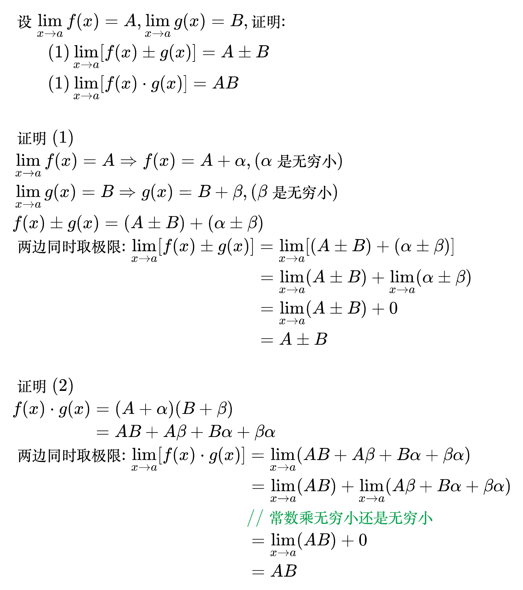

## 无穷小的等价性质

<!--
\begin{align}
& 设 \alpha \to 0, \beta \to 0, \gamma \to 0, 则: \\
& \quad (1) \alpha \sim \alpha \qquad (\sim 表示等价无穷小) \\
& \quad (2) 若 \alpha \sim \beta, 则 \beta \sim \alpha \\
& \quad (2) 若 \alpha \sim \beta, \beta \sim \gamma, 则 \alpha \sim \gamma \\
\end{align}
-->

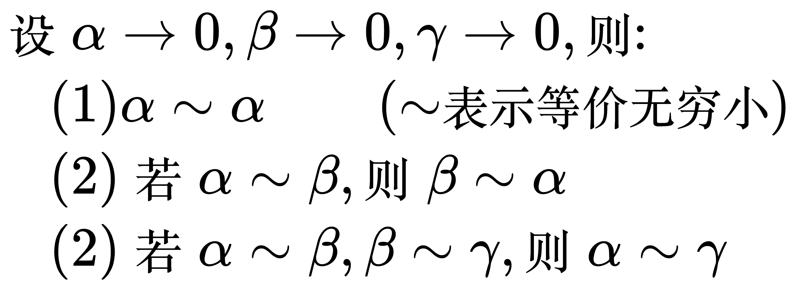

<!--
\begin{align}
& 若 \alpha \sim \alpha_{1}, \beta \sim \beta_{1}, 且 \lim \frac{\beta}{\alpha} = A 则: \\
& \quad \lim \frac{\beta_{1}}{\alpha_{1}} = A \\
\end{align}
-->

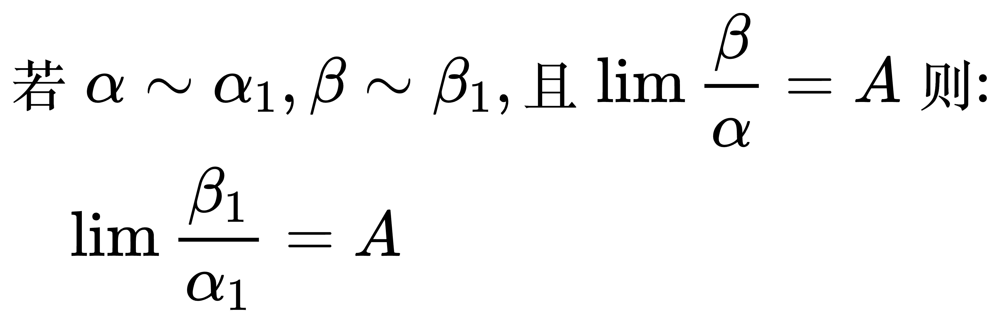

证明:

<!--
\begin{align}
& \frac{\beta}{\alpha} = \frac{\alpha_{1}}{\alpha} \frac{\beta_{1}}{\alpha_{1}} \frac{\beta}{\beta_{1}} \\
& \because \alpha \sim \alpha_{1} \quad \therefore \lim \frac{\alpha_{1}}{\alpha} = 1 \\
& \because \beta \sim \beta_{1} \quad \therefore \lim \frac{\beta}{\beta_{1}} = 1 \\
& \lim \frac{\beta}{\alpha} = \lim \frac{\alpha_{1}}{\alpha} \frac{\beta_{1}}{\alpha_{1}} \frac{\beta}{\beta_{1}} \\
& \quad\quad\;\;\; = \lim \frac{\beta_{1}}{\alpha_{1}} \\
\end{align}
-->

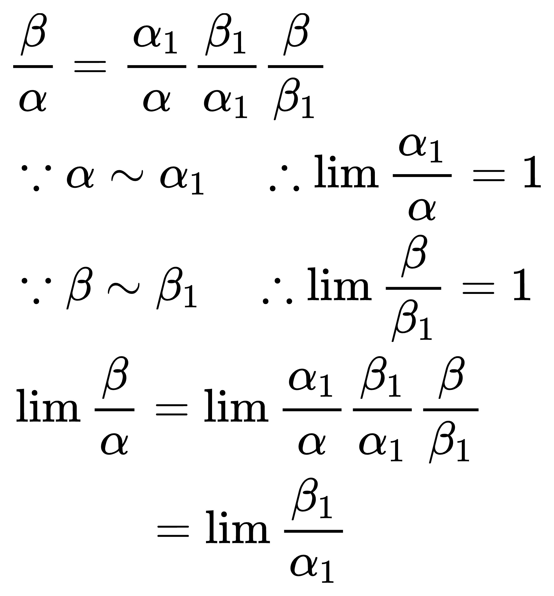

## x 趋于 0 时, 常用的等价无穷小

<!--
\begin{align}
& (1) \quad x \sim \sin x \sim \tan x \sim \arcsin x \sim \arctan x \sim e^{x} - 1 \sim \ln (1 + x) \\
& (2) \quad 1 - \cos x \sim \frac{1}{2} x^{2} \\
& (3) \quad (1 + x)^{a} - 1 \sim ax \\
\end{align}
-->

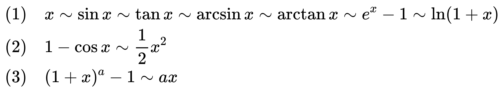
