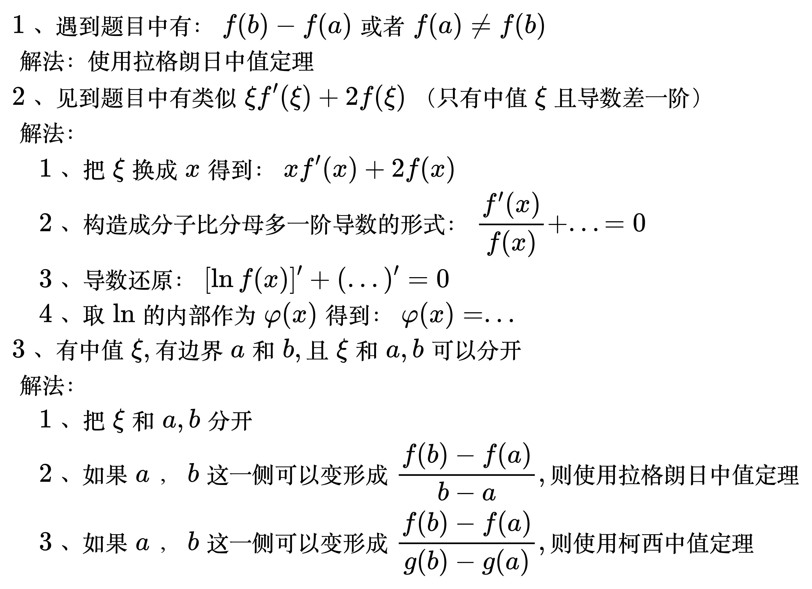
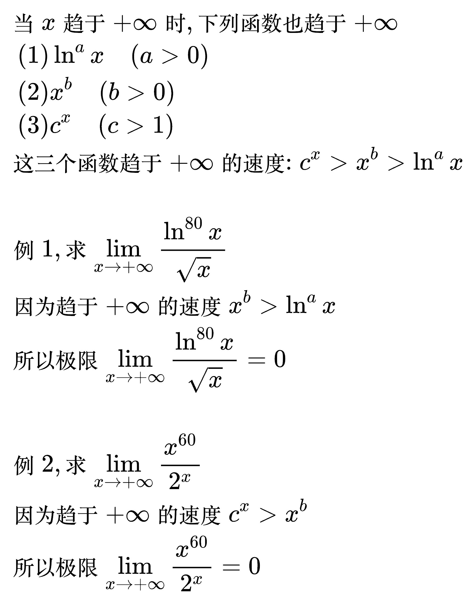
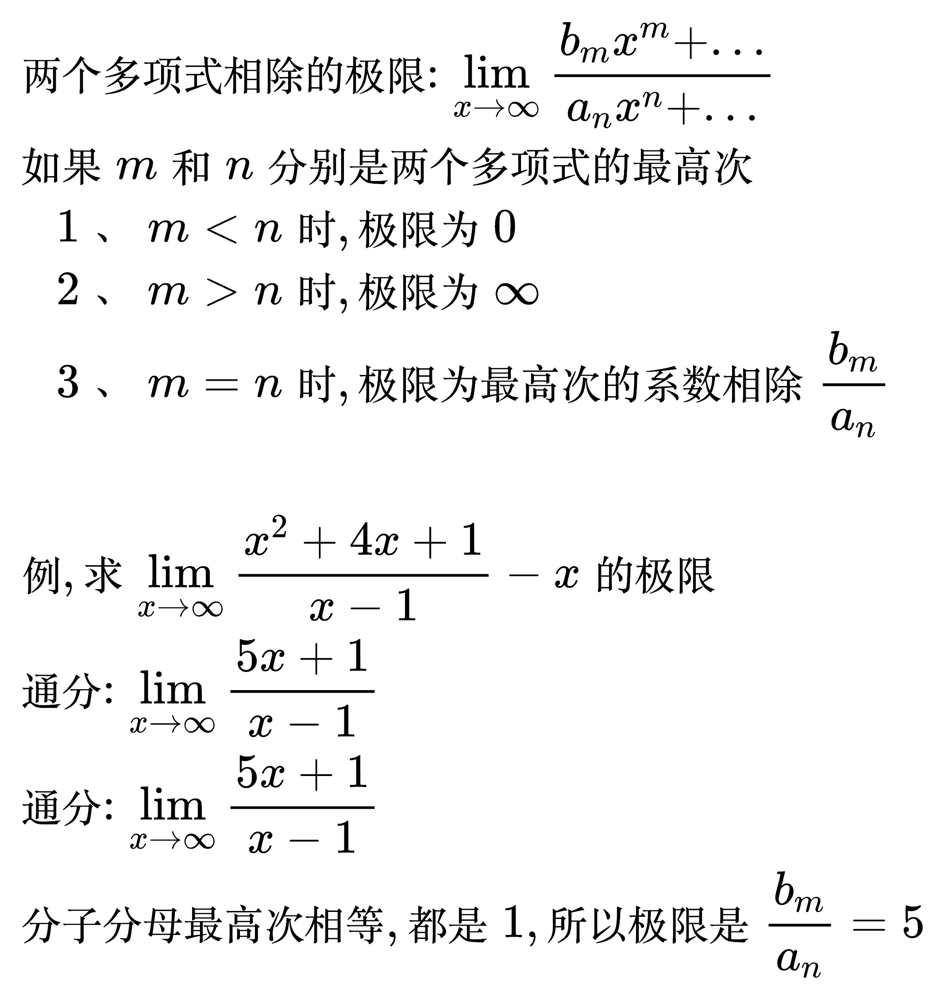
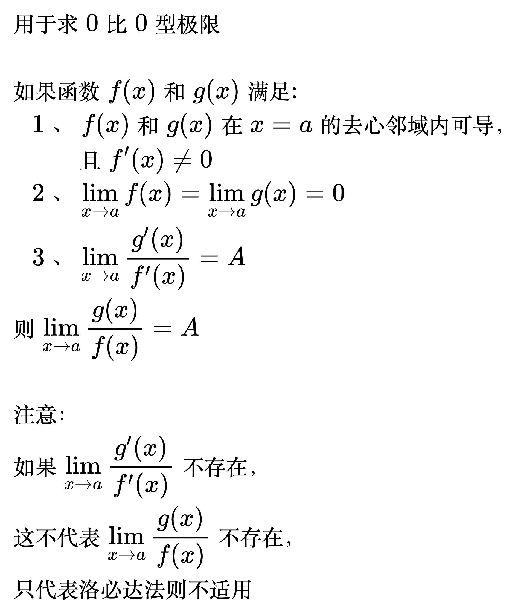
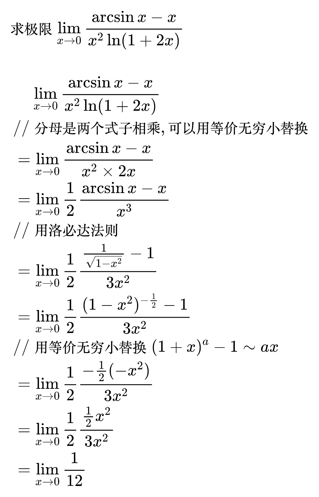
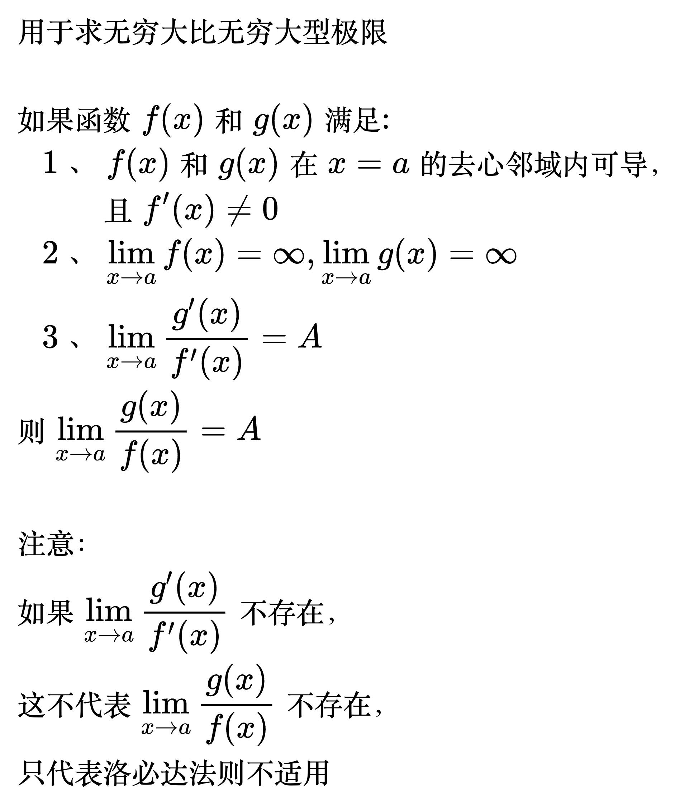
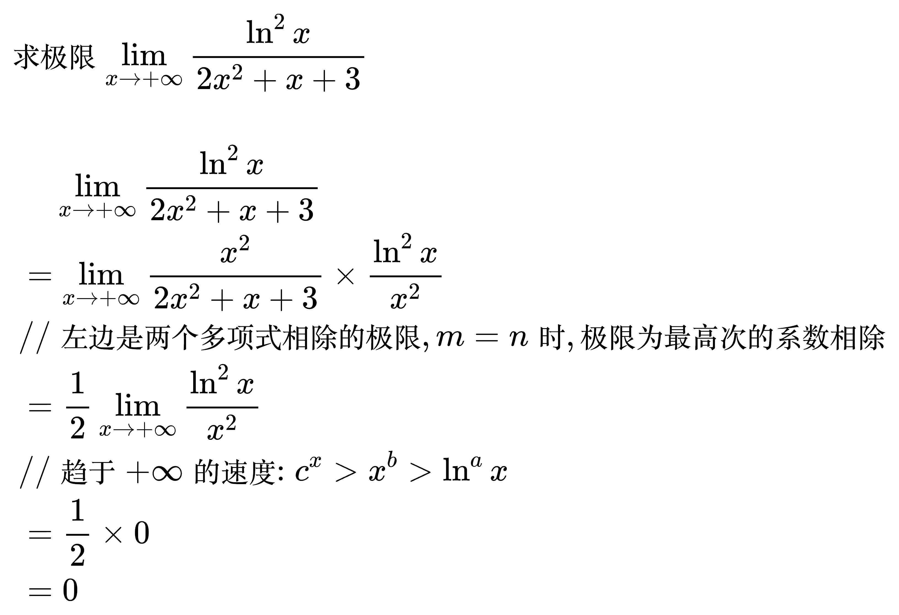

# 洛必达法则

<!--
\begin{align}
& (1) f(b) - f(a) 或者 f(a) \ne f(b), 解法: 使用拉格朗日 \\
& (2) 见到类似于 \xi f'(\xi) + 2f(\xi) 这种只有中值 \xi 且导数差一阶, 解法: \\
& \quad 1、 把 \xi 换成 x \Rightarrow x f'(x) + 2f(x) \\
& \quad 2、 构造成分子比分母多一阶导数的形式 \Rightarrow \frac{f'(x)}{f(x)} + ... = 0 \\
& \quad 3、 导数还原 \Rightarrow [\ln f(x)]' + (...)' = 0 \\
& \quad 4、 把两项合成一项, 取\ln 内部 作为 \varphi (x) \Rightarrow \varphi (x) = ... \\
& (3) 有中值 \xi, 有边界 a 和 b, 且 \xi 和 a, b 可以分开, 解法: \\
& \quad 1、 把 \xi 和 a, b 分开 \\
& \quad 2、 如果 a, b 这一侧可以变形成 \frac{f(b) - f(a)}{b - a}, 则使用拉格朗日定理 \\
& \quad 3、 如果 a, b 这一侧可以变形成 \frac{f(b) - f(a)}{g(b) - g(a)}, 则使用柯西定理 \\
\end{align}
-->

<!--
\begin{align}
& 当 x 趋于 +\infty 时, 下列函数也趋于 +\infty \\
& \;\, (1) \ln ^{a} x \quad (a > 0) \\
& \;\, (2) x^{b} \quad (b > 0) \\
& \;\, (3) c^{x} \quad (c > 1) \\
& 这三个函数趋于 +\infty 的速度: c^{x} > x^{b} > \ln ^{a} x \\
\\
& 例1, 求 \lim_{x \to + \infty} \frac{\ln ^{80} x}{\sqrt{x}} \\
& 因为趋于 +\infty 的速度 x^{b} > \ln ^{a} x \\
& 所以极限 \lim_{x \to + \infty} \frac{\ln ^{80} x}{\sqrt{x}} = 0 \\
\\
& 例2, 求 \lim_{x \to + \infty} \frac{x^{60}}{2^{x}} \\
& 因为趋于 +\infty 的速度 c^{x} > x^{b} \\
& 所以极限 \lim_{x \to + \infty} \frac{x^{60}}{2^{x}} = 0 \\
\end{align}
-->

<!--
\begin{align}
& 两个多项式相除的极限: \lim_{x \to \infty} \frac{b_{m}x^{m} + ...}{a_{n}x^{n} + ...} \\
& 如果 m 和 n 分别是两个多项式的最高次 \\
& \quad 1、 m < n 时, 极限为 0 \\
& \quad 2、 m > n 时, 极限为 \infty \\
& \quad 3、 m = n 时, 极限为最高次的系数相除 \frac{b_{m}}{a_{n}} \\
\\
& 例, 求 \lim_{x \to \infty} \frac{x^{2} + 4x + 1}{x - 1} - x 的极限 \\
& 通分: \lim_{x \to \infty} \frac{5x + 1}{x - 1} \\
& 通分: \lim_{x \to \infty} \frac{5x + 1}{x - 1} \\
& 分子分母最高次相等, 都是1, 所以极限是 \frac{b_{m}}{a_{n}} = 5 \\
\end{align}
-->

## 洛必达法则

### 定理 1

<!--
\begin{align}
& 如果函数 f(x) 和 g(x) 满足: \\
& \quad 1、 f(x) 和 g(x) 在 x = a 的去心邻域内可导, 且 f'(x) \ne 0 \\
& \quad 2、 \lim_{x \to a} f(x) = \lim_{x \to a} g(x) = 0 \\
& \quad 3、 \lim_{x \to a} \frac{g'(x)}{f'(x)} = A \\
& 则 \lim_{x \to a} \frac{g(x)}{f(x)} = A \\
\\
& 如果 \lim_{x \to a} \frac{g'(x)}{f'(x)} 不存在, 那么不代表 \lim_{x \to a} \frac{g(x)}{f(x)} 不存在 \\
& 只代表洛必达法则不适用 \\
\end{align}
-->

例题 1

<!--
\begin{align}
& 求极限 \lim_{x \to 0} \frac{\arcsin x - x}{x^{2} \ln (1 + 2x)} \\
\\
& \;\,\;\,\;\,\, \lim_{x \to 0} \frac{\arcsin x - x}{x^{2} \ln (1 + 2x)} \\
& \;\, // 分母是两个式子相乘, 可以用等价无穷小替换 \\
& \;\, = \lim_{x \to 0} \frac{\arcsin x - x}{x^{2} \times 2x} \\
& \;\, = \lim_{x \to 0} \frac{1}{2} \frac{\arcsin x - x}{x^{3}} \\
& \;\, // 用洛必达法则 \\
& \;\, = \lim_{x \to 0} \frac{1}{2} \frac{\frac{1}{\sqrt{1 - x^{2}}} - 1}{3x^{2}} \\
& \;\, = \lim_{x \to 0} \frac{1}{2} \frac{(1 - x^{2})^{- \frac{1}{2}} - 1}{3x^{2}} \\
& \;\, // 用等价无穷小替换 (1 + x)^{a} - 1 \sim ax \\
& \;\, = \lim_{x \to 0} \frac{1}{2} \frac{- \frac{1}{2}(-x^{2})}{3x^{2}} \\
& \;\, = \lim_{x \to 0} \frac{1}{2} \frac{\frac{1}{2}x^{2}}{3x^{2}} \\
& \;\, = \lim_{x \to 0} \frac{1}{12} \\
\end{align}
-->

### 定理 2

<!--
\begin{align}
& 如果函数 f(x) 和 g(x) 满足: \\
& \quad 1、 f(x) 和 g(x) 在 x = a 的去心邻域内可导, 且 f'(x) \ne 0 \\
& \quad 2、 \lim_{x \to a} f(x) = \infty, \lim_{x \to a} g(x) = \infty \\
& \quad 3、 \lim_{x \to a} \frac{g'(x)}{f'(x)} = A \\
& 则 \lim_{x \to a} \frac{g(x)}{f(x)} = A \\
\\
& 如果 \lim_{x \to a} \frac{g'(x)}{f'(x)} 不存在, 那么不代表 \lim_{x \to a} \frac{g(x)}{f(x)} 不存在 \\
& 只代表洛必达法则不适用 \\
\end{align}
-->

无穷大比无穷大型极限一般不用洛必达法则

例题 1

<!--
\begin{align}
& 求极限 \lim_{x \to + \infty} \frac{\ln ^{2} x}{2x^{2} + x + 3} \\
\\
& \;\,\;\,\;\,\, \lim_{x \to + \infty} \frac{\ln ^{2} x}{2x^{2} + x + 3} \\
& \;\, = \lim_{x \to + \infty} \frac{x^{2}}{2x^{2} + x + 3} \times \frac{\ln ^{2} x}{x^{2}} \\
& \;\, // 左边是两个多项式相除的极限, m = n 时, 极限为最高次的系数相除 \\
& \;\, = \frac{1}{2} \lim_{x \to + \infty} \frac{\ln ^{2} x}{x^{2}} \\
& \;\, // 趋于 +\infty 的速度: c^{x} > x^{b} > \ln ^{a} x \\
& \;\, = \frac{1}{2} \times 0 \\
& \;\, = 0 \\
\end{align}
-->

