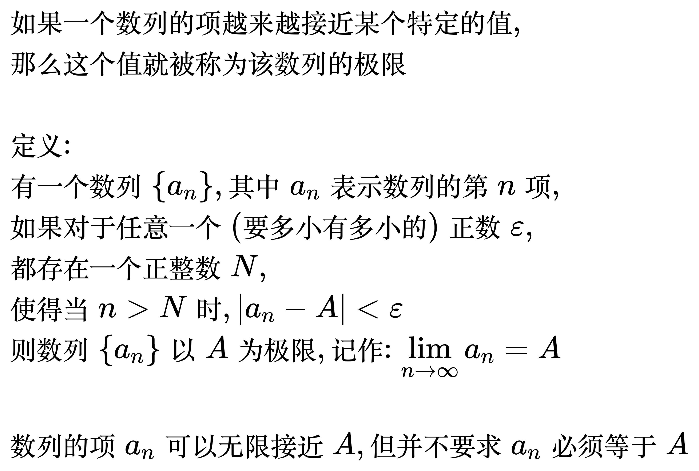
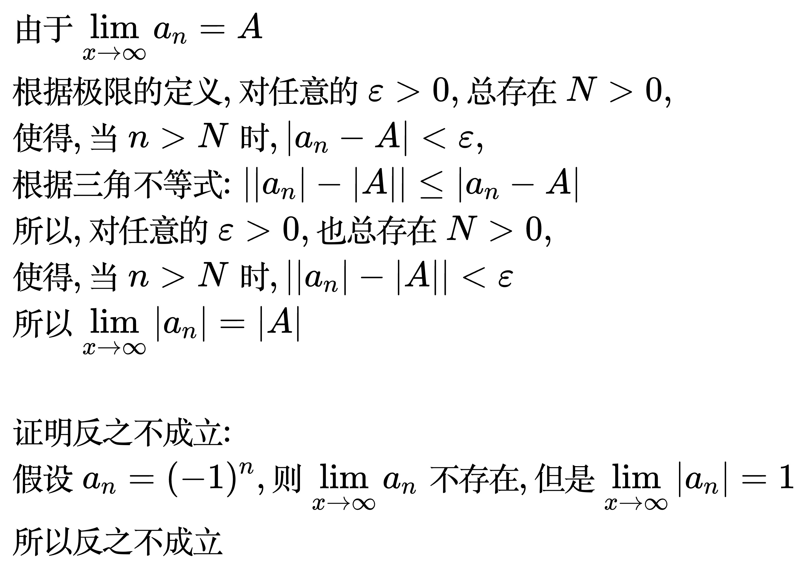
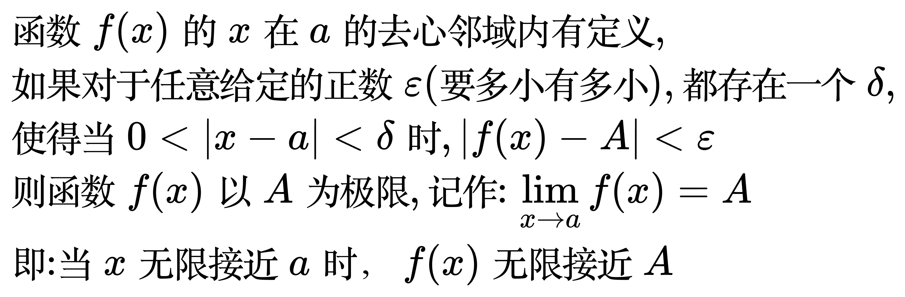
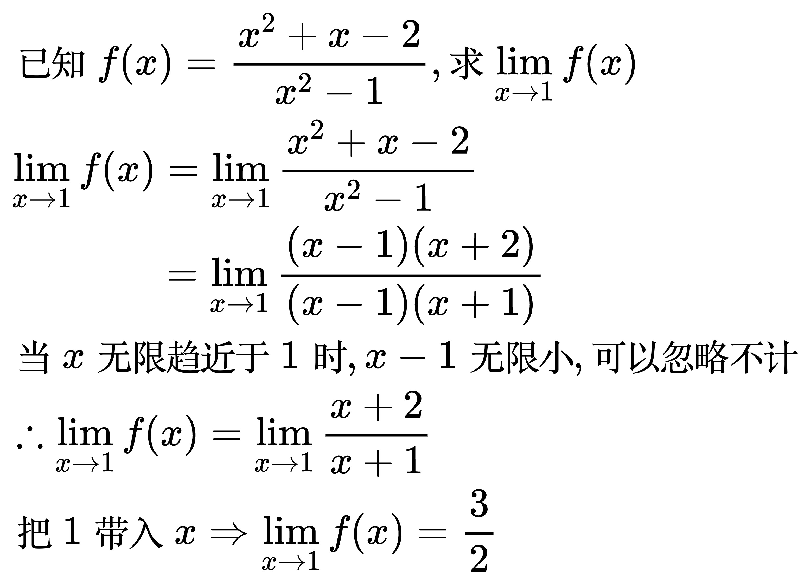
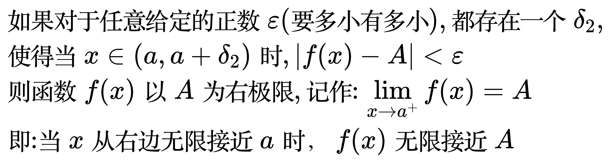
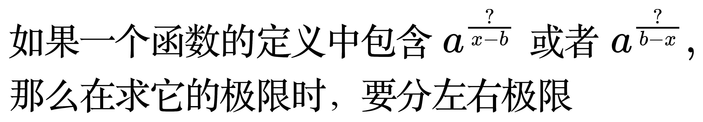

# 极限

## 数列的极限

如果一个数列的项越来越接近某个特定的值，那么这个值就被称为该数列的极限。

<!--
\begin{align}
& 有一个数列 \left \{ a_{n} \right \}, 其中a_{n} 表示数列的第n项 \\
& 如果对于任意给定的正数 \varepsilon (无论多小), 都存在一个正整数 N, \\
& 使得当 n \gt N 时, |a_{n} - A| \lt \varepsilon \\
& 则数列 \left \{ a_{n} \right \} 以 A 为极限, 记作: \lim_{n \to \infty} a_{n} = A \\
& 这个定义说明了数列的项a_{n}可以无限接近A，但并不要求a_{n}必须等于A \\
\end{align}
-->

<!--
\begin{align}
& 已知数列 \left \{ a_{n} \right \} 的极限为A, 证明: 数列 \left \{ |a_{n}| \right \} 的极限为 |A|, 反之不一定成立 \\
&\because \lim_{x \to \infty} a_{n} = A \\
& \therefore 根据极限的定义: \forall \varepsilon  \gt 0, 总 \exists N \gt 0, \\
& \;\;\, 使得, 当 n \gt N 时, |a_{n} - A| \lt \varepsilon \\
& 根据三角不等式: ||a_{n}| - |A|| \le |a_{n} - A| \\
& \therefore \forall \varepsilon  \gt 0, 总 \exists N \gt 0, \\
& \;\;\, 使得, 当 n \gt N 时, ||a_{n}| - |A|| \lt \varepsilon \\
& \therefore \lim_{x \to \infty} |a_{n}| = |A| \\
\\
& 假设 a_{n} = (-1)^{n}, 则 \lim_{x \to \infty} a_{n} 不存在, 但是 \lim_{x \to \infty} |a_{n}| = 1 \\
& \therefore 反之不成立 \\
\end{align}
-->

## 函数的极限

x 接近一个点时的极限:

<!--
\begin{align}
& 函数 f(x) 的 x 在 a 的去心邻域内有定义, \\
& 如果对于任意给定的正数 \varepsilon (要多小有多小), 都存在一个 \delta , \\
& 使得当 0 \lt |x - a| \lt \delta 时, |f(x) - A| \lt \varepsilon \\
& 则函数 f(x) 以 A 为极限, 记作: \lim_{x \to a} f(x) = A \\
& 即: 当 x 无限接近 a 时，f(x) 无限接近 A \\
\end{align}
-->

<!--
\begin{align}
& 已知 f(x) = \frac{x^{2} + x - 2}{x^{2} - 1}, 求 \lim_{x \to 1} f(x) \\
& \lim_{x \to 1} f(x) = \lim_{x \to 1} \frac{x^{2} + x - 2}{x^{2} - 1} \\
& \,\,\,\,\,\,\,\,\,\,\,\,\,\,\,\,\,\,\,\,\,\, = \lim_{x \to 1} \frac{(x - 1)(x + 2)}{(x - 1)(x + 1)} \\
& 当x无限趋近于1时, x - 1无限小, 可以忽略不计 \\
& \therefore \lim_{x \to 1} f(x) = \lim_{x \to 1} \frac{x + 2}{x + 1} \\
& 把1带入x \Rightarrow  \lim_{x \to 1} f(x) = \frac{3}{2} \\
\end{align}
-->

x 接近无穷时的极限:

<!--
\begin{align}
& 如果对于任意给定的正数 \varepsilon (要多小有多小), 都存在一个 X \gt 0 , \\
& 当 x \gt X 时, 有 |f(x) - A| \lt \varepsilon \\
& 则函数 f(x) 在 x \to +\infty 时以 A 为极限, 记作: \lim_{x \to +\infty} f(x) = A \\
\\
& 如果对于任意给定的正数 \varepsilon (要多小有多小), 都存在一个 X \gt 0 , \\
& 当 x \lt -X 时, 有 |f(x) - A| \lt \varepsilon \\
& 则函数 f(x) 在 x \to -\infty 时以 A 为极限, 记作: \lim_{x \to -\infty} f(x) = A \\
\\
& 如果对于任意给定的正数 \varepsilon (要多小有多小), 都存在一个 X \gt 0 , \\
& 当 |x| \gt X 时, 有 |f(x) - A| \lt \varepsilon \\
& 则函数 f(x) 在 x \to \infty 时以 A 为极限, 记作: \lim_{x \to \infty} f(x) = A \\
\end{align}
-->

## 左右极限

<!--
\begin{align}
& 如果对于任意给定的正数 \varepsilon (要多小有多小), 都存在一个 \delta_{1} , \\
& 使得当 x \in (a - \delta_{1}, a) 时, |f(x) - A| \lt \varepsilon \\
& 则函数 f(x) 以 A 为左极限, 记作: \lim_{x \to a^{-}} f(x) = A \\
& 即: 当 x 从左边无限接近 a 时，f(x) 无限接近 A \\
\end{align}
-->

<!--
\begin{align}
& 如果对于任意给定的正数 \varepsilon (要多小有多小), 都存在一个 \delta_{2} , \\
& 使得当 x \in (a, a + \delta_{2}) 时, |f(x) - A| \lt \varepsilon \\
& 则函数 f(x) 以 A 为右极限, 记作: \lim_{x \to a^{+}} f(x) = A \\
& 即: 当 x 从右边无限接近 a 时，f(x) 无限接近 A \\
\end{align}
-->

一个函数极限存在的充要条件是: 它的左右极限都存在且相等。

<!--
\begin{align}
& 如果一个函数的定义中包含 a^{\frac{?}{x - b}} 或者 a^{\frac{?}{b - x}}, \\
& 那么在求它的极限时，要分左右极限 \\
\end{align}
-->

<!--
\begin{align}
& 设 f(x) = \frac{1 - 2^{\frac{1}{x - 1}}}{1 + 2^{\frac{1}{x - 1}}}, 判断 \lim_{x \to 1}f(x) 是否存在: \\
\\
& f(x) 中包含 a^{\frac{?}{x - b}}, 所以要分左右极限 \\
\\
& 当 x \to 1^{-} 时 \Rightarrow  x - 1 \to 0^{-} \Rightarrow \frac{1}{x - 1} \to -\infty \\
& \Rightarrow 2^{\frac{1}{x - 1}} \to 0 \Rightarrow \lim_{x \to 1^{-}}f(x) = \frac{1}{1} = 1 \\
& 当 x \to 1^{+} 时 \Rightarrow  x - 1 \to 0^{+} \Rightarrow \frac{1}{x - 1} \to +\infty \\
& \Rightarrow 2^{\frac{1}{x - 1}} \to +\infty \Rightarrow \lim_{x \to 1^{+}}f(x) = \frac{-\infty}{+\infty} = -1 \\
& \because \lim_{x \to 1^{-}}f(x) \ne \lim_{x \to 1^{+}}f(x) \\
& \therefore \lim_{x \to 1}f(x) 不存在 \\
\end{align}
-->

