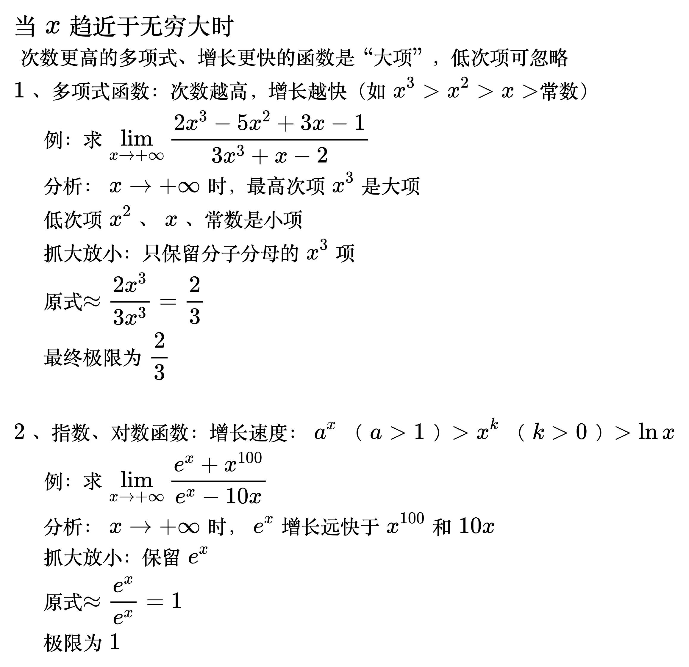
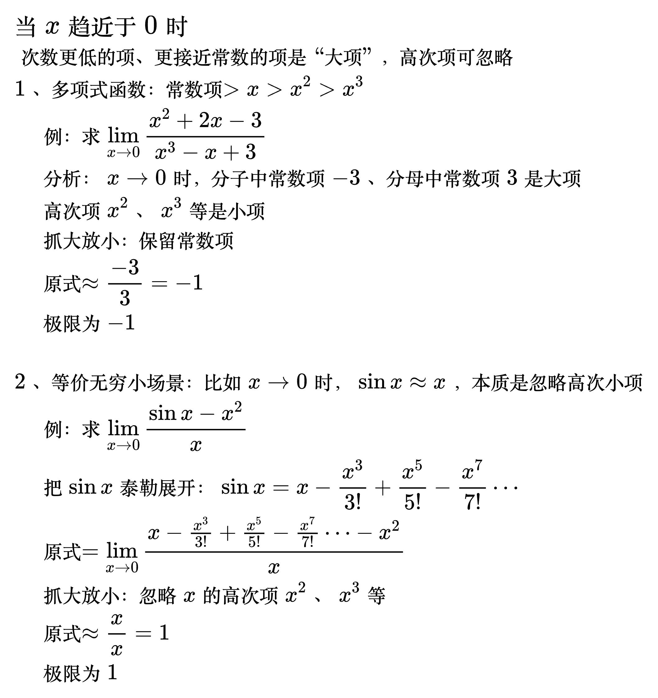

# 抓大放小

<!--
\begin{align}
& {\large 抓大放小的核心} \\
& 在自变量趋近于某个值（如\infty、0）时，\\
& 忽略表达式中“影响极小的次要项”，\\
& 只保留“主导极限结果的主要项” \\
\\
& {\large 判断标准} \\
& 看两项比值的极限：若 \lim\frac{小项}{大项}=0，则小项可忽略 \\
& 大项：当自变量趋近于目标值时，增长更快（或衰减更慢）、 \\
& \qquad\;\; 对表达式整体值起决定性作用的项 \\
& 小项：影响可忽略的项 \\
\end{align}
-->

## 自变量趋近于无穷

<!--
\begin{align}
& {\large 当 x 趋近于无穷大时} \\
& 次数更高的多项式、增长更快的函数是“大项”，低次项可忽略 \\
& 1、多项式函数：次数越高，增长越快（如 x^3 > x^2 > x > 常数） \\
& \quad 例：求 \lim_{x \to +\infty} \frac{2x^3 - 5x^2 + 3x - 1}{3x^3 + x - 2} \\
& \quad 分析：x\to+\infty 时，最高次项 x^3 是大项 \\
& \quad 低次项 x^2、x、常数 是小项 \\
& \quad 抓大放小：只保留分子分母的 x^3 项 \\
& \quad 原式≈\frac{2x^3}{3x^3} = \frac{2}{3} \\
& \quad 最终极限为 \frac{2}{3} \\
\\
& 2、指数、对数函数：增长速度：a^x（a>1）> x^k（k>0）> \ln x \\
& \quad 例：求 \lim_{x \to +\infty} \frac{e^x + x^{100}}{e^x - 10x} \\
& \quad 分析：x\to+\infty 时，e^x 增长远快于 x^{100} 和 10x \\
& \quad 抓大放小：保留 e^x \\
& \quad 原式≈\frac{e^x}{e^x} = 1 \\
& \quad 极限为 1 \\
\end{align}
-->

## 自变量趋近于零

<!--
\begin{align}
& {\large 当 x 趋近于 0 时} \\
& 次数更低的项、更接近常数的项是“大项”，高次项可忽略 \\
& 1、多项式函数：常数项 > x > x^2 > x^3 \\
& \quad 例：求 \lim_{x \to 0} \frac{x^2 + 2x - 3}{x^3 - x + 3} \\
& \quad 分析：x\to0 时，分子中常数项-3、分母中常数项3是大项 \\
& \quad 高次项 x^2、x^3 等是小项 \\
& \quad 抓大放小：保留常数项 \\
& \quad 原式≈\frac{-3}{3} = -1 \\
& \quad 极限为 -1 \\
\\
& 2、等价无穷小场景：比如 x\to0 时，\sin x ≈ x，本质是忽略高次小项 \\
& \quad 例：求 \lim_{x \to 0} \frac{\sin x - x^2}{x} \\
& \quad 把\sin x泰勒展开：\sin x = x-\frac{x^3}{3!}+\frac{x^5}{5!}-\frac{x^7}{7!}\cdots \\
& \quad 原式=\lim_{x \to 0} \frac{x-\frac{x^3}{3!}+\frac{x^5}{5!}-\frac{x^7}{7!}\cdots - x^2}{x} \\
& \quad 抓大放小：忽略x的高次项 x^2、x^3 等 \\
& \quad 原式≈\frac{x}{x} = 1 \\
& \quad 极限为 1 \\
\end{align}
-->

