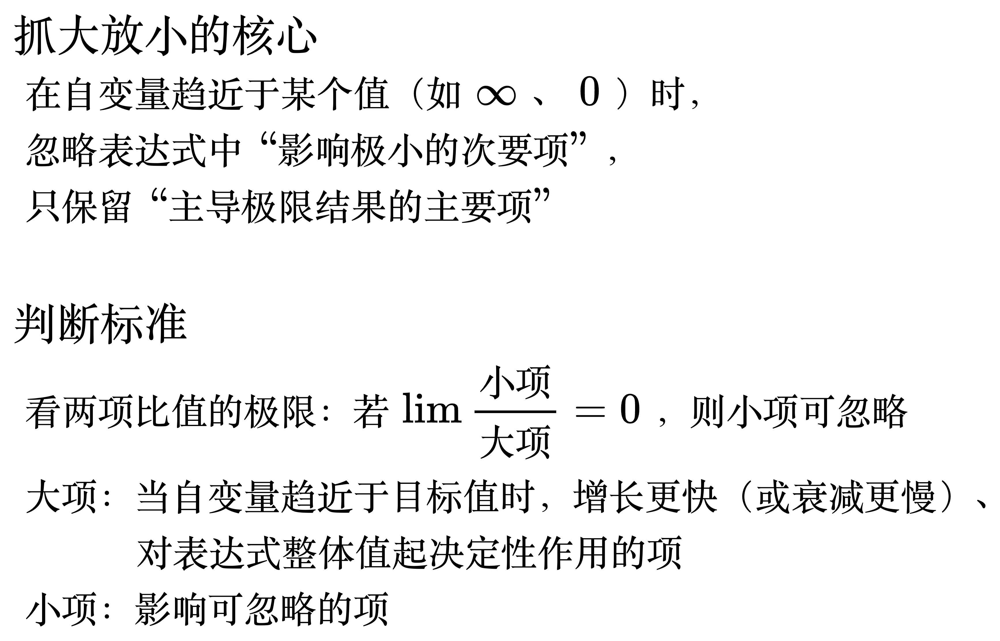

# 抓大放小

<!--
\begin{align}
& {\large 抓大放小的核心} \\
& 在自变量趋近于某个值（如\infty、0）时，\\
& 忽略表达式中“影响极小的次要项”，\\
& 只保留“主导极限结果的主要项” \\
\\
& {\large 判断标准} \\
& 看两项比值的极限：若 \lim\frac{小项}{大项}=0，则小项可忽略 \\
& 大项：当自变量趋近于目标值时，增长更快（或衰减更慢）、 \\
& \qquad\;\; 对表达式整体值起决定性作用的项 \\
& 小项：影响可忽略的项 \\
\end{align}
-->

## 自变量趋近于无穷

## 自变量趋近于零
