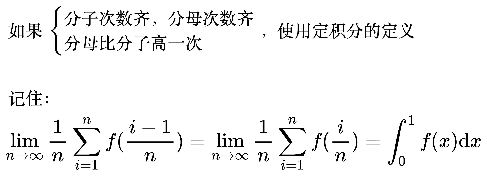
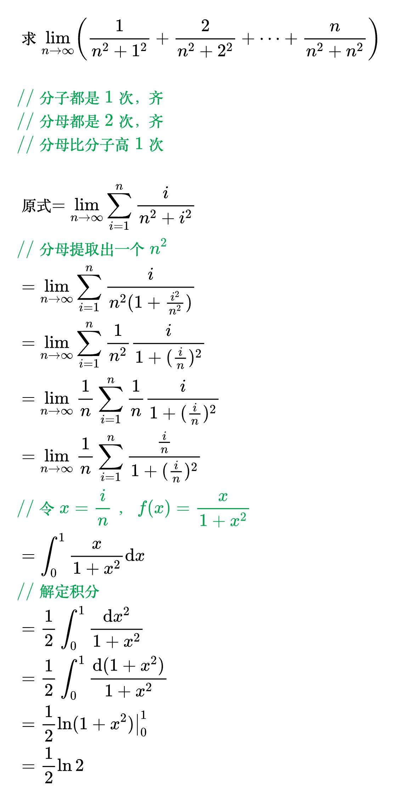
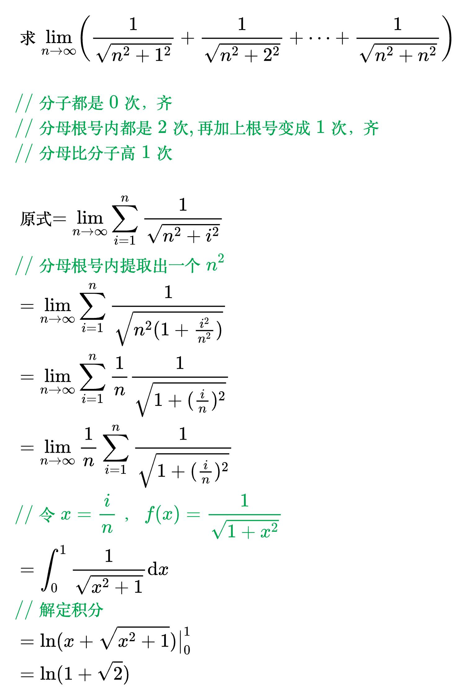
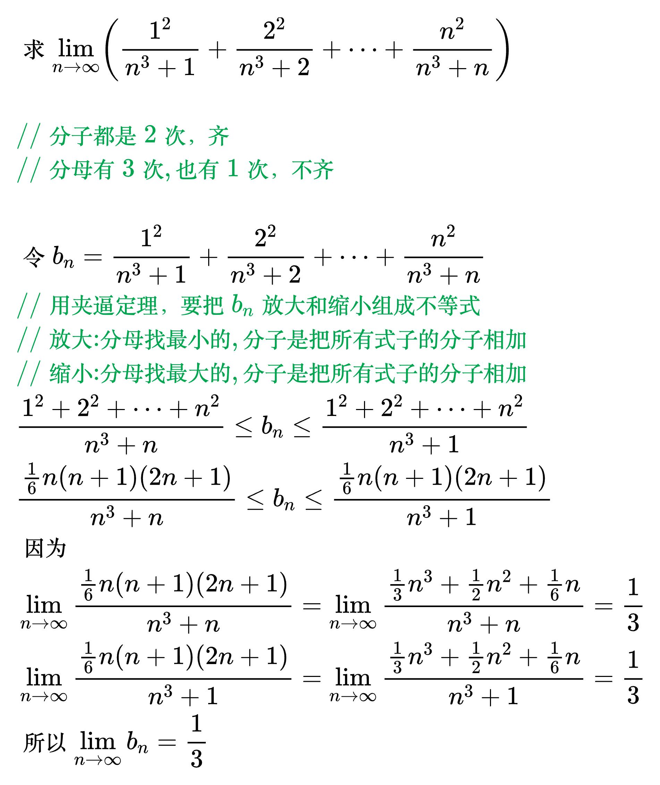

# n 项和的极限

## 先和后极限

### 情形 1

<!--
\begin{align}
& 求 \lim_{n \to \infty} \left [ \frac{1}{1 \times 3} + \frac{1}{3 \times 5} + \cdots + \frac{1}{(2n-1)(2n+1)} \right ] \\
\\
& 对于通项公式\frac{1}{(2n - 1)(2n+1)}进行拆项分析: \\
& 设\frac{1}{(2n - 1)(2n+1)}=\frac{A}{2n - 1}+\frac{B}{2n+1} \\
& 通分得到\frac{1}{(2n - 1)(2n+1)}=\frac{A(2n + 1)+B(2n - 1)}{(2n - 1)(2n+1)} \\
& 则1 = A(2n + 1)+B(2n - 1) \\
& 展开式子得1=(2A + 2B)n+(A - B) \\
& 因为等式右边n的系数为0，常数项为1，\\
& 所以可得方程组\begin{cases}2A + 2B = 0\\A - B = 1\end{cases} \\
& 解得 B =-\frac{1}{2}， A=\frac{1}{2} \\
& 所以\frac{1}{(2n - 1)(2n+1)}=\frac{1}{2}\left(\frac{1}{2n - 1}-\frac{1}{2n+1}\right) \\
& 那么原式就可拆项为：\\
& \frac{1}{2}\left(1-\frac{1}{3}\right)+\frac{1}{2}\left(\frac{1}{3}-\frac{1}{5}\right)+\cdots+\frac{1}{2}\left(\frac{1}{2n - 1}-\frac{1}{2n+1}\right) \\
& 进一步整理为：\\
& \frac{1}{2}\left[\left(1-\frac{1}{3}\right)+\left(\frac{1}{3}-\frac{1}{5}\right)+\cdots+\left(\frac{1}{2n - 1}-\frac{1}{2n+1}\right)\right] \\
& = \frac{1}{2}\left(1-\frac{1}{3}+\frac{1}{3}-\frac{1}{5}+\cdots+\frac{1}{2n - 1}-\frac{1}{2n+1}\right) \\
& = \frac{1}{2}\left(1-\frac{1}{2n+1}\right) \\
& 所以原式 = \lim_{n \to \infty} \frac{1}{2}\left(1-\frac{1}{2n+1}\right) \\
& = \frac{1}{2} \\
\end{align}
-->

### 情形 2

<!--
\begin{align}
& 如果 \begin{cases}
分子次数齐，分母次数齐 \\
分母比分子高一次
\end{cases}，使用定积分的定义 \\
\\
& 记住：\\
& \lim_{n \to \infty} \frac{1}{n} \sum_{i=1}^{n} f(\frac{i-1}{n})
= \lim_{n \to \infty} \frac{1}{n} \sum_{i=1}^{n} f(\frac{i}{n})
= \int_{0}^{1} f(x) \mathrm{d}x \\
\end{align}
-->

<!--
\begin{align}
& 求 \lim_{n \to \infty} \left ( \frac{1}{n^2+1^2} + \frac{2}{n^2+2^2} + \cdots + \frac{n}{n^2+n^2} \right ) \\
\\
& {\color{Green} // 分子都是1次，齐} \\
& {\color{Green} // 分母都是2次，齐} \\
& {\color{Green} // 分母比分子高1次} \\
\\
& 原式 = \lim_{n \to \infty} \sum_{i=1}^{n} \frac{i}{n^2 + i^2} \\
& {\color{Green} // 分母提取出一个n^2} \\
& = \lim_{n \to \infty} \sum_{i=1}^{n} \frac{i}{n^2(1 + \frac{i^2}{n^2})} \\
& = \lim_{n \to \infty} \sum_{i=1}^{n} \frac{1}{n^2} \frac{i}{1 + (\frac{i}{n})^2} \\
& = \lim_{n \to \infty} \frac{1}{n} \sum_{i=1}^{n} \frac{1}{n} \frac{i}{1 + (\frac{i}{n})^2} \\
& = \lim_{n \to \infty} \frac{1}{n} \sum_{i=1}^{n} \frac{\frac{i}{n}}{1 + (\frac{i}{n})^2} \\
& {\color{Green} // 令 x = \frac{i}{n}，f(x) = \frac{x}{1 + x^2}} \\
& = \int_{0}^{1} \frac{x}{1 + x^2} \mathrm{d}x \\
& {\color{Green} // 解定积分} \\
& = \frac{1}{2} \int_{0}^{1} \frac{\mathrm{d}x^2}{1 + x^2} \\
& = \frac{1}{2} \int_{0}^{1} \frac{\mathrm{d}(1 + x^2)}{1 + x^2} \\
& = \frac{1}{2} \ln(1 + x^2) \big|_{0}^{1} \\
& = \frac{1}{2} \ln 2 \\
\end{align}
-->

<!--
\begin{align}
& 求 \lim_{n \to \infty} \left ( \frac{1}{\sqrt{n^2+1^2}} + \frac{1}{\sqrt{n^2+2^2}} + \cdots + \frac{1}{\sqrt{n^2+n^2}} \right ) \\
\\
& {\color{Green} // 分子都是0次，齐} \\
& {\color{Green} // 分母根号内都是2次, 再加上根号变成1次，齐} \\
& {\color{Green} // 分母比分子高1次} \\
\\
& 原式 = \lim_{n \to \infty} \sum_{i=1}^{n} \frac{1}{\sqrt{n^2 + i^2}} \\
& {\color{Green} // 分母根号内提取出一个n^2} \\
& = \lim_{n \to \infty} \sum_{i=1}^{n} \frac{1}{\sqrt{n^2(1 + \frac{i^2}{n^2})}} \\
& = \lim_{n \to \infty} \sum_{i=1}^{n} \frac{1}{n} \frac{1}{\sqrt{1 + (\frac{i}{n})^2}} \\
& = \lim_{n \to \infty} \frac{1}{n} \sum_{i=1}^{n} \frac{1}{\sqrt{1 + (\frac{i}{n})^2}} \\
& {\color{Green} // 令 x = \frac{i}{n}，f(x) = \frac{1}{\sqrt{1 + x^2}}} \\
& = \int_{0}^{1} \frac{1}{\sqrt{x^2 + 1}} \mathrm{d}x \\
& {\color{Green} // 解定积分} \\
& = \ln(x + \sqrt{x^2 + 1}) \big|_{0}^{1} \\
& = \ln(1 + \sqrt{2}) \\
\end{align}
-->

### 情形 3

分子或分母不齐, 使用夹逼定理

<!--
\begin{align}
& 求 \lim_{n \to \infty} \left ( \frac{1^2}{n^3+1} + \frac{2^2}{n^3+2} + \cdots + \frac{n^2}{n^3+n} \right ) \\
\\
& {\color{Green} // 分子都是2次，齐} \\
& {\color{Green} // 分母有3次, 也有1次，不齐} \\
\\
& 令 b_n = \frac{1^2}{n^3+1} + \frac{2^2}{n^3+2} + \cdots + \frac{n^2}{n^3+n} \\
& {\color{Green} // 用夹逼定理，要把b_n放大和缩小组成不等式} \\
& {\color{Green} // 放大: 分母找最小的, 分子是把所有式子的分子相加} \\
& {\color{Green} // 缩小: 分母找最大的, 分子是把所有式子的分子相加} \\
& \frac{1^2 + 2^2 + \cdots + n^2}{n^3+n} \le b_n \le \frac{1^2 + 2^2 + \cdots + n^2}{n^3+1} \\
& \frac{\frac{1}{6} n(n + 1)(2n + 1)}{n^3+n} \le b_n \le \frac{\frac{1}{6} n(n + 1)(2n + 1)}{n^3+1} \\
& 因为 \\
& \lim_{n \to \infty} \frac{\frac{1}{6} n(n + 1)(2n + 1)}{n^3+n}
= \lim_{n \to \infty} \frac{\frac{1}{3}n^3+\frac{1}{2}n^2 + \frac{1}{6}n}{n^3+n}
= \frac{1}{3} \\
& \lim_{n \to \infty} \frac{\frac{1}{6} n(n + 1)(2n + 1)}{n^3+1}
= \lim_{n \to \infty} \frac{\frac{1}{3}n^3+\frac{1}{2}n^2 + \frac{1}{6}n}{n^3+1}
= \frac{1}{3} \\
& 所以 \lim_{n \to \infty} b_n = \frac{1}{3} \\
\end{align}
-->

